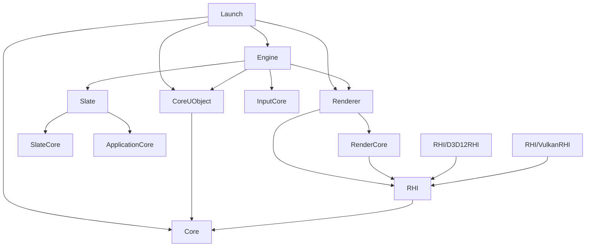

# UE5.7.4 源码目录总览

## 摘要

本文档提供 UE5.7.4 引擎源码的完整目录结构概览，包括 Runtime、Editor、Developer、Programs、Plugins 五大模块分区。

---

## 源码根目录结构

```
Engine/
├── Build/                     # 构建配置（Build.version, BatchFiles）
├── Binaries/                  # 编译输出（忽略）
├── Config/                    # 默认配置文件（BaseEngine.ini 等）
├── Content/                   # 引擎内置资源（纹理、材质、模型）
├── DerivedDataCache/          # DDC 缓存（忽略）
├── Intermediate/              # 中间文件（忽略）
├── Plugins/                   # 内置插件（Niagara, GAS, WorldPartition 等）
├── Shaders/                   # Shader 源码（HLSL, USF, UFS）
└── Source/                    # C++ 源码
    ├── Runtime/               # 运行时模块（188 个）
    ├── Editor/                # 编辑器模块
    ├── Developer/             # 开发者工具模块
    └── Programs/              # 独立程序（UBT, UHT, UnrealPak 等）
```

---

## 五大模块分区

### 1. Runtime（运行时模块）
- **路径**: `Engine/Source/Runtime/`
- **数量**: 188 个模块
- **用途**: 游戏运行时必需的所有功能
- **详情**: 见 [Runtime_Modules.md](Runtime_Modules.md)

### 2. Editor（编辑器模块）
- **路径**: `Engine/Source/Editor/`
- **用途**: 编辑器专用功能（仅在编辑器构建中加载）
- **详情**: 见 [Editor_Modules.md](Editor_Modules.md)

### 3. Developer（开发者工具模块）
- **路径**: `Engine/Source/Developer/`
- **用途**: 开发调试工具（在 Development 和 Debug 构建中可用）
- **详情**: 见 [Developer_Modules.md](Developer_Modules.md)

### 4. Programs（独立程序）
- **路径**: `Engine/Source/Programs/`
- **用途**: 独立的工具程序（UBT, UHT, UnrealPak, ShaderCompileWorker 等）
- **详情**: 见 [Programs.md](Programs.md)

### 5. Plugins（内置插件）
- **路径**: `Engine/Plugins/`
- **用途**: 可选的引擎功能扩展
- **详情**: 见 [Plugins.md](Plugins.md)

---

## 核心模块依赖关系



---

## 引擎源码阅读入口

### 入口文件

| 文件 | 用途 |
|------|------|
| `Engine/Source/Runtime/Launch/Private/Launch.cpp` | 程序入口，`GuardedMain()` |
| `Engine/Source/Runtime/Launch/Private/LaunchEngineLoop.cpp` | 主循环 `FEngineLoop` |
| `Engine/Source/Runtime/Engine/Private/UnrealEngine.cpp` | `UEngine::Tick()` |
| `Engine/Source/Runtime/Renderer/Private/DeferredShadingRenderer.cpp` | 渲染主流程 |
| `Engine/Source/Runtime/Renderer/Private/SceneRendering.cpp` | 渲染入口 `BeginRenderingViewFamily` |
| `Engine/Source/Runtime/CoreUObject/Public/UObject/UObject.h` | UObject 基类定义 |
| `Engine/Source/Runtime/Engine/Classes/Engine/World.h` | UWorld 定义 |
| `Engine/Source/Runtime/Engine/Classes/GameFramework/Actor.h` | AActor 定义 |
| `Engine/Source/Runtime/RHI/Public/DynamicRHI.h` | RHI 抽象接口 |
| `Engine/Source/Runtime/RenderCore/Public/RenderGraph.h` | RDG 系统 |

### 版本文件

| 文件 | 用途 |
|------|------|
| `Engine/Build/Build.version` | 版本号 JSON |
| `Engine/Source/Runtime/Launch/Resources/Version.h` | 版本号宏 |

---

## 构建系统入口

| 文件 | 用途 |
|------|------|
| `Engine/Source/Programs/UnrealBuildTool/` | UBT 源码（C#） |
| `Engine/Source/Programs/UnrealHeaderTool/` | UHT 源码（C++） |
| `Engine/Build/BatchFiles/Build.bat` | 构建入口脚本 |
| `GenerateProjectFiles.bat` | 项目文件生成 |

---

## 相关文档

- [Runtime_Modules.md](Runtime_Modules.md) — Runtime 模块详情
- [Editor_Modules.md](Editor_Modules.md) — Editor 模块详情
- [Developer_Modules.md](Developer_Modules.md) — Developer 模块详情
- [Programs.md](Programs.md) — 独立程序详情
- [Plugins.md](Plugins.md) — 插件详情
- [Engine_Source_Map.md](Engine_Source_Map.md) — 引擎源码地图
