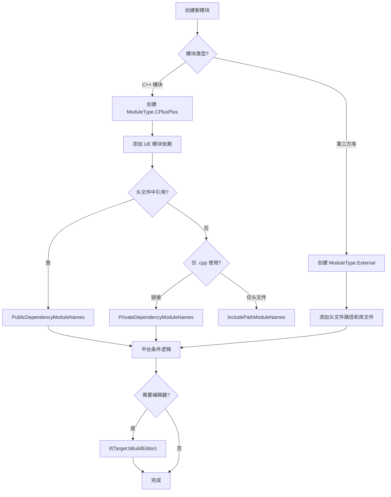

# Build.cs 编写指南

## 摘要
本指南面向需要编写或修改 `.Build.cs` 文件的 UE C++ 开发者，提供实用的编写模式、常见场景示例和排错方法。所有示例均来自 UE5.7.4 引擎源码。

## 适合解决的问题
- 如何创建一个新的 Build.cs 文件？
- 如何添加第三方库？
- 如何处理平台特定的编译逻辑？
- 如何打破循环依赖？
- PublicDependencyModuleNames 和 PrivateDependencyModuleNames 该用哪个？
- 如何控制 PCH 和 Unity 构建？

## 1. Build.cs 文件模板

### 标准 C++ 模块

```csharp
// MyModule/MyModule.Build.cs
using UnrealBuildTool;

public class MyModule : ModuleRules
{
    public MyModule(ReadOnlyTargetRules Target) : base(Target)
    {
        // 模块类型（默认 CPlusPlus，第三方库用 External）
        // Type = ModuleType.CPlusPlus;

        // PCH 设置
        PCHUsage = PCHUsageMode.UseExplicitOrSharedPCHs;
        SharedPCHHeaderFile = "Public/MyModulePCH.h";

        // 公开依赖（头文件中 #include 了的模块）
        PublicDependencyModuleNames.AddRange(new string[] {
            "Core",
            "CoreUObject",
            "Engine",
        });

        // 私有依赖（仅在 .cpp 中使用的模块）
        PrivateDependencyModuleNames.AddRange(new string[] {
            "Slate",
            "SlateCore",
        });

        // 动态加载（运行时按需加载，不链接）
        // DynamicallyLoadedModuleNames.Add("OptionalModule");

        // 仅需要头文件路径，不需要链接
        // PrivateIncludePathModuleNames.Add("HeaderOnlyModule");

        // 自定义包含路径
        // PrivateIncludePaths.Add("Private/Internal");

        // 预处理器定义
        // PublicDefinitions.Add("MY_FEATURE_ENABLED=1");
        // PrivateDefinitions.Add("MY_INTERNAL_FLAG=1");
    }
}
```

### 第三方库模块（External）

```csharp
// ThirdParty/MyLib/MyLib.Build.cs
using UnrealBuildTool;
using System.IO;

public class MyLib : ModuleRules
{
    public MyLib(ReadOnlyTargetRules Target) : base(Target)
    {
        Type = ModuleType.External;  // 关键：声明为外部模块

        // 头文件路径（用 PublicSystemIncludePaths 避免依赖检查）
        string IncludePath = Path.Combine(ModuleDirectory, "include");
        PublicSystemIncludePaths.Add(IncludePath);

        // 按平台添加库文件
        if (Target.Platform == UnrealTargetPlatform.Win64)
        {
            string LibPath = Path.Combine(ModuleDirectory, "lib", "Win64");
            PublicAdditionalLibraries.Add(Path.Combine(LibPath, "MyLib.lib"));

            // 如果有 DLL 需要随打包分发
            string DllPath = Path.Combine(ModuleDirectory, "bin", "Win64", "MyLib.dll");
            RuntimeDependencies.Add("$(BinaryOutputDir)/MyLib.dll", DllPath);

            // 延迟加载 DLL
            PublicDelayLoadDLLs.Add("MyLib.dll");
        }
        else if (Target.Platform == UnrealTargetPlatform.Mac)
        {
            PublicAdditionalLibraries.Add(
                Path.Combine(ModuleDirectory, "lib", "Mac", "libMyLib.a"));
        }
        else if (Target.Platform == UnrealTargetPlatform.Linux)
        {
            PublicAdditionalLibraries.Add(
                Path.Combine(ModuleDirectory, "lib", "Linux", "libMyLib.a"));
        }
    }
}
```

## 2. 依赖选择决策树

```
你的模块是否需要引用目标模块的类型？
├── 不需要 → 不添加任何依赖
└── 需要
    ├── 在 Public/ 头文件中 #include？
    │   ├── 是 → PublicDependencyModuleNames
    │   └── 否（仅在 .cpp 中使用）
    │       ├── 需要链接？→ PrivateDependencyModuleNames
    │       └── 仅需头文件？→ PrivateIncludePathModuleNames
    └── 运行时按需加载？
        └── 是 → DynamicallyLoadedModuleNames
              + PrivateIncludePathModuleNames（编译时需要头文件）
```

### 依赖类型速查表

| 场景 | 使用的属性 |
|------|-----------|
| 头文件 `#include "Engine/Engine.h"` | `PublicDependencyModuleNames.Add("Engine")` |
| .cpp 中 `#include "Renderer/Private/SomeFile.h"` | `PrivateDependencyModuleNames.Add("Renderer")` |
| 运行时 `FModuleManager::LoadModule("Media")` | `DynamicallyLoadedModuleNames.Add("Media")` + `PrivateIncludePathModuleNames.Add("Media")` |
| 头文件 `#include "MyLib.h"` 但不链接 | `PublicIncludePathModuleNames.Add("MyLib")` |
| 第三方库头文件 | `PublicSystemIncludePaths.Add("ThirdParty/include")` |
| UE 模块头文件但不链接 | `PublicIncludePathModuleNames.Add("ModuleName")` |

## 3. 常见场景

### 3.1 编辑器条件编译

```csharp
// 只在编辑器构建中添加编辑器模块
if (Target.bBuildEditor)
{
    PrivateDependencyModuleNames.Add("UnrealEd");
    PrivateDependencyModuleNames.Add("EditorStyle");
    PrivateDependencyModuleNames.Add("Slate");
    PrivateDependencyModuleNames.Add("SlateCore");
}
```

### 3.2 平台特定逻辑

```csharp
// 单个平台判断
if (Target.Platform == UnrealTargetPlatform.Win64)
{
    PublicAdditionalLibraries.Add("Psapi.lib");
    PublicDelayLoadDLLs.Add("Ole32.dll");
}

// 平台组判断（Win64 + WinGDK 等）
if (Target.Platform.IsInGroup(UnrealPlatformGroup.Windows))
{
    // Windows 系列平台
}

if (Target.IsInPlatformGroup(UnrealPlatformGroup.Unix))
{
    // Linux 等类 Unix 平台
}

// Apple 平台
if (Target.Platform == UnrealTargetPlatform.Mac)
{
    PublicFrameworks.Add("Foundation");
    PublicFrameworks.Add("AppKit");
}
else if (Target.IsInPlatformGroup(UnrealPlatformGroup.IOS))
{
    PublicFrameworks.Add("UIKit");
    PublicFrameworks.Add("Foundation");
}

// Android
if (Target.Platform == UnrealTargetPlatform.Android)
{
    PrivateDefinitions.Add("ANDROID_USE_STL=1");
}
```

### 3.3 第三方库集成（完整示例）

参考引擎中的 libcurl 集成模式：

```csharp
// 基于 Engine/Source/ThirdParty/libcurl/libcurl.Build.cs 模式
public class MyThirdParty : ModuleRules
{
    public MyThirdParty(ReadOnlyTargetRules Target) : base(Target)
    {
        Type = ModuleType.External;

        string BaseDir = ModuleDirectory;
        string IncludeDir = Path.Combine(BaseDir, "include");
        PublicSystemIncludePaths.Add(IncludeDir);

        if (Target.Platform == UnrealTargetPlatform.Win64)
        {
            string LibDir = Path.Combine(BaseDir, "lib", "Win64", "Release");
            PublicAdditionalLibraries.Add(Path.Combine(LibDir, "mylib.lib"));

            // DLL 需要运行时分发
            string DllDir = Path.Combine(BaseDir, "bin", "Win64", "Release");
            RuntimeDependencies.Add("$(BinaryOutputDir)/mylib.dll",
                Path.Combine(DllDir, "mylib.dll"));
        }
        else if (Target.Platform == UnrealTargetPlatform.Mac)
        {
            PublicAdditionalLibraries.Add(
                Path.Combine(BaseDir, "lib", "Mac", "libmylib.a"));
        }
        else if (Target.Platform.IsInGroup(UnrealPlatformGroup.Unix))
        {
            PublicAdditionalLibraries.Add(
                Path.Combine(BaseDir, "lib", "Linux", "libmylib.a"));
            PublicRuntimeLibraryPaths.Add(
                Path.Combine(BaseDir, "lib", "Linux"));
        }

        // 引擎第三方依赖快捷方式
        AddEngineThirdPartyPrivateStaticDependencies(Target, "zlib");
    }
}
```

### 3.4 打破循环依赖

```csharp
// 模块 A 和模块 B 互相需要对方的头文件

// 方案 1：使用 DynamicallyLoaded（推荐）
// 模块 A 的 Build.cs：
PublicDependencyModuleNames.Add("B");             // A 依赖 B（公开）
DynamicallyLoadedModuleNames.Add("B");             // B 运行时加载
PrivateIncludePathModuleNames.Add("B");             // 编译时需要 B 的头文件

// 方案 2：使用 CircularlyReferencedDependentModules（遗留方案）
PublicDependencyModuleNames.Add("B");
CircularlyReferencedDependentModules.Add("B");     // 声明循环依赖

// 方案 3（最佳）：拆分公共接口到独立模块
// 创建 MyInterface 模块，只包含接口和前向声明
// A 和 B 都依赖 MyInterface，但不直接互相依赖
```

### 3.5 自定义 PCH

```csharp
// 提供共享 PCH（其他模块可以使用）
PCHUsage = PCHUsageMode.UseExplicitOrSharedPCHs;
SharedPCHHeaderFile = "Public/MyModulePCH.h";

// 使用模块私有 PCH
PCHUsage = PCHUsageMode.UseExplicitOrSharedPCHs;
PrivatePCHHeaderFile = "Private/MyPrivatePCH.h";

// 禁用 PCH（浮点精度敏感代码）
PCHUsage = PCHUsageMode.NoPCHs;

// 调整触发 PCH 的文件数阈值
MinFilesUsingPrecompiledHeaderOverride = 4;
```

### 3.6 Unity 构建控制

```csharp
// 禁用 Unity 构建（调试时单个文件编译更快）
bUseUnity = false;

// 强制 Unity 构建
bForceUnityBuild = true;

// 自适应 Unity（修改的文件自动脱离 Unity 单独编译，默认开启）
// bUseAdaptiveUnityBuild = true;

// 调整 Unity 文件大小
NumIncludedBytesPerUnityCPPOverride = 491520; // 480KB
```

### 3.7 添加运行时依赖文件

```csharp
// 需要随打包分发的文件（DLL、配置文件、数据文件等）
RuntimeDependencies.Add("$(BinaryOutputDir)/MyData.bin",
    Path.Combine(ModuleDirectory, "Data", "MyData.bin"));

// 不带源文件的运行时依赖（UFS 虚拟文件系统）
RuntimeDependencies.Add(Path.Combine("$(BinaryOutputDir)", "Content", "MyAsset.uasset"));
```

## 4. 模块目录结构最佳实践

### 标准模块目录

```
MyModule/
├── MyModule.Build.cs          ← 构建规则
├── Public/                     ← 公开头文件（自动添加到 PublicIncludePaths）
│   ├── MyModule.h             ← 模块入口
│   ├── MyTypes.h              ← 公开类型
│   └── IMyInterface.h         ← 公开接口
├── Internal/                   ← 内部头文件（自动添加到 InternalIncludePaths）
│   └── MyModuleInternal.h
├── Private/                    ← 私有实现（自动添加到 PrivateIncludePaths）
│   ├── MyModulePCH.h          ← PCH 头文件
│   ├── MyModule.cpp           ← 模块实现
│   └── MyPrivateClass.cpp
└── Classes/                    ← UHT 需要的头文件（旧版，建议用 Public/ 替代）
    └── MyComponent.h
```

### 第三方库目录

```
ThirdParty/MyLib/
├── MyLib.Build.cs              ← External 类型
├── include/                    ← 头文件
│   └── mylib.h
├── lib/                        ← 静态库
│   ├── Win64/mylib.lib
│   ├── Mac/libmylib.a
│   └── Linux/libmylib.a
├── bin/                        ← 动态库（运行时需要）
│   ├── Win64/mylib.dll
│   └── Linux/libmylib.so
└── src/                        ← 源码（可选，用于调试）
```

## 5. 引擎模块 Build.cs 模式总结

### 底层模块（Core、CoreUObject）
```csharp
// 最少依赖，通常只有平台 API
PublicDependencyModuleNames.Add("TraceLog");
// 大量平台条件逻辑
// 提供 SharedPCH 给其他模块
SharedPCHHeaderFile = "Public/HAL/Platform.h";
```

### 中间层模块（Engine、RenderCore）
```csharp
// 大量 Public 依赖
PublicDependencyModuleNames.AddRange(new string[] {
    "Core", "CoreUObject", "Slate", "RenderCore", ...
});
// DynamicallyLoaded 打破循环
DynamicallyLoadedModuleNames.Add("Media");
PrivateIncludePathModuleNames.Add("Media");
```

### 上层模块（Renderer、UnrealEd）
```csharp
// 最少公开依赖（降低编译时间）
PublicDependencyModuleNames.AddRange(new string[] { "Core", "Engine" });
// 大量私有依赖
PrivateDependencyModuleNames.AddRange(new string[] { ... });
// 编辑器条件加载
if (Target.bBuildEditor) { ... }
```

### 插件模块（Paper2D 等）
```csharp
// 简洁，标准依赖
PublicDependencyModuleNames.AddRange(new string[] {
    "Core", "CoreUObject", "Engine", "RenderCore", "RHI", "Slate"
});
// 编辑器条件
if (Target.bBuildEditor)
{
    PrivateDependencyModuleNames.Add("UnrealEd");
}
```

## 6. 常见问题排查

| 症状 | 可能原因 | 解决方法 |
|------|----------|----------|
| 头文件找不到 | 未添加依赖或包含路径 | 检查 PublicDependencyModuleNames 或 PublicSystemIncludePaths |
| LNK2019 未解析外部符号 | 依赖了头文件但没链接 | 确认对应的 ModuleName 在 DependencyModuleNames 中 |
| 模块找不到 | Build.cs 文件不在搜索路径中 | 确认 Build.cs 在 Source/ 或 Plugin/Source/ 下 |
| 循环依赖错误 | 两个模块互相 PublicDependency | 使用 DynamicallyLoaded 或拆分接口模块 |
| UHT 找不到类型 | 头文件不在正确位置 | 确保头文件在 Public/ 或 Classes/ 下 |
| 平台编译错误 | 缺少平台条件判断 | 添加 `if (Target.Platform == ...)` 条件 |
| PCH 编译失败 | PCH 头文件包含不当 | 检查 PCH 头文件是否包含了平台特定的内容 |
| Unity 构建冲突 | 匿名命名空间或静态变量 | 使用 `bUseUnity = false` 或重构代码 |

## 7. Mermaid 调用图



## 8. 编写检查清单

- [ ] 确定模块类型（CPlusPlus / External）
- [ ] 区分公开依赖和私有依赖
- [ ] 检查是否需要编辑器条件编译
- [ ] 检查是否需要平台特定逻辑
- [ ] 验证头文件目录结构（Public/、Private/、Internal/）
- [ ] 确认第三方库的库文件路径和运行时依赖
- [ ] 检查是否存在循环依赖
- [ ] 验证 PCH 设置是否合理
- [ ] 确认预处理器定义是否正确

## 源码证据
- Engine/Source/Runtime/Core/Core.Build.cs（底层模块模式）
- Engine/Source/Runtime/Engine/Engine.Build.cs（中间层模块模式）
- Engine/Source/Runtime/Renderer/Renderer.Build.cs（上层模块模式）
- Engine/Source/Editor/UnrealEd/UnrealEd.Build.cs（编辑器模块模式）
- Engine/Source/ThirdParty/libcurl/libcurl.Build.cs（第三方库模式）
- Engine/Source/ThirdParty/Boost/Boost.Build.cs（跨平台第三方库模式）
- Engine/Source/Programs/UnrealBuildTool/Configuration/ModuleRules.cs（基类定义）

## 相关文档
- [ModuleRules.md](ModuleRules.md) — 模块规则属性详解
- [TargetRules.md](TargetRules.md) — 目标规则详解
- [Common_Build_Errors.md](Common_Build_Errors.md) — 常见构建错误
- [UHT.md](UHT.md) — UnrealHeaderTool 详解
