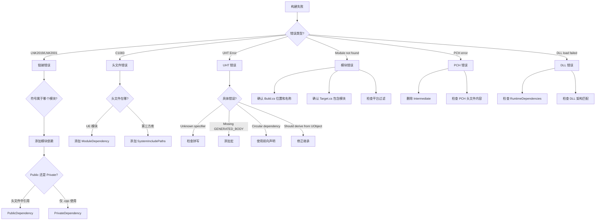

# 常见构建错误排查指南

## 摘要
本文档收集 UE5.7.4 开发中最常见的构建错误，提供根因分析、源码级别的错误检测机制和具体的修复方法。所有错误信息均来自引擎源码中的实际检测逻辑。

## 适合解决的问题
- 编译报 LNK2019 未解析外部符号怎么办？
- 编译报 C1083 头文件找不到怎么办？
- UHT 报 Unknown specifier 怎么办？
- 模块循环依赖怎么解决？
- 模块找不到怎么办？
- DLL 加载失败怎么办？
- PCH 编译失败怎么办？

## 1. 链接错误

### 1.1 LNK2019 / LNK2001 未解析外部符号

**症状：**
```
error LNK2019: 无法解析的外部符号 "public: static class UClass * __cdecl UMyClass::StaticClass(void)"
error LNK2001: 无法解析的外部符号 "public: virtual void __cdecl UMyClass::SomeFunction(void)"
```

**UBT 检测机制：**
- `LinkEventMatcher.cs:16-34`：UBT 通过正则匹配链接器输出
  - MSVC: `error LNK2001`, `error LNK2019`, `error LNK2005`
  - Clang/GCC: `undefined reference to`
  - LLD: `error: undefined symbol:`

**常见原因及修复：**

| 原因 | 修复方法 |
|------|----------|
| 缺少模块依赖 | 在 `.Build.cs` 中添加 `PublicDependencyModuleNames.Add("ModuleName")` |
| 用了 Private 依赖但头文件在 Public 中 | 改为 `PublicDependencyModuleNames` |
| 模块存在但未编译到当前 Target | 检查模块的 `ModuleHostType` 是否匹配当前 TargetType |
| `.gen.cpp` 未编译 | 删除 `Intermediate/` 重新生成 |
| 函数声明了但未实现 | 实现函数或使用纯虚声明 |
| `GENERATED_BODY()` 缺失 | 在 UCLASS 类体第一行添加 `GENERATED_BODY()` |
| 宏不匹配（UFUNCTION 声明与实现不一致） | 检查 UFUNCTION 参数是否与实现一致 |

**排查步骤：**
1. 确认未解析的符号属于哪个模块
2. 检查该模块是否在 `.Build.cs` 的依赖列表中
3. 区分是 Public 头文件引用还是 Private 实现引用
4. 检查模块的 `TargetAllowList` / `PlatformAllowList` 过滤

### 1.2 LNK2005 符号重复定义

**症状：**
```
error LNK2005: "public: static class UClass * UMyClass::StaticClass(void)" 已经在 ModuleA.obj 中定义
```

**常见原因：**
- 同一个 `.cpp` 被多个模块包含
- Unity 构建将含相同符号的文件合并
- 头文件中定义了非 inline 函数

**修复方法：**
```csharp
// 1. 排除 Unity 构建冲突
bUseUnity = false;

// 2. 确保头文件函数是 inline 或在 .cpp 中实现
// 错误：头文件中直接定义函数体
// void MyFunction() { ... }  // 多次包含会导致重复定义

// 正确：使用 inline 或移到 .cpp
// inline void MyFunction() { ... }
```

## 2. 编译错误

### 2.1 C1083 头文件找不到

**症状：**
```
fatal error C1083: 无法打开包括文件: "MyModule/MyHeader.h": No such file or directory
```

**常见原因及修复：**

| 原因 | 修复方法 |
|------|----------|
| 未添加模块依赖 | 添加 `PublicDependencyModuleNames.Add("MyModule")` |
| 头文件路径不标准 | 确保头文件在 `Public/` 子目录下 |
| 第三方库头文件路径未配置 | 添加 `PublicSystemIncludePaths.Add("ThirdParty/include")` |
| 旧式包含路径不兼容 | 检查 `bLegacyPublicIncludePaths` 设置 |
| 模块未被 UBT 发现 | 确认 `.Build.cs` 文件位置正确 |

**排查步骤：**
1. 确认头文件在模块的 `Public/` 目录下
2. 确认依赖模块在 `.Build.cs` 中声明
3. 检查是否需要 `IncludePathModuleNames`（仅头文件，不链接）
4. 检查 `IncludeOrderVersion` 是否匹配

### 2.2 C2011 类类型重定义

**症状：**
```
error C2011: "UMyClass": "class" 类型重定义
```

**常见原因：**
- 缺少头文件保护（`#pragma once`）
- 循环包含
- 前向声明与完整定义冲突

**修复方法：**
```cpp
// 1. 确保所有头文件使用 #pragma once
#pragma once

// 2. 循环包含时使用前向声明
// A.h
class B;  // 前向声明代替 #include "B.h"
class A { B* MyB; };

// 3. 不要在头文件中包含不必要的实现细节
```

### 2.3 C4668 / C4820 对齐警告

**症状：**
```
warning C4668: '_MY_DEFINE' 未定义为预处理器宏
warning C4820: 在成员之间添加了填充字节
```

**修复方法：**
```csharp
// 在 .Build.cs 中控制警告级别
bWarningsAsErrors = false;  // 或将特定警告降级

// 定义缺失的宏
PublicDefinitions.Add("_MY_DEFINE=0");
```

## 3. UHT 错误

### 3.1 Unknown specifier 'XXX'

**症状：**
```
Error: Unknown specifier 'BlueprintReadWritable' in UCLASS declaration
```

**UHT 检测机制：**
- `UhtSpecifierParser.cs:197`：`"Unknown specifier '{specifier}'"`
- UHT 维护了一个合法说明符表，所有不在表中的说明符都会报错

**常见原因：**
- 说明符拼写错误（如 `BlueprintReadWritable` 应为 `BlueprintReadWrite`）
- 使用了旧版本 UE 的说明符名称
- 自定义说明符未注册

**修复方法：**
1. 检查拼写（区分大小写）
2. 查阅 UE5.7.4 的说明符文档
3. 常见易混淆说明符：
   - `BlueprintReadWrite`（不是 `BlueprintReadWritable`）
   - `EditAnywhere`（不是 `EditAnyWhere`）
   - `meta = (DisplayName = "...")`（在 `meta` 中设置显示名）

### 3.2 UClass should derive from UObject

**症状：**
```
Error: UClass 'UMyClass' should derive from UObject
```

**UHT 检测机制：**
- `UhtClass.cs:1743`：验证 UCLASS 标记的类必须继承 UObject 体系

**修复方法：**
```cpp
// 确保继承链正确
// UObject → AActor → 你的类
UCLASS()
class MYMODULE_API UMyObject : public UObject  // 必须继承 UObject
{
    GENERATED_BODY()
};
```

### 3.3 Missing GENERATED_BODY

**症状：**
```
Error: Expected GENERATED_BODY or GENERATED_UCLASS_BODY at the start of class body
```

**UHT 检测机制：**
- `UhtClassParser.cs:32-54`：检测 `GENERATED_BODY` 宏

**修复方法：**
```cpp
UCLASS()
class MYMODULE_API UMyClass : public UObject
{
    GENERATED_BODY()  // 必须是类体的第一行（访问限定符之后）
    // 或旧版：GENERATED_UCLASS_BODY()
};
```

### 3.4 Unable to find class/struct with name

**症状：**
```
Error: Unable to find class with name 'UMyClass'
```

**UHT 检测机制：**
- `UhtSession.cs:1850`：引用的类型在当前扫描范围内找不到

**常见原因：**
- 头文件未包含
- 类型在未参与 UHT 扫描的模块中
- 命名空间不匹配

### 3.5 Circular dependency detected

**症状：**
```
Error: Circular dependency detected: HeaderA.h -> HeaderB.h -> HeaderA.h
```

**UHT 检测机制：**
- `UhtSession.cs:2609`：检测头文件循环包含

**修复方法：**
1. 使用前向声明替代 `#include`
2. 将公共类型提取到独立的轻量头文件
3. 将 `#include` 移到 `.cpp` 文件中

### 3.6 Recursive class/struct definition

**症状：**
```
Error: Recursive class/struct definition
```

**UHT 检测机制：**
- `UhtSession.cs:2710`：自引用类型检测

**修复方法：**
```cpp
// 错误：直接包含自身类型
USTRUCT()
struct FMyStruct
{
    FMyStruct Child;  // 递归定义
};

// 正确：使用指针或 TArray
USTRUCT()
struct FMyStruct
{
    TArray<FMyStruct> Children;  // OK
    FMyStruct* Child;            // OK（指针）
};
```

## 4. 模块依赖错误

### 4.1 模块找不到

**症状：**
```
Error: Unable to find module 'MyModule' referenced by MyProject.Target.cs
```

**UBT 检测机制：**
- `UEBuildTarget.cs:4701`：`"Unable to find module '{0}' referenced by {1}"`
- `UEBuildTarget.cs:6530`：`"Couldn't find referenced module '{0}'."`

**排查步骤：**
1. 确认 `.Build.cs` 文件存在于正确的搜索路径中
2. 确认文件名格式正确（`ModuleName.Build.cs`）
3. 确认类名与文件名一致
4. 确认类是 `public` 且继承自 `ModuleRules`
5. 检查模块是否在插件中（需要 `.uplugin` 文件正确引用）

### 4.2 循环依赖

**症状：**
```
Error: Circular dependency in 'ModuleA' possibly due to 'ModuleA.Build.cs'
```

**UBT 检测机制：**
- `UEBuildModule.cs:1340-1363`：循环依赖检测
- UBT 建议信息：`"Break this loop by moving dependencies into a separate module or using Private/PublicIncludePathModuleNames to reference declarations"`

**修复方法：**

```csharp
// 方案 1：使用 IncludePathModuleNames（仅头文件，不链接）
// ModuleA.Build.cs
PrivateIncludePathModuleNames.Add("ModuleB");

// 方案 2：使用 DynamicallyLoadedModuleNames（运行时加载）
// ModuleA.Build.cs
DynamicallyLoadedModuleNames.Add("ModuleB");
PrivateIncludePathModuleNames.Add("ModuleB");

// ModuleA 的 .cpp 中：
// FModuleManager::Get().LoadModule("ModuleB");

// 方案 3：拆分公共接口到独立模块（推荐长期方案）
// 创建 ModuleAInterface 模块
// ModuleA 和 ModuleB 都依赖 ModuleAInterface
```

### 4.3 插件模块未加载

**症状：**
- 编译通过但运行时模块未加载
- 编辑器中插件功能不可用

**排查步骤：**
1. 检查 `.uplugin` 文件是否正确声明模块
2. 检查 `ModuleHostType` 是否匹配当前构建类型
3. 检查 `PlatformAllowList` / `PlatformDenyList` 是否过滤了当前平台
4. 检查 `LoadingPhase` 是否合适（过早加载可能依赖未就绪）
5. 检查模块的 `StartupModule()` 是否正常执行

## 5. PCH 错误

### 5.1 PCH 编译失败

**症状：**
```
fatal error C1083: Cannot open precompiled header file: 'MyModule.pch'
error C2859: PCH 文件与当前编译不匹配
```

**常见原因：**
- PCH 头文件包含了平台特定代码
- PCH 头文件包含了条件编译不稳定的头文件
- Intermediate 目录损坏

**修复方法：**
```csharp
// 1. 清理 Intermediate
// 删除 模块/Intermediate/ 目录

// 2. 禁用 PCH 排查
PCHUsage = PCHUsageMode.NoPCHs;

// 3. 使用显式 PCH（避免包含不稳定头文件）
PCHUsage = PCHUsageMode.UseExplicitOrSharedPCHs;
PrivatePCHHeaderFile = "Private/MyModulePCH.h";

// PCH 头文件中只包含稳定的基础头文件
```

### 5.2 共享 PCH 冲突

**修复方法：**
```csharp
// 禁用共享 PCH，使用模块独占 PCH
PCHUsage = PCHUsageMode.NoSharedPCHs;
```

## 6. DLL 加载错误

### 6.1 运行时 DLL 找不到

**症状：**
```
Could not load DLL: MyModule.dll (Error 126)
```

**常见原因：**
- DLL 未在正确位置
- DLL 的依赖库缺失
- 架构不匹配（32/64 位）

**修复方法：**
```csharp
// 1. 确保运行时依赖正确声明
RuntimeDependencies.Add("$(BinaryOutputDir)/MyLib.dll",
    Path.Combine(ModuleDirectory, "Binaries", "MyLib.dll"));

// 2. 使用延迟加载（启动时不需要）
PublicDelayLoadDLLs.Add("MyLib.dll");

// 3. 确保依赖库路径正确
PublicRuntimeLibraryPaths.Add(Path.Combine(ModuleDirectory, "Libs"));
```

### 6.2 插件打包缺 DLL

**排查步骤：**
1. 检查 `.Build.cs` 中的 `RuntimeDependencies`
2. 检查 `.uplugin` 中的 `CanContainContent` 设置
3. 确认 DLL 的构建配置（Debug/Development/Shipping）匹配
4. 检查 `PublicDelayLoadDLLs` 声明的 DLL 是否在正确位置

## 7. Unity 构建错误

### 7.1 Unity 构建编译失败

**症状：**
```
error C2084: function already has a body
error C2086: redefinition
```

**常见原因：**
- 匿名命名空间中的符号在 Unity 合并后冲突
- `static` 变量或函数在多个文件中同名

**修复方法：**
```csharp
// 方案 1：临时禁用 Unity 构建排查
bUseUnity = false;

// 方案 2：代码中使用唯一的匿名命名空间
// 每个 .cpp 文件中的匿名命名空间是独立的，Unity 合并后会冲突
// 改用命名命名空间或 static inline

// 方案 3：排除特定文件
// 使用 FORCEINCLUDE 或单独编译
```

## 8. 调试技巧

### 8.1 获取详细构建日志

```bash
# UBT 详细输出
Engine\Build\BatchFiles\Build.bat UnrealEditor Win64 Development -WaitMutex -verbose

# 查看模块解析过程
Engine\Build\BatchFiles\Build.bat UnrealEditor Win64 Development -WaitMutex -log
```

### 8.2 强制重新生成

```bash
# 删除所有中间文件
# 删除项目的 Intermediate/ 和 Binaries/ 目录
# 删除 Engine/Intermediate/ 目录

# 重新生成项目文件
GenerateProjectFiles.bat

# 重新构建
Engine\Build\BatchFiles\Build.bat UnrealEditor Win64 Development -WaitMutex
```

### 8.3 查看 UHT 生成代码

```bash
# UHT 生成的文件位于
# 模块目录/Intermediate/Build/Win64/UnrealEditor/Development/ModuleName/
# 包含 .generated.h 和 .gen.cpp 文件
```

### 8.4 检查模块依赖图

```bash
# 使用 UBT 的 dump 模式（如果可用）
Engine\Build\BatchFiles\Build.bat UnrealEditor Win64 Development -WaitMutex -dump
```

## 9. 错误排查流程图



## 10. 错误码速查表

| 错误码 | 类型 | 修复方向 |
|--------|------|----------|
| LNK2001 | 链接 | 添加模块依赖或实现缺失函数 |
| LNK2019 | 链接 | 添加模块依赖（Public/Private 选择正确） |
| LNK2005 | 链接 | 符号重复定义，检查 Unity 构建或 inline |
| C1083 | 编译 | 添加头文件路径或模块依赖 |
| C2011 | 编译 | 缺少 `#pragma once` 或循环包含 |
| C2859 | PCH | PCH 不匹配，清理 Intermediate |
| UHT Unknown specifier | UHT | 检查说明符拼写 |
| UHT Missing GENERATED_BODY | UHT | 添加 GENERATED_BODY() 宏 |
| UHT Circular dependency | UHT | 使用前向声明或拆分头文件 |
| Module not found | UBT | 检查 Build.cs 文件位置和命名 |
| Circular dependency | UBT | 使用 DynamicallyLoaded 或拆分模块 |
| DLL not found | 运行时 | 检查 RuntimeDependencies 和打包设置 |

## 源码证据
- Engine/Source/Programs/UnrealBuildTool/Configuration/UEBuildModule.cs:1340-1363（循环依赖检测）
- Engine/Source/Programs/UnrealBuildTool/Configuration/UEBuildTarget.cs:4701（模块查找错误）
- Engine/Source/Programs/UnrealBuildTool/Configuration/UEBuildTarget.cs:6530（模块引用错误）
- Engine/Source/Programs/UnrealBuildTool/Device/LinkEventMatcher.cs:16-34（链接错误匹配）
- Engine/Source/Programs/Shared/EpicGames.UHT/Parsers/UhtSpecifierParser.cs:197（未知说明符）
- Engine/Source/Programs/Shared/EpicGames.UHT/Types/UhtClass.cs:1743（类继承验证）
- Engine/Source/Programs/Shared/EpicGames.UHT/Utils/UhtSession.cs:1850（类型查找）
- Engine/Source/Programs/Shared/EpicGames.UHT/Utils/UhtSession.cs:2609（循环依赖）
- Engine/Source/Programs/Shared/EpicGames.UHT/Utils/UhtSession.cs:2710（递归定义）

## 相关文档
- [UBT.md](UBT.md) — UnrealBuildTool 详解
- [UHT.md](UHT.md) — UnrealHeaderTool 详解
- [ModuleRules.md](ModuleRules.md) — 模块规则
- [BuildCs_Guide.md](BuildCs_Guide.md) — Build.cs 编写指南
