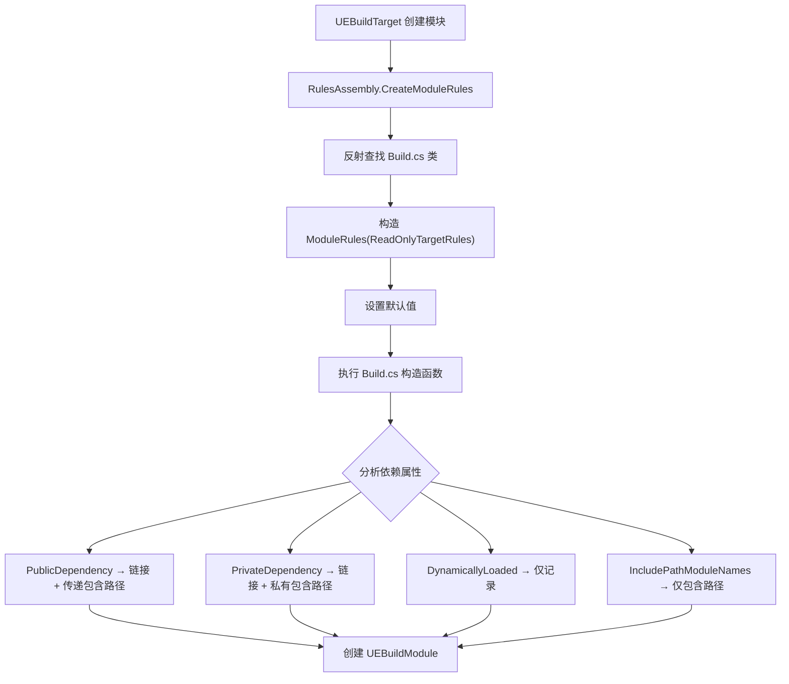
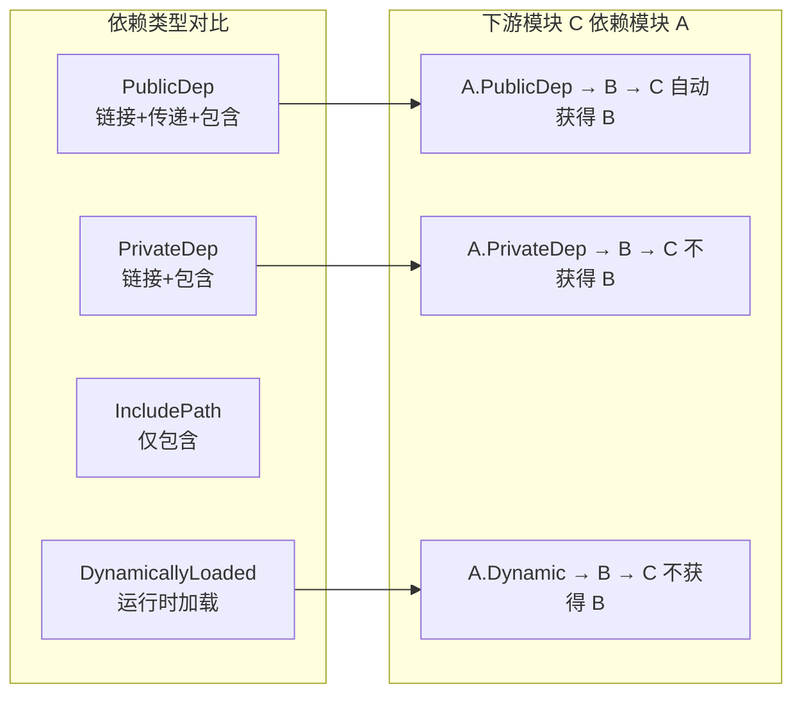

# ModuleRules 详解

## 摘要
`ModuleRules` 是 UE5.7.4 构建系统中每个 `.Build.cs` 文件的基类，定义了模块的依赖关系、编译选项、平台过滤、库链接等全部构建属性。理解 `ModuleRules` 是编写和调试 `.Build.cs` 文件的核心。

## 适合解决的问题
- PublicDependencyModuleNames 和 PrivateDependencyModuleNames 有什么区别？
- 如何添加第三方库？
- 如何控制模块只在特定平台编译？
- ModuleType.External 和 CPlusPlus 有什么区别？
- DynamicallyLoadedModuleNames 是什么？什么时候用？
- PCH 相关属性如何设置？

## 核心结论
1. `PublicDependency` 传递给下游模块，`PrivateDependency` 仅当前模块使用
2. `DynamicallyLoadedModuleNames` 不产生链接依赖，运行时通过 `FModuleManager` 加载
3. `ModuleType.External` 用于第三方库，不参与 C++ 编译，只提供头文件和库文件路径
4. 模块加载有 10 个阶段，从 `EarliestPossible` 到 `PostEngineInit`
5. 平台过滤通过 `TargetAllowList`/`PlatformAllowList` 等属性控制

## 源码位置
| 文件 | 路径 | 作用 |
|------|------|------|
| ModuleRules.cs | `Engine/Source/Programs/UnrealBuildTool/Configuration/ModuleRules.cs` | 模块规则基类 |
| ModuleDescriptor.cs | `Engine/Source/Programs/UnrealBuildTool/System/ModuleDescriptor.cs` | 模块描述符（HostType, LoadingPhase, 平台过滤） |
| UEBuildModule.cs | `Engine/Source/Programs/UnrealBuildTool/Configuration/UEBuildModule.cs` | UBT 内部模块表示 |
| UEBuildTarget.cs | `Engine/Source/Programs/UnrealBuildTool/Configuration/UEBuildTarget.cs` | 构建目标 |

## 1. 构造函数

```csharp
// ModuleRules.cs:1505-1510
public ModuleRules(ReadOnlyTargetRules target)
{
    Target = target;
    CppCompileWarningSettings = new CppCompileWarnings(this, Logger);
}
```

所有 `.Build.cs` 文件都遵循此模式：
```csharp
public class MyModule : ModuleRules
{
    public MyModule(ReadOnlyTargetRules Target) : base(Target)
    {
        // 配置模块
    }
}
```

`ReadOnlyTargetRules` 是 `TargetRules` 的只读包装，防止模块修改全局构建设置。

## 2. 依赖属性

### 核心依赖属性对比

| 属性 | 传递性 | 链接 | 包含路径 | 典型用途 |
|------|--------|------|----------|----------|
| `PublicDependencyModuleNames` | 传递给下游 | 是 | 自动添加公开+私有 | 头文件中引用了该模块的类型 |
| `PrivateDependencyModuleNames` | 不传递 | 是 | 自动添加私有 | 仅 .cpp 中使用 |
| `PublicIncludePathModuleNames` | 传递给下游 | 否 | 仅公开 | 需要头文件但不需要链接 |
| `PrivateIncludePathModuleNames` | 不传递 | 否 | 仅私有 | 内部使用的头文件路径 |
| `DynamicallyLoadedModuleNames` | 不传递 | 否 | 不自动添加 | 运行时按需加载 |
| `CircularlyReferencedDependentModules` | — | — | — | 处理循环依赖（遗留方案） |

### Public vs Private 的关键区别

```
模块 A 依赖 模块 B:
  PublicDependencyModuleNames.Add("B")  → 模块 C 依赖 A 时，自动获得 B 的头文件和链接
  PrivateDependencyModuleNames.Add("B") → 模块 C 依赖 A 时，不会自动获得 B
```

**判断规则**：如果在你的 `Public/` 头文件中 `#include` 了某模块的头文件，必须用 `PublicDependency`；如果只在 `.cpp` 中使用，用 `PrivateDependency`。

### DynamicallyLoadedModuleNames 详解

```csharp
// Engine.Build.cs 中的典型用法
DynamicallyLoadedModuleNames.Add("Media");              // 运行时加载，不链接
PrivateIncludePathModuleNames.Add("Media");              // 但编译时需要头文件
```

运行时加载机制：
```cpp
// 在模块代码中手动加载
FModuleManager::Get().LoadModule("Media");
```

适用场景：
- 可选功能（音频解码器、特定平台模块）
- 打破循环依赖
- 插件系统延迟加载
- 编辑器专用模块在运行时按需加载

## 3. 包含路径属性

| 属性 | 用途 | 默认行为 |
|------|------|----------|
| `PublicSystemIncludePaths` | 第三方公开头文件（不检查依赖） | 空 |
| `PublicIncludePaths` | 模块公开头文件 | 自动添加 `Public/` 子目录 |
| `InternalIncludePaths` | 模块内部头文件 | 自动添加 `Internal/` 子目录 |
| `PrivateIncludePaths` | 模块私有头文件 | 包含 `Private/` 目录 |
| `bAddDefaultIncludePaths` | 是否自动添加默认路径 | `true` |

**典型目录结构**：
```
MyModule/
├── Public/          ← 自动加入 PublicIncludePaths
│   └── MyModule.h
├── Internal/        ← 自动加入 InternalIncludePaths
│   └── MyModuleInternal.h
├── Private/         ← 自动加入 PrivateIncludePaths
│   ├── MyModule.cpp
│   └── MyModulePCH.h
└── MyModule.Build.cs
```

## 4. 定义属性

| 属性 | 传递性 | 效果 |
|------|--------|------|
| `PublicDefinitions` | 传递给下游 | 编译器 `/D` 宏定义 |
| `PrivateDefinitions` | 不传递 | 仅当前模块的宏定义 |

示例：
```csharp
PublicDefinitions.Add("MY_MODULE_API=__declspec(dllexport)");
PrivateDefinitions.Add("WITH_MY_MODULE=1");
```

## 5. 库链接属性

| 属性 | 用途 | 平台 |
|------|------|------|
| `PublicAdditionalLibraries` | 静态库 `.lib` / `.a` | 全平台 |
| `PublicSystemLibraries` | 系统库名（如 "psapi"） | Windows |
| `PublicSystemLibraryPaths` | 系统库搜索路径 | 全平台 |
| `PublicRuntimeLibraryPaths` | 运行时库搜索路径（`.so`） | Linux |
| `PublicFrameworks` | iOS/macOS 框架 | Apple |
| `PublicWeakFrameworks` | 弱链接框架（版本兼容） | Apple |
| `PublicDelayLoadDLLs` | 延迟加载 DLL | Windows |
| `RuntimeDependencies` | 需要随打包分发的文件 | 全平台 |

### 第三方库集成示例

```csharp
// External 模块类型（仅提供头文件和库文件）
Type = ModuleType.External;

// 头文件路径
PublicSystemIncludePaths.Add(Path.Combine(ModuleDirectory, "include"));

// 库文件路径（按平台区分）
if (Target.Platform == UnrealTargetPlatform.Win64)
{
    PublicAdditionalLibraries.Add(Path.Combine(ModuleDirectory, "lib", "Win64", "mylib.lib"));
}
else if (Target.Platform == UnrealTargetPlatform.Mac)
{
    PublicAdditionalLibraries.Add(Path.Combine(ModuleDirectory, "lib", "Mac", "libmylib.a"));
}
```

## 6. 构建控制属性

### 预编译头（PCH）

```csharp
// PCHUsageMode 枚举值
PCHUsageMode.Default              // 引擎模块用共享 PCH，游戏模块不用
PCHUsageMode.NoPCHs               // 禁用所有 PCH
PCHUsageMode.NoSharedPCHs         // 总是生成独占 PCH
PCHUsageMode.UseSharedPCHs        // 允许使用共享 PCH
PCHUsageMode.UseExplicitOrSharedPCHs  // 优先使用指定的私有 PCH
```

```csharp
// 提供共享 PCH 给其他模块
SharedPCHHeaderFile = "Public/MyModulePCH.h";

// 指定模块私有 PCH
PrivatePCHHeaderFile = "Private/MyModulePrivatePCH.h";

// 覆盖触发 PCH 的最小文件数
MinFilesUsingPrecompiledHeaderOverride = 4;
```

### 编译优化

```csharp
// 优化策略
OptimizeCode = CodeOptimization.Never;              // 从不优化（调试模块）
OptimizeCode = CodeOptimization.InNonDebugBuilds;   // 非 Debug 构建（默认）
OptimizeCode = CodeOptimization.InShippingBuildsOnly;  // 仅 Shipping
OptimizeCode = CodeOptimization.Always;             // 始终优化

// 优化方向
OptimizationLevel = OptimizationMode.Speed;   // 速度优先
OptimizationLevel = OptimizationMode.Size;    // 体积优先
```

### C++ 语言标准

```csharp
CppStandard = CppStandardVersion.Cpp17;   // C++17
CppStandard = CppStandardVersion.Cpp20;   // C++20
CStandard = CStandardVersion.C11;         // C11
```

### 异常和 RTTI

```csharp
bEnableExceptions = true;    // 启用 C++ 异常（默认关闭）
bUseRTTI = true;             // 启用 RTTI（默认关闭）
```

## 7. 模块类型（ModuleHostType）

| 类型 | 说明 | 打包 |
|------|------|------|
| `Runtime` | 运行时必需（默认） | 打包到 Shipping |
| `RuntimeNoCommandlet` | 运行时，但不在 Commandlet 中 | 打包到 Shipping |
| `RuntimeAndProgram` | 运行时和独立程序都包含 | 打包到 Shipping |
| `CookedOnly` | 仅 Cooked 构建 | 仅 Cooked |
| `UncookedOnly` | 仅未 Cooked 构建 | 不打包 |
| `DeveloperTool` | bBuildDeveloperTools 时加载 | 不打包到 Shipping |
| `Editor` | 仅编辑器 | 不打包 |
| `EditorNoCommandlet` | 编辑器但非 Commandlet | 不打包 |
| `EditorAndProgram` | 编辑器或程序 | 不打包 |
| `Program` | 仅独立程序 | 不打包 |
| `ServerOnly` | 仅服务器构建 | 仅 Server |
| `ClientOnly` | 仅客户端构建 | 仅 Client |
| `External` | 永不自动加载，仅引用 | N/A |

## 8. 模块加载阶段（ModuleLoadingPhase）

| 阶段 | 加载时机 | 典型用途 |
|------|----------|----------|
| `EarliestPossible` | 插件加载最早时机（需要 GConfig） | 非常早期的钩子 |
| `PostConfigInit` | 配置系统初始化后，引擎完整初始化前 | 低级钩子、日志 |
| `PostSplashScreen` | 初始画面显示后 | 闪屏相关 |
| `PreEarlyLoadingScreen` | 早期加载画面之前（UObject 未就绪） | 加载画面定制 |
| `PreLoadingScreen` | 加载画面触发之前 | 加载画面定制 |
| `PreDefault` | 默认阶段之前 | 早期模块 |
| `Default` | 引擎初始化期间，游戏模块之后 | 标准模块（默认值） |
| `PostDefault` | 默认阶段之后 | 延迟加载模块 |
| `PostEngineInit` | 引擎完全初始化后 | 后期模块 |
| `None` | 不自动加载 | 手动加载 |

在 `.uplugin` 文件中指定：
```json
{
    "Name": "MyModule",
    "Type": "Runtime",
    "LoadingPhase": "Default"
}
```

## 9. 平台过滤

```csharp
// 仅允许特定平台
TargetAllowList = new TargetType[] { TargetType.Editor };

// 排除特定平台
PlatformDenyList = new List<UnrealTargetPlatform> { UnrealTargetPlatform.Android };

// 按架构过滤
PlatformArchitectureAllowList = new Dictionary<UnrealTargetPlatform, List<UnrealArch>>
{
    { UnrealTargetPlatform.Win64, new List<UnrealArch> { UnrealArch.X64 } }
};
```

在 `.Build.cs` 中使用条件编译：
```csharp
if (Target.Platform == UnrealTargetPlatform.Win64)
{
    // Windows 特定逻辑
}
else if (Target.Platform == UnrealTargetPlatform.Android)
{
    // Android 特定逻辑
}

// 平台组判断
if (Target.Platform.IsInGroup(UnrealPlatformGroup.Windows))
{
    // 包含 Win64, WinGDK 等
}
```

## 10. 警告控制

```csharp
bWarningsAsErrors = true;              // 警告视为错误
bDisableStaticAnalysis = true;         // 禁用静态分析
ShadowVariableWarningLevel = WarningLevel.Error;  // 阴影变量警告级别
bValidateFormatStrings = true;         // 验证 UE_LOG 格式字符串
bValidateInternalApi = true;           // 警告使用已弃用内部 API
bValidateCircularDependencies = true;  // 验证循环依赖
```

## 11. 真实引擎 Build.cs 示例分析

### Core.Build.cs（最底层运行时模块）

```csharp
// 关键模式：
// 1. 大量平台条件判断
if (Target.Platform == UnrealTargetPlatform.Win64)
{
    PublicDelayLoadDLLs.Add("Ole32.dll");
    PublicDelayLoadDLLs.Add("WinInet.dll");
}

// 2. 第三方依赖通过专门方法添加
AddEngineThirdPartyPrivateStaticDependencies(Target, "zlib", "IntelTBB", "mimalloc");

// 3. 提供 SharedPCH 给其他模块
SharedPCHHeaderFile = "Public/HAL/Platform.h";
PrivatePCHHeaderFile = "CorePrivatePCH.h";

// 4. Unity 构建调优
NumIncludedBytesPerUnityCPPOverride = 491520;
```

### Engine.Build.cs（最大模块之一）

```csharp
// 关键模式：
// 1. 大量公开依赖（40+ 个模块）
PublicDependencyModuleNames.AddRange(new string[] {
    "Core", "CoreUObject", "InputCore", "Slate", "SlateCore",
    "RenderCore", "RHI", "PhysicsCore", "NavigationSystem", ...
});

// 2. 编辑器条件编译
if (Target.bBuildEditor)
{
    PrivateDependencyModuleNames.Add("TargetPlatform");
    DynamicallyLoadedModuleNames.Add("DesktopPlatform");
}

// 3. 动态加载打破循环依赖
DynamicallyLoadedModuleNames.Add("Media");
PrivateIncludePathModuleNames.Add("Media");

// 4. 遗留循环依赖声明
CircularlyReferencedDependentModules.Add("GameplayTags");
CircularlyReferencedDependentModules.Add("Landscape");
CircularlyReferencedDependentModules.Add("UMG");
```

### Renderer.Build.cs（动态加载渲染模块）

```csharp
// 关键模式：
// 1. 最小公开依赖
PublicDependencyModuleNames.AddRange(new string[] { "Core", "Engine" });

// 2. 私有着色器头文件路径
PrivateIncludePaths.Add("Shaders/Private");

// 3. 编辑器条件加载
if (Target.bBuildEditor)
{
    PrivateDependencyModuleNames.Add("TargetPlatform");
}

// 4. 动态加载可选功能
DynamicallyLoadedModuleNames.Add("EyeTracker");
```

## 12. Mermaid 调用图





## 13. 常见误区

| 误区 | 正确做法 |
|------|----------|
| 所有依赖都用 PublicDependency | 头文件未引用的类型用 Private |
| DynamicallyLoaded 会自动添加包含路径 | 需要手动添加 IncludePathModuleNames |
| External 模块需要 IMPLEMENT_MODULE | External 模块不参与 C++ 编译 |
| `#include` 了某模块的头文件但编译通过就没事 | 链接阶段会报 LNK2019，必须添加依赖 |
| 模块加载阶段越早越好 | 过早加载可能导致依赖未就绪 |

## 源码证据
- Engine/Source/Programs/UnrealBuildTool/Configuration/ModuleRules.cs:1505-1510（构造函数）
- Engine/Source/Programs/UnrealBuildTool/Configuration/ModuleRules.cs:1183-1206（依赖属性）
- Engine/Source/Programs/UnrealBuildTool/Configuration/ModuleRules.cs:1211-1227（包含路径）
- Engine/Source/Programs/UnrealBuildTool/Configuration/ModuleRules.cs:193-219（PCHUsageMode）
- Engine/Source/Programs/UnrealBuildTool/Configuration/ModuleRules.cs:108-119（ModuleType）
- Engine/Source/Programs/UnrealBuildTool/System/ModuleDescriptor.cs:18-99（ModuleHostType）
- Engine/Source/Programs/UnrealBuildTool/System/ModuleDescriptor.cs:104-155（ModuleLoadingPhase）
- Engine/Source/Runtime/Core/Core.Build.cs（Core 模块示例）
- Engine/Source/Runtime/Engine/Engine.Build.cs（Engine 模块示例）
- Engine/Source/Runtime/Renderer/Renderer.Build.cs（Renderer 模块示例）

## 相关文档
- [UBT.md](UBT.md) — UnrealBuildTool 详解
- [TargetRules.md](TargetRules.md) — 目标规则
- [BuildCs_Guide.md](BuildCs_Guide.md) — Build.cs 实践指南
- [Common_Build_Errors.md](Common_Build_Errors.md) — 常见构建错误
