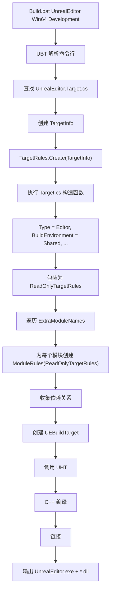
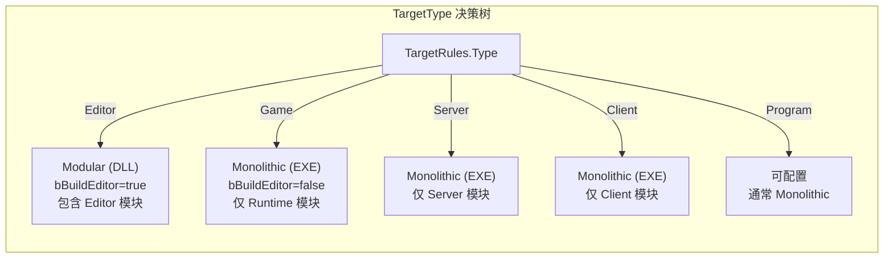

# TargetRules 详解

## 摘要
`TargetRules` 是 UE5.7.4 构建系统中每个 `.Target.cs` 文件的基类，定义了构建目标的类型、链接方式、编译选项、平台设置等全局构建属性。每个 `.Target.cs` 文件对应一个可执行文件（Game、Editor、Server、Client 或 Program）。

## 适合解决的问题
- Target.cs 文件是做什么的？和 Build.cs 有什么关系？
- Game/Editor/Server/Client/Program 这些目标类型有什么区别？
- Monolithic 和 Modular 链接方式的区别是什么？
- 如何控制 Shipping 构建的行为？
- TargetRules 的属性如何传递给 ModuleRules？

## 核心结论
1. 每个 `.Target.cs` 对应一个可执行文件，定义全局构建策略
2. `TargetType` 决定了模块过滤、链接方式和预处理器定义
3. Editor 默认使用 Modular（DLL），Game/Server/Client 默认使用 Monolithic
4. `TargetRules` 通过 `ReadOnlyTargetRules` 包装后传递给 `ModuleRules`，模块不能修改全局设置
5. `DefaultBuildSettings` 和 `IncludeOrderVersion` 控制编译器的版本兼容行为

## 源码位置
| 文件 | 路径 | 作用 |
|------|------|------|
| TargetRules.cs | `Engine/Source/Programs/UnrealBuildTool/Configuration/TargetRules.cs` | 目标规则基类 |
| TargetInfo.cs | `Engine/Source/Programs/UnrealBuildTool/Configuration/TargetInfo.cs` | 目标基本信息 |
| ReadOnlyTargetRules.cs | `Engine/Source/Programs/UnrealBuildTool/Configuration/ReadOnlyTargetRules.cs` | 只读包装 |
| UEBuildTarget.cs | `Engine/Source/Programs/UnrealBuildTool/Configuration/UEBuildTarget.cs` | UBT 内部目标表示 |
| RulesAssembly.cs | `Engine/Source/Programs/UnrealBuildTool/System/RulesAssembly.cs` | 规则实例化 |

## 1. TargetType 枚举

```csharp
// TargetRules.cs:21-47
public enum TargetType
{
    Game,      // Cooked 单体游戏可执行文件（GameName.exe）
    Editor,    // 未 Cooked 模块化编辑器（UnrealEditor.exe + DLL）
    Client,    // Cooked 单体客户端（无服务器代码）
    Server,    // Cooked 单体服务器（无客户端代码）
    Program    // 独立程序（如 ShaderCompileWorker）
}
```

### 各类型对比

| 特征 | Game | Editor | Client | Server | Program |
|------|------|--------|--------|--------|---------|
| 链接方式 | Monolithic | Modular | Monolithic | Monolithic | 可配置 |
| 包含编辑器代码 | 否 | 是 | 否 | 否 | 可配置 |
| 包含开发者工具 | 否 | 是 | 否 | 否 | 可配置 |
| 需要 Cooked 数据 | 是 | 否 | 是 | 是 | 可配置 |
| 预处理器定义 | `UE_GAME` | `UE_EDITOR` | `UE_CLIENT` | `UE_SERVER` | `UE_PROGRAM` |
| 模块过滤 | 仅 Runtime | Runtime + Editor | 仅 Runtime | 仅 Runtime | 可配置 |

## 2. LinkType — 链接方式

```csharp
// TargetRules.cs:53-69
public enum TargetLinkType
{
    Default,    // 根据 TargetType 自动决定
    Monolithic, // 单体二进制
    Modular     // 多个 DLL
}
```

### 默认行为（TargetRules.cs:2529）

```csharp
get => (LinkTypePrivate != TargetLinkType.Default)
    ? LinkTypePrivate
    : ((Type == TargetType.Editor)
        ? TargetLinkType.Modular
        : TargetLinkType.Monolithic);
```

### Monolithic vs Modular

| 特征 | Monolithic | Modular |
|------|-----------|---------|
| 输出 | 单个 .exe | .exe + 多个 .dll |
| 启动速度 | 快（已链接） | 需要加载 DLL |
| 热重载 | 不支持 | 支持 |
| 编译时间 | 全量链接较慢 | 可单独编译模块 |
| 内存布局 | 静态确定 | 运行时绑定 |
| 默认场景 | Game/Server/Client | Editor |
| 热重载 | 不支持 | 支持 Live Coding |

## 3. 核心属性分类

### 3.1 目标标识

| 属性 | 类型 | 默认值 | 说明 |
|------|------|--------|------|
| `Name` | string | 文件名派生 | 目标名称 |
| `Type` | TargetType | Game | 目标类型 |
| `Platform` | UnrealTargetPlatform | — | 构建平台 |
| `Configuration` | UnrealTargetConfiguration | — | 构建配置（Debug/Development/Shipping） |
| `Architecture` | UnrealArch | — | 目标架构 |
| `ProjectFile` | FileReference? | — | .uproject 文件路径 |
| `Version` | ReadOnlyBuildVersion | — | 当前构建版本 |

### 3.2 版本控制

| 属性 | 类型 | 说明 |
|------|------|------|
| `DefaultBuildSettings` | BuildSettingsVersion | 编译器默认行为版本（V1-V6, Latest） |
| `IncludeOrderVersion` | EngineIncludeOrderVersion | 头文件搜索顺序版本（Unreal5_4 到 Unreal5_7, Latest） |

`IncludeOrderVersion` 控制引擎头文件的搜索顺序，不同版本可能有不同的优先级。UE5.7 对应 `Unreal5_7` 或 `Latest`。

### 3.3 引擎链接

| 属性 | 类型 | 默认值 | 说明 |
|------|------|--------|------|
| `bCompileAgainstEngine` | bool | true | 链接 Engine 模块 |
| `bCompileAgainstCoreUObject` | bool | true | 链接 CoreUObject |
| `bCompileAgainstApplicationCore` | bool | true | 链接 ApplicationCore |
| `bCompileAgainstEditor` | bool | Type==Editor | 链接编辑器模块 |
| `bBuildEditor` | bool | Type==Editor | 是否构建编辑器 |
| `bBuildRequiresCookedData` | bool | Game/Client/Server | 是否需要 Cooked 数据 |
| `bBuildWithEditorOnlyData` | bool | Editor/Program | 包含仅编辑器数据 |

### 3.4 构建环境

| 属性 | 类型 | 默认值 | 说明 |
|------|------|--------|------|
| `BuildEnvironment` | TargetBuildEnvironment | — | Shared/Unique/UniqueIfNeeded |
| `bFormalBuild` | bool | false | 正式构建（promoted） |
| `bBuildAllModules` | bool | false | 构建所有有效模块 |

`BuildEnvironment.Shared` 表示多个目标共享中间文件，用于加速引擎构建。Editor 和 Game 目标通常都使用 Shared。

### 3.5 模块配置

| 属性 | 类型 | 说明 |
|------|------|------|
| `ExtraModuleNames` | List\<string\> | 额外编译的模块 |
| `LaunchModuleName` | string? | 启动模块名（默认 "Launch"） |
| `DisableUnityBuildForModules` | string[] | 禁用 Unity 构建的模块 |
| `EnableOptimizeCodeForModules` | string[] | 强制优化的模块 |
| `DisableOptimizeCodeForModules` | string[] | 禁用优化的模块 |

### 3.6 PCH 设置

| 属性 | 类型 | 默认值 | 说明 |
|------|------|--------|------|
| `bUsePCHFiles` | bool | true | 使用预编译头 |
| `bUseSharedPCHs` | bool | true | 共享 PCH |
| `bChainPCHs` | bool | true | PCH 链式引用（Clang） |
| `MinFilesUsingPrecompiledHeader` | int | 6 | 触发 PCH 的最小文件数 |
| `bForcePrecompiledHeaderForGameModules` | bool | true | 强制游戏模块使用 PCH |

### 3.7 Unity 构建

| 属性 | 类型 | 默认值 | 说明 |
|------|------|--------|------|
| `bUseUnityBuild` | bool | true | Unity 构建（合并多个 .cpp） |
| `bForceUnityBuild` | bool | false | 强制 Unity |
| `bUseAdaptiveUnityBuild` | bool | true | 自适应 Unity（修改的文件单独编译） |
| `NumIncludedBytesPerUnityCPP` | int | 393216 | 每个 Unity CPP 的字节数上限 |
| `MinGameModuleSourceFilesForUnityBuild` | int | 32 | 游戏模块触发 Unity 的最小文件数 |

### 3.8 编译器/链接器

| 属性 | 类型 | 默认值 | 说明 |
|------|------|--------|------|
| `OptimizationLevel` | OptimizationMode | — | 优化方向（Speed/Size/SizeAndSpeed） |
| `bUseInlining` | bool | true | 内联优化 |
| `bAllowLTCG` | bool | — | 链接时代码生成 |
| `bPreferThinLTO` | bool | true | Thin LTO |
| `bUseIncrementalLinking` | bool | — | 增量链接 |
| `DebugInfo` | DebugInfoMode | — | 调试信息级别 |
| `AdditionalCompilerArguments` | string? | — | 额外编译器参数 |
| `AdditionalLinkerArguments` | string? | — | 额外链接器参数 |

### 3.9 Shipping 控制

| 属性 | 类型 | 默认值 | 说明 |
|------|------|--------|------|
| `bLegalToDistributeBinary` | bool | false | 公开分发权限 |
| `bUseLoggingInShipping` | bool | false | Shipping 中启用日志 |
| `bUseConsoleInShipping` | bool | false | Shipping 中启用控制台 |
| `bUseChecksInShipping` | bool | false | Shipping 中启用检查 |
| `bAllowProfileGPUInShipping` | bool | false | Shipping 中允许 GPU 性能分析 |
| `bUseExecCommandsInShipping` | bool | true | Shipping 中允许 exec 命令 |

### 3.10 平台特定

| 属性 | 类型 | 说明 |
|------|------|------|
| `WindowsPlatform` | WindowsTargetRules | Windows 平台设置 |
| `MacPlatform` | MacTargetRules | Mac 平台设置 |
| `LinuxPlatform` | LinuxTargetRules | Linux 平台设置 |
| `IOSPlatform` | IOSTargetRules | iOS 平台设置 |
| `AndroidPlatform` | AndroidTargetRules | Android 平台设置 |

## 4. TargetRules 如何传递给 ModuleRules

```
TargetRules（可变）
    ↓ 包装
ReadOnlyTargetRules（只读）
    ↓ 传入
ModuleRules 构造函数
```

**关键代码路径：**

1. **创建 TargetRules**（TargetRules.cs:3105-3143）：
```csharp
// 从 TargetInfo 创建 TargetRules 实例
public static TargetRules Create(TargetInfo Target, ...)
```

2. **包装为只读**（ReadOnlyTargetRules.cs:27-30）：
```csharp
public ReadOnlyTargetRules(TargetRules inner)
{
    Inner = inner;
    // 包装平台特定规则
}
```

3. **传入 ModuleRules**（RulesAssembly.cs:568-582）：
```csharp
ConstructorInfo? Constructor = RulesObjectType.GetConstructor(
    new Type[] { typeof(ReadOnlyTargetRules) }
);
Constructor.Invoke(RulesObject, new object[] { Target });
```

4. **ModuleRules 存储**（ModuleRules.cs:1505-1509）：
```csharp
public ModuleRules(ReadOnlyTargetRules target)
{
    Target = target;  // 模块只能读取，不能修改
}
```

这种设计确保模块不能修改全局构建设置，只能配置自己的构建规则。

## 5. 真实 Target.cs 示例

### UnrealEditor（编辑器目标）

```csharp
// Engine/Source/UnrealEditor.Target.cs
public class UnrealEditorTarget : TargetRules
{
    public UnrealEditorTarget(TargetInfo Target) : base(Target)
    {
        Type = TargetType.Editor;
        IncludeOrderVersion = EngineIncludeOrderVersion.Latest;
        BuildEnvironment = TargetBuildEnvironment.Shared;
        bBuildAllModules = true;                    // 编辑器构建所有模块
        ExtraModuleNames.Add("UnrealGame");         // 包含游戏模块
    }
}
```

### UnrealGame（游戏目标）

```csharp
// Engine/Source/UnrealGame.Target.cs
[SupportedPlatforms(UnrealPlatformClass.All)]
public class UnrealGameTarget : TargetRules
{
    public UnrealGameTarget(TargetInfo Target) : base(Target)
    {
        Type = TargetType.Game;
        IncludeOrderVersion = EngineIncludeOrderVersion.Latest;
        BuildEnvironment = TargetBuildEnvironment.Shared;
        ExtraModuleNames.Add("UnrealGame");
    }
}
```

### UnrealServer（服务器目标）

```csharp
// Engine/Source/UnrealServer.Target.cs
[SupportedPlatforms(UnrealPlatformClass.Server)]
public class UnrealServerTarget : TargetRules
{
    public UnrealServerTarget(TargetInfo Target) : base(Target)
    {
        Type = TargetType.Server;
        IncludeOrderVersion = EngineIncludeOrderVersion.Latest;
        BuildEnvironment = TargetBuildEnvironment.Shared;
        ExtraModuleNames.Add("UnrealGame");
    }
}
```

### BlankProgram（最小程序目标）

```csharp
// Engine/Source/Programs/BlankProgram/BlankProgram.Target.cs
[SupportedPlatforms(UnrealPlatformClass.All)]
public class BlankProgramTarget : TargetRules
{
    public BlankProgramTarget(TargetInfo Target) : base(Target)
    {
        Type = TargetType.Program;
        IncludeOrderVersion = EngineIncludeOrderVersion.Latest;
        LinkType = TargetLinkType.Monolithic;       // 程序使用单体链接
        LaunchModuleName = "BlankProgram";           // 指定启动模块

        // 精简配置——不链接引擎
        bBuildDeveloperTools = false;
        bCompileAgainstEngine = false;
        bCompileAgainstCoreUObject = false;
        bCompileAgainstApplicationCore = false;
        bCompileICU = false;
        bIsBuildingConsoleApplication = true;
    }
}
```

### ShaderCompileWorker（工具程序目标）

```csharp
// 独立的编译工具，不依赖 Engine
Type = TargetType.Program;
LinkType = TargetLinkType.Monolithic;
bCompileAgainstEngine = false;
bCompileAgainstCoreUObject = false;
```

## 6. 构建目标创建流程

```
Build.bat → UBT 入口
    ↓
解析命令行参数（TargetName, Platform, Configuration）
    ↓
查找 Target.cs 文件
    ↓
创建 TargetInfo（Name, Platform, Configuration）
    ↓
调用 TargetRules.Create(TargetInfo, ...) 创建实例
    ↓
执行 Target.cs 构造函数，设置属性
    ↓
包装为 ReadOnlyTargetRules
    ↓
遍历模块列表，为每个模块：
    ├── 查找 ModuleName.Build.cs
    ├── 创建 ModuleRules(ReadOnlyTargetRules)
    └── 收集依赖关系
    ↓
创建 UEBuildTarget（UBT 内部表示）
    ↓
驱动编译和链接
```

## 7. Mermaid 调用图





## 8. 常见误区

| 误区 | 正确做法 |
|------|----------|
| 在 ModuleRules 中修改 Target 属性 | ModuleRules 只接收 ReadOnlyTargetRules，不能修改 |
| 所有目标类型都包含编辑器模块 | 只有 Editor 和 EditorAndProgram 类型包含 |
| Monolithic 构建更快 | 编译可能更慢（全量链接），但启动更快 |
| Program 目标可以随意设置 | Program 需要仔细控制 bCompileAgainst* 属性 |
| IncludeOrderVersion 越新越好 | 应与项目版本匹配，避免头文件冲突 |

## 9. 调试建议

1. **查看 UBT 解析结果**：运行 `GenerateProjectFiles.bat -verbose` 查看目标解析详情
2. **检查目标属性**：在 Build.cs 中通过 `Target.Type`、`Target.bBuildEditor` 判断当前构建目标
3. **查看模块列表**：UBT 输出中搜索 "Compiling" 查看哪些模块被包含
4. **Shipping 构建**：使用 `-WaitMutex` 和 verbose 输出排查 Shipping 配置问题

## 源码证据
- Engine/Source/Programs/UnrealBuildTool/Configuration/TargetRules.cs:21-47（TargetType 枚举）
- Engine/Source/Programs/UnrealBuildTool/Configuration/TargetRules.cs:53-69（TargetLinkType 枚举）
- Engine/Source/Programs/UnrealBuildTool/Configuration/TargetRules.cs:552（TargetRules 基类声明）
- Engine/Source/Programs/UnrealBuildTool/Configuration/TargetRules.cs:2527-2531（LinkType 属性）
- Engine/Source/Programs/UnrealBuildTool/Configuration/TargetRules.cs:3105-3143（Create 工厂方法）
- Engine/Source/Programs/UnrealBuildTool/Configuration/TargetInfo.cs:12-127（TargetInfo 类）
- Engine/Source/Programs/UnrealBuildTool/Configuration/ReadOnlyTargetRules.cs:27-30（只读包装）
- Engine/Source/UnrealEditor.Target.cs（编辑器目标示例）
- Engine/Source/UnrealGame.Target.cs（游戏目标示例）
- Engine/Source/UnrealServer.Target.cs（服务器目标示例）
- Engine/Source/Programs/BlankProgram/BlankProgram.Target.cs（程序目标示例）

## 相关文档
- [UBT.md](UBT.md) — UnrealBuildTool 详解
- [ModuleRules.md](ModuleRules.md) — 模块规则
- [BuildCs_Guide.md](BuildCs_Guide.md) — Build.cs 实践指南
- [Common_Build_Errors.md](Common_Build_Errors.md) — 常见构建错误
