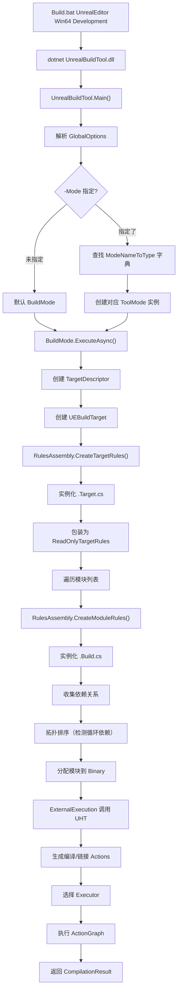
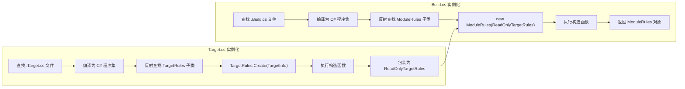
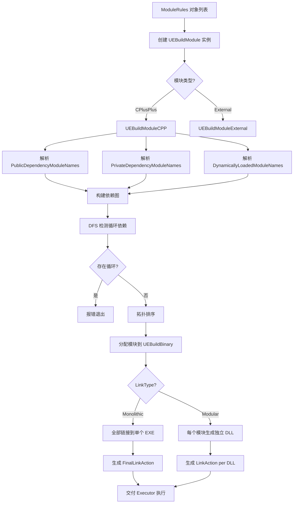

# UnrealBuildTool (UBT) 详解

## 摘要
UBT 是 UE5.7.4 构建系统的核心，用 C# 编写，位于 `Engine/Source/Programs/UnrealBuildTool/`。它负责解析 `.Target.cs` 和 `.Build.cs` 文件、确定模块依赖拓扑排序、调用 UHT 生成反射代码、驱动 C++ 编译器、编排链接器生成最终可执行文件或 DLL。UBT 采用 ToolMode 架构，支持 27 种运行模式（BuildMode 为默认模式）。

## 适合解决的问题
- UBT 的完整启动流程和构建流程是怎样的？
- Target.cs 和 Build.cs 是如何被加载和实例化的？
- 模块依赖如何解析？循环依赖如何检测？
- 如何实现增量构建？UBT 如何判断哪些模块需要重新编译？
- UBT 支持哪些构建模式？如何添加自定义模式？
- Makefile / ActionGraph 是如何工作的？
- 如何调试 UBT 本身？

## 核心结论
1. UBT 入口为 `UnrealBuildTool.Main()`，默认使用 `BuildMode` 执行构建
2. 模式系统通过反射发现所有 `ToolMode` 子类，命令行 `-Mode=XXX` 指定模式
3. `BuildMode.ExecuteAsync()` 是构建入口，创建 `UEBuildTarget` 并调用 `BuildAsync()`
4. `RulesAssembly` 负责编译 `.Build.cs` 和 `.Target.cs` 为 C# 程序集并实例化
5. UEBuildTarget 创建 UEBuildModule（CPP/External），进行拓扑排序，生成 ActionGraph
6. ActionGraph 包含所有编译/链接操作，由 Executor（Local/Parallel/XGE）执行
7. 增量构建通过 Makefile 机制实现：比对动作依赖的哈希值决定是否重新执行
8. UBT 与 UHT 通过 `ExternalExecution.ExecuteHeaderToolIfNecessaryInternalAsync()` 集成

## 源码位置

| 组件 | 路径 | 作用 |
|------|------|------|
| UBT 入口 | `Engine/Source/Programs/UnrealBuildTool/UnrealBuildTool.cs` | Main() 函数，模式分发 |
| BuildMode | `Engine/Source/Programs/UnrealBuildTool/Modes/BuildMode.cs` | 默认构建模式 |
| UEBuildTarget | `Engine/Source/Programs/UnrealBuildTool/Configuration/UEBuildTarget.cs` | 构建目标内部表示 |
| UEBuildModule | `Engine/Source/Programs/UnrealBuildTool/Configuration/UEBuildModule.cs` | 模块内部表示（抽象基类） |
| UEBuildModuleCPP | `Engine/Source/Programs/UnrealBuildTool/Configuration/UEBuildModuleCPP.cs` | C++ 模块内部表示 |
| UEBuildModuleExternal | `Engine/Source/Programs/UnrealBuildTool/Configuration/UEBuildModuleExternal.cs` | 第三方外部模块 |
| ModuleRules | `Engine/Source/Programs/UnrealBuildTool/Configuration/ModuleRules.cs` | Build.cs 基类 |
| TargetRules | `Engine/Source/Programs/UnrealBuildTool/Configuration/TargetRules.cs` | Target.cs 基类 |
| RulesAssembly | `Engine/Source/Programs/UnrealBuildTool/System/RulesAssembly.cs` | 规则编译与实例化 |
| ExternalExecution | `Engine/Source/Programs/UnrealBuildTool/System/ExternalExecution.cs` | UHT 调用与外部工具集成 |
| ToolMode | `Engine/Source/Programs/UnrealBuildTool/System/ToolMode.cs` | 所有模式的基类 |
| Platform | `Engine/Source/Programs/UnrealBuildTool/Platform/` | 平台抽象 |
| ToolChain | `Engine/Source/Programs/UnrealBuildTool/ToolChain/` | 编译器工具链抽象 |
| Executor | `Engine/Source/Programs/UnrealBuildTool/Executors/` | 构建执行器（本地/并行/XGE） |
| Matchers | `Engine/Source/Programs/UnrealBuildTool/Matchers/` | 编译/链接错误匹配器 |
| Preprocessor | `Engine/Source/Programs/UnrealBuildTool/Preprocessor/` | C++ 预处理器 |
| Storage | `Engine/Source/Programs/UnrealBuildTool/Storage/` | 构建状态缓存 |

## 1. UBT 启动流程

### 入口：UnrealBuildTool.Main()

```
Build.bat → dotnet UnrealBuildTool.dll [参数]
    ↓
UnrealBuildTool.Main() (UnrealBuildTool.cs:396)
    ↓
创建 GlobalOptions，解析命令行参数 (UnrealBuildTool.cs:427)
    ↓
配置日志系统 (Log.OutputLevel, StartupTraceListener)
    ↓
设置工作目录为 Engine/Source (UnrealBuildTool.cs:473-474)
    ↓
通过 ModeNameToType 字典查找 ModeType (默认 BuildMode) (UnrealBuildTool.cs:480-491)
    ↓
获取 ToolModeAttribute.Options (确定需要初始化的系统)
    ↓
创建 ToolMode 实例，调用 ExecuteAsync()
    ↓
返回 CompilationResult (0=成功, 非0=失败)
```

### 模式发现机制

```csharp
// UnrealBuildTool.cs:291-307
// 通过反射自动发现所有 ToolMode 子类
private static Dictionary<string, Type> GetModes()
{
    Dictionary<string, Type> ModeNameToType = new(...);
    foreach (Type Type in Assembly.GetExecutingAssembly().GetTypes())
    {
        if (Type.IsClass && !Type.IsAbstract && Type.IsSubclassOf(typeof(ToolMode)))
        {
            ToolModeAttribute? Attribute = Type.GetCustomAttribute<ToolModeAttribute>();
            ModeNameToType.Add(Attribute!.Name, Type);
        }
    }
    return ModeNameToType;
}
```

### UBT 支持的全部模式（27 个）

| 模式 | 文件 | 用途 |
|------|------|------|
| `Build` | BuildMode.cs | **默认模式**，编译和链接目标 |
| `Clean` | CleanMode.cs | 清理构建产物 |
| `GenerateProjectFiles` | GenerateProjectFilesMode.cs | 生成 IDE 项目文件 |
| `UnrealHeaderTool` | UnrealHeaderToolMode.cs | 运行 UHT 代码生成 |
| `Deploy` | DeployMode.cs | 部署到目标设备 |
| `Execute` | ExecuteMode.cs | 执行构建后的程序 |
| `Query` | QueryMode.cs | 查询构建信息 |
| `QueryTargets` | QueryTargetsMode.cs | 查询可用目标 |
| `ValidatePlatforms` | ValidatePlatformsMode.cs | 验证平台配置 |
| `SetupPlatforms` | SetupPlatformsMode.cs | 设置平台 SDK |
| `WriteDocumentation` | WriteDocumentationMode.cs | 生成文档 |
| `WriteMetadata` | WriteMetadataMode.cs | 输出元数据 |
| `JsonExport` | JsonExportMode.cs | JSON 格式导出 |
| `Server` | ServerMode.cs | UBT 服务器模式（分布式构建） |
| `Test` | TestMode.cs | 运行测试 |
| `Analyze` | AnalyzeMode.cs | 分析构建输出 |
| `FixIncludePaths` | FixIncludePathsMode.cs | 修复头文件包含路径 |
| `GenerateClangDatabase` | GenerateClangDatabaseMode.cs | 生成 compile_commands.json |
| `InlineGeneratedCpps` | InlineGeneratedCpps.cs | 内联生成 .cpp |
| `IWYU` | IWYUMode.cs | Include-What-You-Use 分析 |
| `ProfileUnitySizes` | ProfileUnitySizesMode.cs | Unity 构建大小分析 |
| `PrintBuildGraphInfo` | PrintBuildGraphInfo.cs | 打印构建图信息 |
| `PipInstall` | PipInstallMode.cs | Python pip 安装 |
| `ParseMsvcTimingInfo` | ParseMsvcTimingInfo.cs | 解析 MSVC 计时日志 |
| `AggregateParsedTimingInfo` | AggregateParsedTimingInfo.cs | 聚合计时信息 |
| `AggregateClangTimingInfo` | AggregateClangTimingInfo.cs | 聚合 Clang 计时信息 |
| `ClRepro` | ClReproMode.cs | 生成 MSVC 复现命令 |

## 2. BuildMode 构建流程

### BuildMode.ExecuteAsync() 主流程

```
BuildMode.ExecuteAsync() (BuildMode.cs:112)
    ↓
1. 解析命令行参数（目标名、平台、配置、架构）
    ↓
2. 创建 TargetDescriptor（目标描述符）
    ↓
3. 创建 UEBuildTarget（核心）
    ├── TargetRules.Create() → 实例化 TargetRules
    ├── RulesAssembly.CreateTargetRules() → 反射加载 .Target.cs
    ├── RulesAssembly.CreateModuleRules() → 遍历所有 .Build.cs
    ├── 创建 UEBuildModule 对象（UEBuildModuleCPP / UEBuildModuleExternal）
    ├── 模块拓扑排序（检测循环依赖）
    ├── 确定每个模块的 Binary（可执行文件或 DLL）
    ├── 调用 UHT 生成反射代码
    └── 为每个模块创建编译 Action
    ↓
4. 构建 ActionGraph
    ├── 为每个 .cpp 创建 CompileAction
    ├── 为每个模块创建 LinkAction
    └── 为每个目标创建 FinalLinkAction
    ↓
5. 执行 ActionGraph
    ├── 选择 Executor（Local/Parallel/XGE）
    ├── 执行所有 Action（可能并行）
    └── 报告编译结果和耗时
    ↓
6. 返回 CompilationResult
```

### TargetDescriptor — 构建目标描述

```csharp
// 命令行示例
Build.bat UnrealEditor Win64 Development -WaitMutex

// 对应 TargetDescriptor:
// TargetName = "UnrealEditor"
// Platform = Win64
// Configuration = Development
```

### UEBuildTarget 核心职责

1. **创建 TargetRules**：读取 `.Target.cs`，实例化规则类
2. **发现模块**：通过 TargetRules 中的 `ExtraModuleNames` 和平台相关模块列表，定位所有需要编译的模块
3. **创建 ModuleRules**：为每个模块读取 `.Build.cs`，实例化 ModuleRules
4. **依赖解析**：基于 Public/PrivateDependencyModuleNames 构建依赖图
5. **拓扑排序**：检测循环依赖，确定编译顺序
6. **Binary 分配**：决定哪些模块链接到同一个 Binary（Monolithic 模式下全链接到一个 EXE）
7. **调用 UHT**：在 C++ 编译前处理反射宏
8. **生成 Actions**：为每个编译单元和链接步骤创建 Action 对象
9. **执行构建**：通过 Executor 执行 ActionGraph

## 3. 关键类详解

| 类名 | 文件 | 职责 |
|------|------|------|
| `UnrealBuildTool` | UnrealBuildTool.cs | 静态入口类，Main() 函数，全局配置 |
| `GlobalOptions` | UnrealBuildTool.cs | 命令行全局选项（-Verbose, -WaitMutex, -Mode 等） |
| `BuildMode` | Modes/BuildMode.cs | 构建模式，ExecuteAsync() 编排构建流程 |
| `ToolMode` | System/ToolMode.cs | 所有模式的抽象基类 |
| `UEBuildTarget` | Configuration/UEBuildTarget.cs | 构建目标的核心表示，管理模块、Binary、Actions |
| `UEBuildModule` | Configuration/UEBuildModule.cs | 模块的抽象基类 |
| `UEBuildModuleCPP` | Configuration/UEBuildModuleCPP.cs | C++ 模块，包含编译单元和头文件 |
| `UEBuildModuleExternal` | Configuration/UEBuildModuleExternal.cs | 外部模块（第三方库），不参与 C++ 编译 |
| `UEBuildBinary` | Configuration/UEBuildBinary.cs | 可执行文件或 DLL 的表示 |
| `ModuleRules` | Configuration/ModuleRules.cs | `.Build.cs` 的基类 |
| `TargetRules` | Configuration/TargetRules.cs | `.Target.cs` 的基类 |
| `ReadOnlyTargetRules` | Configuration/ReadOnlyTargetRules.cs | TargetRules 的只读包装，传入 ModuleRules |
| `TargetInfo` | Configuration/TargetInfo.cs | 目标基本信息（Name, Platform, Configuration, Architecture） |
| `RulesAssembly` | System/RulesAssembly.cs | 编译 .cs 规则文件并实例化 |
| `ExternalExecution` | System/ExternalExecution.cs | UHT 调用、ShaderCompileWorker 集成 |
| `ActionGraph` | System/ActionGraph.cs | 构建操作的 DAG 图 |
| `Action` | System/Action.cs | 单个构建操作（编译/链接/代码生成） |
| `SourceFileWorkingSet` | System/SourceFileWorkingSet.cs | 源文件工作集（增量构建依据） |
| `CppCompileEnvironment` | Configuration/CppCompileEnvironment.cs | C++ 编译环境（宏定义、包含路径、编译选项） |
| `LinkEnvironment` | Configuration/LinkEnvironment.cs | 链接环境（库路径、链接标志） |

### UEBuildModule 继承体系

```
UEBuildModule (抽象)
    ├── UEBuildModuleCPP        ← 标准 C++ 模块
    ├── UEBuildModuleExternal   ← 第三方库模块
    └── UEBuildModuleHeaderUnit ← 仅头文件模块
```

## 4. 目标与模块创建流程

```
1. TargetRules.Create(TargetInfo) 
   → RulesAssembly.CreateTargetRules() 
   → 反射查找 Target.cs 中的 TargetRules 子类
   → 执行构造函数设置属性
   → 包装为 ReadOnlyTargetRules

2. 遍历模块列表：
   RulesAssembly.CreateModuleRules(ModuleName, ReadOnlyTargetRules)
   → 反射查找 ModuleName.Build.cs 中的 ModuleRules 子类
   → 执行构造函数设置依赖属性
   → 返回 ModuleRules 对象

3. 创建 UEBuildTarget：
   new UEBuildTarget(TargetRules, ReadOnlyTargetRules, ModuleRules[], ...)
   → 对模块进行拓扑排序
   → 分配模块到 Binary（DLL 或 EXE）
   → 调用 UHT
   → 生成编译和链接的 Actions
```

### RulesAssembly 关键代码

```csharp
// RulesAssembly.cs:568-582 — 创建 ModuleRules 实例
ConstructorInfo? Constructor = RulesObjectType.GetConstructor(
    new Type[] { typeof(ReadOnlyTargetRules) }
);
Constructor.Invoke(RulesObject, new object[] { Target });
```

## 5. 模块依赖解析与拓扑排序

### 依赖类型传播

```
模块 A → PublicDep B → PublicDep C
    → 模块 D 依赖 A 时，自动获得 B 和 C 的头文件/链接

模块 A → PrivateDep B → PublicDep C
    → 模块 D 依赖 A 时，只获得 A 的头文件，不获得 B、C
```

### 循环依赖检测

```csharp
// UEBuildModule.cs:1340-1363
// UBT 通过 DFS 检测依赖图中的环
// 检测到循环依赖时输出错误信息：
// "Circular dependency in 'ModuleA' possibly due to 'ModuleA.Build.cs'"
// "Break this loop by moving dependencies into a separate module..."
```

### 模块加载阶段对启动顺序的影响

```
EarliestPossible → PostConfigInit → PostSplashScreen → PreEarlyLoadingScreen →
PreLoadingScreen → PreDefault → Default → PostDefault → PostEngineInit → None
```

UBT 根据 `LoadingPhase` 决定模块的静态初始化顺序，但编译依赖与运行时加载阶段是独立的两个维度。

## 6. ActionGraph 与增量构建

### Action 对象

每个 Action 代表一个原子构建操作：
- **CompileAction**：编译单个 .cpp（或 Unity 文件）
- **LinkAction**：链接模块生成 DLL/EXE
- **CodeGenAction**：UHT 代码生成
- **WriteMetadataAction**：写入构建元数据

### ActionGraph 构建流程

```
UEBuildTarget 创建完成后
    ↓
遍历所有 UEBuildModuleCPP
    ↓
为每个编译单元创建 CompileAction
    ├── 包含该文件所需的编译选项
    ├── 依赖的头文件列表
    └── 产出物路径（.obj 文件）
    ↓
为每个 UEBuildBinary 创建 LinkAction
    ├── 依赖所有该 Binary 中模块的 CompileAction
    └── 产出物路径（.dll 或 .exe）
    ↓
ActionGraph 完成，交付给 Executor 执行
```

### 增量构建机制（Makefile）

UBT 使用以下机制实现增量构建：

1. **Action 哈希**：每个 Action 的输入（源文件内容、编译选项、依赖头文件）计算哈希值
2. **Makefile 缓存**：哈希值存储在 `Intermediate/Build/<Platform>/<Target>/Makefile.bin` 中
3. **比对机制**：下次构建时比对哈希值，若一致则跳过该 Action
4. **头文件依赖追踪**：编译器生成 `.depend` 文件记录每个 .cpp 依赖的头文件
5. **SourceFileWorkingSet**：跟踪源文件状态，判断哪些文件被修改/新增/删除

跳过 UHT 的条件（ExternalExecution.cs:1221-1282）：
1. UHT 程序集时间戳未变化
2. UHT 设置版本一致
3. 已生成的 `.gen.cpp` 比源 `.h` 文件更新
4. UHT 版本号匹配
5. 外部依赖未变化

## 7. 编译工具链

### ToolChain 抽象

```
UEBuildToolChain (抽象)
    ├── VCToolChain (MSVC)
    ├── ClangToolChain
    ├── AppleToolChain
    ├── AndroidToolChain
    ├── LinuxToolChain
    └── ... (各平台)
```

ToolChain 负责：
- 编译单个 .cpp 文件（生成 .obj）
- 链接多个 .obj 生成 .dll/.exe
- 平台特定的编译/链接标志
- PCH 编译支持
- 调试信息生成

### Executor 执行器

| 执行器 | 文件 | 说明 |
|--------|------|------|
| `LocalExecutor` | (内置) | 单线程本地执行 |
| `ParallelExecutor` | Executors/ParallelExecutor.cs | 多线程本地并行执行 |
| `XGE` | Executors/XGE.cs | Incredibuild/XGE 分布式编译 |
| `SNDBS` | Executors/SNDBS.cs | SN-DBS 分布式编译 |
| `UnrealBuildAccelerator` | Executors/UnrealBuildAccelerator/ | UBA (Unreal Build Accelerator) |
| `ActionLogger` | Executors/ActionLogger.cs | 仅记录不执行（调试用） |

### 并行执行策略

`ParallelExecutor` 利用 `MaxParallelActions` 控制并发编译任务数，基于系统 CPU 核心数和内存自动调整。

## 8. 项目文件生成

UBT 的 `GenerateProjectFilesMode` 负责生成 IDE 项目文件：

```
GenerateProjectFiles.bat
    ↓
UBT -Mode=GenerateProjectFiles
    ↓
GenerateProjectFilesMode.ExecuteAsync()
    ↓
收集所有模块和目标信息
    ↓
根据 IDE 类型选择生成器：
    ├── VisualStudioProjectFileGenerator → .sln + .vcxproj
    ├── XcodeProjectFileGenerator → .xcodeproj
    ├── VSCodeProjectFileGenerator → .code-workspace
    ├── RiderProjectFileGenerator → .sln (Rider)
    ├── MakefileGenerator → Makefile
    ├── CMakefileGenerator → CMakeLists.txt
    └── ... (CLion, KDevelop, CodeLite, QMake, Eddie)
```

## 9. 预处理器

UBT 内置 C++ 预处理器（`Preprocessor/`），用于：
- 解析 `#include` 指令，确定头文件依赖
- 处理 `#if`/`#ifdef` 条件编译
- 计算 `GENERATED_BODY` 等 UE 宏的展开
- 确定 Unity Build 的文件分组

## 10. 错误匹配系统

UBT 的 `Matchers/` 目录包含错误/警告匹配器，用于：
- 解析编译器输出的错误/警告信息
- 将错误分类（编译错误、链接错误、UHT 错误等）
- 提供结构化的错误报告

### 匹配器类型

| 匹配器 | 匹配内容 |
|--------|----------|
| `MicrosoftEventMatcher` | MSVC 编译错误/警告 |
| `LinkEventMatcher` | LNK2001/LNK2019/LNK2005 链接错误 |
| `ClangEventMatcher` | Clang 编译错误/警告 |
| `XcodeEventMatcher` | Xcode 格式错误 |
| `PVSStudioEventMatcher` | PVS-Studio 静态分析警告 |
| `IntelEventMatcher` | Intel 编译器错误 |
| `GenuineIntelEventMatcher` | GenuineIntel 编译器错误 |

## 11. 平台抽象

```
UnrealTargetPlatform (枚举 — UEBuildTarget.cs:31)
    ├── Win64
    ├── Linux, LinuxArm64
    ├── Mac
    ├── Android, AndroidArm64
    ├── IOS
    ├── TVOS
    ├── VisionOS
    └── ... (各平台变体)

UEBuildPlatform (抽象 — Platform/ 目录)
    ├── 注册平台 SDK
    ├── 提供编译环境
    ├── 平台特定设置
    └── 部署工具集成
```

UEBuildPlatform 负责：
- 检测平台 SDK 是否已安装
- 提供平台特定的编译标志（如 Win64 的 `/EHsc`、Android 的 `-fno-exceptions`）
- 管理平台特定的预处理器定义（如 `PLATFORM_WINDOWS`、`PLATFORM_ANDROID`）
- 提供部署路径和打包逻辑

## 12. Mermaid 调用图

### UBT 启动到构建完成全流程



### RulesAssembly 规则实例化



### 模块依赖与链接流程



## 13. 常见误区

| 误区 | 正确做法 |
|------|----------|
| UBT 直接调用 MSVC | UBT 通过 ToolChain 抽象层调用，支持多编译器 |
| Build.cs 修改了就一定触发重新编译 | UBT 通过哈希判断，相同内容的 Build.cs 不会触发重新编译 |
| UnityBuild 把整个模块合成一个 .cpp | 按 `NumIncludedBytesPerUnityCPP`（约 384KB）分组 |
| 项目文件生成和构建是同一流程 | 它们是独立的 ToolMode（GenerateProjectFiles vs Build） |
| UBT 每次全量扫描所有模块 | 增量构建使用 Makefile 缓存，只处理变更的模块 |

## 14. 调试建议

1. **查看 UBT 详细日志**：`Build.bat ... -Verbose -Timestamps`
2. **查看 UBT 完整命令行**：Search "Command line:" in UBT log
3. **调试 UBT 本身（C#）**：在 Rider/VS 中打开 `UnrealBuildTool.sln`，附加调试器到 dotnet 进程
4. **查看模块依赖图**：Search "Module" and "Dependency" in build log
5. **查看 ActionGraph**：使用 `-WriteMetadata` 模式输出元数据
6. **强制全量重建**：删除 `Intermediate/Build/` 目录
7. **查看生成的 Makefile**：检查 `Intermediate/Build/<Platform>/<Target>/Makefile.bin`
8. **UBT 版本信息**：Search "UnrealBuildTool" in build log to see UBT assembly version

## 15. UE5.7.4 中的变化

基于源码观察：
- `UnrealBuildTool.cs:79-96` — 大量 Obsolete 标记（UE5.1/UE5.5/UE5.6），`Unreal.*` 静态类取代部分直接引用
- `UnrealBuildTool.cs:54-55` — `EngineSourceDirectory` 被 `Unreal.EngineSourceDirectory` 取代
- `UnrealBuildTool.cs:79-81` — `IsProjectInstalled()` 被 `Unreal.IsProjectInstalled()` 取代（UE5.5）
- 新增 `UnrealBuildAccelerator` (UBA) 执行器（UE5.5+）
- 新增 `InlineGeneratedCpps` 模式
- 新增 Verse 语言相关支持
- `IncludeOrderVersion.Unreal5_7` 已定义

未确认：以上变化的精确引入版本号，当前扫描范围内没有找到详细的版本变更记录。

## 源码证据
- Engine/Source/Programs/UnrealBuildTool/UnrealBuildTool.cs:396-495（Main 入口和模式分发）
- Engine/Source/Programs/UnrealBuildTool/UnrealBuildTool.cs:291-307（GetModes 反射发现）
- Engine/Source/Programs/UnrealBuildTool/Modes/BuildMode.cs:48-112（BuildMode 声明和入口）
- Engine/Source/Programs/UnrealBuildTool/Modes/BuildMode.cs:112-120（ExecuteAsync 入口）
- Engine/Source/Programs/UnrealBuildTool/Configuration/UEBuildTarget.cs（UEBuildTarget 核心类）
- Engine/Source/Programs/UnrealBuildTool/Configuration/UEBuildModule.cs（UEBuildModule 抽象基类）
- Engine/Source/Programs/UnrealBuildTool/Configuration/UEBuildModuleCPP.cs（C++ 模块）
- Engine/Source/Programs/UnrealBuildTool/Configuration/UEBuildModuleExternal.cs（External 模块）
- Engine/Source/Programs/UnrealBuildTool/Configuration/ModuleRules.cs:1505-1510（ModuleRules 构造函数）
- Engine/Source/Programs/UnrealBuildTool/Configuration/TargetRules.cs:3105-3143（TargetRules.Create 工厂方法）
- Engine/Source/Programs/UnrealBuildTool/System/RulesAssembly.cs:568-582（创建 ModuleRules 实例）
- Engine/Source/Programs/UnrealBuildTool/System/ExternalExecution.cs:1207-1383（UBT 调用 UHT）
- Engine/Source/Programs/UnrealBuildTool/System/ExternalExecution.cs:1221-1282（UHT 跳过条件）
- Engine/Source/Programs/UnrealBuildTool/Configuration/UEBuildModule.cs:1340-1363（循环依赖检测）
- Engine/Source/Programs/UnrealBuildTool/Modes/UnrealHeaderToolMode.cs（UHT 模式）
- Engine/Source/Programs/UnrealBuildTool/Modes/GenerateProjectFilesMode.cs（项目文件生成模式）
- Engine/Source/Programs/UnrealBuildTool/Executors/ParallelExecutor.cs（并行执行器）
- Engine/Source/Programs/UnrealBuildTool/Matchers/LinkEventMatcher.cs:16-34（链接错误匹配）

## 相关文档
- [UHT.md](UHT.md) — UnrealHeaderTool 详解
- [ModuleRules.md](ModuleRules.md) — 模块规则详解
- [TargetRules.md](TargetRules.md) — 目标规则详解
- [BuildCs_Guide.md](BuildCs_Guide.md) — Build.cs 编写指南
- [Common_Build_Errors.md](Common_Build_Errors.md) — 常见构建错误
