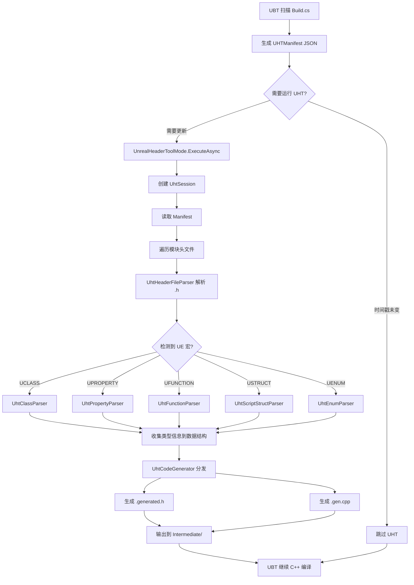
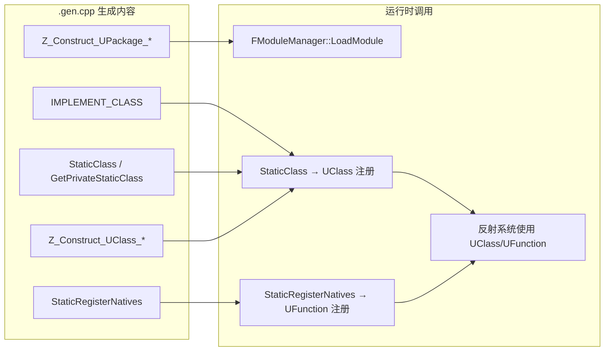

# UnrealHeaderTool (UHT) 详解

## 摘要
UHT 是 UE5.7.4 的头文件解析与反射代码生成工具，负责解析 `UCLASS`/`UPROPERTY`/`UFUNCTION`/`USTRUCT`/`UENUM` 宏，并生成 `.generated.h` 和 `.gen.cpp` 反射注册代码。UHT 由 UBT 在编译前自动调用，是 UE 反射系统的根基。

## 适合解决的问题
- UHT 什么时候运行？是谁调用的？
- `.generated.h` 文件是怎么生成的？里面有什么？
- UHT 解析了哪些宏？生成了哪些注册函数？
- 如何避免 UHT 反复处理未修改的头文件？
- UHT 报错了该怎么排查？

## 核心结论
1. UHT 是独立进程，由 UBT 在 C++ 编译之前调用
2. UHT 解析所有含 UE 反射宏的头文件，生成反射注册代码
3. 生成的代码包含 `StaticClass()`、`StaticRegisterNatives()`、`Z_Construct_UClass_*` 等函数
4. UHT 使用 Manifest 缓存和哈希比对来避免不必要的重新处理
5. UHT 代码已迁移到共享库 `EpicGames.UHT`，入口在 `UnrealHeaderToolMode.cs`

## 源码位置
| 组件 | 路径 |
|------|------|
| UHT 入口 | `Engine/Source/Programs/UnrealBuildTool/Modes/UnrealHeaderToolMode.cs` |
| UHT 核心库 | `Engine/Source/Programs/Shared/EpicGames.UHT/` |
| 解析器 | `Engine/Source/Programs/Shared/EpicGames.UHT/Parsers/` |
| 代码生成器 | `Engine/Source/Programs/Shared/EpicGames.UHT/Exporters/CodeGen/` |
| 类型定义 | `Engine/Source/Programs/Shared/EpicGames.UHT/Types/` |
| 词法分析 | `Engine/Source/Programs/Shared/EpicGames.UHT/Tokenizer/` |
| Manifest 定义 | `Engine/Source/Programs/Shared/EpicGames.Core/UHTTypes.cs` |
| UBT-UHT 集成 | `Engine/Source/Programs/UnrealBuildTool/System/ExternalExecution.cs` |

## 关键类
| 类名 | 职责 |
|------|------|
| `UnrealHeaderToolMode` | UHT 入口模式，由 UBT 调用 |
| `UhtSession` | UHT 处理会话，管理整个解析-生成流程 |
| `UhtTables` | 宏关键字和说明符查找表 |
| `UhtClassParser` | 解析 `UCLASS` 宏 |
| `UhtPropertyParser` | 解析 `UPROPERTY` 宏 |
| `UhtFunctionParser` | 解析 `UFUNCTION` 宏 |
| `UhtScriptStructParser` | 解析 `USTRUCT` 宏 |
| `UhtEnumParser` | 解析 `UENUM` 宏 |
| `UhtCodeGenerator` | 代码生成主控 |
| `UhtHeaderCodeGenerator` | 生成 `.generated.h` 和 `.gen.cpp` |
| `UhtPackageCodeGenerator` | 生成包注册代码 |
| `UhtManifest` | UHT 输入描述，包含模块和头文件列表 |
| `UhtSpecifierParser` | 说明符（如 `BlueprintReadWrite`）解析 |

## 关键函数
| 函数 | 位置 | 作用 |
|------|------|------|
| `UnrealHeaderToolMode.ExecuteAsync()` | UnrealHeaderToolMode.cs:1132 | UHT 主入口 |
| `UhtSession.Run()` | UhtSession.cs | 解析头文件并生成代码的主循环 |
| `UhtSession.ProcessHeaders()` | UhtSession.cs | 处理所有头文件 |
| `UhtClassParser.ParseUClass()` | UhtClassParser.cs:57-144 | 解析 UCLASS 声明 |
| `UhtHeaderCodeGeneratorHFile` | UhtHeaderCodeGeneratorHFile.cs | 生成 .generated.h |
| `UhtHeaderCodeGeneratorCppFile` | UhtHeaderCodeGeneratorCppFile.cs | 生成 .gen.cpp |
| `ExternalExecution.ExecuteHeaderToolIfNecessaryInternalAsync()` | ExternalExecution.cs:1207-1383 | UBT 调用 UHT 的逻辑 |

## 1. UHT 完整流程

```
UBT 扫描 Build.cs
    ↓
UBT 生成 UHTManifest (.uhtmanifest JSON)
    ↓
UBT 检查是否需要运行 UHT（时间戳/哈希比对）
    ↓
调用 UnrealHeaderToolMode.ExecuteAsync()
    ↓
创建 UhtSession → 初始化 UhtTables → 解析全局选项
    ↓
UhtSession.Run() → 读取 Manifest → 遍历模块头文件
    ↓
UhtHeaderFileParser 解析每个 .h 文件
    ↓
遇到 UCLASS/USTRUCT/UENUM/UFUNCTION/UPROPERTY → 对应 Parser 处理
    ↓
UhtSpecifierParser 解析说明符（BlueprintReadWrite 等）
    ↓
所有类型信息收集到 UhtClass/UhtProperty/UhtFunction 等数据结构
    ↓
UhtCodeGenerator 分发到各 Exporter
    ↓
生成 .generated.h（宏定义 + 内联函数）
生成 .gen.cpp（StaticRegisterNatives, Z_Construct_UClass_*, IMPLEMENT_CLASS）
    ↓
输出到各模块的 Intermediate 目录
    ↓
UBT 继续执行 C++ 编译
```

## 2. UBT 如何调用 UHT

UBT 通过 `ExternalExecution.ExecuteHeaderToolIfNecessaryInternalAsync()` 调用 UHT。

**调用前检查（跳过机制）：**
1. UHT 程序集时间戳与上次比对（ExternalExecution.cs:1221-1228）
2. UHT 设置版本比对（ExternalExecution.cs:1233-1250）
3. 已生成文件是否过时检查（ExternalExecution.cs:1258）
4. UHT 版本号检查（ExternalExecution.cs:1266-1275）
5. 外部依赖检查（ExternalExecution.cs:1278-1282）

如果以上检查全部通过，跳过 UHT 调用，直接使用已生成的代码。

**调用方式（ExternalExecution.cs:1335-1359）：**
```csharp
// 不是启动外部进程，而是直接在 UBT 进程内实例化 UHT
UnrealHeaderToolMode UHTTool = new();
CompilationResult UHTResult = (CompilationResult)await UHTTool.ExecuteAsync(Arguments, Logger);
```

**命令行参数构造（ExternalExecution.cs:1294-1324）：**
```
[ProjectFile | TargetName] ManifestFile -WarningsAsErrors
```

**Manifest 文件（.uhtmanifest）：**
JSON 格式，包含：
- 每个模块的名称、类型、路径
- 需要处理的头文件分类（ClassesHeaders, PublicHeaders, InternalHeaders, PrivateHeaders）
- 输出目录和生成文件名模板
- 公开宏定义

## 3. 宏解析系统

### 宏关键字表

| 关键字 | 解析器文件 | 处理类 |
|--------|-----------|--------|
| `UCLASS` | UhtClassParser.cs | `UhtClass` |
| `USTRUCT` | UhtScriptStructParser.cs | `UhtScriptStruct` |
| `UENUM` | UhtEnumParser.cs | `UhtEnum` |
| `UFUNCTION` | UhtFunctionParser.cs | `UhtFunction` |
| `UPROPERTY` | UhtPropertyParser.cs | `UhtProperty` |
| `UDELEGATE` | UhtFunctionParser.cs | `UhtFunction` |
| `UINTERFACE` | UhtClassParser.cs | `UhtClass` (接口特殊处理) |

### 解析流程（以 UCLASS 为例）

```
词法分析器读取 UCLASS 标记
    ↓
UhtTables 查找 "Class" 关键字 → 定位到 UhtClassParser.UCLASSKeyword
    ↓
UhtClassParser.ParseUClass() 解析括号内的说明符
    ↓
UhtSpecifierParser.ParseSpecifiers() 解析每个说明符
    ↓
生成 UhtClass 数据结构，包含：
  - 类名、命名空间、文件位置
  - 基类信息
  - 所有 UPROPERTY 成员
  - 所有 UFUNCTION 方法
  - 类说明符（ClassGroup, Within, Config, etc.）
  - 元数据（注释、Category 等）
```

### GENERATED_BODY 检测

UHT 检测以下已知宏（UhtTokenReaderUtilityExtensions.cs:18-20）：
- `GENERATED_BODY` — 当前推荐
- `GENERATED_UCLASS_BODY` — 旧版（自动声明构造函数）
- `GENERATED_UINTERFACE_BODY` — 接口专用

检测到这些宏后，UHT 会在 `.generated.h` 中生成对应的内联代码，替换宏调用。

## 4. 代码生成

### 生成的文件类型
| 模式 | 文件名 | 内容 |
|------|--------|------|
| 每个头文件 | `FileName.generated.h` | 宏定义、类型前向声明、内联辅助函数 |
| 每个模块 | `ModuleName.gen.cpp` | 包注册、类构造单例、IMPLEMENT_CLASS |

### .generated.h 中生成的内容

```
// 类声明辅助宏（替换 GENERATED_BODY）
#define FMyClass_GENERATED_BODY \
    friend struct Z_Construct_UClass_UMyClass_Statics; \
    static UClass* GetPrivateStaticClass(); \
    public: static UClass* StaticClass();

// 类型转换辅助
inline FMyClass* Cast(UObject* Obj) { ... }

// 序列化辅助声明
template<> struct TStructOpsTypeTraits<FMyStruct> { ... };
```

### .gen.cpp 中生成的内容

```cpp
// 1. 类注册单例函数
UClass* UMyClass::GetPrivateStaticClass()
{
    static UClass* Singleton = nullptr;
    if (!Singleton)
    {
        GetPrivateStaticClassBody(...);
    }
    return Singleton;
}

// 2. 原生函数注册
void UMyClass::StaticRegisterNativesUMyClass()
{
    UClass* Class = UMyClass::StaticClass();
    FNativeFunctionRegistrar::RegisterFunctions(Class, ...);
}

// 3. 类构造单例
static FCompiledInDefer Z_CompiledInDefer_UClass_UMyClass(...);

// 4. IMPLEMENT_CLASS（包含类注册逻辑）
IMPLEMENT_CLASS(UMyClass, ...);

// 5. 包注册
UPackage* Z_Construct_UPackage__Script_MyModule()
{
    // 创建并注册包
}

// 6. StaticClass 实现
UClass* UMyClass::StaticClass()
{
    return GetPrivateStaticClass();
}
```

### 代码生成关键路径

```
UhtCodeGenerator (主控)
    ├── UhtHeaderCodeGeneratorHFile → .generated.h
    │   ├── 类声明宏
    │   ├── 类型转换函数
    │   └── 序列化辅助
    ├── UhtHeaderCodeGeneratorCppFile → .gen.cpp
    │   ├── StaticClass / GetPrivateStaticClass
    │   ├── StaticRegisterNatives
    │   ├── Z_Construct_UClass_*
    │   ├── Z_Construct_UPackage_*
    │   └── IMPLEMENT_CLASS
    └── UhtPackageCodeGenerator → 模块级包注册代码
```

## 5. 缓存与增量机制

### Manifest 缓存文件

| 文件 | 内容 | 作用 |
|------|------|------|
| `.uhtmanifest` | JSON 格式模块描述 | UHT 输入，UBT 生成 |
| `.deps.uhtmanifest` | 依赖描述 | 跨模块依赖追踪 |
| `.uhtpath` | UHT 程序集路径 | 版本追踪 |
| UHTTargetSettings | 二进制配置 | 构建设置快照 |

### 跳过条件

UBT 在以下条件全部满足时跳过 UHT：
1. UHT 程序集未变化
2. UHT 设置与上次一致
3. 已生成的代码文件比源文件更新
4. UHT 版本号匹配
5. 外部依赖未变化

### 内容哈希

UHT 使用 `HashCombine` 函数（UhtPackageCodeGenerator.cs:104-120）来验证生成代码的一致性，支持 `-FailIfGeneratedCodeChanges` 标志。

## 6. UHT 命令行参数

| 参数 | 说明 |
|------|------|
| `ProjectFile` | .uproject 文件路径（游戏项目） |
| `ManifestFile` | .uhtmanifest 文件路径 |
| `-Target=<TargetName>` | 现代模式：直接指定目标名 |
| `-WarningsAsErrors` | 将警告视为错误 |
| `-installed` | 已安装引擎模式 |
| `-FailIfGeneratedCodeChanges` | 已生成代码变化时失败（CI 用） |

## 7. 常见 UHT 错误

| 错误 | 原因 | 解决方法 |
|------|------|----------|
| `Unknown specifier 'XXX'` | 说明符拼写错误或版本不支持 | 检查 UCLASS/UPROPERTY 说明符名称 |
| `Unable to find class with name 'XXX'` | 头文件中引用了不存在的类型 | 检查头文件包含和前向声明 |
| `Circular dependency detected` | 头文件循环包含 | 拆分头文件或使用前向声明 |
| `UClass 'XXX' should derive from UObject` | UCLASS 标记的类未继承 UObject | 确保继承链正确 |
| `Recursive class/struct definition` | 自引用类型未正确声明 | 使用指针或前向声明 |
| `Missing GENERATED_BODY` | UCLASS 标记的类缺少 GENERATED_BODY 宏 | 在类体第一行添加 GENERATED_BODY() |

## 8. 调试建议

1. **查看生成的代码**：检查 `Intermediate/` 目录下的 `.generated.h` 和 `.gen.cpp`
2. **强制重新生成**：删除 `Intermediate/` 后重新生成项目文件
3. **UHT 日志**：UBT 输出中搜索 "UnrealHeaderTool" 查看调用详情
4. **Manifest 检查**：查看 `.uhtmanifest` JSON 确认模块头文件列表是否正确
5. **单文件测试**：最小化复现，只保留必要的 UCLASS/UPROPERTY 声明

## 9. Mermaid 调用图





## 10. UE5.7.4 中的变化

基于源码观察：
- UHT 核心已迁移到 `EpicGames.UHT` 共享库（不在 UnrealHeaderTool 项目内，而在 Shared 目录）
- UHT 直接在 UBT 进程内执行（不再启动独立进程）
- 新增 Verse 语言相关属性（UhtManifest 中有 Verse 属性）
- 新增 `CompiledInObjectFormat` 选项（Params, ConstInit, All）
- 新增 `GenerateEnumMaxValues` 设置
- `GeneratedCodeVersion` 支持多版本生成代码格式

未确认：以上变化的精确引入版本号，当前扫描范围内没有找到详细的版本变更记录。

## 源码证据
- Engine/Source/Programs/UnrealBuildTool/Modes/UnrealHeaderToolMode.cs:1132-1297（UHT 入口）
- Engine/Source/Programs/Shared/EpicGames.UHT/Parsers/UhtClassParser.cs:23-144（UCLASS 解析）
- Engine/Source/Programs/Shared/EpicGames.UHT/Parsers/UhtPropertyParser.cs:22-69（UPROPERTY 解析）
- Engine/Source/Programs/Shared/EpicGames.UHT/Exporters/CodeGen/UhtCodeGenerator.cs:74-145（代码生成主控）
- Engine/Source/Programs/Shared/EpicGames.UHT/Exporters/CodeGen/UhtHeaderCodeGeneratorHFile.cs（.h 生成）
- Engine/Source/Programs/Shared/EpicGames.UHT/Exporters/CodeGen/UhtHeaderCodeGeneratorCppFile.cs:2964-2982（StaticRegisterNatives）
- Engine/Source/Programs/UnrealBuildTool/System/ExternalExecution.cs:1207-1383（UBT 调用 UHT）
- Engine/Source/Programs/Shared/EpicGames.Core/UHTTypes.cs:170-281（Manifest 结构）
- Engine/Source/Programs/Shared/EpicGames.UHT/Tokenizer/UhtTokenReaderUtilityExtensions.cs:18-20（宏检测）

## 相关文档
- [UBT.md](UBT.md) — UnrealBuildTool 详解
- [ModuleRules.md](ModuleRules.md) — 模块规则
- [BuildCs_Guide.md](BuildCs_Guide.md) — Build.cs 编写指南
- [Common_Build_Errors.md](Common_Build_Errors.md) — 常见构建错误
- [04_CORE_OBJECT_SYSTEM/UObject.md](../04_CORE_OBJECT_SYSTEM/UObject.md) — UObject 反射系统
- [04_CORE_OBJECT_SYSTEM/UClass_Reflection.md](../04_CORE_OBJECT_SYSTEM/UClass_Reflection.md) — UClass 反射详解
