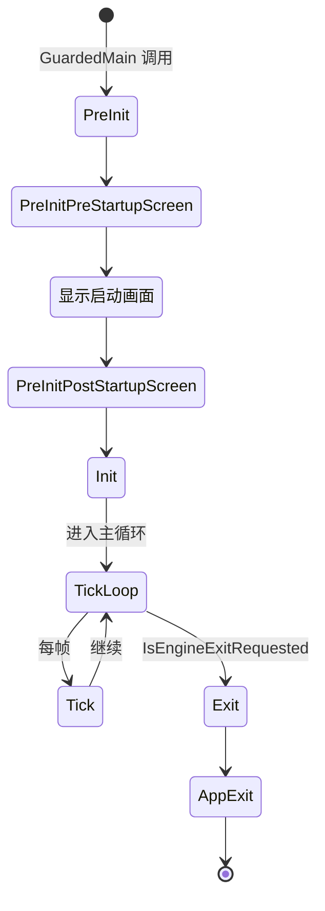

# FEngineLoop 详解

## 摘要

本文档深入分析 UE5.7.4 中 `FEngineLoop` 类的设计、生命周期管理和核心方法。

## 核心结论

`FEngineLoop` 是 UE 引擎的主循环实现，负责引擎的初始化、每帧 Tick 和退出清理。它是 `GuardedMain` 与引擎核心之间的桥梁。

---

## 类定义

### 源码位置
- `Engine/Source/Runtime/Launch/Public/LaunchEngineLoop.h:48`

```cpp
class FEngineLoop : public IEngineLoop
{
public:
    FEngineLoop();
    virtual ~FEngineLoop();

    // PreInit 阶段
    int32 PreInit(int32 ArgC, TCHAR* ArgV[], const TCHAR* AdditionalCommandline = nullptr);
    int32 PreInit(const TCHAR* CmdLine);
    int32 PreInitPreStartupScreen(const TCHAR* CmdLine);
    int32 PreInitPostStartupScreen(const TCHAR* CmdLine);

    // 模块加载
    void LoadPreInitModules();
    bool LoadCoreModules();
    bool LoadStartupCoreModules();
    bool LoadStartupModules();

    // Init / Tick / Exit
    virtual int32 Init() override;
    virtual void Tick() override;
    void Exit();

    // 应用生命周期
    static bool AppInit();
    static void AppPreExit();
    static void AppExit();

    // RHI 初始化
    static void PostInitRHI();
    static void PreInitHMDDevice();

private:
    void ProcessLocalPlayerSlateOperations() const;

protected:
    TArray<float> FrameTimes;        // 每帧耗时记录
    double TotalTickTime;            // 总 Tick 时间
    double MaxTickTime;              // 最大 Tick 时间限制
    uint64 MaxFrameCounter;          // 最大帧数限制
    uint32 LastFrameCycles;          // 上一帧 CPU 周期数

    FPendingCleanupObjects* PendingCleanupObjects;  // 待清理对象

    FEngineService* EngineService;   // 引擎服务（Session 管理）
    FTraceService* TraceService;     // Trace 控制服务
    TSharedPtr<ISessionService> SessionService;  // 应用会话服务
    FPreInitContext PreInitContext;   // PreInit 上下文
};
```

---

## 全局实例

```cpp
// Launch.cpp:28
FEngineLoop GEngineLoop;
```

`GEngineLoop` 是全局唯一的 FEngineLoop 实例。

---

## FPreInitContext 结构体

```cpp
struct FPreInitContext
{
    bool bDumpEarlyConfigReads = false;
    bool bDumpEarlyPakFileReads = false;
    bool bForceQuitAfterEarlyReads = false;
    bool bWithConfigPatching = false;
    bool bHasEditorToken = false;
    bool bIsRegularClient = false;
    bool bIsPossiblyUnrecognizedCommandlet = false;
    FString Token;
    FString CommandletCommandLine;
    FScopedSlowTask* SlowTaskPtr = nullptr;
    TSharedPtr<FSlateRenderer> SlateRenderer;  // PreInit 期间的临时 Slate 渲染器
};
```

---

## 生命周期 Mermaid 图



---

## 各阶段耗时

基于 SCOPED_BOOT_TIMING 标记，启动各阶段的主要耗时点：

| 阶段 | 耗时级别 | 描述 |
|------|---------|------|
| AppInit | 中 | 平台初始化、配置系统 |
| LoadCoreModules | 低 | 加载 CoreUObject |
| LoadPreInitModules | 高 | 加载 Engine/Renderer/RenderCore |
| InitializeShaderTypes | 高 | Shader 类型注册和编译 |
| LoadStartupModules | 高 | 加载所有启动模块 |
| Init | 中 | 创建 UEngine、初始化子系统 |
| GEngine->Init | 中 | 引擎完整初始化 |

---

## 关键方法详解

### PreInitPreStartupScreen — 7105 行中的 1700 行

这是最复杂的初始化方法，处理：
1. 命令行解析
2. 项目发现
3. 配置系统初始化
4. 文件系统初始化
5. CoreUObject 加载
6. RHI 选择

### LoadPreInitModules — 第 4379 行

固定顺序加载关键模块：
1. Engine
2. Renderer
3. AnimGraphRuntime
4. 平台模块
5. SlateRHIRenderer
6. Landscape
7. RHICore
8. RenderCore

### Tick — 第 5536 行

每帧执行约 900+ 行代码，管理：
1. 帧计时
2. 渲染线程同步
3. 输入处理
4. GEngine->Tick()
5. Slate UI
6. 渲染提交

---

## 调试建议

1. **启动耗时分析**：设置环境变量 `UE_BOOT_TIMING=1` 查看各阶段耗时
2. **断点位置**：
   - `LaunchEngineLoop.cpp:1699` — PreInit 开始
   - `LaunchEngineLoop.cpp:4682` — Init 开始
   - `LaunchEngineLoop.cpp:5536` — Tick 开始
3. **命令行参数**：
   - `-waitforattach` — 等待调试器
   - `-log` — 显示日志
   - `-nothreadedrendering` — 单线程渲染

---

## 相关文档

- [Launch_Flow.md](Launch_Flow.md) — 启动流程总览
- [GameInstance_Flow.md](GameInstance_Flow.md) — GameInstance 流程
- [World_Init_Flow.md](World_Init_Flow.md) — World 初始化流程

源码证据：
- Engine/Source/Runtime/Launch/Public/LaunchEngineLoop.h:48-200
- Engine/Source/Runtime/Launch/Private/LaunchEngineLoop.cpp
