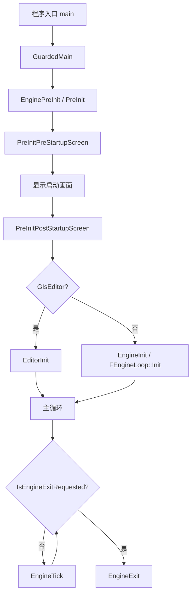
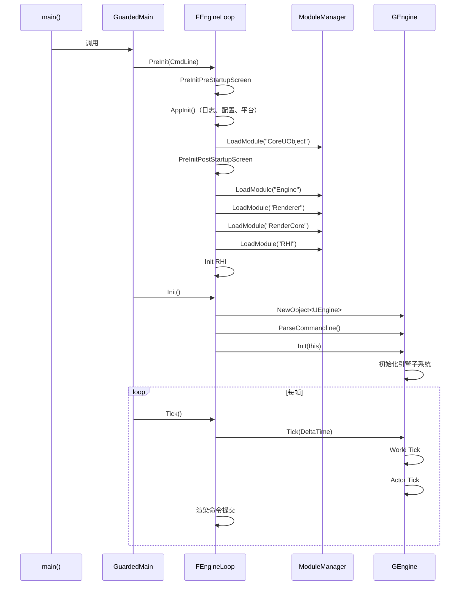

# UE5.7.4 引擎启动流程

## 摘要

本文档详细分析 UE5.7.4 引擎从程序入口到主循环开始运行的完整启动流程，包括 PreInit、Init、Tick 三个阶段。

## 适合解决的问题

- UE 引擎是如何启动的？
- 引擎初始化过程中做了哪些事情？
- 模块加载顺序是什么？
- 如何在启动阶段插入自定义逻辑？

---

## 核心结论

UE5.7.4 启动流程分为三大阶段：

1. **PreInit** — 平台初始化、配置加载、模块预加载
2. **Init** — 创建 UEngine 实例、初始化引擎子系统
3. **Tick Loop** — 主循环，每帧执行引擎 Tick

---

## 启动流程 Mermaid 图



---

## 1. 程序入口

### 源码位置
- `Engine/Source/Runtime/Launch/Private/Launch.cpp`

### 关键函数

#### `GuardedMain(const TCHAR* CmdLine)` — Launch.cpp:87

这是 UE 的实际入口函数（被各平台的 main/WinMain 调用）。

```cpp
int32 GuardedMain(const TCHAR* CmdLine)
{
    // 1. 标记 GameThread ID
    GGameThreadId = FPlatformTLS::GetCurrentThreadId();
    GIsGameThreadIdInitialized = true;

    // 2. 等待调试器附加（-waitforattach 参数）
    // ...

    // 3. 广播 PreMainInit 委托
    FCoreDelegates::GetPreMainInitDelegate().Broadcast();

    // 4. 注册 EngineLoopCleanupGuard（RAII 确保 EngineExit 被调用）

    // 5. 执行 PreInit
    int32 ErrorLevel = EnginePreInit(CmdLine);

    // 6. 执行 Init（编辑器用 EditorInit，游戏用 EngineInit）
    if (GIsEditor)
        ErrorLevel = EditorInit(GEngineLoop);
    else
        ErrorLevel = EngineInit();

    // 7. 进入主循环
    while (!IsEngineExitRequested())
    {
        EngineTick();
    }

    return ErrorLevel;
}
```

**源码证据：**
- Engine/Source/Runtime/Launch/Private/Launch.cpp:87-205

---

## 2. PreInit 阶段

### 源码位置
- `Engine/Source/Runtime/Launch/Private/LaunchEngineLoop.cpp`

### 关键函数

#### `FEngineLoop::PreInit(const TCHAR* CmdLine)` — LaunchEngineLoop.cpp:4332

PreInit 分两个阶段：
1. `PreInitPreStartupScreen()` — 在启动画面显示之前执行
2. `PreInitPostStartupScreen()` — 在启动画面显示之后执行

### 2.1 PreInitPreStartupScreen — LaunchEngineLoop.cpp:1699

主要步骤（按执行顺序）：

| 步骤 | 行号 | 描述 |
|------|------|------|
| 1 | 1709 | 设置 GLog 主线程 |
| 2 | 1713 | 启用日志 backlog |
| 3 | 1749 | 设置 UTF-8 输出 |
| 4 | 1760 | 切换到可执行文件目录 |
| 5 | 1765 | 设置命令行 FCommandLine::Set() |
| 6 | 1795 | LaunchSetGameName() — 设置游戏项目名 |
| 7 | AppInit() | 平台初始化（日志、配置系统、GConfig） |
| 8 | LoadCoreModules() | 加载 CoreUObject 模块 |
| 9 | 初始化 FName、FThreadManager |
| 10 | 加载目标平台模块 |

#### `FEngineLoop::AppInit()` — LaunchEngineLoop.cpp:6409

```cpp
bool FEngineLoop::AppInit()
{
    // 1. 初始化文本本地化
    BeginInitTextLocalization();

    // 2. 平台预初始化
    FPlatformMisc::PlatformPreInit();

    // 3. 记录启动时间
    GSystemStartTime = FDateTime::Now().ToString();

    // 4. 设置工作目录
    FPlatformProcess::SetCurrentWorkingDirectoryToBaseDir();

    // 5. 初始化文件管理器
    IFileManager::Get().ProcessCommandLineOptions();

    // 6. 初始化日志输出
    FPlatformOutputDevices::SetupOutputDevices();

    // 7. 初始化配置系统
    FConfigCacheIni::InitializeConfigSystem();

    // 8. 应用启动热补丁
    UE::ConfigUtilities::ApplyCVarsFromBootHotfix();

    // ...更多初始化步骤
}
```

**源码证据：**
- Engine/Source/Runtime/Launch/Private/LaunchEngineLoop.cpp:6409-6508

### 2.2 LoadCoreModules — LaunchEngineLoop.cpp:4361

```cpp
bool FEngineLoop::LoadCoreModules()
{
#if WITH_COREUOBJECT
    RegisterModularObjectsProcessing();
    return FModuleManager::Get().LoadModule(TEXT("CoreUObject")) != nullptr;
#else
    return true;
#endif
}
```

### 2.3 PreInitPostStartupScreen — LaunchEngineLoop.cpp:3387

此阶段在启动画面显示后执行：

| 步骤 | 描述 |
|------|------|
| 1 | 初始化 RHI（渲染硬件接口） |
| 2 | LoadPreInitModules() — 加载引擎核心模块 |
| 3 | 初始化 Shader 类型 |
| 4 | LoadStartupCoreModules() |
| 5 | LoadStartupModules() — 加载所有启动模块 |

### 2.4 LoadPreInitModules — LaunchEngineLoop.cpp:4379

这是引擎最关键的模块加载步骤，按以下固定顺序加载：

```cpp
void FEngineLoop::LoadPreInitModules()
{
    FModuleManager::Get().LoadModule(TEXT("Engine"));
    FModuleManager::Get().LoadModule(TEXT("Renderer"));
    FModuleManager::Get().LoadModule(TEXT("AnimGraphRuntime"));
    FPlatformApplicationMisc::LoadPreInitModules();
    // SlateRHIRenderer（非服务器构建）
    FModuleManager::Get().LoadModule(TEXT("Landscape"));
    FModuleManager::Get().LoadModule(TEXT("RHICore"));
    FModuleManager::Get().LoadModule(TEXT("RenderCore"));
    // TextureCompressor（仅编辑器）
    // Virtualization（仅非 Cooked 构建）
}
```

**模块加载顺序：**
1. Engine
2. Renderer
3. AnimGraphRuntime
4. 平台相关模块
5. SlateRHIRenderer
6. Landscape
7. RHICore
8. RenderCore
9. TextureCompressor（仅编辑器）
10. Virtualization（仅非 Cooked 构建）

**编辑器额外加载：**
- AudioEditor
- AnimationModifiers

**源码证据：**
- Engine/Source/Runtime/Launch/Private/LaunchEngineLoop.cpp:4379-4432

---

## 3. Init 阶段

### `FEngineLoop::Init()` — LaunchEngineLoop.cpp:4682

```cpp
int32 FEngineLoop::Init()
{
    // 1. 创建 UEngine 实例
    if (!GIsEditor)
    {
        // 游戏：创建 UGameEngine
        GConfig->GetString(TEXT("/Script/Engine.Engine"), TEXT("GameEngine"), ...);
        EngineClass = StaticLoadClass(UGameEngine::StaticClass(), ...);
        GEngine = NewObject<UEngine>(GetTransientPackage(), EngineClass);
    }
    else
    {
        // 编辑器：创建 UUnrealEdEngine
        GConfig->GetString(TEXT("/Script/Engine.Engine"), TEXT("UnrealEdEngine"), ...);
        EngineClass = StaticLoadClass(UUnrealEdEngine::StaticClass(), ...);
        GEngine = GEditor = GUnrealEd = NewObject<UUnrealEdEngine>(...);
    }

    // 2. 解析命令行
    GEngine->ParseCommandline();

    // 3. 初始化时间
    InitTime();

    // 4. 初始化引擎
    GEngine->Init(this);

    // 5. 广播 PostEngineInit
    FCoreDelegates::OnPostEngineInit.Broadcast();

    // 6. 启动 SessionService
    // 7. 加载启动关卡
}
```

**关键点：**
- UEngine 的实际类型由配置文件 `/Script/Engine.Engine` 中的 `GameEngine` 或 `UnrealEdEngine` 键决定
- `GEngine->Init()` 完成引擎的其余初始化（World 创建、子系统初始化等）
- `FCoreDelegates::OnPostEngineInit` 是插件初始化的重要时机

**源码证据：**
- Engine/Source/Runtime/Launch/Private/LaunchEngineLoop.cpp:4682-4800

---

## 4. Tick 阶段

### `FEngineLoop::Tick()` — LaunchEngineLoop.cpp:5536

每帧执行一次，包含以下步骤（按执行顺序）：

| 步骤 | 行号 | 描述 |
|------|------|------|
| 1 | 5549 | BeginExitIfRequested() — 检查退出请求 |
| 2 | 5561 | 线程心跳 |
| 3 | 5568 | FPlatformMisc::TickHotfixables() |
| 4 | 5575 | TickRenderingTickables（单线程渲染模式） |
| 5 | 5682 | GEngine->UpdateTimeAndHandleMaxTickRate() |
| 6 | 5689 | ENQUEUE_RENDER_COMMAND(BeginFrame) — 渲染线程 BeginFrame |
| 7 | 5694 | FScene::StartFrame() |
| 8 | 5716 | 性能监控 Tick |
| 9 | 5753 | FPlatformApplicationMisc::PumpMessages() — 处理窗口消息 |
| 10 | 5802 | FCoreDelegates::OnSamplingInput.Broadcast() |
| 11 | 5806 | Slate 输入处理（FSlateApplication） |
| 12 | 5828 | **GEngine->Tick()** — 核心 Tick |
| 13 | 5839+ | 渲染提交、结束帧等 |

### GEngine->Tick() 内部流程

`UEngine::Tick()` 执行以下操作：

1. World Tick（所有 UWorld 的 Tick）
2. Actor Tick（通过 FTickTaskManagerInterface）
3. Timer Tick
4. Latent Action Tick
5. 延迟渲染命令提交
6. 渲染线程同步

**源码证据：**
- Engine/Source/Runtime/Launch/Private/LaunchEngineLoop.cpp:5536-5850

---

## 5. 关键委托（扩展点）

| 委托 | 触发时机 | 用途 |
|------|---------|------|
| `FCoreDelegates::GetPreMainInitDelegate()` | GuardedMain 最早期 | 超早期初始化 |
| `FCoreDelegates::OnPostEngineInit` | GEngine->Init() 之后 | 插件初始化 |
| `FCoreDelegates::OnBeginFrame` | 每帧开始 | 每帧逻辑 |
| `FCoreDelegates::OnSamplingInput` | 输入采样前 | 输入预处理 |
| `FModuleManager::OnModulesChanged` | 模块加载/卸载 | 模块监听 |

---

## 6. 启动流程时序图



---

## 7. 调试建议

1. **断点位置**：
   - `Launch.cpp:87` (GuardedMain) — 程序入口
   - `LaunchEngineLoop.cpp:1699` (PreInitPreStartupScreen) — 早期初始化
   - `LaunchEngineLoop.cpp:4379` (LoadPreInitModules) — 模块加载
   - `LaunchEngineLoop.cpp:4682` (Init) — 引擎初始化
   - `LaunchEngineLoop.cpp:5536` (Tick) — 主循环

2. **启动参数**：
   - `-waitforattach` — 等待调试器附加
   - `-log` — 显示日志窗口
   - `-NullRHI` — 无渲染模式

3. **性能分析**：
   - 使用 BootTimingPoint 宏标记启动各阶段
   - 查看 `SCOPED_BOOT_TIMING` 标记

---

## 8. 常见误区

1. **UEngine 不是单例** — 通过 `NewObject` 创建，类型由配置文件决定
2. **模块加载顺序很重要** — 改变 LoadPreInitModules 的顺序可能导致崩溃
3. **PostEngineInit 不是最终阶段** — 还需要加载关卡、初始化 World 后才真正可用

---

## 相关文档

- [EngineLoop.md](EngineLoop.md)
- [GameInstance_Flow.md](GameInstance_Flow.md)
- [World_Init_Flow.md](World_Init_Flow.md)
- [Mermaid_Startup_Flow.md](Mermaid_Startup_Flow.md)
