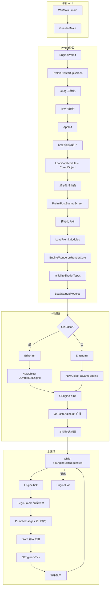
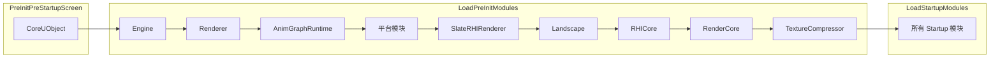
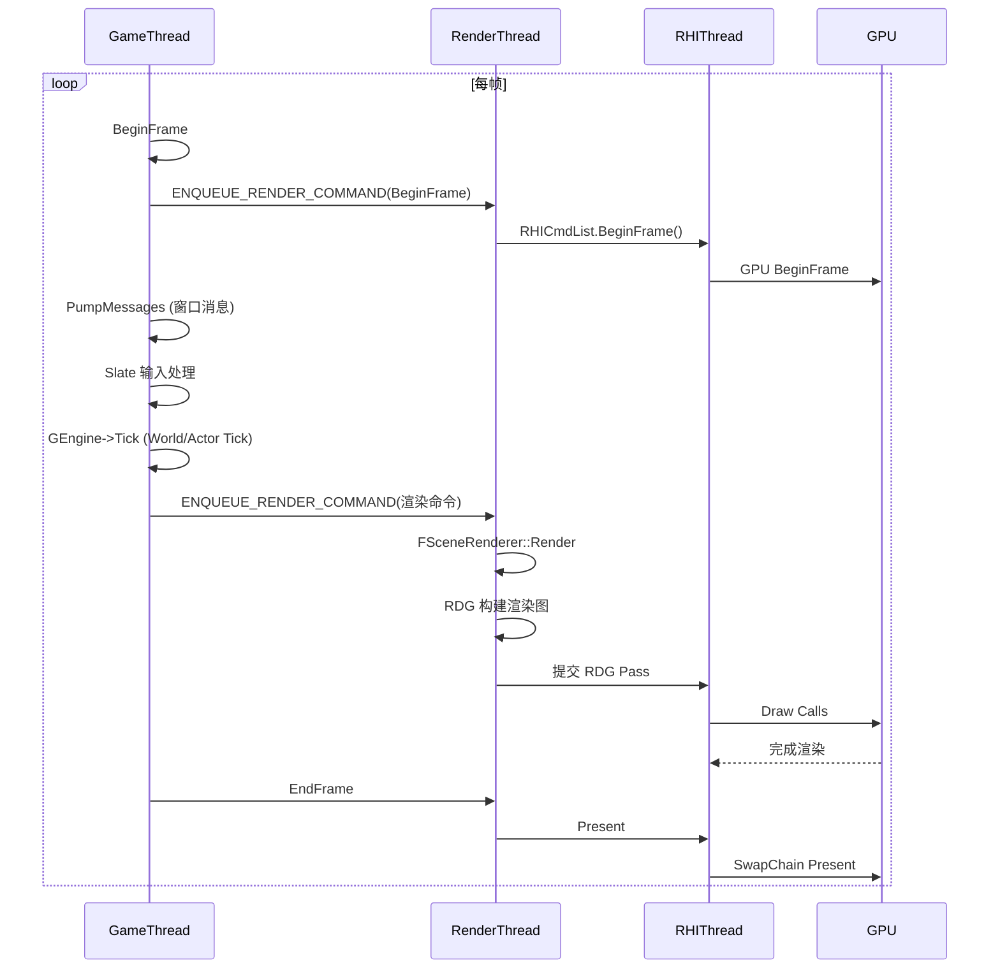
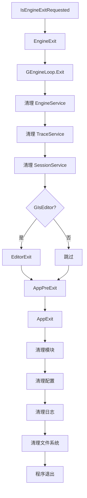
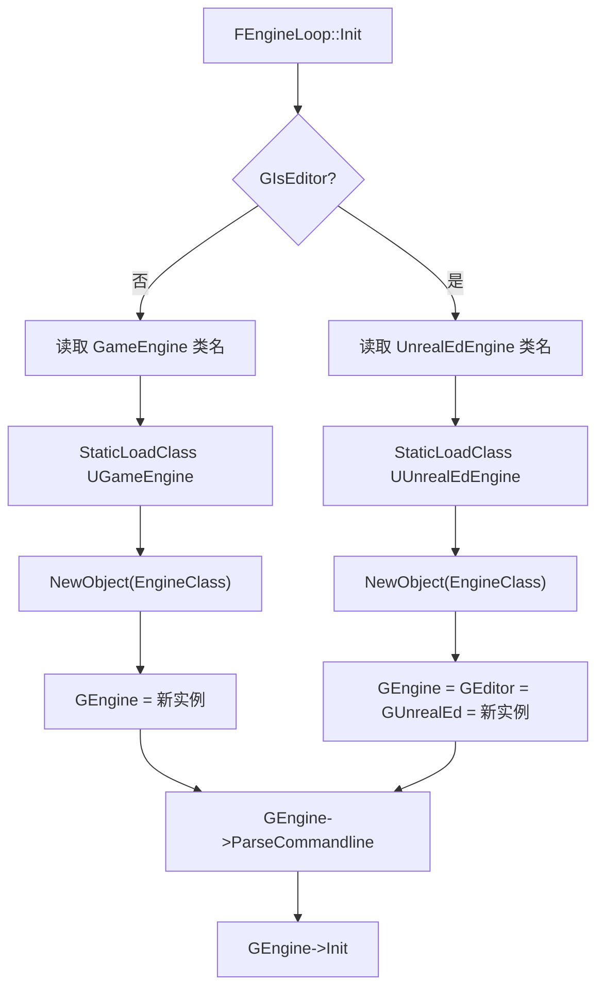
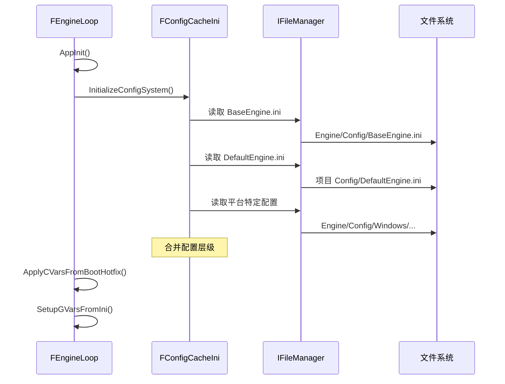

# UE5.7.4 启动流程 Mermaid 图集

## 摘要

本文档包含 UE5.7.4 引擎启动流程的所有 Mermaid 可视化图表。

---

## 1. 引擎启动总流程



---

## 2. 模块加载顺序



---

## 3. GameThread 与 RenderThread 交互



---

## 4. 从启动到第一帧渲染

```mermaid
sequenceDiagram
    participant Main as main()
    participant Loop as FEngineLoop
    participant ModMan as ModuleManager
    participant Engine as UEngine
    participant World as UWorld
    participant Renderer as FRendererModule

    Main->>Loop: PreInit()
    Loop->>ModMan: LoadModule("CoreUObject")
    Loop->>ModMan: LoadModule("Engine")
    Loop->>ModMan: LoadModule("Renderer")
    Loop->>ModMan: LoadModule("RenderCore")

    Main->>Loop: Init()
    Loop->>Engine: NewObject<UGameEngine>()
    Loop->>Engine: Init()
    Engine->>World: CreateWorld()
    Engine->>World: InitializeNewWorld()

    Main->>Loop: Tick() [第1帧]
    Loop->>Engine: Tick(DeltaTime)
    Engine->>World: Tick()
    World->>World: Actor Tick
    Loop->>Renderer: BeginRenderingViewFamily
    Renderer->>Renderer: FSceneRenderer::Render
```

---

## 5. 引擎退出流程



---

## 6. UEngine 类型选择



---

## 7. 配置加载时序



---

## 相关文档

- [Launch_Flow.md](Launch_Flow.md) — 启动流程详解
- [EngineLoop.md](EngineLoop.md) — FEngineLoop 详解
- [GameInstance_Flow.md](GameInstance_Flow.md) — GameInstance 流程
- [World_Init_Flow.md](World_Init_Flow.md) — World 初始化

源码证据：
- Engine/Source/Runtime/Launch/Private/Launch.cpp
- Engine/Source/Runtime/Launch/Private/LaunchEngineLoop.cpp
