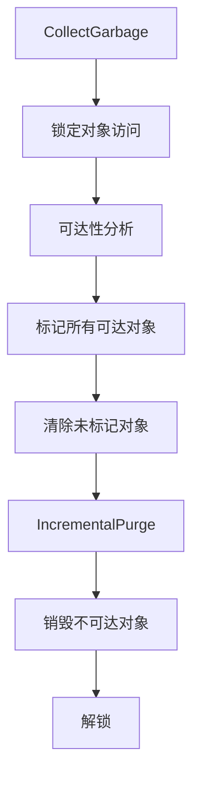
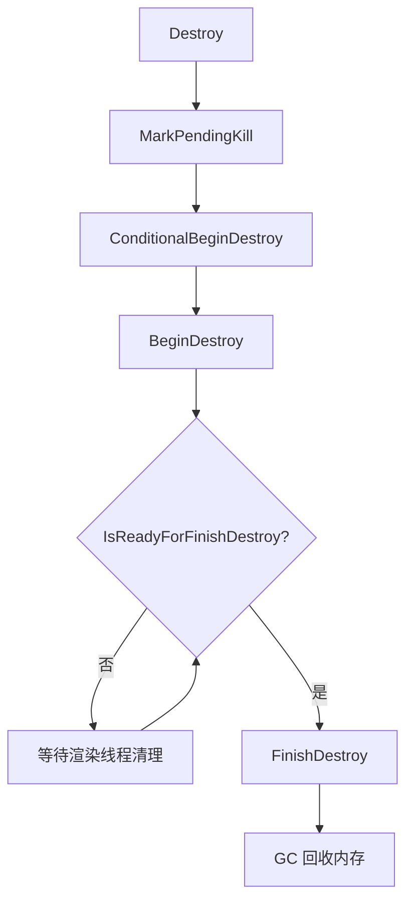

# 垃圾回收 (GC) 详解

## 摘要

UE5.7.4 使用标记-清除（Mark-Sweep）垃圾回收器管理 UObject 生命周期。GC 自动追踪对象引用，回收不可达对象。

---

## 1. GC 类型

| 类型 | 描述 | 触发时机 |
|------|------|---------|
| Full GC | 完整回收 | 关卡切换、手动触发 |
| Incremental GC | 增量回收 | 每帧执行部分工作 |

## 2. GC 完整流程



## 3. 关键函数（带源码行号）

| 函数 | 文件:行号 | 描述 |
|------|----------|------|
| CollectGarbage() | GarbageCollection.cpp:6203 | GC 入口 |
| CollectGarbageImpl() | GarbageCollection.cpp:5680 | GC 实现 |
| CollectGarbageIncremental() | GarbageCollection.cpp:5501 | 增量 GC |
| CollectGarbageFull() | GarbageCollection.cpp:5511 | 完整 GC |
| IncrementalPurgeGarbage() | GarbageCollection.cpp:4652 | 增量清除 |

## 4. 引用追踪机制

### 自动追踪
- `UPROPERTY()` 标记的成员变量会被 GC 自动追踪
- UObject 引用（UObject*, TWeakObjectPtr, TSoftObjectPtr）自动管理

### 手动追踪
```cpp
// 非 UObject 类需要声明引用
class FMyHelper : public FGCObject
{
    virtual void AddReferencedObjects(FReferenceCollector& Collector) override
    {
        Collector.AddReferencedObject(MyUObject);
    }
    virtual FString GetReferencerName() const override
    {
        return TEXT("FMyHelper");
    }
};
```

## 5. Root Set — GC 根集

Root Set 中的对象不会被 GC 回收：

```cpp
// 添加到根集
MyObject->AddToRoot();

// 从根集移除
MyObject->RemoveFromRoot();
```

典型 Root Set 成员：
- GEngine — 引擎实例
- GWorld — 当前 World
- GGameInstance — GameInstance
- 所有 AddToRoot() 的对象
- Disregard for GC 列表（索引 < MaxObjectsNotConsideredByGC）

## 6. GC 配置参数

| 参数 | 默认值 | 描述 |
|------|--------|------|
| gc.MaxObjectsInGame | 2,162,688 | 游戏最大对象数 |
| gc.MaxObjectsInEditor | 2,162,688 | 编辑器最大对象数 |
| gc.MaxObjectsNotConsideredByGC | 0 | GC 忽略的对象数 |
| gc.FlushStreamingOnGC | true | GC 时是否刷新流式加载 |
| gc.IncrementalTimeBudget | 2ms | 增量 GC 每帧时间预算 |
| gc.NumThreadsPerGCTask | 2 | GC 线程数 |

## 7. UObject 销毁流程



## 8. 智能指针与 GC

| 指针类型 | GC 行为 |
|---------|---------|
| TObjectPtr<T> / UObject* | 强引用，阻止 GC 回收 |
| TWeakObjectPtr<T> | 弱引用，不阻止 GC |
| TStrongObjectPtr<T> | 强引用，非 UObject 类使用 |
| TSharedPtr<T> | 不参与 GC（纯 C++ 引用计数） |

## 9. 常见 GC 问题

### 问题 1：对象被意外回收
**原因：** UObject* 没有用 UPROPERTY() 标记
**解决：** 添加 `UPROPERTY() UObject* MyRef;`

### 问题 2：GC 卡顿
**原因：** 增量 GC 时间预算不足或对象过多
**解决：** 增大 gc.IncrementalTimeBudget，减少运行时对象创建

### 问题 3：内存泄漏
**原因：** AddToRoot() 后忘记 RemoveFromRoot()
**解决：** 使用 `obj list` 检查，确保成对调用

## 10. 调试命令

| 命令 | 描述 |
|------|------|
| `obj gc` | 手动触发 GC |
| `obj list` | 列出所有对象 |
| `obj refs name=XXX` | 查看对象引用 |
| `stat gc` | GC 统计信息 |
| `memreport` | 内存报告 |

## 11. 源码证据

- Engine/Source/Runtime/CoreUObject/Private/UObject/GarbageCollection.cpp — GC 核心实现
- Engine/Source/Runtime/CoreUObject/Public/UObject/GCObject.h — FGCObject 基类
- Engine/Source/Runtime/CoreUObject/Private/UObject/ReachabilityAnalysisState.h — 可达性分析
- Engine/Source/Runtime/CoreUObject/Public/UObject/UObjectArray.h — FUObjectArray

---

## 相关文档

- [UObject.md](UObject.md)
- [UClass_Reflection.md](UClass_Reflection.md)
