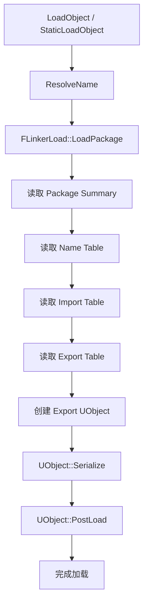

# Package 加载详解

## 摘要

UPackage 是 UE5.7.4 资源管理的基本单元。每个 .uasset 文件对应一个 UPackage，包含序列化的 UObject 数据。

---

## 1. UPackage 概述

UPackage 继承自 UObject，是 UObject 的 Outer（容器）。

```
UPackage (对应 .uasset 文件)
  → UObject (资产本身，如 UTexture2D, UStaticMesh)
    → 子对象
```

**源码位置：** Engine/Source/Runtime/CoreUObject/Public/UObject/Package.h

### 关键属性

| 属性 | 描述 |
|------|------|
| FileName | 包文件路径 |
| PackageFlags | 包标志 (PKG_Game, PKG_Editor, etc.) |
| Guid | 包唯一标识 |
| ChunkIDs | IOStore Chunk ID |

## 2. Package 加载流程



## 3. 关键类

| 类 | 描述 |
|-----|------|
| FLinkerLoad | 负责从文件加载 Package |
| FLinkerTables | Linker 表数据 |
| FPackageSummary | 包摘要（快速预览） |
| FObjectExport | Export 条目 |
| FObjectImport | Import 条目 |

## 4. 加载方式

### StaticLoadObject
```cpp
UObject* Obj = StaticLoadObject(UTexture2D::StaticClass(), nullptr, TEXT("/Game/MyTexture"));
```

### LoadObject<T>
```cpp
UTexture2D* Tex = LoadObject<UTexture2D>(nullptr, TEXT("/Game/MyTexture"));
```

### FSoftObjectPath (推荐)
```cpp
// 异步加载
FSoftObjectPath SoftPath(TEXT("/Game/MyTexture"));
TWeakObjectPtr<UObject> LoadedObj = SoftPath.TryLoad();
```

### FStreamableManager (异步流式加载)
```cpp
UAssetManager::Get().LoadAssetList(AssetPaths, FStreamableDelegate::CreateLambda([&]() {
    // 加载完成回调
}));
```

## 5. Cooked vs Uncooked

| 特性 | Uncooked (编辑器) | Cooked (运行时) |
|------|-------------------|-----------------|
| 文件格式 | .uasset + .uexp + .ubulk | .uasset + .uexp + .ubulk (优化后) |
| 加载方式 | FLinkerLoad | FPakFile + FLinkerLoad |
| 包含信息 | 完整编辑器信息 | 仅运行时必需 |
| 平台特定 | 否 | 是 |

## 6. IOStore

UE5 的 IOStore 格式替代传统 Pak 加载：
- `.ucas` — 连续存储
- `.utoc` — 目录目录
- `.udks` — 解密密钥
- 更快的加载速度
- 支持按需加载

**源码位置：**
- Engine/Source/Runtime/PakFile/
- Engine/Source/Runtime/Experimental/IO/

## 7. 运行时资源扫描

```cpp
// 通过 AssetRegistry 扫描（Cooked 模式）
UAssetRegistry* Registry = UAssetRegistry::Get();
Registry->GetAssetsByClass(UTexture2D::StaticClass(), TextureAssets);
```

## 8. 调试命令
- obj load — 查看加载状态
- obj refs — 查看引用
- memreport — 内存报告

## 9. 源码证据

- Engine/Source/Runtime/CoreUObject/Public/UObject/Package.h
- Engine/Source/Runtime/CoreUObject/Private/UObject/LinkerLoad.cpp
- Engine/Source/Runtime/CoreUObject/Public/UObject/SoftObjectPath.h

---

## 相关文档

- [UObject.md](UObject.md)
- [Serialization.md](Serialization.md)
- [../07_ASSET_PIPELINE/Pak.md](../07_ASSET_PIPELINE/Pak.md)
