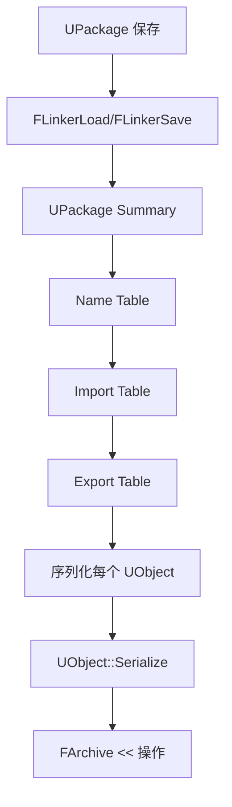

# 序列化系统详解

## 摘要

UE5.7.4 的序列化系统基于 FArchive 抽象，支持二进制序列化、文本导出、网络序列化等多种模式。

---

## 1. FArchive 基类

FArchive 是所有序列化操作的抽象基类。

**源码位置：** Engine/Source/Runtime/Core/Public/Serialization/Archive.h

### 关键成员

| 成员 | 描述 |
|------|------|
| ArIsSaving | 是否正在保存 |
| ArIsLoading | 是否正在加载 |
| ArIsTransacting | 是否在事务中（Undo/Redo） |
| ArIsTextFormat | 是否文本格式 |
| ArNoDelta | 是否禁用 Delta 序列化 |
| ArWantBinaryPropertySerialization | 是否使用二进制属性序列化 |
| ArUE4Ver | UE4 版本号 |
| ArCustomVersionContainer | 自定义版本 |

### 关键运算符

```cpp
FArchive& operator<<(FName& Name);        // 序列化 FName
FArchive& operator<<(FString& String);     // 序列化 FString
FArchive& operator<<(FText& Text);         // 序列化 FText
FArchive& operator<<(UObject*& Object);    // 序列化 UObject 引用
FArchive& operator<<(FObjectPtr& ObjPtr);  // 序列化 FObjectPtr

template<typename T>
FArchive& operator<<(TArray<T>& Array);    // 序列化 TArray
```

## 2. FArchive 子类

| 子类 | 用途 |
|------|------|
| FMemoryReader | 从内存读取 |
| FMemoryWriter | 写入内存 |
| FArchiveUObject | UObject 序列化 |
| FLinkerTables | Linker 表 |
| FJsonArchiveWriter | JSON 序列化 |
| FCbWriter / FCbReader | Compact Binary 序列化 (UE5) |
| FStructuredArchive | 结构化归档 |

## 3. UObject 序列化流程



## 4. 自定义序列化

### 方式一：重写 Serialize

```cpp
void UMyClass::Serialize(FArchive& Ar)
{
    Super::Serialize(Ar);
    Ar << MyData;
    Ar << MyArray;
}
```

### 方式二：使用 UPROPERTY 自动序列化

```cpp
UPROPERTY(SaveGame)
int32 Health;

UPROPERTY()
FString PlayerName;
```

标记了 UPROPERTY() 的属性会自动参与序列化。

## 5. 版本控制

### ObjectVersion
- `Engine/Source/Runtime/CoreUObject/Public/UObject/ObjectVersion.h`
- 全局版本号，每次引擎更新时递增

### CustomVersion
- 允许模块定义独立的版本号
- 通过 FCustomVersionRegistration 注册
- GUID 标识

```cpp
FCustomVersionRegistration GRegisterMyCustomVersion(
    FMyCustomVersion::GUID,
    FMyCustomVersion::LatestVersion,
    TEXT("My Custom Version")
);
```

## 6. Compact Binary (Cb) — UE5 新序列化格式

UE5 引入了 Compact Binary 格式：
- FCbWriter — 写入
- FCbReader — 读取
- FCbObject — 不可变对象
- FCbArray — 不可变数组
- 更高效的二进制序列化

**源码位置：**
- Engine/Source/Runtime/Core/Public/Serialization/CompactBinary.h
- Engine/Source/Runtime/Core/Public/Serialization/CompactBinaryWriter.h

## 7. 源码证据

- Engine/Source/Runtime/Core/Public/Serialization/Archive.h
- Engine/Source/Runtime/CoreUObject/Private/UObject/Obj.cpp
- Engine/Source/Runtime/Core/Public/Serialization/CompactBinary.h

---

## 相关文档

- [UObject.md](UObject.md)
- [Package_Loading.md](Package_Loading.md)
