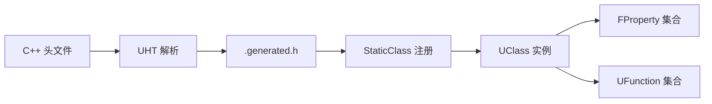

# UClass 与反射系统详解

## 摘要

UE5.7.4 反射系统由 UHT 编译时生成、运行时通过 UClass/UProperty/UFunction 描述类型信息，支持编辑器、序列化、GC、网络复制和 Blueprint。

---

## 1. 反射代码生成流程



### UHT 生成的关键函数
- `StaticClass()` — 返回 UClass*
- `GetLifetimeReplicatedProps()` — 网络复制属性
- `StaticRegisterNatives_XXX()` — 原生函数注册
- `operator new` — 内存分配

## 2. 核心宏

### UCLASS() 参数
| 参数 | 描述 |
|------|------|
| BlueprintType | Blueprint 可使用此类型 |
| Blueprintable | 可创建 Blueprint 子类 |
| EditInlineNew | 可在编辑器中实例化 |
| NotEditInlineNew | 不可编辑器实例化 |
| Placeable | 可放置到关卡 |
| NotPlaceable | 不可放置 |
| DefaultToInstanced | 默认实例化 |
| Const | 常量类 |
| Abstract | 抽象类 |
| Deprecated | 已废弃 |
| Within=XXX | 必须在 XXX 的 Outer 内 |
| MinimalAPI | 仅导出最小 API |
| ClassGroup=XXX | 编辑器分组 |
| CustomConstructor | 自定义构造函数 |
| config=XXX | 配置文件 |

### UPROPERTY() 参数
| 参数 | 描述 |
|------|------|
| EditAnywhere | 任意位置可编辑 |
| EditDefaultsOnly | 仅 CDO 可编辑 |
| EditInstanceOnly | 仅实例可编辑 |
| VisibleAnywhere | 任意位置可见 |
| BlueprintReadOnly | BP 只读 |
| BlueprintReadWrite | BP 可读写 |
| Category="X.Y" | 编辑器分类 |
| Replicated | 网络复制 |
| ReplicatedUsing=Fn | 复制时调用函数 |
| Transient | 不序列化 |
| SaveGame | 存档序列化 |
| meta=(XXX) | 元数据 |

### UFUNCTION() 参数
| 参数 | 描述 |
|------|------|
| BlueprintCallable | BP 可调用 |
| BlueprintPure | BP 纯函数（无执行引脚） |
| BlueprintImplementableEvent | BP 实现事件 |
| BlueprintNativeEvent | C++ 默认实现+BP 覆盖 |
| Server | 服务器 RPC |
| Client | 客户端 RPC |
| NetMulticast | 多播 RPC |
| Reliable | 可靠 RPC |
| Unreliable | 不可靠 RPC |
| Exec | 控制台命令 |
| CallInEditor | 编辑器调用 |
| CustomThunk | 自定义 Thunk |

## 3. UClass 关键函数

```cpp
UClass* StaticClass();                        // 获取类
UClass* GetClass();                           // 运行时类
FProperty* FindPropertyByName(FName);         // 按名查属性
UFunction* FindFunctionByName(FName);         // 按名查函数
UObject* GetDefaultObject();                  // 获取 CDO
bool IsChildOf(const UClass*) const;          // 继承检查
UClass* GetSuperClass() const;                // 父类
FString GetName() const;                      // 类名
bool HasAnyFunctionFlags(EFunctionFlags);     // 函数标志检查
```

## 4. FProperty 类型映射

| C++ 类型 | FProperty 子类 |
|----------|---------------|
| int8/int16/int32/int64 | FInt8Property/FInt16Property/FIntProperty/FInt64Property |
| uint8/uint16/uint32/uint64 | FByteProperty/FUInt16Property/FUInt32Property/FUInt64Property |
| float/double | FFloatProperty/FDoubleProperty |
| bool | FBoolProperty |
| FString | FStrProperty |
| FName | FNameProperty |
| FText | FTextProperty |
| UObject* | FObjectProperty |
| TSubclassOf<T> | FClassProperty |
| TSoftObjectPtr<T> | FSoftObjectProperty |
| TWeakObjectPtr<T> | FWeakObjectProperty |
| TArray<T> | FArrayProperty |
| TMap<K,V> | FMapProperty |
| TSet<T> | FSetProperty |
| UStruct | FStructProperty |
| UEnum | FEnumProperty |
| FDelegate | FDelegateProperty |
| FMulticastDelegate | FMulticastDelegateProperty |

## 5. UFunction 调用机制

```cpp
// 通过反射调用函数
UFunction* Func = GetClass()->FindFunctionByName(FName("MyFunction"));
if (Func)
{
    FStructOnScope Params(Func);
    ProcessEvent(Func, Params.GetStruct());
}
```

UFunction 的调用链：
```
ProcessEvent() → UFunction::Invoke() → Generated Thunk → C++ 实现
```

## 6. 反射与 Blueprint

Blueprint 编辑器完全依赖反射系统：
- 所有 Blueprint 节点基于 UFunction/FProperty
- Blueprint 类型系统通过 UClass 描述
- 蓝图编译器 (KismetCompiler) 将节点图编译为字节码

## 7. 源码证据

- Engine/Source/Runtime/CoreUObject/Public/UObject/UClass.h
- Engine/Source/Runtime/CoreUObject/Public/UObject/UnrealType.h
- Engine/Source/Programs/UnrealHeaderTool/Public/
- Engine/Source/Runtime/CoreUObject/Private/UObject/Class.cpp

---

## 相关文档

- [UObject.md](UObject.md)
- [GC.md](GC.md)
- [Property_System.md](Property_System.md)
