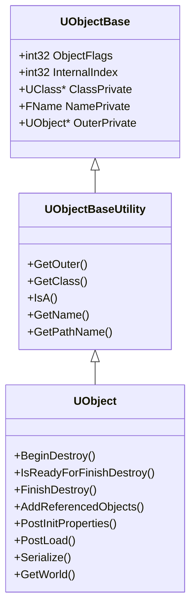

# UObject 详解

## 摘要

UObject 是 UE5.7.4 所有托管对象的基类，提供反射、GC、序列化、网络复制等核心能力。每个 UObject 都有对应的 UClass 描述其类型信息。

---

## 1. 类定义与继承链

**源码位置：** Engine/Source/Runtime/CoreUObject/Public/UObject/UObject.h

```
UObjectBase
  → UObjectBaseUtility
    → UObject
      → 所有 UE 托管对象（AActor, UActorComponent, UWorld 等）
```

### UObjectBase 核心数据成员

```cpp
class UObjectBase
{
    EObjectFlags	ObjectFlags;     // 对象标志
    int32			InternalIndex;   // FUObjectArray 索引
    UClass*			ClassPrivate;    // 类指针
    FName			NamePrivate;     // 对象名称
    UObject*		OuterPrivate;    // 外部对象（UPackage 或其他）
};
```

## 2. UObject 关键函数

| 函数 | 描述 |
|------|------|
| StaticClass() | 获取 UClass（编译时确定） |
| GetClass() | 获取运行时 UClass |
| GetOuter() | 获取 Outer 对象 |
| GetWorld() | 获取所属 World |
| IsA<T>() | 类型检查 |
| GetName() | 获取对象名称 |
| GetPathName() | 获取完整路径 |
| GetFullName() | 获取完整名称（含类名） |
| Destroy() | 请求销毁 |
| MarkPendingKill() | 标记待销毁（废弃，用 Destroy） |
| ConditionalBeginDestroy() | 条件销毁 |
| AddReferencedObjects() | GC 引用声明 |
| PostInitProperties() | 初始化后回调 |
| PostLoad() | 加载后回调 |
| BeginDestroy() | 开始销毁 |
| IsReadyForFinishDestroy() | 是否可完成销毁 |
| FinishDestroy() | 完成销毁 |

## 3. 对象创建流程

```mermaid
flowchart TD
    A[NewObject<T>()] --> B[StaticAllocateObject]
    B --> C[分配内存]
    C --> D[调用 C++ 构造函数]
    D --> E[PostInitProperties]
    E --> F[注册到 FUObjectArray]
    F --> F1{是否 PostLoad?}
    F1 -->|是| G[PostLoad]
    F1 -->|否| H[完成]
    G --> H
```

### NewObject<T>() 完整签名

```cpp
template<class T>
T* NewObject(UObject* Outer, UClass* Class, FName Name,
             EObjectFlags Flags, UObject* Template, bool bCopyTransientsFromClassDefaults,
             FObjectInstancingGraph* InstanceGraph);
```

### StaticAllocateObject
- 从 UObject 分配器分配内存
- 设置 ClassPrivate, NamePrivate, OuterPrivate
- 分配 InternalIndex

## 4. EObjectFlags 关键标志

| 标志 | 值 | 描述 |
|------|-----|------|
| RF_NoFlags | 0x00000000 | 无标志 |
| RF_Public | 0x00000001 | 公开对象 |
| RF_Standalone | 0x00000002 | 独立对象（不被 GC 自动回收） |
| RF_MarkAsNative | 0x00000004 | C++ 原生对象 |
| RF_Transactional | 0x00000008 | 支持事务（Undo/Redo） |
| RF_ClassDefaultObject | 0x00000010 | 类默认对象（CDO） |
| RF_ArchetypeObject | 0x00000020 | 原型对象 |
| RF_Transient | 0x00000040 | 瞬态（不保存） |
| RF_MarkAsRootSet | 0x00000080 | GC 根集 |
| RF_TagGarbageTemp | 0x00000400 | GC 临时标记 |
| RF_NeedLoad | 0x00020000 | 需要加载 |
| RF_BeginDestroyed | 0x02000000 | 开始销毁 |
| RF_FinishDestroyed | 0x04000000 | 完成销毁 |

## 5. FUObjectArray — 全局对象数组

所有 UObject 都注册到全局数组 `GUObjectArray`：

```cpp
class FUObjectArray
{
    TArray<UObjectBase*> Objects;    // 对象指针数组
    FUObjectItem* ObjObjects;        // 对象项数组
};
```

- `AllocateUObjectIndex()` — 分配索引
- 每个 UObject 的 InternalIndex 对应数组下标
- GC 遍历此数组进行标记-清除

## 6. CDO (Class Default Object)

每个 UClass 都有一个 CDO 实例：
```cpp
UClass* Class = T::StaticClass();
UObject* CDO = Class->GetDefaultObject();
```

CDO 存储该类的默认属性值，所有实例在创建时从 CDO 复制属性。

## 7. 对象命名规则

| 前缀 | 基类 | 示例 |
|------|------|------|
| U | UObject | UTexture2D, UMaterial |
| A | AActor | APlayerController |
| F | struct | FVector, FLinearColor |
| E | enum | EObjectType |
| I | interface | IInterface |
| T | template | TArray, TMap |
| S | Slate widget | SButton |

## 8. 常见误区

1. **不是所有 UObject 都需要 UCLASS()** — 只有需要反射的才标记
2. **UObject 不能用 new 创建** — 必须用 NewObject 或 StaticAllocateObject
3. **UPROPERTY() 不是可选的** — 不标记的属性不会被 GC 追踪、序列化或复制
4. **UObject 数量有限制** — 默认约 2M 个对象（可配置）

## 9. 调试命令

- `obj list` — 列出所有对象
- `obj list class=UMaterial` — 按类过滤
- `obj refs name=/Game/MyAsset` — 查看引用
- `obj gc` — 强制 GC
- `stat uobject` — UObject 统计

## 10. 源码证据

- Engine/Source/Runtime/CoreUObject/Public/UObject/UObject.h — UObject 定义
- Engine/Source/Runtime/CoreUObject/Private/UObject/Object.cpp — 实现
- Engine/Source/Runtime/CoreUObject/Private/UObject/Obj.cpp — 对象管理
- Engine/Source/Runtime/CoreUObject/Public/UObject/UObjectArray.h — FUObjectArray
- Engine/Source/Runtime/CoreUObject/Public/UObject/ObjectMacros.h — 宏定义

---

## Mermaid 类图



---

## 相关文档

- [UClass_Reflection.md](UClass_Reflection.md)
- [GC.md](GC.md)
- [Property_System.md](Property_System.md)
- [Serialization.md](Serialization.md)
