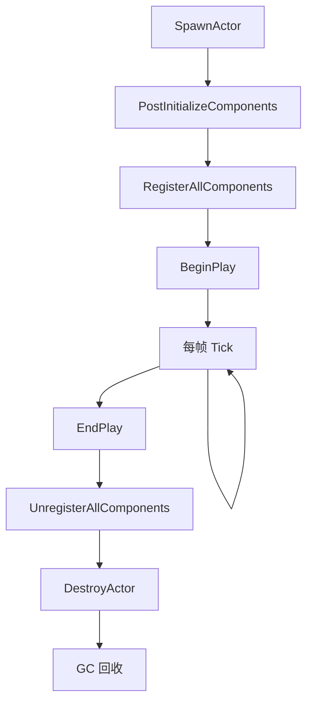

# AActor 详解

## 摘要
AActor 是 UE5.7.4 中所有可放置实体的基类，是 Gameplay 框架的核心概念。

## 1. 源码位置
- Engine/Source/Runtime/Engine/Classes/GameFramework/Actor.h
- Engine/Source/Runtime/Engine/Private/Actor.cpp

## 2. 关键属性
- GetWorld() — 获取所属 World
- GetActorLocation() / GetActorRotation() — 空间变换
- RootComponent — 根 SceneComponent
- Instigator — 触发者
- Owner — 所有者
- ActorHasTag() — 标签系统
- Layers — 层级

## 3. 生命周期


## 4. 关键函数
- BeginPlay() — 游戏开始时调用
- Tick(float DeltaTime) — 每帧调用
- EndPlay() — 退出时调用
- Destroy() — 请求销毁
- SetActorLocation() — 设置位置
- GetComponents() — 获取所有组件
- AddComponent() — 动态添加组件

## 5. Actor 生成流程
```
UWorld::SpawnActor()
  → AActor::PostSpawnInitialize()
    → AActor::PostInitializeComponents()
      → RegisterAllComponents()
        → UActorComponent::RegisterComponent()
          → UPrimitiveComponent::CreateRenderState()
            → FScene::AddPrimitive()
    → AActor::BeginPlay()
```

## 6. Tick 系统
- PrimaryActorTick.bCanEverTick — 控制是否 Tick
- SetTickFunctionEnable() — 运行时开关
- TickGroup — 控制 Tick 时机（PrePhysics/PostPhysics/PostUpdateWork）

## 7. 网络相关
- bReplicates — 是否启用网络复制
- SetReplicates() — 设置复制
- GetLifetimeReplicatedProps() — 复制属性声明
- NetMulticast / Server / Client — RPC 宏

## 8. 源码证据
- Engine/Source/Runtime/Engine/Classes/GameFramework/Actor.h
- Engine/Source/Runtime/Engine/Private/Actor.cpp:PostSpawnInitialize
- Engine/Source/Runtime/Engine/Private/Actor.cpp:BeginPlay
