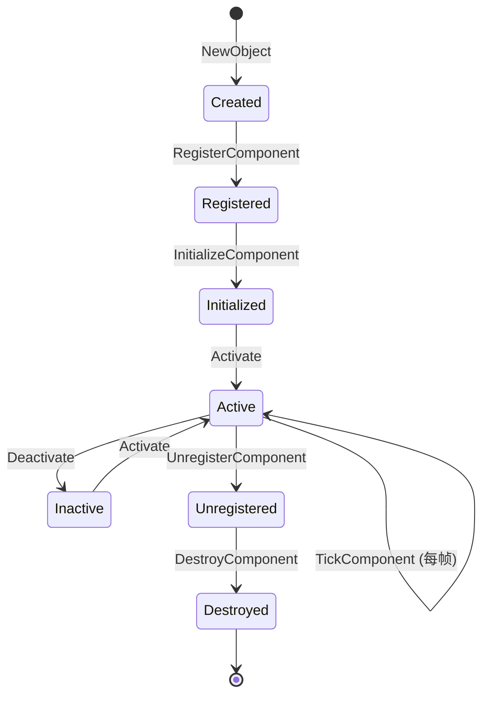

# UActorComponent 详解

## 摘要

UActorComponent 是 UE5.7.4 组件系统的基类。Actor 通过组合 Component 来构建功能，而非通过继承。

---

## 1. 类层级

```
UActorComponent
  → USceneComponent (有 Transform)
    → UPrimitiveComponent (可渲染)
      → UMeshComponent (网格)
        → UStaticMeshComponent
        → USkeletalMeshComponent
      → UShapeComponent (碰撞)
        → UBoxComponent, USphereComponent, UCapsuleComponent
      → ULightComponent (光照)
      → UCameraComponent
      → USpringArmComponent
    → UAudioComponent
    → UParticleSystemComponent
    → UInputComponent
    → USplineComponent
```

**源码位置：** Engine/Source/Runtime/Engine/Classes/Components/ActorComponent.h

## 2. 生命周期



## 3. 关键函数

| 函数 | 时机 | 描述 |
|------|------|------|
| InitializeComponent() | 注册后 | 初始化（仅一次） |
| BeginPlay() | 游戏开始 | Actor BeginPlay 时调用 |
| TickComponent() | 每帧 | 主 Tick 函数 |
| EndPlay() | 游戏结束 | 清理 |
| Activate() | 激活 | 启用组件 |
| Deactivate() | 停用 | 禁用组件 |
| DestroyComponent() | 销毁 | 请求销毁 |
| RegisterComponent() | 注册 | 注册到 World |

## 4. 注册流程

```
RegisterComponent()
  → UWorld::AddComponent()
    → CreateRenderState_Concurrent() (渲染状态)
    → CreatePhysicsState_Concurrent() (物理状态)
    → FScene::AddPrimitive() (如果 UPrimitiveComponent)
```

## 5. USceneComponent

提供 Transform 层级：
- AttachToComponent() — 挂载到父组件
- SetupAttachment() — 构造时设置挂载
- GetSocketLocation() — Socket 位置

## 6. UPrimitiveComponent

渲染和碰撞的核心：
- CreateSceneProxy() — 创建渲染代理
- GetCollisionShape() — 碰撞形状
- SetVisibility() — 可见性
- SetHiddenInGame() — 游戏中隐藏

## 7. Component 通信

- GetOwner() — 获取所属 Actor
- GetComponents() — 获取同 Actor 的其他组件
- FindComponentByClass<T>() — 按类型查找

## 8. 源码证据

- Engine/Source/Runtime/Engine/Classes/Components/ActorComponent.h
- Engine/Source/Runtime/Engine/Private/Components/ActorComponent.cpp
- Engine/Source/Runtime/Engine/Classes/Components/SceneComponent.h
- Engine/Source/Runtime/Engine/Classes/Components/PrimitiveComponent.h

---

## 相关文档

- [Actor.md](Actor.md)
- [Tick.md](Tick.md)
