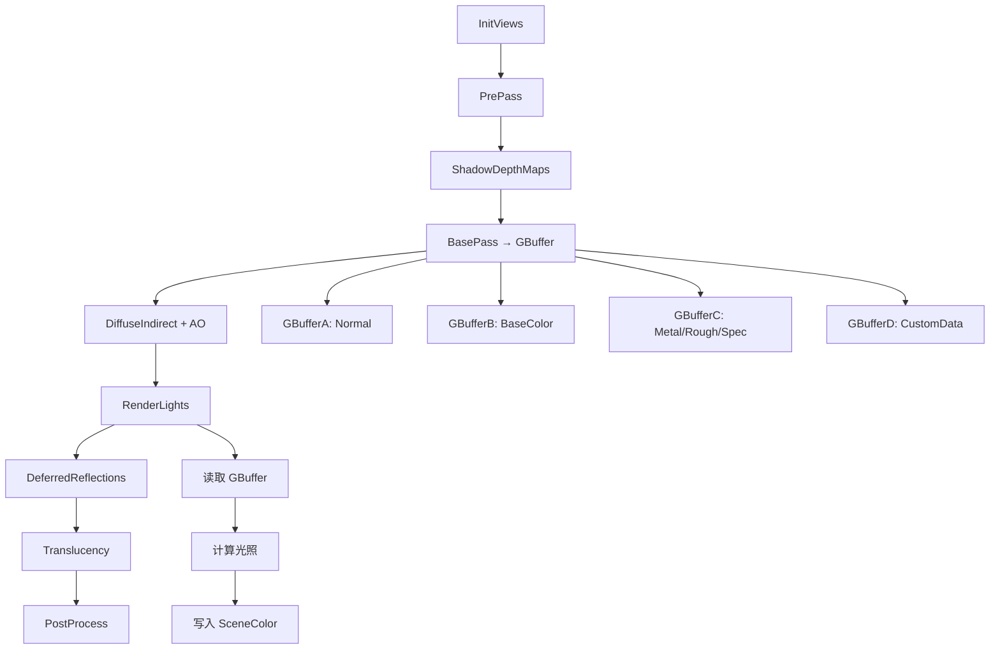
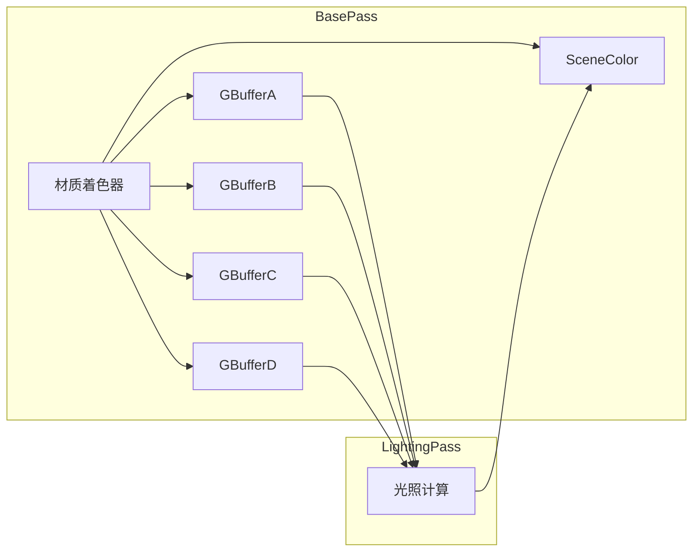

# 延迟渲染流程详解

## 摘要

UE5.7.4 默认使用延迟渲染（Deferred Shading）作为主要渲染路径。核心流程为：PrePass → BasePass（写入 GBuffer）→ Shadow → Lighting（读取 GBuffer 计算光照）→ Translucency → PostProcess。几何通道与光照通道解耦，使得多光源场景下效率更高。

---

## 适合解决的问题

- 延迟渲染一帧的完整流程是什么？
- GBuffer 包含哪些通道？每个通道存什么？
- BasePass 如何写入 GBuffer？
- LightingPass 如何读取 GBuffer 并计算光照？
- 延迟渲染和前向渲染如何选择？

---

## 核心结论

1. **多通道架构**: PrePass → BasePass → Shadow → Lighting → Translucency → PostProcess
2. **GBuffer 解耦**: 几何通道写入材质属性到 GBuffer，光照通道独立计算
3. **主入口**: `FDeferredShadingSceneRenderer::Render()` 位于 `DeferredShadingRenderer.cpp:1736`
4. **GBuffer 结构**: 7 个纹理（GBufferA-F + SceneColor），存储法线、基础色、金属度、粗糙度等

---

## 源码位置

| 组件 | 路径 |
|------|------|
| 延迟渲染器主文件 | `Engine/Source/Runtime/Renderer/Private/DeferredShadingRenderer.cpp` |
| 延迟渲染器头文件 | `Engine/Source/Runtime/Renderer/Private/DeferredShadingRenderer.h` |
| GBuffer 定义 | `Engine/Source/Runtime/RenderCore/Public/GBufferInfo.h` |
| 场景纹理 | `Engine/Source/Runtime/Renderer/Private/SceneTextures.cpp` |
| BasePass 渲染 | `Engine/Source/Runtime/Renderer/Private/BasePassRendering.cpp` |
| 光照渲染 | `Engine/Source/Runtime/Renderer/Private/LightRendering.cpp` |
| 移动端渲染 | `Engine/Source/Runtime/Renderer/Private/MobileShadingRenderer.cpp` |

---

## 关键类

### FDeferredShadingSceneRenderer
- **路径**: `DeferredShadingRenderer.h`
- **职责**: 延迟渲染主渲染器，管理整个渲染流程
- **核心方法**: `Render(FRDGBuilder&, ...)` — 主渲染入口

### GBuffer 通道枚举 (EGBufferSlot)
- **路径**: `GBufferInfo.h:12-44`
- **核心通道**:
  - `GBS_WorldNormal` — 世界空间法线 (RGB10)
  - `GBS_BaseColor` — 基础颜色 (RGB8)
  - `GBS_Metallic` — 金属度 (R8)
  - `GBS_Specular` — 高光度 (R8)
  - `GBS_Roughness` — 粗糙度 (R8)
  - `GBS_ShadingModelId` — 着色模型 ID (4位)
  - `GBS_GenericAO` — 通用 AO (R8)
  - `GBS_Velocity` — 速度 (RG float16)
  - `GBS_CustomData` — 自定义数据 (RGBA8)
  - `GBS_SubsurfaceColor` — 次表面颜色 (RGB8)
  - `GBS_ClearCoat` — 清漆 (R8)
  - `GBS_IrisNormal` — 虹膜法线 (RG8)

### GBuffer 纹理
- **路径**: `SceneTextures.h:131-137`
- **GBufferA**: 法线 + ShadingModelId + SelectiveOutputMask
- **GBufferB**: 基础颜色 + AO
- **GBufferC**: 金属度 + 高光度 + 粗糙度
- **GBufferD**: 自定义数据/次表面数据
- **GBufferE**: 额外特性数据
- **GBufferF**: 额外数据
- **GBufferVelocity**: 速度缓冲

---

## 关键函数与调用顺序

### 完整渲染流程（行号约 1736-3700）

```
FDeferredShadingSceneRenderer::Render()          // :1736
  │
  ├─ 1. 初始化阶段 (1736-2047)
  │   ├─ RayTracing 处理
  │   ├─ OnRenderBegin()
  │   └─ BeginInitViews()                        // :2052
  │
  ├─ 2. 场景更新 (2076-2350)
  │   ├─ VirtualTexture 更新
  │   ├─ EndInitViews()                          // :2316
  │   ├─ GatherAndSortLights (异步任务)
  │   └─ PrepareForwardLightData()
  │
  ├─ 3. Lumen 更新 (2794)
  │   └─ UpdateLumenScene()
  │
  ├─ 4. 深度预处理 (2369-2423)
  │   ├─ RenderPrePass()                         // :2384
  │   ├─ RenderPrePassHMD()                      // :2389
  │   └─ RenderVelocities()                      // :2396
  │
  ├─ 5. 阴影深度 (2823-2849)
  │   └─ RenderShadowDepthMaps()                 // :2823
  │
  ├─ 6. BasePass (2904-2905)
  │   └─ RenderBasePass()                        // :2905
  │       ├─ 清除 GBuffer
  │       ├─ 渲染不透明/遮罩几何
  │       └─ 写入 GBufferA-F + SceneColor
  │
  ├─ 7. 间接光照 (3265-3272)
  │   └─ RenderDiffuseIndirectAndAmbientOcclusion()
  │       ├─ Lumen GI / SSGI
  │       └─ SSAO
  │
  ├─ 8. 延迟光照 (3314)
  │   └─ RenderLights()                          // :3314
  │       ├─ 简单光源批量渲染
  │       ├─ 聚类延迟光源
  │       └─ 阴影应用
  │
  ├─ 9. 反射 (3339)
  │   └─ RenderDeferredReflectionsAndSkyLighting()
  │
  ├─ 10. 半透明 (3431-3589)
  │   ├─ RenderLightShaftOcclusion()
  │   ├─ RenderSkyAtmosphere()
  │   ├─ RenderFog()
  │   └─ RenderTranslucency()
  │
  └─ 11. 后处理
      └─ RenderPostProcessing()
```

---

## Mermaid 图

### 延迟渲染完整流程



### GBuffer 写入与读取



---

## 常见误区

1. **GBuffer 不固定**: UE5.7.4 支持可编程 GBuffer 布局，不同着色模型使用不同通道
2. **延迟渲染也有 PrePass**: 深度预处理用于 Early-Z 优化
3. **BasePass 不只写 GBuffer**: 还会写入 SceneColor（自发光、Substrate 等）
4. **MegaLights**: UE5.7.4 引入 MegaLights 系统（`RenderMegaLights`），替代传统聚类延迟光照

---

## 调试建议

- `showflag.BufferVisualization` — GBuffer 可视化
- `r.BasePassOutputs 0/1` — 控制 BasePass 输出
- `r.DeferredRendering 0/1` — 开关延迟渲染
- `r.ShowMaterialDrawEvents` — 显示材质绘制事件
- Unreal Insights → GPU → 查看每个 Pass 耗时

---

## 扩展点

1. **自定义 GBuffer 通道**: 通过修改 `GBufferInfo.h` 添加自定义通道
2. **自定义着色模型**: 添加新的 ShadingModelId 并在材质中处理
3. **自定义光照通道**: 通过 `FLightRendering` 扩展光照计算
4. **FDeferredShadingSceneRenderer 子类化**: 不直接支持，但可通过 SceneViewExtension 注入自定义 Pass

---

## 源码证据

- `Engine/Source/Runtime/Renderer/Private/DeferredShadingRenderer.cpp:1736` — `Render()` 主入口
- `Engine/Source/Runtime/Renderer/Private/DeferredShadingRenderer.cpp:2905` — `RenderBasePass()` 调用
- `Engine/Source/Runtime/Renderer/Private/DeferredShadingRenderer.cpp:3314` — `RenderLights()` 调用
- `Engine/Source/Runtime/Renderer/Private/DeferredShadingRenderer.cpp:3265` — 间接光照入口
- `Engine/Source/Runtime/Renderer/Private/DeferredShadingRenderer.cpp:2819` — 前向/延迟分支
- `Engine/Source/Runtime/RenderCore/Public/GBufferInfo.h:12-44` — GBuffer 通道枚举
- `Engine/Source/Runtime/Renderer/Private/SceneTextures.h:131-137` — GBuffer 纹理定义
- `Engine/Source/Runtime/Renderer/Private/BasePassRendering.cpp` — BasePass 实现
- `Engine/Source/Runtime/Renderer/Private/MobileShadingRenderer.cpp` — 移动端渲染器

---

## 相关文档

- [前向渲染流程](Forward_Rendering.md)
- [完整渲染管线](Full_Render_Pipeline.md)
- [Lumen 全局光照](Lumen.md)
- [虚拟阴影映射](Virtual_Shadow_Map.md)
- [RDG 渲染图](RDG.md)
