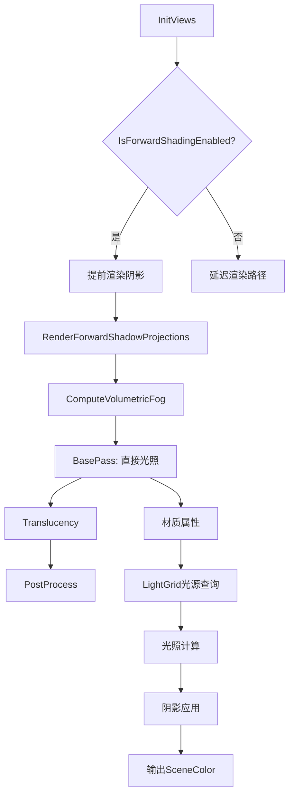

# 前向渲染流程详解

## 摘要

UE5.7.4 的前向渲染（Forward Shading）主要用于移动端和 VR 平台。与延迟渲染不同，前向渲染在几何通道直接计算最终光照，无需 GBuffer 中间存储。光照信息通过聚类光源网格（Clustered Light Grid）或光照体积注入传递。

---

## 适合解决的问题

- 什么时候使用前向渲染而不是延迟渲染？
- 前向渲染的光照如何计算？
- 移动端渲染器的特殊处理有哪些？
- 前向渲染和延迟渲染的性能差异？

---

## 核心结论

1. **单通道光照**: 几何阶段直接计算最终颜色，无需 GBuffer
2. **主要用于移动端**: `FMobileSceneRenderer` 是前向渲染的主要实现
3. **VSM 不支持**: 前向渲染路径明确不支持 Virtual Shadow Map
4. **光照网格**: 通过 `PrepareForwardLightData()` 和 `ComputeLightGrid` 构建光源聚类

---

## 源码位置

| 组件 | 路径 |
|------|------|
| 移动端渲染器 | `Engine/Source/Runtime/Renderer/Private/MobileShadingRenderer.cpp` |
| 延迟渲染中的前向分支 | `Engine/Source/Runtime/Renderer/Private/DeferredShadingRenderer.cpp:2819` |
| 前向光照准备 | `Engine/Source/Runtime/Renderer/Private/ForwardLighting.cpp` |
| 光照网格 | `Engine/Source/Runtime/Renderer/Private/LightGrid.cpp` |

---

## 关键类

### FMobileSceneRenderer
- **路径**: `MobileShadingRenderer.cpp`
- **职责**: 移动端渲染主类，支持前向和移动端延迟渲染
- **判断**: `bDeferredShading(IsMobileDeferredShadingEnabled(ShaderPlatform))`

---

## 前向 vs 延迟分支

### 分支判断 (`DeferredShadingRenderer.cpp:2662, 2819`)
```cpp
if (!IsForwardShadingEnabled(ShaderPlatform))
{
    // 延迟渲染路径
    FinishInitDynamicShadows(GraphBuilder, ...);
}
// ...
if (IsForwardShadingEnabled(ShaderPlatform))
{
    // 前向渲染路径 - 提前渲染阴影
    RenderShadowDepthMaps(GraphBuilder, ...);
    RenderForwardShadowProjections(GraphBuilder, ...);
    ComputeVolumetricFog(GraphBuilder, ...);
}
```

### 移动端前向渲染条件
- 默认使用前向渲染
- 移动端延迟渲染需要: OpenGL ES 3.1+ / Vulkan / Metal + MRT 支持
- MSAA > 1 时无法使用移动端延迟渲染

---

## 前向渲染光照流程

```
IsForwardShadingEnabled()
  │
  ├─ RenderShadowDepthMaps()              // 提前渲染阴影
  ├─ RenderForwardShadowProjections()     // 前向阴影投影
  ├─ ComputeVolumetricFog()               // 体积雾
  │
  └─ RenderBasePass()
      ├─ 每个像素直接计算:
      │   ├─ 材质属性 (基础色、法线、粗糙度等)
      │   ├─ 从 LightGrid 读取光源列表
      │   ├─ 计算每个光源的贡献
      │   ├─ 应用阴影
      │   └─ 输出最终颜色到 SceneColor
      └─ 无需 GBuffer 中间存储
```

---

## Mermaid 图



---

## 调试建议

- `r.ForwardShading 0/1` — 强制开关前向渲染（仅限支持的平台）
- `r.MobileDeferredShading 0/1` — 移动端延迟渲染开关
- `showflag.Lighting` — 查看光照效果
- Stats → GPU → 搜索 `Forward` 查看前向渲染耗时

---

## 源码证据

- `Engine/Source/Runtime/Renderer/Private/DeferredShadingRenderer.cpp:2662` — 延迟/前向分支
- `Engine/Source/Runtime/Renderer/Private/DeferredShadingRenderer.cpp:2819-2842` — 前向渲染路径（提前阴影、VSM 不支持）
- `Engine/Source/Runtime/Renderer/Private/MobileShadingRenderer.cpp` — FMobileSceneRenderer
- `Engine/Source/Runtime/Renderer/Private/MobileShadingRenderer.cpp:1780` — 移动端前向渲染入口
- `Engine/Source/Runtime/Renderer/Private/ForwardLighting.cpp` — 前向光照数据准备

---

## 相关文档

- [延迟渲染流程](Deferred_Rendering.md)
- [完整渲染管线](Full_Render_Pipeline.md)
- [RHI 硬件抽象](RHI.md)
