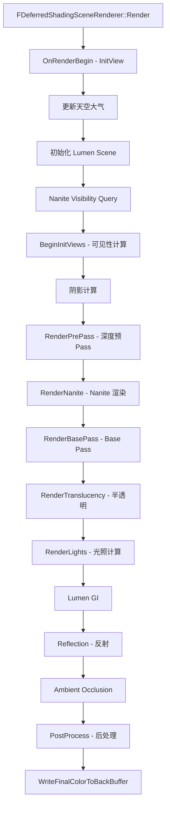
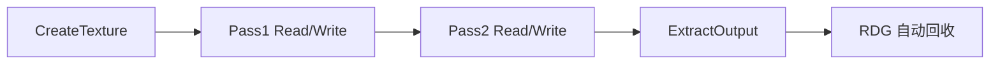
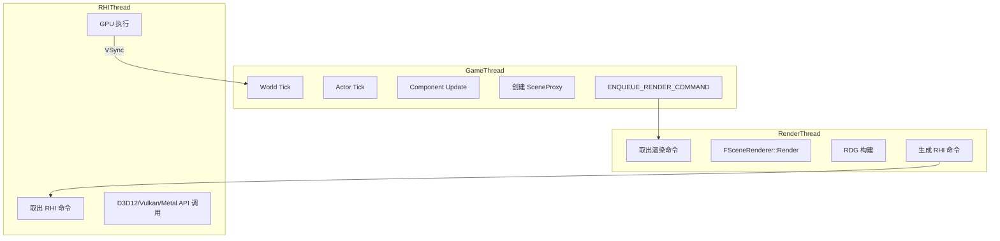

# UE5.7.4 完整渲染管线

## 摘要

本文档详细分析 UE5.7.4 从 GameThread 到 GPU 的完整渲染流程，覆盖 SceneProxy 创建、RenderThread 命令执行、RDG 渲染图、RHI 抽象、延迟着色主流程，以及 Nanite/Lumen/VSM 的集成点。

## 适合解决的问题

- UE 渲染一帧到底做了什么？
- GameThread 如何将渲染数据传递给 RenderThread？
- 延迟着色的完整 Pass 有哪些？
- Nanite/Lumen/VSM 如何进入渲染管线？
- RDG 是如何组织 Pass 的？
- Material 如何编译成 Shader？
- RHI 如何落到 D3D12？

---

## 核心结论

UE5.7.4 渲染管线采用**三线程架构**：
1. **GameThread** — 逻辑计算、SceneProxy 创建
2. **RenderThread** — 渲染命令编码、RDG 构建
3. **RHIThread** — GPU API 调用提交

渲染模式以**延迟着色（Deferred Shading）**为主，Forward Rendering 为辅。

---

## 1. 渲染入口：从 GameThread 到 RenderThread

### 核心问题：GameThread 如何触发渲染？

### 源码路径
- `Engine/Source/Runtime/Engine/Private/GameViewportClient.cpp:1971`
- `Engine/Source/Runtime/Renderer/Private/SceneRendering.cpp:5034`

### 调用链

```
UGameViewportClient::Draw()
  → GetRendererModule().BeginRenderingViewFamily(SceneCanvas, &ViewFamily)
    → FRendererModule::BeginRenderingViewFamilies()
      → World->SendAllEndOfFrameUpdates()  // 确保所有 SceneProxy 更新
      → ENQUEUE_RENDER_COMMAND(渲染命令)
```

### 关键函数

#### `FRendererModule::BeginRenderingViewFamilies` — SceneRendering.cpp:5039

```cpp
void FRendererModule::BeginRenderingViewFamilies(FCanvas* Canvas, TConstArrayView<FSceneViewFamily*> ViewFamilies)
{
    FScene* Scene = ViewFamilies[0]->Scene->GetRenderScene();
    if (Scene)
    {
        World = Scene->GetWorld();
        // 确保所有渲染代理更新
        World->SendAllEndOfFrameUpdates();
    }

    // 刷新 Canvas
    Canvas->Flush_GameThread();

    // 通过 ENQUEUE_RENDER_COMMAND 将渲染任务发送到渲染线程
    // 最终调用 FSceneRenderer::Render
}
```

**源码证据：**
- Engine/Source/Runtime/Renderer/Private/SceneRendering.cpp:5039-5113

---

## 2. SceneProxy 创建：从 Component 到渲染对象

### 核心问题：UPrimitiveComponent 如何创建 FPrimitiveSceneProxy？

### 调用链

```
UPrimitiveComponent::CreateRenderState_Concurrent()
  → FScene::AddPrimitive(PrimitiveComponent)
    → UPrimitiveComponent::CreateSceneProxy()
      → 返回 FPrimitiveSceneProxy 子类
    → ENQUEUE_RENDER_COMMAND(AddPrimitiveCommand)
      → FScene::AddPrimitiveSceneInfo_RenderThread(FPrimitiveSceneInfo*)
```

### 关键类

| 类 | 职责 |
|----|------|
| `UPrimitiveComponent` | GameThread 侧的渲染组件 |
| `FPrimitiveSceneProxy` | RenderThread 侧的渲染代理（线程安全副本） |
| `FPrimitiveSceneInfo` | FScene 中管理 Primitive 的内部结构 |
| `FScene` | 渲染场景容器 |

### SceneProxy 类型对应关系

| Component | SceneProxy |
|-----------|-----------|
| UStaticMeshComponent | FStaticMeshSceneProxy |
| USkeletalMeshComponent | FSkeletalMeshSceneProxy |
| UNiagaraComponent | FNiagaraSceneProxy |
| UInstancedStaticMeshComponent | FInstancedStaticMeshSceneProxy |
| UParticleSystemComponent | FParticleSceneProxy |
| ULandscapeComponent | FLandscapeComponentSceneProxy |

**源码证据：**
- Engine/Source/Runtime/Engine/Private/PrimitiveComponent.cpp (CreateSceneProxy)
- Engine/Source/Runtime/Renderer/Private/ScenePrivate.h (FScene)

---

## 3. FScene：渲染场景管理

### 源码位置
- `Engine/Source/Runtime/Renderer/Private/Scene.h`

### 关键数据

```cpp
class FScene : public FSceneInterface
{
    // 场景中的所有 Primitive
    TSparseArray<FPrimitiveSceneInfo*> Primitives;

    // 场景中的所有 Light
    TArray<FLightSceneInfo*> Lights;

    // 场景中的所有 Decal
    TArray<FDecalState> Decals;

    // Nanite 相关
    FNaniteVisibility NaniteVisibility;

    // Lumen 相关
    FLumenSceneData* LumenSceneData;

    // 虚拟阴影贴图
    FVirtualShadowMapArray VirtualShadowMapArray;

    // GPU Scene
    FGPUScene GPUScene;
};
```

---

## 4. 延迟着色主流程

### 核心问题：FDeferredShadingSceneRenderer::Render() 做了什么？

### 源码位置
- `Engine/Source/Runtime/Renderer/Private/DeferredShadingRenderer.cpp:1736`

### 完整 Pass 顺序



### 主要步骤详解

| 步骤 | 函数 | 描述 |
|------|------|------|
| 1 | `OnRenderBegin` | 初始化视图数据、GPU Scene |
| 2 | `BeginInitViews` | 可见性剔除、LOD 选择 |
| 3 | `RenderPrePass` | 深度预Pass（Z-Prepass） |
| 4 | `RenderNanite` | Nanite 虚拟几何渲染 |
| 5 | `RenderBasePass` | GBuffer 生成 |
| 6 | `RenderShadowMaps` | 阴影贴图渲染 |
| 7 | `RenderLights` | 光照计算（Tile/Cluster） |
| 8 | `RenderLumen` | Lumen 全局光照 |
| 9 | `RenderReflections` | 屏幕空间反射/光线追踪反射 |
| 10 | `RenderAmbientOcclusion` | 环境光遮蔽 |
| 11 | `RenderPostProcess` | 后处理（Bloom/Tonemap/DOF等） |

**源码证据：**
- Engine/Source/Runtime/Renderer/Private/DeferredShadingRenderer.cpp:1736-2200+

---

## 5. ENQUEUE_RENDER_COMMAND 机制

### 核心问题：GameThread 如何向 RenderThread 发送命令？

### 源码位置
- `Engine/Source/Runtime/RenderCore/Public/RenderingThread.h`

### 机制

```cpp
// GameThread 调用
ENQUEUE_RENDER_COMMAND(BeginFrame)([CurrentFrameCounter](FRHICommandListImmediate& RHICmdList)
{
    BeginFrameRenderThread(RHICmdList, CurrentFrameCounter);
});
```

`ENQUEUE_RENDER_COMMAND` 是一个宏，它：
1. 创建一个 Lambda 函数
2. 将 Lambda 封装为渲染命令
3. 放入渲染线程的命令队列
4. 渲染线程从队列取出并执行

### 命令流转

```
GameThread → ENQUEUE_RENDER_COMMAND → 渲染命令队列 → RenderThread 执行
```

---

## 6. RDG（Render Dependency Graph）

### 源码位置
- `Engine/Source/Runtime/RenderCore/Public/RenderGraph.h`

### 核心概念

RDG 是 UE5 的渲染图系统，自动管理渲染 Pass 之间的依赖和资源生命周期。

```cpp
void FDeferredShadingSceneRenderer::Render(FRDGBuilder& GraphBuilder, ...)
{
    // 创建 RDG 资源
    FRDGTextureRef SceneColor = GraphBuilder.CreateTexture(...);

    // 添加 Pass
    GraphBuilder.AddPass(RDG_EVENT_NAME("BasePass"), ...)
        .Read(DepthTexture)
        .Write(SceneColor)
        .Execute([=](FRHICommandList& RHICmdList) { /* GPU 命令 */ });

    // 执行整个图
    GraphBuilder.Execute();
}
```

### RDG 资源生命周期



**源码证据：**
- Engine/Source/Runtime/RenderCore/Public/RenderGraph.h
- Engine/Source/Runtime/RenderCore/Private/RenderGraph.cpp

---

## 7. RHI 抽象层

### 核心问题：RHI 如何抽象不同 GPU API？

### 源码位置
- `Engine/Source/Runtime/RHI/Public/RHI.h`
- `Engine/Source/Runtime/RHI/Public/DynamicRHI.h`

### 关键接口

```cpp
class FRHICommandList  // RHI 命令列表
{
    void DrawPrimitive(uint32 BaseVertexIndex, uint32 NumPrimitives, uint32 NumInstances);
    void DrawIndexedPrimitive(FRHIIndexBuffer* IndexBuffer, ...);
    void SetGraphicsPipelineState(FRHIGraphicsPipelineState* PipelineState);
    void SetShaderParameters(FRHIVertexShader* Shader, ...);
    void ClearRenderTargets(...);
    void BeginRenderPass(...);
    void EndRenderPass();
};

class FDynamicRHI  // 动态 RHI 实现
{
    // ~1400 行纯虚方法
    virtual FRHITexture* CreateTexture(...) = 0;
    virtual FRHIBuffer* CreateBuffer(...) = 0;
    virtual FRHIShader* CreateShader(...) = 0;
    // ...
};
```

### RHI 实现层次

```
FRHICommandList (接口)
  → FD3D12CommandList (D3D12 实现, Engine/Source/Runtime/D3D12RHI/)
  → FVulkanCommandList (Vulkan 实现, Engine/Source/Runtime/VulkanRHI/)
  → FMetalCommandBuffer (Metal 实现, Engine/Source/Runtime/MetalRHI/)
```

**源码证据：**
- Engine/Source/Runtime/RHI/Public/DynamicRHI.h (~1400 lines)

---

## 8. Nanite 渲染集成

### 核心问题：Nanite 如何进入渲染流程？

### 源码位置
- `Engine/Source/Runtime/Renderer/Private/DeferredShadingRenderer.cpp:1364`
- `Engine/Source/Runtime/Renderer/Private/Nanite/`

### 集成点

1. **可见性查询** — `FDeferredShadingSceneRenderer::RenderNanite()` (line 1364)
2. **BasePass 渲染** — Nanite 有自己的光栅化管线
3. **ShadowPass 渲染** — Nanite 阴影渲染

### Nanite 管线

```
Nanite Mesh Data (Cluster-based)
  → Visibility Cull (GPU Driven)
  → Rasterize (Persistent Cull + Raster)
  → Shade (Material Shading)
  → Output to GBuffer
```

**源码证据：**
- Engine/Source/Runtime/Renderer/Private/DeferredShadingRenderer.cpp:1880-1906

---

## 9. Lumen 渲染集成

### 核心问题：Lumen 如何进入渲染流程？

### 源码位置
- `Engine/Source/Runtime/Renderer/Private/Lumen/`

### 集成点

1. **Lumen Scene 更新** — `BeginUpdateLumenSceneTasks()` (line 1873)
2. **Lumen Direct Lighting** — `BeginGatherLumenLights()` (line 1876)
3. **Lumen GI Pass** — 在光照计算阶段执行

### Lumen 管线

```
Surface Cache (场景表面缓存)
  → Trace Radiance (射线追踪)
  → Denoise (去噪)
  → Final Gather (最终收集)
  → Output Indirect Lighting
```

**源码证据：**
- Engine/Source/Runtime/Renderer/Private/DeferredShadingRenderer.cpp:1861-1877

---

## 10. Virtual Shadow Map 集成

### 核心问题：VSM 如何进入渲染流程？

### 源码位置
- `Engine/Source/Runtime/Renderer/Private/VirtualShadowMaps/`

### 集成点

```cpp
// DeferredShadingRenderer.cpp:1868
const bool bEnableVirtualShadowMaps = UseVirtualShadowMaps(ShaderPlatform, FeatureLevel)
    && ViewFamily.EngineShowFlags.DynamicShadows
    && !bHasRayTracedOverlay;

VirtualShadowMapArray.Initialize(GraphBuilder, Scene->GetVirtualShadowMapCache(), bEnableVirtualShadowMaps, ...);
```

---

## 11. Material 到 Shader 的编译流程

### 核心问题：Material 如何编译成可执行的 Shader？

### 调用链

```
UMaterialInterface::GetRenderProxy()
  → FMaterial::GetShaderMap()
    → FMaterialShaderMap::Compile()
      → FShaderCompiler::Compile()
        → ShaderCompileWorker (独立进程)
          → HLSL Cross Compile (DXC)
          → 输出目标平台 Shader Bytecode
```

### 关键文件

| 文件 | 职责 |
|------|------|
| MaterialShader.cpp | Material 到 Shader 的映射 |
| ShaderCompiler.cpp | Shader 编译调度 |
| MaterialShared.cpp | Material 模板生成 |

---

## 12. 渲染线程架构

### 三线程模型



---

## 13. BackBuffer Present

### 核心问题：最终画面如何呈现到屏幕？

### 调用链

```
FViewport::Draw()
  → FViewportRHI->Present()
    → FD3D12Viewport::Present()
      → IDXGISwapChain::Present()
        → 屏幕显示
```

---

## 调试建议

1. **渲染断点**：
   - `DeferredShadingRenderer.cpp:1736` — Render 入口
   - `SceneRendering.cpp:5039` — BeginRenderingViewFamily
   - `RenderGraph.cpp` — RDG Pass 执行

2. **控制台命令**：
   - `r.ScreenPercentage 50` — 降低分辨率
   - `r.Nanite 0` — 禁用 Nanite
   - `r.Lumen 0` — 禁用 Lumen
   - `r.Shadow.Virtual 0` — 禁用 VSM
   - `r.RDG.Debug 1` — 启用 RDG 调试

3. **GPU 调试**：
   - `profilegpu` — GPU 性能分析
   - `stat gpu` — GPU 统计信息
   - RenderDoc / Pix 集成

---

## 相关文档

- [GameThread_To_RenderThread.md](GameThread_To_RenderThread.md)
- [RDG.md](RDG.md)
- [RHI.md](RHI.md)
- [Nanite.md](Nanite.md)
- [Lumen.md](Lumen.md)
- [Virtual_Shadow_Map.md](Virtual_Shadow_Map.md)
- [Mermaid_Render_Flow.md](Mermaid_Render_Flow.md)

源码证据：
- Engine/Source/Runtime/Renderer/Private/DeferredShadingRenderer.cpp:1736
- Engine/Source/Runtime/Renderer/Private/SceneRendering.cpp:5034
- Engine/Source/Runtime/RenderCore/Public/RenderGraph.h
- Engine/Source/Runtime/RHI/Public/DynamicRHI.h
