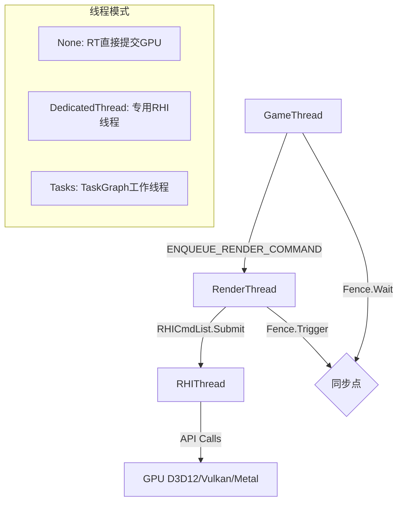
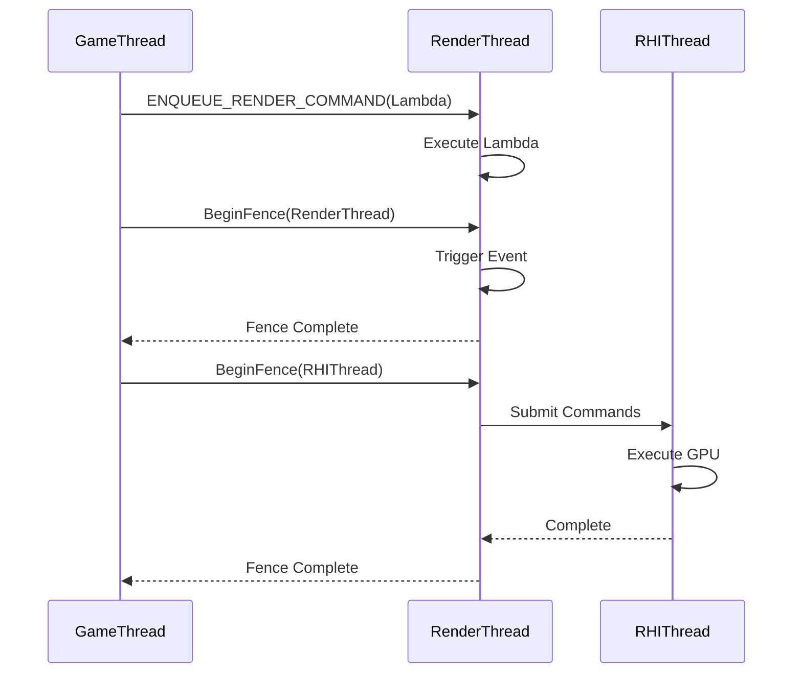

# GameThread → RenderThread → RHIThread 线程调用链详解

## 摘要

UE5.7.4 采用三线程渲染架构：GameThread 负责逻辑、RenderThread 负责渲染命令编码、RHIThread 负责 GPU API 调用提交。三者通过 Task Graph 系统协调，命令通过管道（Pipe）和 Fence 实现同步。

---

## 适合解决的问题

- 三线程架构各线程职责是什么？
- ENQUEUE_RENDER_COMMAND 的实现原理？
- RenderThread 和 RHIThread 是同一个线程吗？
- FRenderCommandFence 的同步机制？
- 如何避免 GT/RT 同步导致的性能瓶颈？

---

## 核心结论

1. **三线程架构**: GameThread → RenderThread → RHIThread（可选独立线程）
2. **Task Graph 驱动**: 所有线程通过 TaskGraph 协调调度
3. **命令管道**: `FRenderCommandPipe` 支持链表式命令队列和批量提交
4. **RHI 线程模式**: 支持三种 — `None`（RT 直接提交）、`DedicatedThread`（专用线程）、`Tasks`（Task 工作线程）
5. **Fence 同步**: `FRenderCommandFence` 基于 UE Task 系统实现，支持 RT/RHI/Swapchain 三种同步深度

---

## 源码位置

| 组件 | 路径 |
|------|------|
| 渲染线程核心 | `Engine/Source/Runtime/RenderCore/Private/RenderingThread.cpp` |
| ENQUEUE_RENDER_COMMAND | `Engine/Source/Runtime/RenderCore/Public/RenderingThread.h:1167` |
| RHI 命令列表 | `Engine/Source/Runtime/RHI/Public/RHICommandList.h` |
| Fence 定义 | `Engine/Source/Runtime/RenderCore/Public/RenderCommandFence.h` |
| 命令管道 | `Engine/Source/Runtime/RenderCore/Public/RenderingThread.h:489-529` |

---

## 关键类与函数

### FRenderingThread
- **路径**: `RenderingThread.cpp:562`
- **启动**: `StartRenderingThread()` 创建渲染线程
- **主循环**: 通过 `FTaskGraphInterface::ProcessThreadUntilRequestReturn()` 驱动

### FRHIThread
- **路径**: `RenderingThread.cpp:160-223`
- **RHI 线程模式**:
  ```cpp
  enum class ERHIThreadMode {
      None,            // 无独立 RHI 线程（RT 直接提交）
      DedicatedThread, // 专用 RHI 线程
      Tasks            // Task Graph 工作线程
  };
  ```

### FRenderCommandFence
- **路径**: `RenderCommandFence.h:14-53`
- **同步深度**:
  - `ESyncDepth::RenderThread` — 在 RT 完成
  - `ESyncDepth::RHIThread` — 在 RHI 完成
  - `ESyncDepth::Swapchain` — 在 Swapchain Present 后
- **实现**: 基于 `UE::Tasks::FTask` 的异步同步原语

### 命令管道 (FRenderCommandPipeBase)
- **路径**: `RenderingThread.h:489-529`
- **数据结构**:
  - `FMemStackBase Allocator` — 栈式内存分配器
  - `FCommandList CommandList` — 链表式命令队列（Head/Tail 指针）
  - 支持 `ExecuteFunction` 和 `ExecuteCommandList` 两种命令类型

---

## 调用链

### 线程启动流程

```
FEngineLoop::Init()
  │
  └─ StartRenderingThread()                      // RenderingThread.cpp:562
      ├─ 检查 GRHISupportsRHIThread → 决定 RHI 线程模式
      ├─ [DedicatedThread] 创建 FRHIThread
      │   └─ Thread = FRunnableThread::Create(this, "RHIThread", 512K, ...)
      │       └─ Run() → TaskGraph.AttachToThread(RHIThread) → ProcessThreadUntilReturn
      │
      ├─ 创建 FRenderingThread
      │   └─ Thread = FRunnableThread::Create(this, "RenderThread", ...)
      │       └─ RenderingThreadMain()
      │           ├─ TaskGraph.AttachToThread(ActualRenderingThread)
      │           └─ ProcessThreadUntilReturn(RenderThread)
      │
      └─ 等待 RenderThread 绑定 TaskGraph
```

### ENQUEUE_RENDER_COMMAND 执行路径

```
// 宏展开:
ENQUEUE_RENDER_COMMAND(MyCommand)(Lambda)
  │
  ├─ FRenderCommandDispatcher::Enqueue<Tag>(Lambda)
  │   │
  │   ├─ [在非渲染线程 + 渲染线程运行中]
  │   │   ├─ [Pipe模式] Instance.EnqueueAndLaunch(Lambda, Tag)
  │   │   │   └─ 添加到命令管道链表
  │   │   └─ [非Pipe模式] TGraphTask<TRenderCommandTask>::CreateTask()
  │   │       └─ 构建 TaskGraph 任务分发
  │   │
  │   └─ [在渲染线程中]
  │       └─ Lambda(GetImmediateCommandList())  // 直接执行
```

### 帧渲染三线程协调

```
GameThread                        RenderThread                     RHIThread
    │                                 │                               │
    ├─ Tick()                         │                               │
    ├─ UpdateWorld()                  │                               │
    ├─ FRendererModule::RenderThread  │                               │
    │  EnqueueRenderTask() ──────────►│                               │
    │                                 ├─ UpdateLumenScene()           │
    │                                 ├─ RenderBasePass()             │
    │                                 ├─ RenderLights()               │
    │                                 │                               │
    │                                 ├─ RHICmdList.Submit() ────────►│
    │                                 │                               ├─ D3D12/Vulkan
    │                                 │                               │   API 调用
    ├─ FRenderCommandFence::Wait() ◄─┤                               ├─ GPU Submit
    │                                 │                               │
```

---

## Mermaid 图

### 三线程架构



### Fence 同步流程



---

## 常见误区

1. **RHIThread 不一定存在**: 当 `ERHIThreadMode::None` 时，RHI 命令在 RT 上直接执行
2. **ENQUEUE_RENDER_COMMAND 不是异步**: 如果已在渲染线程，命令直接同步执行
3. **FlushRenderingCommands 是性能杀手**: 会阻塞 GT 等待 RT 完成，只应在必要时使用

---

## 调试建议

- `r.RHIThread.Enable 0/1/2` — 控制 RHI 线程模式（0=off, 1=dedicated, 2=tasks）
- `stat RenderingThread` — 查看渲染线程统计
- `r.GTSyncType` — GT 同步策略
- `r.RenderThreadHeapSize` — 渲染线程堆大小
- Unreal Insights → Threads 视图查看三线程时间线

---

## 扩展点

1. **自定义渲染命令**: 通过 ENQUEUE_RENDER_COMMAND 在 RT 执行任意代码
2. **SceneViewExtension**: 通过 ViewExtension 在渲染管线中注入自定义 Pass
3. **Fence 同步**: 使用 FRenderCommandFence 精确控制 GT/RT 同步点

---

## 源码证据

- `Engine/Source/Runtime/RenderCore/Private/RenderingThread.cpp:562` — `StartRenderingThread()`
- `Engine/Source/Runtime/RenderCore/Private/RenderingThread.cpp:226` — `RenderingThreadMain()`
- `Engine/Source/Runtime/RenderCore/Private/RenderingThread.cpp:160-223` — FRHIThread 类
- `Engine/Source/Runtime/RenderCore/Public/RenderingThread.h:1167` — ENQUEUE_RENDER_COMMAND 宏
- `Engine/Source/Runtime/RenderCore/Public/RenderingThread.h:593-617` — FRenderCommandPipe::Enqueue
- `Engine/Source/Runtime/RenderCore/Public/RenderCommandFence.h:14-53` — FRenderCommandFence 定义
- `Engine/Source/Runtime/RenderCore/Private/RenderingThread.cpp:978-1052` — BeginFence 实现
- `Engine/Source/Runtime/RHI/Public/RHICommandList.h:159-178` — RHI 线程状态查询

---

## 相关文档

- [场景代理系统](SceneProxy.md)
- [完整渲染管线](Full_Render_Pipeline.md)
- [RDG 渲染图](RDG.md)
- [RHI 硬件抽象](RHI.md)
