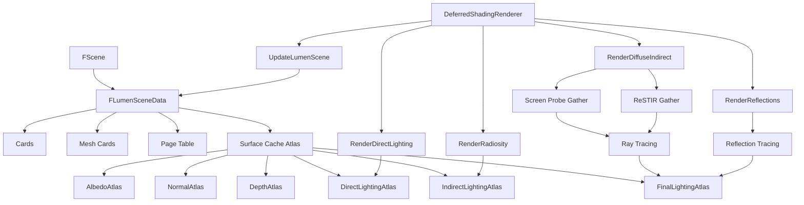
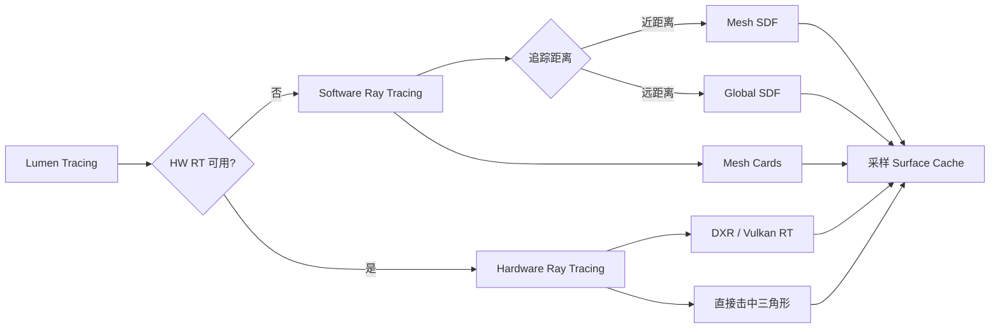

# Lumen 全局光照系统详解

## 摘要

Lumen 是 UE5.7.4 的核心全局光照（GI）和反射系统，通过 Surface Cache + Screen Probe Gather + Radiance Cache 的三级架构实现实时间接光照。支持 Software Ray Tracing（基于 SDF/Mesh Cards）和 Hardware Ray Tracing（基于 DXR/Vulkan RT）两种追踪模式。

---

## 适合解决的问题

- Lumen GI 如何工作？间接光照是怎么算出来的？
- Lumen Surface Cache 是什么？如何缓存表面光照？
- Screen Probe Gather 的流程是什么？
- Lumen 反射如何实现？
- Software vs Hardware Ray Tracing 如何选择？
- 如何调试 Lumen 性能问题？
- Lumen 与 Nanite 如何集成？

---

## 核心结论

1. Lumen 通过 **Surface Cache** 预计算场景表面辐射率，存储在 Atlas 纹理中
2. **Screen Probe Gather** 从屏幕空间发射探针，采样 Surface Cache 获取间接光照
3. **Radiance Cache** 在屏幕外区域缓存辐射率，减少采样频率
4. Lumen 支持 **Software RT**（基于 Global SDF + Mesh SDF + Mesh Cards）和 **Hardware RT**（基于 GPU RT 核心）
5. Lumen Scene 是一个独立的场景表示，通过 **FLumenSceneData** 管理 Cards、Primitive Groups、Mesh Cards 等数据

---

## 源码位置

| 组件 | 路径 |
|------|------|
| Lumen 核心 | `Engine/Source/Runtime/Renderer/Private/Lumen/Lumen.h` |
| Lumen Scene 数据 | `Engine/Source/Runtime/Renderer/Private/Lumen/LumenSceneData.h` |
| Lumen Scene 渲染 | `Engine/Source/Runtime/Renderer/Private/Lumen/LumenSceneRendering.cpp` |
| Surface Cache | `Engine/Source/Runtime/Renderer/Private/Lumen/LumenSurfaceCache.cpp` |
| Screen Probe Gather | `Engine/Source/Runtime/Renderer/Private/Lumen/LumenScreenProbeGather.cpp` |
| Screen Probe 追踪 | `Engine/Source/Runtime/Renderer/Private/Lumen/LumenScreenProbeTracing.cpp` |
| Radiance Cache | `Engine/Source/Runtime/Renderer/Private/Lumen/LumenRadianceCache.h` |
| Lumen 反射 | `Engine/Source/Runtime/Renderer/Private/Lumen/LumenReflections.h` |
| Lumen Radiosity | `Engine/Source/Runtime/Renderer/Private/Lumen/LumenRadiosity.cpp` |
| Lumen 直接光照 | `Engine/Source/Runtime/Renderer/Private/Lumen/LumenSceneDirectLighting.cpp` |
| Mesh Cards | `Engine/Source/Runtime/Renderer/Private/Lumen/LumenMeshCards.cpp` |
| Diffuse Indirect | `Engine/Source/Runtime/Renderer/Private/Lumen/LumenDiffuseIndirect.cpp` |
| Hardware RT 公共 | `Engine/Source/Runtime/Renderer/Private/Lumen/LumenHardwareRayTracingCommon.h` |
| ReSTIR Gather | `Engine/Source/Runtime/Renderer/Private/Lumen/LumenReSTIRGather.cpp` |
| GPU Driven Update | `Engine/Source/Runtime/Renderer/Private/Lumen/LumenSceneGPUDrivenUpdate.cpp` |

---

## 关键类

### FLumenSceneData
- **路径**: `LumenSceneData.h:1008`
- **职责**: 管理 Lumen 场景的全部数据，包括 Cards、Mesh Cards、Page Table、Atlas 纹理
- **核心成员**:
  - `TSparseSpanArray<FLumenCard> Cards` — 所有 Lumen Card
  - `TChunkedSparseArray<FLumenPrimitiveGroup> PrimitiveGroups` — 原始体分组
  - `TSparseSpanArray<FLumenMeshCards> MeshCards` — 网格 Cards（表面方向采样点）
  - `TSparseSpanArray<FLumenPageTableEntry> PageTable` — Surface Cache 页表
  - `TRefCountPtr<IPooledRenderTarget> AlbedoAtlas` — 反照率图集
  - `TRefCountPtr<IPooledRenderTarget> NormalAtlas` — 法线图集
  - `TRefCountPtr<IPooledRenderTarget> DepthAtlas` — 深度图集
  - `TRefCountPtr<IPooledRenderTarget> FinalLightingAtlas` — 最终光照图集
  - `TRefCountPtr<IPooledRenderTarget> DirectLightingAtlas` — 直接光照图集
  - `TRefCountPtr<IPooledRenderTarget> IndirectLightingAtlas` — 间接光照图集
  - `FLumenSurfaceCacheFeedback SurfaceCacheFeedback` — Surface Cache 反馈
  - `float SurfaceCacheResolution` — Atlas 分辨率缩放因子

### Lumen 命名空间常量 (`Lumen.h:37-49`)
```cpp
namespace Lumen
{
    constexpr uint32 PhysicalPageSize = 128;
    constexpr uint32 VirtualPageSize = PhysicalPageSize - 1; // 0.5 texel border
    constexpr uint32 MinCardResolution = 8;
    constexpr uint32 MaxResLevel = 11; // 2^11 = 2048 texels
    constexpr uint32 CardTileSize = 8;
    constexpr uint32 NumDistanceBuckets = 16;
    constexpr float MaxTraceDistance = 0.5f * UE_OLD_WORLD_MAX;
}
```

### 关键查询函数
- `ShouldRenderLumenDiffuseGI()` — 是否渲染 Lumen 漫反射 GI
- `ShouldRenderLumenReflections()` — 是否渲染 Lumen 反射
- `Lumen::UseHardwareRayTracing()` — 是否使用硬件光线追踪
- `Lumen::UseMeshSDFTracing()` — 是否使用 Mesh SDF 追踪
- `Lumen::UseGlobalSDFTracing()` — 是否使用 Global SDF 追踪

---

## 关键函数

### 入口函数

| 函数 | 文件 | 作用 |
|------|------|------|
| `FDeferredShadingSceneRenderer::UpdateLumenScene()` | `LumenSceneRendering.cpp:2490` | 每帧更新 Lumen Scene |
| `FDeferredShadingSceneRenderer::RenderDirectLightingForLumenScene()` | `LumenSceneDirectLighting.cpp:2239` | 渲染 Lumen Scene 直接光照 |
| `FDeferredShadingSceneRenderer::RenderRadiosityForLumenScene()` | `LumenRadiosity.cpp:1085` | 渲染 Lumen Radiosity |
| `FDeferredShadingSceneRenderer::RenderLumenReflections()` | `LumenReflections.cpp:1154` | 渲染 Lumen 反射 |
| `FDeferredShadingSceneRenderer::RenderLumenReSTIRGather()` | `LumenReSTIRGather.cpp:929` | ReSTIR 采样 |
| `FDeferredShadingSceneRenderer::RenderLumenIrradianceFieldGather()` | `LumenIrradianceFieldGather.cpp:246` | 辐照度场采集 |
| `FDeferredShadingSceneRenderer::DispatchAsyncLumenIndirectLightingWork()` | `IndirectLightRendering.cpp:889` | 异步 Lumen 间接光照 |
| `FDeferredShadingSceneRenderer::BeginGatherLumenLights()` | `LumenSceneDirectLighting.cpp:1908` | 开始采集 Lumen 光照 |

### Hardware RT 函数
- `SetupLumenHardwareRayTracingUniformBuffer()` — 设置 HW RT Uniform Buffer
- `CreateLumenHardwareRayTracingMaterialPipeline()` — 创建 HW RT 材质管线
- `RenderLumenHardwareRayTracingReflections()` — HW RT 反射
- `RenderLumenHardwareRayTracingRadianceCache()` — HW RT 辐射率缓存

---

## 调用链

### Lumen 完整渲染流程

```
FDeferredShadingSceneRenderer::Render()
  │
  ├─ UpdateLumenScene()                    // LumenSceneRendering.cpp:2490
  │   ├─ 更新 Mesh Cards
  │   ├─ 更新 Surface Cache Atlas
  │   ├─ 更新 Card 缓冲区
  │   └─ 更新 Page Table
  │
  ├─ RenderDirectLightingForLumenScene()   // LumenSceneDirectLighting.cpp:2239
  │   ├─ BeginGatherLumenLights()
  │   ├─ 对每张 Card 计算直接光照
  │   └─ 写入 DirectLightingAtlas
  │
  ├─ RenderRadiosityForLumenScene()        // LumenRadiosity.cpp:1085
  │   ├─ 追踪 Card 间的光反弹
  │   └─ 更新 IndirectLightingAtlas
  │
  ├─ RenderDiffuseIndirectAndAmbientOcclusion()  // 间接光照入口
  │   ├─ RenderLumenScreenProbeGather()    // Screen Probe Gather
  │   │   ├─ 发射屏幕空间探针
  │   │   ├─ LumenScreenProbeTracing — 追踪射线
  │   │   │   ├─ Software: GlobalSDF → MeshSDF → Cards
  │   │   │   └─ Hardware: DXR Ray Tracing
  │   │   ├─ LumenScreenProbeFiltering — 过滤探针结果
  │   │   └─ 合成到间接光照缓冲区
  │   │
  │   └─ 或 RenderLumenReSTIRGather()      // ReSTIR 路径 (高端GPU)
  │
  ├─ RenderLumenReflections()              // LumenReflections.cpp:1154
  │   ├─ LumenReflectionTracing — 追踪反射射线
  │   ├─ 采样 Surface Cache / Radiance Cache
  │   └─ 过滤并合成反射
  │
  └─ RenderLumenFrontLayerTranslucencyReflections()  // 前层半透明反射
```

### Surface Cache 更新流程

```
UpdateLumenScene()
  │
  ├─ 处理 PendingAddOperations / PendingUpdateOperations
  ├─ 创建/更新 FLumenMeshCards
  │   └─ LumenMeshCards.cpp — 为每个 Primitive Group 生成 Cards
  │
  ├─ GPU Driven Update (LumenSceneGPUDrivenUpdate.cpp)
  │   └─ 基于 GPU 反馈动态调整 Card 分辨率
  │
  ├─ Surface Cache Capture (LumenSceneCardCapture.cpp)
  │   ├─ 渲染 Card 对应的几何到 Atlas
  │   ├─ 写入 AlbedoAtlas / NormalAtlas / DepthAtlas / EmissiveAtlas
  │   └─ Surface Cache Feedback 收集访问频率
  │
  └─ 更新 FinalLightingAtlas
      ├─ DirectLightingAtlas
      ├─ IndirectLightingAtlas (Radiosity)
      └─ 合并写入 FinalLightingAtlas
```

---

## 生命周期

### Lumen Scene 生命周期
1. **创建**: 当 `FScene` 创建时，`FLumenSceneData` 作为 `FScene` 成员被初始化
2. **每帧更新**: `UpdateLumenScene()` 处理增删改的 Primitive
3. **Card 管理**: Card 根据 Primitive 的添加/移除动态创建/销毁
4. **Surface Cache**: Atlas 纹理按需分配，通过 Feedback 机制动态调整

### Card 生命周期
1. **创建**: Primitive 添加到场景时，生成 Mesh Cards → Lumen Cards
2. **更新**: 每帧检查 Card 是否需要重新 Capture（Transform 变化、材质变化）
3. **销毁**: Primitive 从场景移除时，释放对应 Card 和 Page Table 条目

---

## Mermaid 图

### Lumen 整体架构



### Lumen 追踪模式选择



---

## 常见误区

1. **Lumen 不是纯光线追踪**：Lumen 默认使用 Software RT（SDF + Cards），只在高端 GPU 上自动启用 Hardware RT
2. **Surface Cache 不等于光照贴图**：Surface Cache 是实时更新的，每帧都会重新 Capture 和计算光照
3. **Lumen 反射和 SSR 是独立的**：Lumen 反射通过 Surface Cache 实现，SSR 通过屏幕空间采样实现
4. **关闭 Lumen GI 不影响 Lumen 反射**：两者可以独立开关

---

## 调试建议

### 控制台命令
- `r.Lumen.DiffuseIndirect.Allow 0` — 关闭 Lumen GI
- `r.Lumen.Reflections.Allow 0` — 关闭 Lumen 反射
- `r.Lumen.ScreenProbeGather.TracingOctahedronResolution` — 调整探针分辨率
- `r.Lumen.ScreenProbeGather.FixedJitterWidth` — 控制探针抖动
- `r.Lumen.RadianceCache.ProbeResolution` — 辐射率缓存探针分辨率
- `r.Lumen.SurfaceCacheResolution` — Surface Cache 分辨率缩放
- `r.Lumen.DiffuseIndirect.TraceStepFactor` — 追踪步长因子

### 视图模式
- `ShowFlag.LumenGlobalIllumination 1/0` — 开关 Lumen GI 可视化
- `ShowFlag.LumenReflections 1/0` — 开关 Lumen 反射可视化
- `r.Lumen.Visualize.*` — Lumen 各子系统的可视化

### Stats
- `stat Lumen` — Lumen 详细性能统计
- Unreal Insights 中搜索 `Lumen` 关键字可看到每个 Pass 的 GPU 时间

---

## 扩展点

1. **自定义 Card 生成**: 通过 `FLumenMeshCards` 的扩展控制 Card 布局
2. **自定义追踪策略**: 修改 `LumenScreenProbeTracing.cpp` 中的追踪逻辑
3. **Hardware RT 材质集成**: 通过 `SetupLumenHardwareRayTracingHitGroupBuffer()` 自定义 RT 材质
4. **Surface Cache 反馈**: 通过 `FLumenSurfaceCacheFeedback` 控制 Card 更新频率
5. **Radiance Cache 插值**: 通过 `LumenRadianceCacheInterpolation.h` 自定义插值策略

---

## 源码证据

- `Engine/Source/Runtime/Renderer/Private/Lumen/Lumen.h` — Lumen 命名空间、常量定义、功能查询函数
- `Engine/Source/Runtime/Renderer/Private/Lumen/LumenSceneData.h:1008` — FLumenSceneData 类定义，Cards/Atlas/PageTable 成员
- `Engine/Source/Runtime/Renderer/Private/Lumen/LumenSceneRendering.cpp:2490` — `UpdateLumenScene()` 入口
- `Engine/Source/Runtime/Renderer/Private/Lumen/LumenSceneDirectLighting.cpp:2239` — `RenderDirectLightingForLumenScene()` 入口
- `Engine/Source/Runtime/Renderer/Private/Lumen/LumenRadiosity.cpp:1085` — `RenderRadiosityForLumenScene()` 入口
- `Engine/Source/Runtime/Renderer/Private/Lumen/LumenReflections.cpp:1154` — `RenderLumenReflections()` 入口
- `Engine/Source/Runtime/Renderer/Private/Lumen/LumenReSTIRGather.cpp:929` — `RenderLumenReSTIRGather()` 入口
- `Engine/Source/Runtime/Renderer/Private/Lumen/LumenDiffuseIndirect.cpp` — GI CVar 定义（`r.Lumen.DiffuseIndirect.*`）
- `Engine/Source/Runtime/Renderer/Private/Lumen/LumenScreenProbeGather.cpp` — Screen Probe Gather 实现
- `Engine/Source/Runtime/Renderer/Private/Lumen/LumenSurfaceCache.cpp` — Surface Cache 更新逻辑
- `Engine/Source/Runtime/Renderer/Private/Lumen/LumenMeshCards.cpp` — Mesh Cards 生成和管理
- `Engine/Source/Runtime/Renderer/Private/DeferredShadingRenderer.cpp:2794` — `UpdateLumenScene()` 调用点
- `Engine/Source/Runtime/Renderer/Private/IndirectLightRendering.cpp:889` — 异步 Lumen 间接光照调度

---

## 相关文档

- [完整渲染管线](Full_Render_Pipeline.md)
- [Nanite 虚拟几何](Nanite.md)
- [虚拟阴影映射](Virtual_Shadow_Map.md)
- [RDG 渲染图](RDG.md)
- [材质系统](Material_System.md)
- [Shader 编译](Shader_Compile.md)
