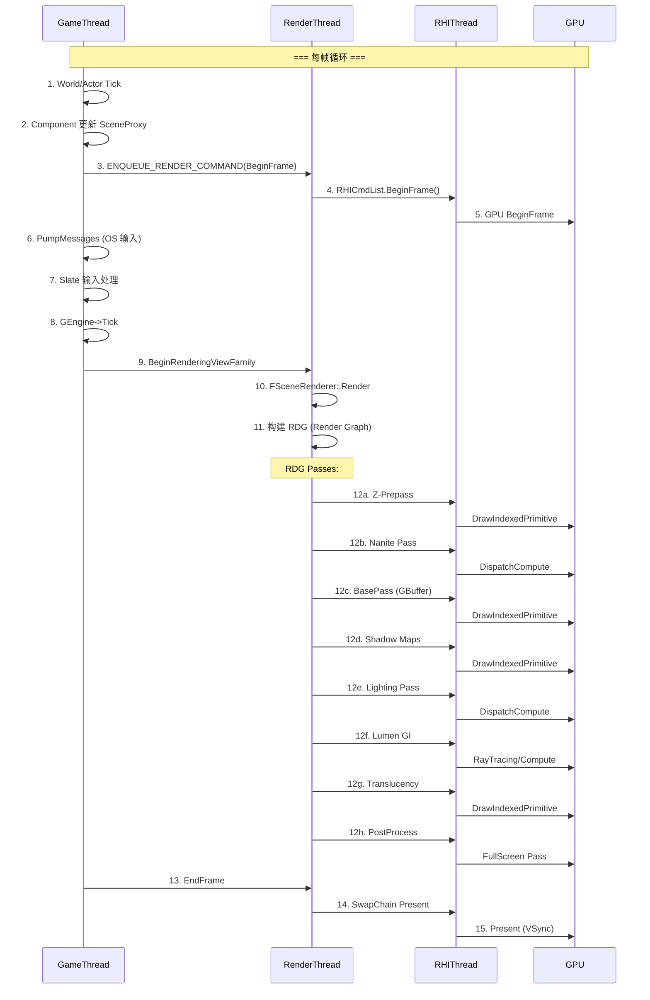
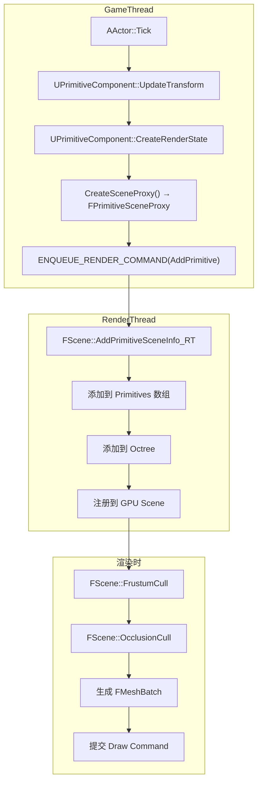
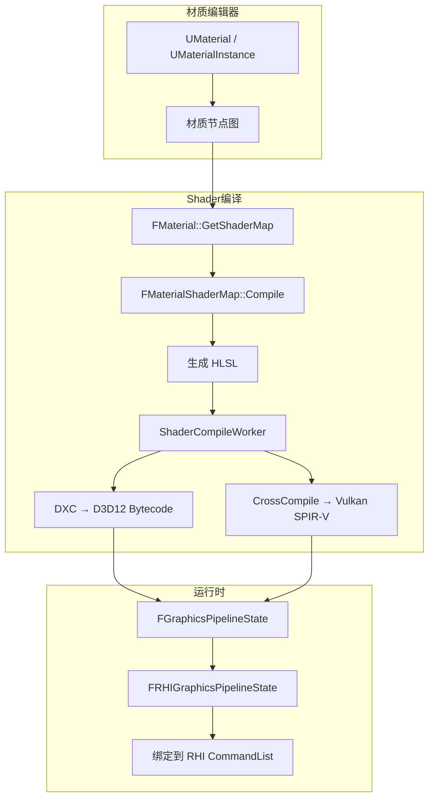
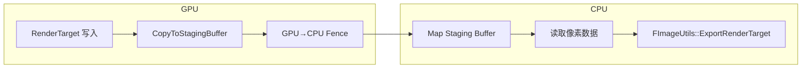
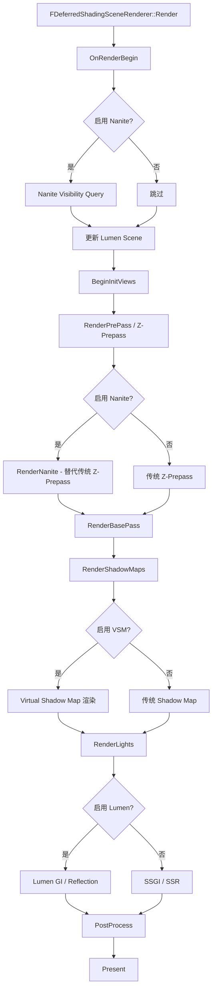
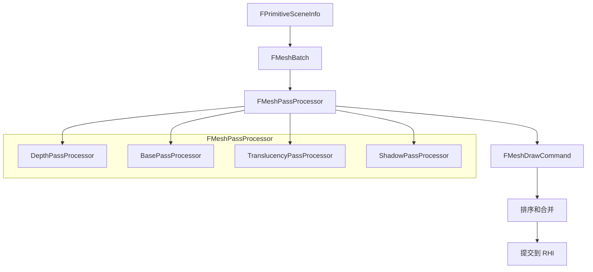
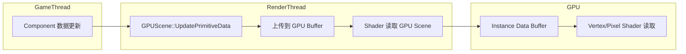

# UE5.7.4 完整渲染流程 Mermaid 图集

## 摘要

本文档包含 UE5.7.4 渲染管线的所有 Mermaid 可视化图表。

---

## 1. GameThread → RenderThread → RHIThread → GPU

---

## 2. Actor / Component → SceneProxy → FScene

---

## 3. Renderer → RDG → RHI

```mermaid
flowchart LR
    subgraph FSceneRenderer
        A[构建 ViewFamily]
        B[InitViews - 可见性]
    end

    subgraph RDG
        C[CreateTexture - SceneColor]
        D[CreateTexture - Depth]
        E[AddPass - ZPrepass]
        F[AddPass - BasePass]
        G[AddPass - Lighting]
        H[AddPass - PostProcess]
    end

    subgraph RHI
        I[SetGraphicsPipelineState]
        J[SetVertexBuffer]
        K[SetShaderParameters]
        L[DrawIndexedPrimitive]
    end

    subgraph GPU
        M[Vertex Shader]
        N[Pixel Shader]
        O[Compute Shader]
        P[RenderTarget Write]
    end

    A --> B --> C
    C --> D --> E --> F --> G --> H
    H --> I --> J --> K --> L
    L --> M --> N --> P
    L --> O --> P
```

---

## 4. Material → ShaderMap → PipelineState

---

## 5. RenderTarget → Readback → CPU

---

## 6. Nanite / Lumen / VSM 在渲染流程中的位置

---

## 7. Mesh Draw Command 生成流程

---

## 8. GPU Scene 数据流

---

## 相关文档

- [Full_Render_Pipeline.md](Full_Render_Pipeline.md) — 完整渲染管线详解
- [RDG.md](RDG.md) — RDG 详解
- [RHI.md](RHI.md) — RHI 详解
- [Nanite.md](Nanite.md) — Nanite 详解
- [Lumen.md](Lumen.md) — Lumen 详解

源码证据：
- Engine/Source/Runtime/Renderer/Private/DeferredShadingRenderer.cpp
- Engine/Source/Runtime/Renderer/Private/SceneRendering.cpp
- Engine/Source/Runtime/RenderCore/Public/RenderGraph.h
