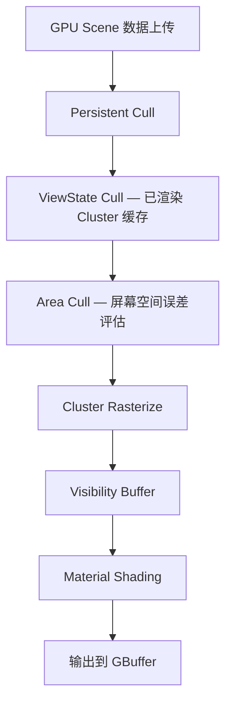

# Nanite 虚拟几何详解

## 摘要

Nanite 是 UE5.7.4 的虚拟几何系统，通过 GPU 驱动的 Cluster 层级持续剔除，实现数十亿三角形实时渲染。

---

## 1. 核心数据结构

Nanite 将网格组织为 Cluster 层级结构：

```
Nanite Mesh
  → Streaming Section (LOD 区域)
    → Cluster Group (128 个 Cluster)
      → Cluster (128 个三角形，64 个顶点)
        → Triangle / Vertex
```

每个 Cluster 包含：
- 128 个三角形索引
- 64 个顶点（位置、法线、UV 等）
- Bounding Box / Bounding Sphere
- LOD 误差度量
- Material 信息

## 2. GPU 驱动管线



## 3. 持续剔除 (Persistent Cull)

Nanite 的核心优化：已渲染的 Cluster 在下一帧不需要重新剔除，只需检查新可见或不再可见的 Cluster。

- FViewCullResults — 视图剔除结果缓存
- FPersistentCullData — 持续剔除数据
- 每帧只处理"变化"的部分

## 4. 关键源码文件

| 文件 | 职责 |
|------|------|
| Nanite.h/Nanite.cpp | 主入口、全局资源 |
| NaniteCullRaster.h/.cpp | GPU 剔除和光栅化 |
| NaniteShading.h/.cpp | 材质着色 |
| NaniteMaterials.h/.cpp | 材质处理 |
| NaniteVisibility.h/.cpp | 可见性管理 |
| NaniteStreamOut.h/.cpp | GPU→CPU 回读 |
| NaniteData.h/.cpp | 数据结构定义 |
| NaniteDrawList.h/.cpp | 绘制列表 |
| NaniteFeedback.h/.cpp | LOD 反馈 |

**路径：** Engine/Source/Runtime/Renderer/Private/Nanite/

## 5. 渲染集成点

在 FDeferredShadingSceneRenderer::Render() 中：

1. **line 1880** — Nanite Visibility Query 初始化
```cpp
NaniteVisibility.BeginVisibilityFrame();
NaniteBasePassVisibility.Query = NaniteVisibility.BeginVisibilityQuery(...);
```

2. **line 1364** — RenderNanite() 执行渲染
```cpp
void FDeferredShadingSceneRenderer::RenderNanite(FRDGBuilder& GraphBuilder, ...)
```

3. **替代传统 Z-Prepass** — Nanite 渲染的深度直接用于后续 Pass

## 6. Nanite + Virtual Shadow Map

Nanite 直接写入 VSM 深度，无需传统光栅化：
- Nanite Visibility Query 用于 VSM
- 每个 VSM Page 单独剔除和渲染
- 高效处理高多边形阴影

## 7. 数据构建 (NaniteBuilder)

**路径：** Engine/Source/Developer/NaniteBuilder/

构建流程：
```
Raw Mesh → Cluster 分组 → 层级构建 → LOD 生成 → 序列化
```

## 8. Shader 文件

**路径：** Engine/Shaders/Private/Nanite/

| Shader | 描述 |
|--------|------|
| NaniteVisualize.usf | 可视化 |
| NaniteMaterials.usf | 材质处理 |
| NaniteDataDecode.ush | 数据解码 |

## 9. 限制

- 不支持半透明材质
- Masked 材质有限制（TwoSided 不支持）
- 不支持 World Position Offset
- 不支持某些特殊