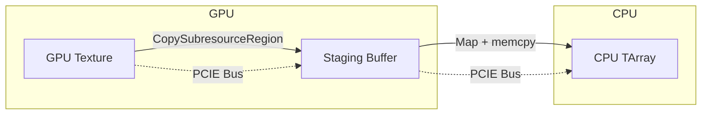
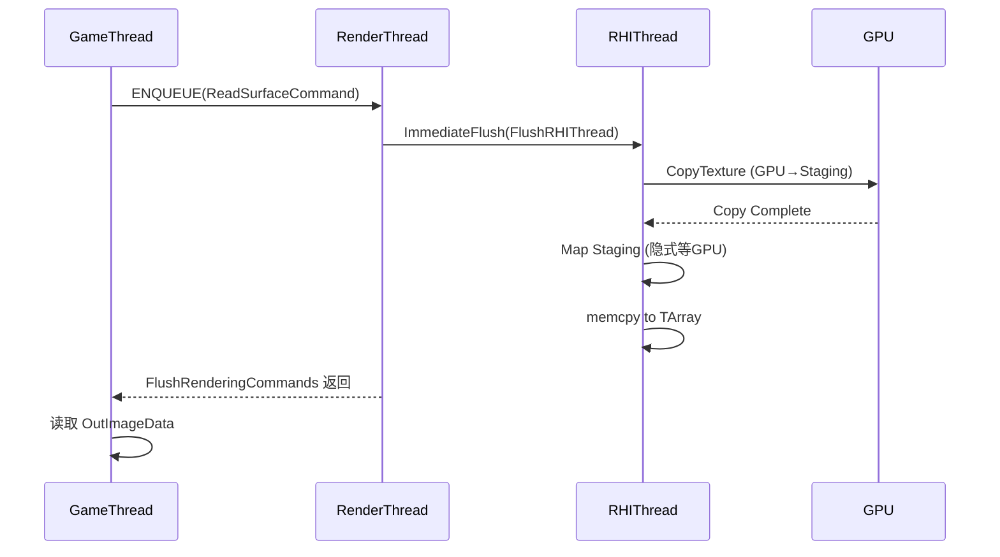

# RenderTarget Readback / GPU 回读详解

## 摘要

GPU 回读是指将 GPU 显存中的纹理数据传输到 CPU 内存的过程。UE5.7.4 提供了 `FRenderTarget::ReadPixels` 等接口实现同步回读，内部通过 Staging Buffer 进行 GPU→CPU Copy。回读操作会强制同步所有渲染线程，是已知的性能瓶颈。

---

## 适合解决的问题

- 如何从 RenderTarget 读取像素数据到 CPU？
- GPU 回读的性能影响有多大？
- ReadPixels 的完整调用链是什么？
- Staging Buffer 如何工作？
- 有没有异步回读方案？

---

## 核心结论

1. **同步阻塞**: `ReadPixels` 调用 `FlushRenderingCommands()` 会阻塞所有线程
2. **Staging Buffer**: 通过 GPU Copy 到 Staging 纹理 → CPU Map 读取
3. **每次创建临时资源**: D3D11 路径每次 ReadPixels 创建临时 Staging 纹理
4. **性能杀手**: 每帧调用 ReadPixels 会导致帧率显著下降
5. **异步接口存在但未默认使用**: `RHIMapStagingSurface` + `FRHIGPUFence` 可实现异步

---

## 源码位置

| 组件 | 路径 |
|------|------|
| ReadPixels 入口 | `Engine/Source/Runtime/Engine/Private/UnrealClient.cpp:54` |
| RHI ReadSurfaceData | `Engine/Source/Runtime/RHI/Public/RHICommandList.h:4850` |
| DynamicRHI 接口 | `Engine/Source/Runtime/RHI/Public/DynamicRHI.h:612` |
| D3D11 实现 | `Engine/Source/Runtime/Windows/D3D11RHI/Private/D3D11RenderTarget.cpp` |
| GPU Fence | `Engine/Source/Runtime/RHI/Public/RHIResources.h:2386` |
| Staging Surface | `Engine/Source/Runtime/RHI/Public/DynamicRHI.h:628` |

---

## 关键函数

### FRenderTarget::ReadPixels
- **路径**: `UnrealClient.cpp:54-72`
- **流程**:
  1. 准备矩形区域
  2. ENQUEUE_RENDER_COMMAND 在 RT 执行 ReadSurfaceData
  3. FlushRenderingCommands() 阻塞等待
  4. 返回数据

### RHICmdList::ReadSurfaceData
- **路径**: `RHICommandList.h:4850-4856`
- **关键操作**:
  ```cpp
  ImmediateFlush(EImmediateFlushType::FlushRHIThread);  // 刷新 RHI 线程
  GDynamicRHI->RHIReadSurfaceData(Texture, Rect, OutData, InFlags);
  ```

### 变体函数
- `ReadFloat16Pixels()` — 读取 FP16 数据 (`UnrealClient.cpp:88`)
- `ReadLinearColorPixels()` — 读取线性颜色 (`UnrealClient.cpp:122`)

---

## 调用链

### ReadPixels 完整流程

```
FRenderTarget::ReadPixels()                     // UnrealClient.cpp:54
  │
  ├─ ENQUEUE_RENDER_COMMAND(ReadSurfaceCommand)
  │   └─ [RenderThread]
  │       └─ RHICmdList.ReadSurfaceData()        // RHICommandList.h:4850
  │           ├─ ImmediateFlush(FlushRHIThread)   // 等待 RHI 线程完成
  │           └─ GDynamicRHI->RHIReadSurfaceData()
  │               ├─ [D3D11] GetStagingTexture() // 创建 Staging 纹理
  │               │   ├─ 创建 D3D11_TEXTURE2D (STAGING, CPU_ACCESS_READ)
  │               │   └─ CopySubresourceRegion()  // GPU Copy
  │               ├─ Map(StagingTexture, READ)    // 等待 GPU 完成
  │               ├─ memcpy 行数据到 TArray<FColor>
  │               └─ Unmap(StagingTexture)
  │
  └─ FlushRenderingCommands()                    // 阻塞 GameThread
      └─ 等待上述所有命令完成
```

### D3D11 Staging Texture 创建

```
GetStagingTexture()                              // D3D11RenderTarget.cpp:296
  │
  ├─ 检查源纹理是否已是 Staging
  │   └─ [是] 直接返回（快速路径）
  │
  └─ [否] 创建临时 Staging 纹理
      ├─ Desc.Usage = D3D11_USAGE_STAGING
      ├─ Desc.CPUAccessFlags = D3D11_CPU_ACCESS_READ
      ├─ Desc.BindFlags = 0
      ├─ CreateTexture2D()
      └─ CopySubresourceRegion()  // GPU→Staging Copy
```

---

## Mermaid 图

### ReadPixels 数据流



### 同步时序



---

## 常见误区

1. **ReadPixels 不是每帧操作**: 它会阻塞整个渲染管线，只在截图/特殊需求时使用
2. **没有异步 ReadPixels**: UE 默认 API 是同步的，需要手动实现异步方案
3. **FP16 回读更慢**: `ReadFloat16Pixels` 传输量是 LDR 的两倍

---

## 调试建议

- 避免在 Tick 中调用 ReadPixels
- 使用 `TRACE_CPUPROFILE` 标记回读代码段
- 检查 `FlushRenderingCommands` 调用次数：每次 ReadPixels 都会调用
- 如必须回读，使用最小矩形区域
- 考虑使用 Compute Shader 替代 CPU 端处理

### 性能估算
- 1920×1080×4 字节 ≈ 8MB 通过 PCIE 传输
- 典型延迟: 1-5ms（含同步）
- 每帧调用将导致 10-30% 帧率下降

---

## 扩展点

1. **异步回读**: 使用 `FRHIGPUFence` + `RHIMapStagingSurface` 实现非阻塞回读
2. **双缓冲 Staging**: 预分配两个 Staging Buffer 交替使用，避免每帧创建
3. **Compute Shader 替代**: 将 CPU 处理逻辑移到 GPU，避免回读
4. **RDG 集成**: 在渲染图中添加自定义 Readback Pass

---

## 源码证据

- `Engine/Source/Runtime/Engine/Private/UnrealClient.cpp:54-72` — ReadPixels 入口
- `Engine/Source/Runtime/RHI/Public/RHICommandList.h:4850-4856` — ReadSurfaceData + ImmediateFlush
- `Engine/Source/Runtime/RHI/Public/DynamicRHI.h:612` — RHIReadSurfaceData 声明
- `Engine/Source/Runtime/Windows/D3D11RHI/Private/D3D11RenderTarget.cpp:296-369` — GetStagingTexture
- `Engine/Source/Runtime/Windows/D3D11RHI/Private/D3D11RenderTarget.cpp:412-463` — RHIReadSurfaceData 实现
- `Engine/Source/Runtime/RHI/Public/DynamicRHI.h:628` — RHIMapStagingSurface 异步接口
- `Engine/Source/Runtime/RHI/Public/RHIResources.h:2386` — FRHIGPUFence

---

## 相关文档

- [GT→RT 线程调用链](GameThread_To_RenderThread.md)
- [RHI 硬件抽象](RHI.md)
- [完整渲染管线](Full_Render_Pipeline.md)
