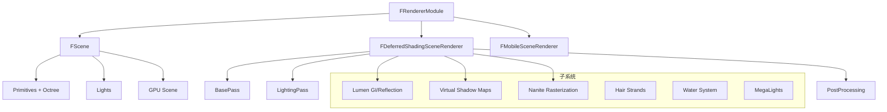

# Renderer 模块总览

## 摘要

Renderer 模块（`Engine/Source/Runtime/Renderer/`）是 UE5.7.4 渲染管线的核心实现，包含延迟/前向渲染器、光照系统、阴影系统、后处理、Nanite/Lumen/VSM 集成等。模块通过 FRendererModule 在引擎启动时初始化，通过 FSceneRenderer 每帧执行渲染。

---

## 适合解决的问题

- Renderer 模块的整体结构是什么？
- 渲染器如何初始化？
- 如何创建自定义渲染 Pass？
- Renderer 模块依赖哪些其他模块？

---

## 核心结论

1. **模块入口**: `FRendererModule` 实现 `IRendererModule` 接口，在引擎启动时注册
2. **场景分配**: `AllocateScene()` 创建 `FScene` 实例，管理所有渲染对象
3. **渲染选择**: 根据 ShaderPlatform 决定延迟/前向渲染路径
4. **文件规模**: `DeferredShadingRenderer.cpp` 约 257KB，是最大的单文件

---

## 源码位置

| 组件 | 路径 |
|------|------|
| 模块入口 | `Engine/Source/Runtime/Renderer/Private/Renderer.cpp` |
| 模块接口 | `Engine/Source/Runtime/Renderer/Private/RendererModule.h` |
| Build.cs | `Engine/Source/Runtime/Renderer/Renderer.Build.cs` |
| 延迟渲染器 | `Engine/Source/Runtime/Renderer/Private/DeferredShadingRenderer.cpp` |
| 场景管理 | `Engine/Source/Runtime/Renderer/Private/RendererScene.cpp` |
| 基础通道 | `Engine/Source/Runtime/Renderer/Private/BasePassRendering.cpp` |
| 光照渲染 | `Engine/Source/Runtime/Renderer/Private/LightRendering.cpp` |
| Lumen | `Engine/Source/Runtime/Renderer/Private/Lumen/` |
| VSM | `Engine/Source/Runtime/Renderer/Private/VirtualShadowMaps/` |
| Nanite | `Engine/Source/Runtime/Renderer/Private/Nanite/` |

---

## 关键类

### FRendererModule
- **路径**: `RendererModule.h:32`
- **职责**: 渲染模块入口，实现 IRendererModule 接口
- **核心方法**:
  - `StartupModule()` — 初始化虚拟纹理、光线追踪、Lumen 等
  - `ShutdownModule()` — 清理
  - `AllocateScene()` — 创建 FScene
  - `RemoveScene()` — 销毁 FScene
  - `UpdateStaticDrawLists()` — 更新静态绘制列表

### FScene
- **路径**: `Engine/Source/Runtime/Renderer/Private/FScene.h`
- **职责**: 渲染场景，管理所有 Primitive、Light、Texture
- **核心成员**:
  - GPUScene — GPU-Driven 渲染数据
  - PrimitiveOctree — 空间加速结构
  - Lights — 光源集合
  - Lumen Scene Data
  - Nanite 数据

---

## Build.cs 依赖

### 公共依赖
```csharp
PublicDependencyModuleNames = { "Core", "Engine" }
```

### 私有依赖
```csharp
PrivateDependencyModuleNames = {
    "CoreUObject", "ApplicationCore", "RenderCore",
    "ImageWriteQueue", "RHI", "MaterialShaderQualitySettings",
    "StateStream", "TraceLog"
}
```

### 编辑器依赖
```csharp
PrivateDependencyModuleNames += { "TargetPlatform", "GeometryCore", "NaniteUtilities" }
```

---

## 模块初始化流程

```
FRendererModule::StartupModule()
  │
  ├─ 虚拟纹理系统初始化
  ├─ 材质缓存标签提供者初始化
  ├─ 光线追踪几何管理器 (GRayTracingGeometryManager)
  ├─ Nanite 光线追踪管理器 (Nanite::GRayTracingManager)
  └─ 屏幕空间降噪器 (GScreenSpaceDenoiser)
```

---

## Mermaid 图

### Renderer 模块内部结构



---

## 扩展点

1. **IRendererModule 接口**: 通过模块接口扩展渲染器功能
2. **SceneViewExtension**: 在渲染管线中注入自定义 Pass
3. **自定义 SceneProxy**: 为自定义组件创建专属代理
4. **RDG Pass**: 通过 RDG 系统添加自定义渲染 Pass

---

## 源码证据

- `Engine/Source/Runtime/Renderer/Private/Renderer.cpp` — FRendererModule 实现
- `Engine/Source/Runtime/Renderer/Private/RendererModule.h:32` — FRendererModule 定义
- `Engine/Source/Runtime/Renderer/Renderer.Build.cs:17-52` — 模块依赖
- `Engine/Source/Runtime/Renderer/Private/DeferredShadingRenderer.cpp:1736` — 主渲染入口

---

## 相关文档

- [完整渲染管线](Full_Render_Pipeline.md)
- [延迟渲染流程](Deferred_Rendering.md)
- [Lumen 全局光照](Lumen.md)
- [场景代理系统](SceneProxy.md)
