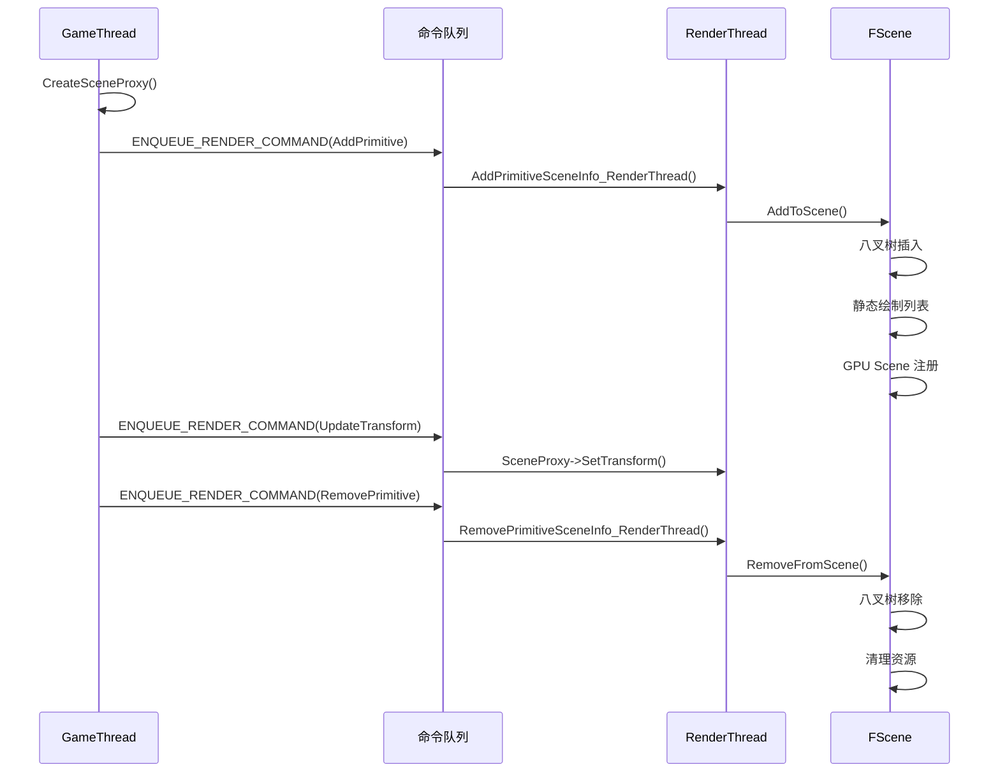

# SceneProxy 场景代理系统详解

## 摘要

SceneProxy 是 UE5.7.4 中 GameThread 与 RenderThread 之间的桥梁。每个 UPrimitiveComponent 在渲染线程拥有一个对应的 FPrimitiveSceneProxy，负责封装渲染所需的几何和材质数据。SceneProxy 的创建、更新、销毁全部通过 ENQUEUE_RENDER_COMMAND 跨线程完成。

---

## 适合解决的问题

- SceneProxy 是什么？为什么需要它？
- UPrimitiveComponent 如何创建 SceneProxy？
- FScene 如何管理 SceneProxy 的生命周期？
- ENQUEUE_RENDER_COMMAND 如何实现跨线程通信？
- SceneProxy 与 FPrimitiveSceneInfo 的关系？

---

## 核心结论

1. **线程隔离**: GameThread 操作 UObject，RenderThread 操作 SceneProxy，通过命令队列同步
2. **创建时机**: 组件注册时通过 `CreateSceneProxy()` 创建，ENQUEUE 到渲染线程
3. **FPrimitiveSceneInfo**: 每个代理拥有一个 SceneInfo，管理静态网格、GPU Scene 实例等
4. **核心接口**: `DrawStaticElements()` 和 `GetDynamicMeshElements()` 是两个主要的绘制接口

---

## 源码位置

| 组件 | 路径 |
|------|------|
| SceneProxy 基类 | `Engine/Source/Runtime/Engine/Public/PrimitiveSceneProxy.h` |
| PrimitiveComponent 创建 | `Engine/Source/Runtime/Engine/Private/Components/PrimitiveComponent.cpp` |
| FPrimitiveSceneInfo | `Engine/Source/Runtime/Renderer/Private/PrimitiveSceneInfo.cpp` |
| FScene 管理 | `Engine/Source/Runtime/Renderer/Private/RendererScene.cpp` |
| ENQUEUE_RENDER_COMMAND | `Engine/Source/Runtime/RenderCore/Public/RenderingThread.h:1167` |

---

## 关键类

### FPrimitiveSceneProxy
- **路径**: `Engine/Public/PrimitiveSceneProxy.h`
- **核心成员**:
  - `FPrimitiveComponentId PrimitiveComponentId` — 组件唯一 ID
  - `FMatrix LocalToWorld` — 局部到世界变换
  - `FBoxSphereBounds Bounds` — 包围盒
  - `FSceneInterface* Scene` — 所属场景
  - `FPrimitiveSceneInfo* PrimitiveSceneInfo` — 场景信息
  - `TUniformBufferRef<FPrimitiveUniformShaderParameters> UniformBuffer` — Uniform 缓冲
- **核心方法**:
  - `virtual void DrawStaticElements(FStaticPrimitiveDrawInterface* PDI)` — 静态绘制
  - `virtual void GetDynamicMeshElements(...)` — 动态绘制
  - `virtual FPrimitiveViewRelevance GetViewRelevance(const FSceneView*)` — 视图相关性
  - `virtual SIZE_T GetTypeHash() const = 0` — 类型哈希

### FPrimitiveSceneInfo
- **路径**: `Engine/Source/Runtime/Renderer/Private/PrimitiveSceneInfo.cpp`
- **核心成员**:
  - `FPrimitiveSceneProxy* Proxy` — 持有的 SceneProxy 指针
  - `FScene* Scene` — 所属场景
  - `TArray<FStaticMeshBatch> StaticMeshes` — 静态网格批次
  - `TArray<FStaticMeshBatchRelevance> StaticMeshRelevances` — 相关性
- **核心方法**:
  - `AddToScene()` (:1755) — 添加到场景
  - `RemoveFromScene()` (:1969) — 从场景移除
  - `AddStaticMeshes()` (:1537) — 添加静态网格
  - `RemoveStaticMeshes()` (:1944) — 移除静态网格

---

## 调用链

### SceneProxy 创建流程

```
UPrimitiveComponent::RegisterComponent()
  │
  ├─ CreateSceneProxy()                         // PrimitiveComponent.cpp
  │   ├─ UStaticMeshComponent → FStaticMeshSceneProxy
  │   ├─ USkinnedMeshComponent → FSkeletalMeshSceneProxy
  │   └─ 其他组件各自的 SceneProxy 子类
  │
  └─ ENQUEUE_RENDER_COMMAND(AddPrimitive)
      │
      └─ FScene::AddPrimitiveSceneInfo_RenderThread()   // RendererScene.cpp:1037
          ├─ PrimitiveUpdates.EnqueueAdd(PrimitiveSceneInfo)
          ├─ FPrimitiveSceneInfo::AddToScene()
          │   ├─ 添加到场景八叉树
          │   ├─ 添加静态网格到绘制列表
          │   └─ 注册到 GPU Scene
          └─ 更新 Uniform Buffer
```

### SceneProxy 更新流程

```
UPrimitiveComponent::UpdateTransform()
  │
  └─ ENQUEUE_RENDER_COMMAND(UpdateTransform)
      │
      └─ SceneProxy->SetTransform()
          ├─ 更新 LocalToWorld 矩阵
          ├─ 更新 Bounds
          └─ UpdateUniformBuffer()
```

### SceneProxy 销毁流程

```
UPrimitiveComponent::UnregisterComponent()
  │
  └─ ENQUEUE_RENDER_COMMAND(RemovePrimitive)
      │
      └─ FScene::RemovePrimitiveSceneInfo_RenderThread()  // RendererScene.cpp:1982
          ├─ 从场景八叉树移除
          ├─ FPrimitiveSceneInfo::RemoveFromScene()
          │   ├─ RemoveStaticMeshes()
          │   └─ FreeGPUSceneInstances()
          └─ delete SceneProxy
```

---

## Mermaid 图

### SceneProxy 生命周期



---

## 常见误区

1. **SceneProxy 不是 UObject**: 它是纯 C++ 对象，只在渲染线程存在
2. **不要在 GameThread 访问 SceneProxy**: 所有访问必须通过 ENQUEUE_RENDER_COMMAND
3. **SceneProxy 子类必须实现 GetTypeHash**: 返回运行时类型标识

---

## 调试建议

- `r.DebugDrawSceneProxy 1` — 调试绘制 SceneProxy
- `stat SceneRendering` — 场景渲染统计
- `r.DumpDrawListStats` — 查看静态绘制列表状态
- 在 `CreateSceneProxy()` 断点查看各组件的代理创建

---

## 扩展点

1. **自定义 SceneProxy**: 继承 `FPrimitiveSceneProxy` 实现自定义渲染逻辑
2. **自定义静态绘制**: 重写 `DrawStaticElements()` 添加到静态绘制列表
3. **自定义动态绘制**: 重写 `GetDynamicMeshElements()` 每帧提交动态网格

---

## 源码证据

- `Engine/Source/Runtime/Engine/Public/PrimitiveSceneProxy.h` — FPrimitiveSceneProxy 基类定义
- `Engine/Source/Runtime/Engine/Private/Components/PrimitiveComponent.cpp:5512` — CreateSceneProxy 创建
- `Engine/Source/Runtime/Renderer/Private/PrimitiveSceneInfo.cpp:1755` — AddToScene
- `Engine/Source/Runtime/Renderer/Private/PrimitiveSceneInfo.cpp:1969` — RemoveFromScene
- `Engine/Source/Runtime/Renderer/Private/RendererScene.cpp:1037` — AddPrimitiveSceneInfo_RenderThread
- `Engine/Source/Runtime/Renderer/Private/RendererScene.cpp:1982` — RemovePrimitiveSceneInfo_RenderThread

---

## 相关文档

- [完整渲染管线](Full_Render_Pipeline.md)
- [GT→RT 线程调用链](GameThread_To_RenderThread.md)
- [Renderer 模块](Renderer_Module.md)
