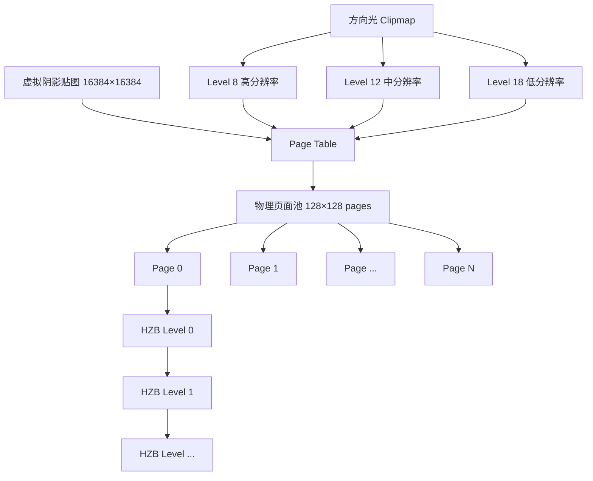
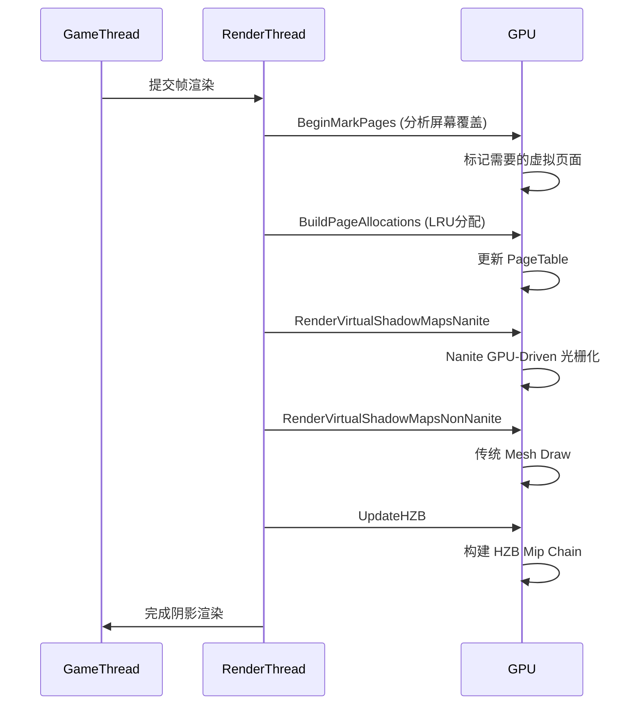

# Virtual Shadow Map (VSM) 虚拟阴影映射详解

## 摘要

Virtual Shadow Map 是 UE5.7.4 的下一代阴影系统，通过 GPU 驱动的分页管理实现超高分辨率阴影贴图。每个光源拥有一张虚拟 16K×16K 阴影贴图，但只按需分配实际可见的 128×128 物理页面。方向光使用 Clipmap 多层 LOD 组织，Nanite 和传统几何体分别渲染到 VSM。

---

## 适合解决的问题

- VSM 的分页管理如何工作？
- 为什么 VSM 比传统 Cascade Shadow Map 更好？
- VSM 与 Nanite 如何集成？
- VSM 缓存机制如何减少每帧开销？
- 如何调试 VSM 性能问题？
- VSM 的 Clipmap 层级如何组织？

---

## 核心结论

1. **虚拟地址空间**: 每个光源拥有 16K×16K 虚拟阴影贴图（`VirtualMaxResolutionXY = 16384`），但实际物理页面按需分配
2. **分页管理**: 页面大小 128×128（`PageSize = 128`），通过 GPU 驱动的 Page Table 映射虚拟地址到物理页面
3. **Clipmap**: 方向光使用多层 Clipmap（默认 8-22 级），每层独立投影矩阵和世界中心
4. **帧间缓存**: 未变化的页面可跨帧缓存，静态物体 100 帧后转入静态缓存
5. **Nanite 集成**: Nanite 几何体通过 GPU-Driven 光栅化直接写入 VSM 深度

---

## 源码位置

| 组件 | 路径 |
|------|------|
| VSM 核心数组 | `Engine/Source/Runtime/Renderer/Private/VirtualShadowMaps/VirtualShadowMapArray.h` |
| VSM 数组实现 | `Engine/Source/Runtime/Renderer/Private/VirtualShadowMaps/VirtualShadowMapArray.cpp` |
| 缓存管理器 | `Engine/Source/Runtime/Renderer/Private/VirtualShadowMaps/VirtualShadowMapCacheManager.h` |
| Clipmap | `Engine/Source/Runtime/Renderer/Private/VirtualShadowMaps/VirtualShadowMapClipmap.h` |
| 投影 | `Engine/Source/Runtime/Renderer/Private/VirtualShadowMaps/VirtualShadowMapProjection.h` |
| Shader | `Engine/Source/Runtime/Renderer/Private/VirtualShadowMaps/VirtualShadowMapShaders.h` |

---

## 关键类

### FVirtualShadowMap
- **路径**: `VirtualShadowMapArray.h:66-95`
- **职责**: 静态常量定义类
- **核心常量**:
  - `PageSize = 128` — 物理页大小
  - `Level0DimPagesXY = 128` — Level0 的页面数
  - `MaxMipLevels = 8` — 最大 MIP 层级
  - `VirtualMaxResolutionXY = 16384` — 虚拟分辨率 (128×128页 × 128像素/页)
  - `NumHZBLevels = 7` — HZB 层级数 (Log2(128))

### FVirtualShadowMapArray
- **路径**: `VirtualShadowMapArray.h:290-612`
- **职责**: 每帧创建的核心管理类，管理所有光源的 VSM
- **核心成员**:
  - `FRDGTextureRef PhysicalPagePoolRDG` — 物理页面池（深度纹理数组）
  - `FRDGTextureRef PageTableRDG` — 页表（虚拟→物理映射）
  - `FRDGTextureRef PageFlagsRDG` — 页面状态标记
  - `FRDGTextureRef PageRequestFlagsRDG` — 页面请求标记
  - `FRDGTextureRef PageReceiverMasksRDG` — 8×8 接收者掩码
  - `TRefCountPtr<IPooledRenderTarget> HZBPhysicalArray` — HZB 层级缓冲
  - `FVirtualShadowMapArrayCacheManager* CacheManager` — 跨帧缓存管理器
- **分配顺序**: 单页本地光 → 方向光 → 完整本地光 → 未引用光源

### FVirtualShadowMapArrayCacheManager
- **路径**: `VirtualShadowMapCacheManager.h:258-579`
- **职责**: 跨帧缓存管理，持久化存在
- **核心机制**:
  - `FEntryMap CacheEntries` — 光源到缓存条目的映射
  - `FInvalidatingPrimitiveCollector` — 原始体失效收集器
  - `CachePrimitiveAsDynamic` — 动态/静态分类位图
  - `LastPrimitiveInvalidatedFrame` — 每个原始体最后失效帧

### FVirtualShadowMapClipmap
- **路径**: `VirtualShadowMapClipmap.h:41-181`
- **职责**: 方向光 Clipmap 层级管理
- **配置**:
  - `FirstLevel = 8` — 最高分辨率层级
  - `LastLevel = 18` — 最低分辨率层级
  - `FirstCoarseLevel` — 粗糙页起始层
  - 每层独立 `FLevelData`（投影矩阵、世界中心、偏移）

---

## 关键函数

### 渲染流程函数

| 函数 | 文件 | 作用 |
|------|------|------|
| `FVirtualShadowMapArray::Initialize()` | `VirtualShadowMapArray.cpp` | 初始化 VSM 数组 |
| `FVirtualShadowMapArray::BeginMarkPages()` | `VirtualShadowMapArray.cpp:2106` | 标记需要渲染的页面 |
| `FVirtualShadowMapArray::BuildPageAllocations()` | `VirtualShadowMapArray.cpp:2818` | 分配物理页面 |
| `FVirtualShadowMapArray::RenderVirtualShadowMapsNanite()` | `VirtualShadowMapArray.cpp:3789` | Nanite 渲染到 VSM |
| `FVirtualShadowMapArray::RenderVirtualShadowMapsNonNanite()` | `VirtualShadowMapArray.cpp:3956` | 非 Nanite 渲染到 VSM |
| `FVirtualShadowMapArray::UpdateHZB()` | `VirtualShadowMapArray.cpp:4395` | 构建 HZB |
| `FVirtualShadowMapArray::PostRender()` | `VirtualShadowMapArray.cpp` | 后处理和缓存提取 |
| `FVirtualShadowMapArray::GetSamplingParameters()` | `VirtualShadowMapArray.h:425` | 获取采样参数 |

### 调用入口（ShadowSceneRenderer）

```
FShadowSceneRenderer::PrepareVirtualShadowMaps()
  └─ VirtualShadowMapArray.BeginMarkPages()

FShadowSceneRenderer::RenderVirtualShadowMaps()
  ├─ VirtualShadowMapArray.BuildPageAllocations()
  ├─ VirtualShadowMapArray.RenderVirtualShadowMapsNanite()
  ├─ VirtualShadowMapArray.RenderVirtualShadowMapsNonNanite()
  └─ VirtualShadowMapArray.PostRender()
```

---

## 调用链

### VSM 完整渲染流程

```
FDeferredShadingSceneRenderer::Render()
  │
  ├─ 初始化 VSM Array
  │   └─ FVirtualShadowMapArray::Initialize()
  │
  ├─ [延迟路径] BasePass 之后的阴影阶段
  │   ├─ BeginMarkPages()                    // 1. 标记页面
  │   │   ├─ 从 GBuffer 分析屏幕像素覆盖
  │   │   ├─ 标记需要的虚拟页面
  │   │   └─ 生成 PageRequestFlags
  │   │
  │   ├─ BuildPageAllocations()              // 2. 分配页面
  │   │   ├─ 检查缓存（跨帧复用）
  │   │   ├─ 处理缓存失效（Primitive 变化）
  │   │   ├─ LRU 页面替换
  │   │   └─ 更新 PageTable 映射
  │   │
  │   ├─ RenderVirtualShadowMapsNanite()     // 3. Nanite 渲染
  │   │   ├─ CreateMipViews()
  │   │   ├─ Nanite::AddRasterizationPass()  // GPU-Driven 光栅化
  │   │   └─ 写入 PhysicalPagePool
  │   │
  │   ├─ RenderVirtualShadowMapsNonNanite()  // 4. 非 Nanite 渲染
  │   │   ├─ 传统 Mesh Draw Command
  │   │   └─ 写入 PhysicalPagePool
  │   │
  │   ├─ PostRender()                        // 5. 后处理
  │   │   ├─ UpdateHZB()                     // 构建层级深度缓冲
  │   │   └─ CacheManager.ExtractFrameData() // 保存帧数据
  │   │
  │   └─ VirtualShadowMapProjection          // 6. 阴影投影
  │       ├─ 采样 PageTable 查找物理页
  │       ├─ 读取 PhysicalPagePool 深度
  │       └─ 输出阴影因子
```

---

## 生命周期

### VSM 帧生命周期
1. **Initialize**: 创建 `FVirtualShadowMapArray`，设置物理池大小
2. **BeginMarkPages**: 分析屏幕像素，标记需要的虚拟页面
3. **BuildPageAllocations**: 分配物理页面，更新页表
4. **Render**: Nanite/Non-Nanite 渲染深度到物理页面
5. **UpdateHZB**: 构建层级深度缓冲（用于剔除）
6. **PostRender**: 提取帧数据，保存到缓存
7. **Sampling**: 后续 Pass 通过 `GetSamplingParameters()` 采样阴影

### 缓存生命周期
1. **新光源**: 分配 `FVirtualShadowMapPerLightCacheEntry`
2. **每帧**: 检查失效（Primitive 变化/移动/修改）
3. **静态化**: 连续 100 帧无失效 → 转入静态缓存
4. **动态化**: 任何失效 → 回到动态缓存
5. **光源移除**: 释放缓存条目

---

## Mermaid 图

### VSM 分页架构



### VSM 渲染流程



---

## 常见误区

1. **VSM 不是传统 CSM**: VSM 使用单一 16K 虚拟贴图 + Clipmap，而非多个级联
2. **物理页面有限**: 默认最多 2048 个物理页面，不够时会降级
3. **VSM 不支持前向渲染**: `ensureMsgf(!VirtualShadowMapArray.IsEnabled(), TEXT("VSM are not supported in forward shading"))`
4. **缓存不等于无开销**: 静态页面仍需验证，动态页面每帧重新渲染

---

## 调试建议

### 控制台命令
- `r.Shadow.Virtual.Enable 0/1` — 开关 VSM
- `r.Shadow.Virtual.MaxPhysicalPages` — 最大物理页面数
- `r.Shadow.Virtual.ResolutionLodBiasDirectional` — 方向光分辨率偏移
- `r.Shadow.Virtual.Cache 0/1` — 开关缓存
- `r.Shadow.Virtual.Cache.MaxPageAgeSinceLastRequest` — 缓存页面最大存活帧数
- `r.Shadow.Virtual.Cache.FramesStaticThreshold` — 静态化阈值帧数
- `r.Shadows.Virtual.UseHZB 0/1` — HZB 遮挡剔除开关

### 可视化
- 视图模式 `Shadow Map` 可查看 VSM 页面分布
- `r.Shadow.Visualize 1` — 阴影可视化
- Unreal Insights 搜索 `VirtualShadowMap` 查看 GPU 时间

---

## 扩展点

1. **自定义页面标记**: 修改 `BeginMarkPages` 的标记策略
2. **缓存策略**: 通过 `FVirtualShadowMapArrayCacheManager` 自定义缓存淘汰策略
3. **物理池大小**: 根据场景复杂度动态调整 `MaxPhysicalPages`
4. **Nanite 集成**: 通过 `FNaniteVirtualShadowMapRenderPass` 控制 Nanite VSM 渲染
5. **SMRT (Shadow Map Ray Tracing)**: `VirtualShadowMapArray.h` 中的 SMRT 参数支持软阴影

---

## 源码证据

- `Engine/Source/Runtime/Renderer/Private/VirtualShadowMaps/VirtualShadowMapArray.h:66-95` — FVirtualShadowMap 常量定义
- `Engine/Source/Runtime/Renderer/Private/VirtualShadowMaps/VirtualShadowMapArray.h:290-612` — FVirtualShadowMapArray 类定义
- `Engine/Source/Runtime/Renderer/Private/VirtualShadowMaps/VirtualShadowMapArray.h:157-225` — FVirtualShadowMapUniformParameters
- `Engine/Source/Runtime/Renderer/Private/VirtualShadowMaps/VirtualShadowMapCacheManager.h:258-579` — 缓存管理器
- `Engine/Source/Runtime/Renderer/Private/VirtualShadowMaps/VirtualShadowMapClipmap.h:41-181` — Clipmap 实现
- `Engine/Source/Runtime/Renderer/Private/VirtualShadowMaps/VirtualShadowMapProjection.h` — 投影着色器
- `Engine/Source/Runtime/Renderer/Private/DeferredShadingRenderer.cpp:2819-2842` — 前向渲染不支持 VSM 的检查
- `Engine/Source/Runtime/Renderer/Private/VirtualShadowMaps/VirtualShadowMapArray.cpp:2106` — BeginMarkPages
- `Engine/Source/Runtime/Renderer/Private/VirtualShadowMaps/VirtualShadowMapArray.cpp:2818` — BuildPageAllocations
- `Engine/Source/Runtime/Renderer/Private/VirtualShadowMaps/VirtualShadowMapArray.cpp:3789` — RenderVirtualShadowMapsNanite

---

## 相关文档

- [完整渲染管线](Full_Render_Pipeline.md)
- [Nanite 虚拟几何](Nanite.md)
- [Lumen 全局光照](Lumen.md)
- [延迟渲染流程](Deferred_Rendering.md)
