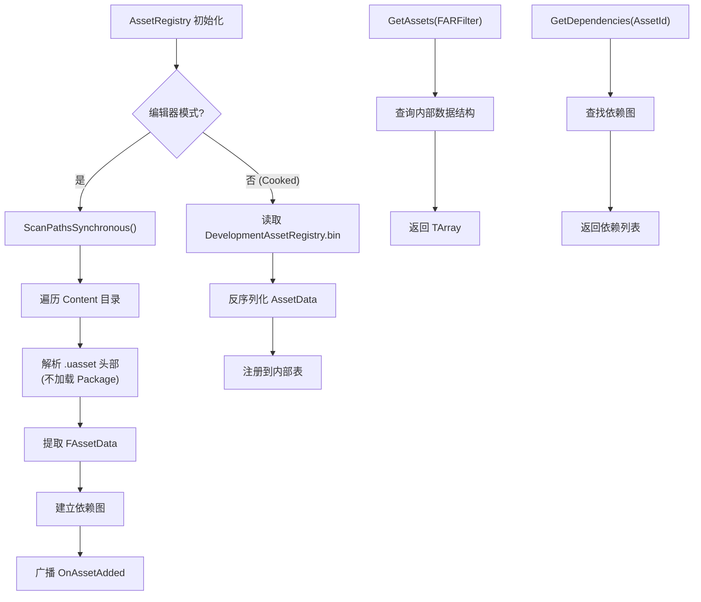

# AssetRegistry 详解

## 摘要
AssetRegistry 是 UE5.7.4 的资产发现与查询系统。它在编辑器中扫描 Content 目录下的所有 .uasset 文件并建立索引，在 Cooked 运行时读取预先生成的 `DevelopmentAssetRegistry.bin` 缓存。AssetRegistry 是 Cook 依赖图搜索、资产管理器（UAssetManager）、内容浏览器和 Blueprint 引用检查的基础设施。

## 适合解决的问题
- 如何按类型、路径、过滤器查询所有资产？
- 资产之间的依赖关系如何追踪？
- AssetRegistry 在编辑器和运行时的行为有什么区别？
- 如何监听资产的添加/删除/修改事件？
- FAssetData 包含哪些信息？和 UObject 的区别是什么？

## 核心结论
1. AssetRegistry 是一个引擎级子系统，由 `UAssetRegistryImpl` 实现 `IAssetRegistry` 接口
2. 编辑器模式下主动扫描磁盘 .uasset 文件；运行时模式下读取 Cook 阶段生成的缓存文件
3. `FAssetData` 是资产的轻量描述（不加载 UObject），包含资产名称、类、Package 路径、Tags 和 Chunk IDs
4. 依赖追踪通过 `GetDependencies()` / `GetReferencers()` 支持正向和反向查询
5. Cook 过程中的依赖图搜索（FRequestCluster）依赖 AssetRegistry 进行传递闭包计算

## 源码位置

| 组件 | 路径 | 作用 |
|------|------|------|
| IAssetRegistry | `Engine/Source/Runtime/AssetRegistry/Public/AssetRegistry.h` | 公开接口 |
| UAssetRegistryImpl | `Engine/Source/Runtime/AssetRegistry/Private/AssetRegistry.cpp` | 核心实现 |
| FAssetData | `Engine/Source/Runtime/AssetRegistry/Public/AssetData.h` | 资产数据描述 |
| FAssetIdentifier | `Engine/Source/Runtime/AssetRegistry/Public/AssetIdentifier.h` | 资产标识符 |
| FAssetDependency | `Engine/Source/Runtime/AssetRegistry/Public/AssetDependency.h` | 依赖关系 |

## 1. 模块定位

AssetRegistry 是一个 Runtime 模块，位于 `Engine/Source/Runtime/AssetRegistry/`。它是引擎的核心基础设施，以下系统依赖它：
- **UAssetManager** — 资产管理器（PrimaryAsset 系统）
- **Cooker** — 依赖图搜索和增量编译
- **ContentBrowser** — 内容浏览器资产展示
- **Reference Viewer** — 资产引用关系可视化
- **Blueprint Editor** — 引用检查和搜索

## 2. 关键类

### IAssetRegistry — 公开接口

```cpp
class IAssetRegistry {
    // 查询
    virtual void GetAssetsByClass(FName ClassName, TArray<FAssetData>& OutAssets, ...) = 0;
    virtual void GetAssetsByPackageName(FName PackageName, TArray<FAssetData>& OutAssets) = 0;
    virtual bool GetAssets(const FARFilter& Filter, TArray<FAssetData>& OutAssets) = 0;
    virtual FAssetData GetAssetByObjectPath(FName ObjectPath, ...) = 0;
    
    // 依赖
    virtual bool GetDependencies(FAssetIdentifier AssetId, TArray<FAssetIdentifier>& OutDeps, ...) = 0;
    virtual bool GetReferencers(FAssetIdentifier AssetId, TArray<FAssetIdentifier>& OutRefs, ...) = 0;
    
    // 扫描
    virtual void ScanPathsSynchronous(const TArray<FString>& InPaths, bool bForceRescan = false) = 0;
    virtual void SearchAllAssets(bool bSynchronousScan) = 0;
    
    // 事件
    virtual FAssetRegistryOnFilesLoaded& OnFilesLoaded() = 0;
    virtual FAssetRegistryOnAssetAdded& OnAssetAdded() = 0;
    virtual FAssetRegistryOnAssetRemoved& OnAssetRemoved() = 0;
    virtual FAssetRegistryOnAssetUpdated& OnAssetUpdated() = 0;
};
```

### FAssetData — 资产轻量描述

```cpp
struct FAssetData {
    FName ObjectPath;         // 完整对象路径: /Game/Path.AssetName
    FName PackageName;        // Package 名称: /Game/Path
    FName AssetName;          // 资产名称: AssetName
    FName AssetClassPath;     // 类路径: /Script/Engine.StaticMesh
    FTopLevelAssetPath AssetClass;  // 顶级类路径
    TMap<FName, FAssetTagValueRef> TagsAndValues; // 资产标签/值对
    TArray<int32> ChunkIDs;   // Streaming Install Chunk IDs
    uint32 PackageFlags;      // PKG_* 标志位
};
```

### FARFilter — 查询过滤器

```cpp
struct FARFilter {
    TArray<FName> PackageNames;        // 按 Package 名过滤
    TArray<FName> PackagePaths;        // 按路径过滤
    TArray<FName> ClassPaths;          // 按类路径过滤（新版）
    TArray<FName> ClassNames;          // 按类名过滤（旧版）
    TSet<FName> RecursiveClassesExclusionSet; // 递归排除的类
    TArray<FName> TagsAndValues;       // 按 Tag=Value 过滤
    bool bRecursivePaths = false;      // 是否递归路径
    bool bIncludeOnlyOnDiskAssets = false;
};
```

## 3. 编辑器和运行时模式差异

| 特性 | 编辑器模式 | 运行时模式 (Cooked) |
|------|-----------|-------------------|
| 数据来源 | 扫描磁盘 .uasset 文件 | 读取 `DevelopmentAssetRegistry.bin` |
| 扫描触发 | 启动时自动 + 文件变更检测 | 启动时一次性加载 |
| 更新方式 | 实时监听文件变化 | 静态，不更新 |
| 数据完整度 | 所有 Package 的所有 AssetData | Cook 时过滤后的 AssetData |
| 依赖信息 | 完整 | 运行时必要的依赖 |

### 编辑器扫描流程

```
初始化 → ScanPathsSynchronous()
  → 遍历 Content 目录
  → 发现 .uasset 文件
  → 解析 FPackageFileSummary（不加载完整 Package）
  → 提取 FAssetData（类、名称、标签）
  → 注册到内部数据结构
  → 建立依赖图
  → 广播 OnAssetAdded 事件
```

### 运行时缓存加载

Cook 过程中生成的 `DevelopmentAssetRegistry.bin` 包含所有 Cooked Package 的 FAssetData 快照，运行时直接反序列化加载。

## 4. 依赖追踪

AssetRegistry 维护双向依赖关系：

- **正向依赖（Hard + Soft）**：`GetDependencies("/Game/A")` → `["/Game/B", "/Game/C"]`
- **反向引用**：`GetReferencers("/Game/A")` → `["/Game/D", "/Game/E"]`（哪些资产引用了 A）

依赖类型分类：
- **Hard Dependency**：通过 UPROPERTY 直接引用
- **Soft Dependency**：通过 FSoftObjectPath/FSoftObjectPtr 引用
- **Searchable Name Dependency**：通过 `FStringAssetReference` 或名称引用
- **Management Dependency**：外部系统注册的依赖（如 UAssetManager 的 PrimaryAsset 规则）

## 5. AssetManager 集成

```cpp
// UAssetManager 使用 AssetRegistry 发现 Primary Assets
UAssetManager::ScanPathsForPrimaryAssets(AssetType, Paths, BaseClass, ...)
  → IAssetRegistry::GetAssetsByClass(BaseClass, Assets)
  → 检查每个 Asset 的 FAssetData 标签
  → 注册为 Primary Asset（分配 PrimaryAssetId）
```

## 6. Cook 中的使用

Cooker 的 `FRequestCluster` 通过 AssetRegistry 进行依赖图搜索：
- 使用 `ETraversalTier::BuildDependencies` → `RuntimeFollowDependencies` 遍历层级
- 构建完整的 Package 传递依赖图
- 决定 Cook 所需的最小 Package 集合

## 7. Mermaid 调用图



## 8. 常见误区

| 误区 | 正确理解 |
|------|----------|
| AssetRegistry 存储 UObject | 只存储 FAssetData（轻量描述），不加载 UObject |
| GetDependencies 返回运行时引用 | 返回 Cook/编辑器时发现的引用关系，运行时可能有变化 |
| 运行时 AssetRegistry 可以动态更新 | Cooked 运行时 AssetRegistry 是静态的 |

## 9. 调试建议

- `AssetRegistry.Debug` 控制台命令
- `stat assetregistry` 查看扫描/查询统计
- Asset Audit 工具（编辑器）可视化依赖关系
- Reference Viewer 追踪资产引用链

## 源码证据
- Engine/Source/Runtime/AssetRegistry/Public/AssetRegistry.h（IAssetRegistry 接口）
- Engine/Source/Runtime/AssetRegistry/Public/AssetData.h（FAssetData）
- Engine/Source/Runtime/AssetRegistry/Private/AssetRegistry.cpp（UAssetRegistryImpl）
- Engine/Source/Runtime/AssetRegistry/Private/AssetRegistry.h（UAssetRegistryImpl 声明）

## 相关文档
- [Package.md](Package.md) — UPackage 格式（AssetRegistry 读取的源）
- [Cook.md](Cook.md) — Cook 系统（AssetRegistry 的消费者）
- [Dynamic_Loading.md](Dynamic_Loading.md) — 动态加载系统
