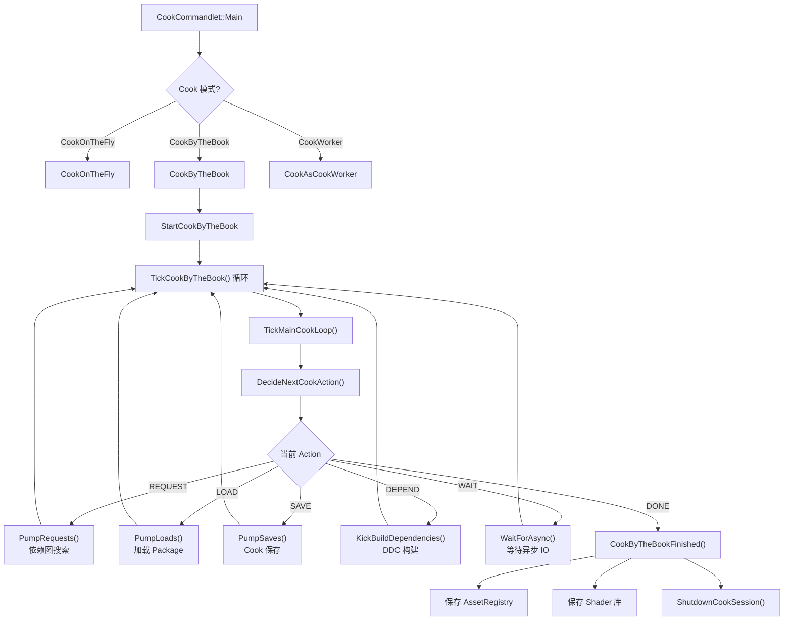

# Cook 系统详解

## 摘要
Cook 是将 Editor 格式的资源（.uasset）转换为目标平台运行时格式的核心流程。UE5.7.4 的 Cook 系统由 `UCookCommandlet` 和 `UCookOnTheFlyServer` 驱动，采用 Tick 驱动的状态机架构（REQUEST → LOAD → SAVE → FINALIZE），支持增量构建、多平台并行、DDC 缓存、多进程分布式 Cook 和 ZenStore 存储。

## 适合解决的问题
- Cook 命令行的完整流程是怎样的？
- Cook 如何发现哪些资源需要 Cook？
- Cook 过程中 Package 经历了哪些处理阶段？
- 增量 Cook 如何判断哪些资源没变化可以跳过？
- Cook 如何与 DDC（Derived Data Cache）交互？
- CookOnTheFly 和 CookByTheBook 有什么区别？
- 多进程 Cook（MPCook）如何工作？
- Shader 编译在 Cook 中如何触发？

## 核心结论
1. Cook 入口是 `UCookCommandlet::Main()`，分发到三种模式：CookOnTheFly、CookByTheBook、CookWorker
2. `UCookOnTheFlyServer` 是核心引擎，通过 `TickMainCookLoop()` 运行五阶段状态机
3. 五阶段：REQUEST（依赖图搜索）→ LOAD（加载 Package）→ SAVE（序列化+Bulk Data）→ POLL/DEPEND（异步等待）→ FINALIZE
4. 增量 Cook 使用 TargetDomainKey 哈希系统：比对平台数据哈希决定是否重新 Cook
5. DDC 在 `BeginCacheForCookedPlatformData()` 中查询/存储 Cooked 平台数据（纹理压缩、材质 ShaderMap 等）
6. Cook 输出通过 `FLooseCookedPackageWriter` 写为分离的 .uasset/.uexp/.ubulk 文件或通过 ZenStore 流式存储
7. Shader 编译通过 `GShaderCompilingManager->ProcessAsyncResults()` 在 Cook Tick 中驱动

## 源码位置

| 组件 | 路径 | 作用 |
|------|------|------|
| CookCommandlet | `Engine/Source/Editor/UnrealEd/Classes/Commandlets/CookCommandlet.h` | Cook 入口类 |
| CookCommandlet 实现 | `Engine/Source/Editor/UnrealEd/Private/Commandlets/CookCommandlet.cpp` | Cook 入口实现 |
| CookOnTheFlyServer | `Engine/Source/Editor/UnrealEd/Classes/CookOnTheSide/CookOnTheFlyServer.h` | 核心 Cook 引擎声明 |
| CookOnTheFlyServer 实现 | `Engine/Source/Editor/UnrealEd/Private/CookOnTheFlyServer.cpp` | 核心 Cook 引擎实现 (~12,000 行) |
| CookTypes | `Engine/Source/Editor/UnrealEd/Private/Cooker/CookTypes.h` | Cook 类型定义 |
| CookPackageData | `Engine/Source/Editor/UnrealEd/Private/Cooker/CookPackageData.h` | 每个 Package 的 Cook 状态数据 |
| CookRequestCluster | `Engine/Source/Editor/UnrealEd/Private/Cooker/CookRequestCluster.h` | 请求依赖图搜索 |
| CookSavePackage | `Engine/Source/Editor/UnrealEd/Private/Cooker/CookSavePackage.h` | Cook 保存逻辑 |
| CookPlatformManager | `Engine/Source/Editor/UnrealEd/Private/Cooker/CookPlatformManager.h` | 多平台 Cook 管理 |
| CookDirector | `Engine/Source/Editor/UnrealEd/Private/Cooker/CookDirector.h` | 多进程 Cook 编排 |
| ArchiveCookContext | `Engine/Source/Runtime/CoreUObject/Public/UObject/ArchiveCookContext.h` | Cook 上下文（传递到 Serialize） |
| ICookInfo | `Engine/Source/Runtime/CoreUObject/Public/UObject/ICookInfo.h` | Cook 信息接口 |

## 1. Cook 入口与模式

### CookCommandlet::Main()

```cpp
// CookCommandlet.cpp:177
int32 UCookCommandlet::Main(const FString& Params)
{
    // 解析命令行参数
    if (bCookOnTheFly)    → CookOnTheFly()
    if (bCookWorker)      → CookAsCookWorker()  
    else                  → CookByTheBook()
}
```

### 三种 Cook 模式

| 模式 | ECookMode | 用途 |
|------|-----------|------|
| CookOnTheFly | CookOnTheFly | 网络服务器模式，编辑器持续提供服务，客户端连接获取 Cooked 数据 |
| CookByTheBook | CookByTheBook | **标准模式**，从命令行指定资源列表，批量 Cook 完成后退出 |
| CookWorker | CookWorker | 多进程工作进程，从 CookDirector 接收任务 |

### CookByTheBook 常用命令行参数

```
-CookAll              Cook 所有 Maps 和 Content 目录
-MAP=MapName          指定 Cook 的 Map
-COOKDIR=DirName      指定 Cook 的目录
-Unversioned          保存时不带版本号
-Iterate              旧版增量 Cook
-ZenStore             使用 Zen 存储服务器
-FastCook             快速 Cook 模式
-PartialGC            Package 间增量 GC
-DLCNAME=Name         DLC 名称
-CreateReleaseVersion=Num 创建发布版本
```

## 2. UCookOnTheFlyServer — 核心 Cook 引擎

### 初始化标志

**ECookInitializationFlags**（CookOnTheFlyServer.h:55-81）：
- `LegacyIterative` — 复用上次 Cook 结果
- `SkipEditorContent` — 跳过引擎编辑器内容
- `Unversioned` — 不带版本号
- `BuildDDCInBackground` — 后台构建 DDC
- `EnablePartialGC` — Package 间增量 GC
- `TestCook` — 无限循环压力测试

**ECookByTheBookOptions**（CookOnTheFlyServer.h:84-108）：
- `CookAll` — Cook 所有内容
- `MapsOnly` — 仅 Cook Maps
- `NoDevContent` — 排除开发内容
- `CookAgainstFixedBase` — DLC 假设基础内容不变

### 初始化流程

```
UCookOnTheFlyServer::Initialize(ECookMode, ECookInitializationFlags)
    → StartCookByTheBook(ECookByTheBookOptions)
        → InitializeSession()
        → InitializeAtFirstSession()
        → GenerateInitialRequests()  // 生成初始请求集群
        → BeginCookSandbox()         // 初始化输出沙盒
        → BeginCookShaderLibrary()   // 初始化 Shader 库
```

## 3. Cook 五阶段状态机

### TickMainCookLoop 主循环

```cpp
// CookOnTheFlyServer.cpp:1529
while (!bCookComplete)
{
    DecideNextCookAction()
    switch (CurrentAction):
        REQUEST  → PumpRequests()
        LOAD     → PumpLoads()
        SAVE     → PumpSaves()
        POLL     → PumpPollables()
        DEPEND   → KickBuildDependencies()
        WAIT     → WaitForAsync()
        DONE     → CookComplete
    TickCookStatus()
}
```

### 阶段 A: REQUEST — 发现与依赖解析

`PumpRequests()` → `PumpRequestsInternal()` 使用 `FRequestCluster`：

1. 收集外部请求（来自命令行 `-MAP=`, `-COOKDIR=` 等）
2. 通过 `FGraphSearch` 遍历 AssetRegistry 依赖图：
   - 查找每个 Package 的上次增量 Cook 结果（异步 Oplog 查询）
   - 计算 TargetDomainKey 哈希
   - 比对依赖变化，标记 `IncrementallySkippable`
3. 按叶到根排序（先 Cook 叶子依赖）
4. 支持 5 个 `ETraversalTier` 层级（MarkForRuntime → RuntimeFollowDependencies）

### 阶段 B: LOAD — 加载 Package

`PumpLoads()` → `LoadPackageInQueue()` → `LoadPackageForCooking()`：

1. 调用 `LoadPackage()` 将源 Package 加载到内存
2. 调用 `PostLoadPackageFixup()` 处理 streaming levels
3. 可选：调用 `ValidateSourcePackage()` 验证内容
4. 使用 `FPackagePreloader` 进行异步 IO 优化（预读）
5. 参数控制加载队列深度：`DesiredLoadQueueLength`, `LoadBatchSize`

### 阶段 C: SAVE — Cook 保存

`PumpSaves()` → `SaveCookedPackage()`：

1. **PrepareSave()**（CookOnTheFlyServer.h:1293）：
   - 对 Package 中每个 UObject 调用 `BeginCacheForCookedPlatformData()`
   - 处理 CookPackageSplitters（如 World Partition Splitter）
   - 创建 `FCookSavePackageContext` per-platform
2. 对每个目标平台：
   - 设置 `FArchiveCookData` 上下文
   - 调用 `GEditor->Save()` → `UPackage::SavePackage()`
   - 支持多次保存 Pass 处理新增依赖
3. 通过 `FLooseCookedPackageWriter` 输出为 .uasset/.uexp/.ubulk/.uptnl

### 阶段 D: FINALIZE — 提交与清理

`CookByTheBookFinished()`（CookOnTheFlyServer.cpp:9248）：
1. 等待异步文件写入完成
2. 等待挂起的 DDC BuildDefinition
3. 等待 DDC 静默（`GetDerivedDataCacheRef().WaitForQuiescence(true)`）
4. 保存 `DevelopmentAssetRegistry.bin`（运行时资产注册表）
5. 保存 Shader 库
6. 写入 PackageStore、Manifests 和元数据
7. 调用 `ShutdownCookSession()` 释放会话数据

## 4. 增量 Cook 机制

### 现代增量（TargetDomainKey 系统）

非 Legacy 模式使用 `TargetDomainKey` 哈希：
- 计算每个 Package 的 `TargetDomainKey` 哈希，基于：
  - Package 字节哈希
  - 所有 `FCookDependency` 值（配置、CVar、文件、传递构建等）
  - 全局依赖哈希（引擎版本、插件等）
- `FRequestCluster` 异步获取上次 Cook 的 Attachments
- `HasKeyMatch()` 判断是否可以增量跳过
- `bIncrementallyUnmodified` 标记每个 Package 的每个平台状态

### 旧版迭代（-Iterate）

- `ECookInitializationFlags::LegacyIterative`
- 通过 `PackageSavedHash` 比对判断变化
- 传递给 AssetRegistry Referencer 的无效化传播
- 更简单但可能有更多误判

### FIncrementalCookAttachments

存储每个 Package 的上次 Cook 状态：
- `FPackageArtifacts` — 构建依赖、运行时依赖、TargetDomainKey
- `FBuildDefinitionList` — DDC 构建定义
- `FImportsCheckerData` — Import 追踪
- `FReplicatedLogData` — 上次 Cook 的日志

## 5. DDC 集成

Cook 中的 DDC 交互点：

1. **BeginCacheForCookedPlatformData()**：每个 UObject 的虚函数，查询 DDC 获取缓存的 Cooked 平台数据（纹理压缩结果、材质 ShaderMap 等）
2. **FBuildDefinitionList**：收集 `UE::DerivedData::FBuildDefinition` 对象，存储在 Oplog 中作为 Attachments
3. **FBuildDefinitions** 类（CookTypes.h:432）：管理挂起的 DDC 构建，`AddBuildDefinitionList()` 排队，`Wait()` 等待全部完成
4. **全局 DDC 版本**：`MaterialShaderMapDDCVersion`、`GlobalDDCVersion` 等 Ini 版本字符串用于增量无效化

## 6. Cook 输出格式

### FLooseCookedPackageWriter

```
输出目录结构:
<SandboxDir>/
  <ProjectName>/
    Content/
      <PackagePath>/
        AssetName.uasset   ← Package 头部
        AssetName.uexp     ← Export 序列化数据
        AssetName.ubulk    ← 内联 Bulk Data
        AssetName.uptnl    ← Payload 数据
```

### ZenStore 模式（-ZenStore）

数据流向 Zen Storage Server 而非松散的本地文件，适合多进程 Cook 和云端构建。

## 7. 多进程 Cook（MPCook）

由 `FCookDirector`（CookDirector.h:73-355）编排：

- CookDirector 进程创建 CookWorker 子进程（通过 `CookWorkerServer`）
- 按 `ELoadBalanceAlgorithm::Striped` 或 `ELoadBalanceAlgorithm::CookBurden` 分配 Package
- 支持从过载 Worker 撤回 Package 并重新分配
- Workers 通过 Oplog 共享状态

## 8. Shader 编译

Shader 在 Cook 中通过 `BeginCacheForCookedPlatformData()` 触发材质调用 `FMaterialShaderMap::Compile()`：

- `GShaderCompilingManager->ProcessAsyncResults()` 在 Cook Tick 中调用
- 内存压力时主动 Flush Shader 作业（CookCommandlet.cpp:688-715）
- `MaxConcurrentShaderJobs` 控制 Shader 编译并行度
- `FODSCClientData`（OnDemandShaderCompilation.h）管理 ODSC 客户端
- `FShaderLibraryCookArtifact` 管理 Shader 代码库输出

## 9. Cook 类型枚举

```cpp
// CookEnums.h
enum class ECookType { CookByTheBook, CookOnTheFly };
enum class ECookingDLC { None, StandAlone, BasedOn };
enum class EProcessType { Director, Worker, Simple };
enum class ECookResult { Succeeded, Failed, Retry, Unknown };
```

## 10. Mermaid 调用图

### Cook 状态机



### Request → Save 阶段 Pipeline

```mermaid
flowchart LR
    subgraph "REQUEST"
        A1["收集命令行请求<br/>-MAP= / -COOKDIR="]
        A2["FRequestCluster<br/>依赖图搜索"]
        A3["Async Oplog 查询<br/>上次 Cook 结果"]
        A4["TargetDomainKey<br/>哈希比对"]
        A5["标记 IncrementallySkippable"]
    end
    subgraph "LOAD"
        B1["LoadPackage()<br/>加载源 Package"]
        B2["PostLoadPackageFixup()<br/>修复延迟引用"]
        B3["可选: ValidateSourcePackage()"]
    end
    subgraph "SAVE"
        C1["BeginCacheForCookedPlatformData()"]
        C2["SaveCookedPackage()<br/>每平台循环"]
        C3["FLooseCookedPackageWriter<br/>输出 .uasset/.uexp"]
    end
    A1 --> A2 --> A3 --> A4 --> A5
    A5 --> B1 --> B2 --> B3
    B3 --> C1 --> C2 --> C3
```



## 11. 常见误区

| 误区 | 正确理解 |
|------|----------|
| Cook 只是"压缩资源" | Cook 涉及平台特定数据生成（纹理压缩、Shader 编译、序列化格式转换） |
| Cook 后 .uasset 变小很多 | .uasset 变小但 .uexp 包含同样多的数据，总体可能更大（平台数据膨胀） |
| 增量 Cook 一定能跳过没变的 Package | TargetDomainKey 哈希需精确匹配，依赖链上任何变化都会导致重 Cook |
| CookOnTheFly 和 CookByTheBook 功能相同 | CookOnTheFly 是服务器模式，增量发送数据；CookByTheBook 是批处理 |
| -Iterate 和现代增量 Cook 是一样的 | 它们是两套不同的增量系统，现代增量更精确但更复杂 |

## 12. 调试建议

1. **Cook 日志**：搜索 "Cook:" 前缀的日志输出
2. **Cook Profiling**：启用 `-ProfileCook` 查看各阶段耗时
3. **增量跳过确认**：搜索 "IncrementallySkippable" 或 "Skipping" 确认增量是否生效
4. **DDC 问题**：检查 `-DDC=Cold` 或 `-NoSharedDDC` 参数影响
5. **查看 Package 依赖**：`Asset Audit` 工具查看 Cook 依赖图
6. **Shader 编译阻塞**：查看 `GShaderCompilingManager` 的 "NumRemainingJobs"

## 源码证据
- Engine/Source/Editor/UnrealEd/Classes/Commandlets/CookCommandlet.h:25-103（UCookCommandlet 声明）
- Engine/Source/Editor/UnrealEd/Private/Commandlets/CookCommandlet.cpp:177-797（Main 入口与模式分发）
- Engine/Source/Editor/UnrealEd/Classes/CookOnTheSide/CookOnTheFlyServer.h:55-1796（UCookOnTheFlyServer 声明）
- Engine/Source/Editor/UnrealEd/Private/CookOnTheFlyServer.cpp:1529（TickMainCookLoop）
- Engine/Source/Editor/UnrealEd/Private/CookOnTheFlyServer.cpp:2687（PumpRequests）
- Engine/Source/Editor/UnrealEd/Private/CookOnTheFlyServer.cpp:3019（PumpLoads）
- Engine/Source/Editor/UnrealEd/Private/CookOnTheFlyServer.cpp:4914（PumpSaves）
- Engine/Source/Editor/UnrealEd/Private/CookOnTheFlyServer.cpp:9248（CookByTheBookFinished）
- Engine/Source/Editor/UnrealEd/Private/Cooker/CookRequestCluster.h:52-565（FRequestCluster 依赖图搜索）
- Engine/Source/Editor/UnrealEd/Private/Cooker/CookPackageArtifacts.h:211-371（增量 Cook Attachments）
- Engine/Source/Editor/UnrealEd/Private/Cooker/CookTypes.h:371-390（FCookSavePackageContext）
- Engine/Source/Editor/UnrealEd/Private/Cooker/CookPlatformManager.h:33-238（多平台管理）
- Engine/Source/Editor/UnrealEd/Private/Cooker/LooseCookedPackageWriter.h:1-128（松散文件输出）
- Engine/Source/Editor/UnrealEd/Private/Cooker/CookDirector.h:73-355（MPCook 编排）
- Engine/Source/Runtime/CoreUObject/Public/UObject/ArchiveCookContext.h:1-140（Cook 上下文）
- Engine/Source/Runtime/CoreUObject/Public/UObject/ICookInfo.h:199-348（Cook 信息接口）

## 相关文档
- [Package.md](Package.md) — UPackage 与 Package 文件格式
- [IOStore.md](IOStore.md) — IOStore 存储格式
- [Dynamic_Loading.md](Dynamic_Loading.md) — 动态加载系统
- [AssetRegistry.md](AssetRegistry.md) — 资产注册表
