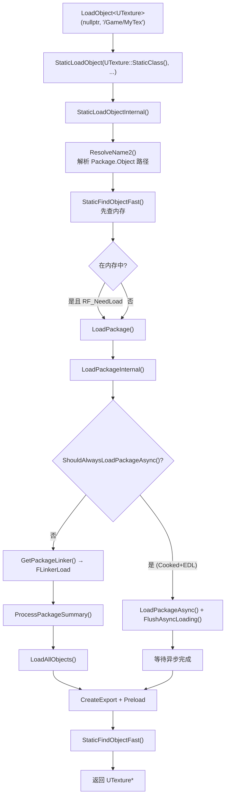
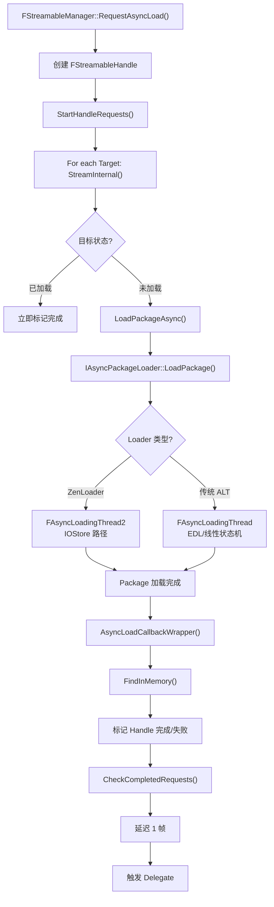
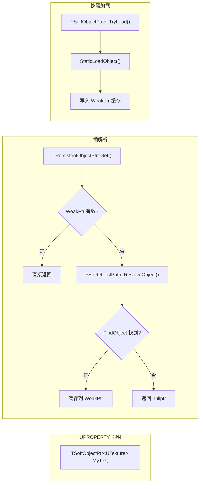

# 动态加载系统详解

## 摘要
UE5.7.4 的动态资源加载系统提供从简单同步加载到复杂异步批量加载的多层次 API。`StaticLoadObject()` 是同步加载的核心入口，`FSoftObjectPath` 支持懒引用和延迟解析，`LoadPackageAsync()` 驱动异步加载，`FStreamableManager` 提供高级批量管理和优先级控制。底层异步引擎有两条路径：传统的 ALT (AsyncLoadingThread) 和 UE5 新增的 ZenLoader (FAsyncLoadingThread2)，两者都支持 EDL (Event-Driven Loader) 最大化 IO 并行度。

## 适合解决的问题
- LoadObject<T>() 和 StaticLoadObject() 的区别？
- FSoftObjectPath / FSoftObjectPtr / TSoftObjectPtr 如何工作？
- 异步加载的正确姿势是什么？
- FStreamableManager 如何处理大量资源的批量加载？
- 异步加载和 GC 如何协调？
- Blueprint 类如何在运行时动态加载？
- Event-Driven Loader (EDL) 比传统加载快在哪里？

## 核心结论
1. `LoadObject<T>()` 是 `StaticLoadObject()` 的模板包装，自动做类型检查和转换
2. `FSoftObjectPath` 存储路径字符串，通过 `TryLoad()` 同步加载，通过 `LoadAsync()` 异步加载
3. `TPersistentObjectPtr<T>` 是 `FSoftObjectPtr` 的基类，持有弱指针缓存和路径 ID
4. 异步加载在 Cooked 构建中即使调用同步 API 也走异步基础路径（EDL/ZenLoader）
5. EDL 将加载分解为事件节点（Package_LoadSummary → ImportOrExport_Create → ImportOrExport_Serialize），通过依赖图驱动并行执行
6. `FStreamableManager` 通过引用计数 Handle 管理加载生命周期，防止过早 GC
7. ZenLoader (FAsyncLoadingThread2) 是 UE5 基于 IOStore 的新异步加载器

## 源码位置

| 组件 | 路径 | 作用 |
|------|------|------|
| StaticLoadObject | `Engine/Source/Runtime/CoreUObject/Public/UObject/UObjectGlobals.h:578` | 同步加载声明 |
| StaticLoadObject 实现 | `Engine/Source/Runtime/CoreUObject/Private/UObject/UObjectGlobals.cpp:1325-1434` | 同步加载实现 |
| FSoftObjectPath | `Engine/Source/Runtime/CoreUObject/Public/UObject/SoftObjectPath.h:54-486` | 软引用路径 |
| FSoftObjectPath 实现 | `Engine/Source/Runtime/CoreUObject/Private/UObject/SoftObjectPath.cpp` | TryLoad/ResolveObject/LoadAsync |
| FSoftObjectPtr | `Engine/Source/Runtime/CoreUObject/Public/UObject/SoftObjectPtr.h:44-163` | 软指针 |
| TPersistentObjectPtr | `Engine/Source/Runtime/CoreUObject/Public/UObject/PersistentObjectPtr.h:17-150` | 持久化指针基类 |
| IAsyncPackageLoader | `Engine/Source/Runtime/CoreUObject/Public/Serialization/AsyncPackageLoader.h:87-246` | 异步加载器接口 |
| AsyncPackageLoader 实现 | `Engine/Source/Runtime/CoreUObject/Private/Serialization/AsyncPackageLoader.cpp` | 异步加载器初始化 |
| FAsyncLoadingThread (ALT) | `Engine/Source/Runtime/CoreUObject/Private/Serialization/AsyncLoadingThread.h` | 传统 ALT 声明 |
| ALT 实现 | `Engine/Source/Runtime/CoreUObject/Private/Serialization/AsyncLoading.cpp` | ALT 实现 |
| EDL 事件节点 | `Engine/Source/Runtime/CoreUObject/Private/Serialization/AsyncLoading.h:99-124` | EDL 事件类型 |
| ZenLoader (ALT2) | `Engine/Source/Runtime/CoreUObject/Private/Serialization/AsyncLoading2.cpp` | IOStore 异步加载 |
| FStreamableManager | `Engine/Source/Runtime/Engine/Classes/Engine/StreamableManager.h:100+` | 高级流式加载 |
| FStreamableManager 实现 | `Engine/Source/Runtime/Engine/Private/StreamableManager.cpp` | 流式加载实现 |

## 1. 同步加载 API

### StaticLoadObject — 核心入口

```cpp
// UObjectGlobals.h:578
UObject* StaticLoadObject(UClass* Class, UObject* InOuter, FStringView Name,
    FStringView Filename = {}, uint32 LoadFlags = LOAD_None, ...);
```

**完整调用链（UObjectGlobals.cpp:1325-1434）：**

```
StaticLoadObject()
  → StaticLoadObjectInternal()
    → ResolveName2()                    // 解析路径字符串
      - 去除 ClassName' 前缀
      - 解析 Package.Object 的左右部分
      - 处理 Package 重定向（FCoreRedirects）
      - 处理 ScriptPackageName → LongPackageName 转换
    → [如果 bAllowObjectReconciliation]
      → StaticFindObjectFast()          // 先检查内存
      → [如果找到但 RF_NeedLoad] → 强制从磁盘加载
    → LoadPackage(nullptr, *OutermostPackageName, ...)
      → LoadPackageInternal()
        → [如果 ShouldAlwaysLoadPackageAsync()]
          → LoadPackageAsync() + FlushAsyncLoading()  // 走异步基础设施同步等待
        → [否则]
          → GetPackageLinker()          // 创建 FLinkerLoad
          → Linker->LoadAllObjects()    // 反序列化所有 Export
    → StaticFindObjectFast()            // 再查内存
    → [如果未找到] → 跟随 UObjectRedirector 链
    → [如果无对象名] → 用短包名作资产名递归
```

### LoadObject\<T\>() — 模板包装

```cpp
// UObjectGlobals.h:2134-2138
template<class T>
inline T* LoadObject(UObject* Outer, FStringView Name, ...)
{
    return (T*)StaticLoadObject(T::StaticClass(), Outer, Name, ...);
}
```

**配套函数：**
- `StaticLoadClass()` — 加载类并验证继承关系
- `StaticLoadAsset()` — 从 FTopLevelAssetPath 构造路径后加载

## 2. 软引用系统

### FSoftObjectPath — 路径字符串

```cpp
// SoftObjectPath.h:472-477
struct FSoftObjectPath {
    FTopLevelAssetPath AssetPath;  // "/Game/Path.AssetName"
    FUtf8String SubPathString;     // ":SubObject" 子路径
};
```

**路径格式：** `/package/path.assetname:subpath`

**解析过程（SetPath, SoftObjectPath.cpp:193-254）：**
- 移除 `ClassName'` 前缀
- 按 `.` 分割 Package 名称和 Asset 名称
- 按 `:` 分割 SubPath

**TryLoad() — 同步按需加载（SoftObjectPath.cpp:781-838）：**
1. 如果是 SubObject：先加载顶层 Asset，再解析 SubPath
2. 如果是顶层 Asset：调用 `StaticLoadObject()`
3. 失败后尝试 `FixupCoreRedirects()` 重定向
4. 跟随 `UObjectRedirector` 链

**ResolveObject() — 仅内存查找（SoftObjectPath.cpp:874-938）：**
- 调用 `FindObject<UObject>(AssetPath)`
- 不触发磁盘加载，找不到返回 `nullptr`

**LoadAsync() — 异步加载（SoftObjectPath.cpp:840-872）：**
- 先 Fixup PIE/CoreRedirects
- 调用 `LoadAssetAsync()` → `LoadPackageAsync()`
- 完成后通过 Lambda 解析 SubObject

### TPersistentObjectPtr\<T\> — 懒指针基类

```cpp
// PersistentObjectPtr.h:17-150
template<typename TObjectID>
class TPersistentObjectPtr {
    mutable TWeakObjectPtr<UObject> WeakPtr;  // 缓存已解析指针
    TObjectID ObjectID;                       // FSoftObjectPath
public:
    UObject* Get() const {
        if (WeakPtr.IsValid()) return WeakPtr.Get();
        if (!ObjectID.IsNull()) {
            UObject* Obj = ObjectID.ResolveObject();  // 仅查内存
            WeakPtr = Obj;
            return Obj;
        }
        return nullptr;
    }
};
```

### FSoftObjectPtr / TSoftObjectPtr\<T\>

```cpp
// SoftObjectPtr.h:44-163
class FSoftObjectPtr : public TPersistentObjectPtr<FSoftObjectPath> {
    UObject* LoadSynchronous() const {
        if (Get() == nullptr && !IsNull()) {
            ToSoftObjectPath().TryLoad();  // 触发磁盘加载
        }
        return Get();
    }
};

template<class T>
class TSoftObjectPtr : public TPersistentObjectPtr<FSoftObjectPath> {
    // 类型安全包装
    T* Get() const { return (T*)FSoftObjectPtr::Get(); }
    T* LoadSynchronous() const { return (T*)FSoftObjectPtr::LoadSynchronous(); }
};
```

## 3. 异步加载核心架构

### IAsyncPackageLoader — 抽象接口

```cpp
// AsyncPackageLoader.h:87-246
class IAsyncPackageLoader {
    virtual int32 LoadPackage(const FPackagePath&, ...) = 0;
    virtual void ProcessLoading(...) = 0;
    virtual void FlushLoading(int32 PackageID) = 0;
    virtual void CancelLoading(int32 PackageID) = 0;
};
```

### 加载器选择（AsyncPackageLoader.cpp:216-284）

```
InitAsyncThread()
  → if (FIoDispatcher 已初始化)
    → FAsyncLoadingThread2 (ZenLoader, IOStore-based)
  → else
    → FAsyncLoadingThread (传统 ALT)
  → [可选] FTransactionallySafeAsyncPackageLoader 包装
```

### FAsyncLoadingThread (ALT) — 传统异步加载器

**工作线程（AsyncLoading.cpp:5199-5243）：**
```
while (!StopRequested)
    if (!Suspended)
        TickAsyncThread()
            → ProcessAsyncLoading()       // 主循环
              → [EDL enabled]
                → ProcessIncomingIO()
                → CreateAsyncPackagesFromQueue()
                → EventQueue.PopAndExecute()      // EDL 事件引擎
                → TickReadyPackages()
              → [EDL disabled]
                → FAsyncPackage::TickAsyncPackage() // 线性状态机
```

**FAsyncPackage 线性状态机（AsyncLoading.cpp:5935-6125）：**
```
CreateLinker → FinishLinker → LoadImports → CreateImports →
CreateMetaData → CreateExports → PreLoadObjects → CallCompletionCallbacks →
WaitForImportSerialize → FinishExternalReadDependencies →
PostLoadObjects → FinishObjects
```

### Event-Driven Loader (EDL)

EDL 将加载过程分解为异步事件图：

**事件节点（AsyncLoading.h:99-114）：**
```
Package_LoadSummary        — 读取 Package 头部
Package_SetupImports       — 设置 Import 解析
Package_ExportsSerialized  — 所有 Export 序列化完成

ImportOrExport_Create      — 创建 Import/Export UObject
ImportOrExport_Serialize   — 序列化 Import/Export 数据
Export_StartIO             — 开始 Export IO
```

**隐式边（AsyncLoading.h:117-124）：**
```
Import:  Create → Serialize → Package_ExportsSerialized
Export:  Create → StartIO → Serialize → Package_ExportsSerialized
```

**Package 生命周期状态（AsyncLoading.h:30-43）：**
```
NewPackage → WaitingForSummary → StartImportPackages → WaitingForImportPackages →
SetupImports → SetupExports → ProcessNewImportsAndExports → WaitingForPostLoad →
ReadyForPostLoad → PostLoad_Etc → PackageComplete
```

EDL 的核心优势：当一个 Package 的 Export 正在序列化时可能触发对其他 Package 的 Import，EDL 通过事件图直接激活这些 Import 的依赖事件，实现最大 IO 并行度。

### ZenLoader (FAsyncLoadingThread2) — IOStore 异步加载器

`AsyncLoading2.cpp:4147+` — UE5 新增基于 IOStore 的异步加载器：
- 使用 FIoDispatcher 进行所有 IO
- 不同的 FAsyncPackage2 状态机
- 支持 `FLoadPackageAsyncProgressDelegate` 进度回调
- 更好的取消支持
- 线程安全的 LoadPackage（可从任意线程调用）

## 4. FStreamableManager — 高级批量加载

### 核心 API

```cpp
// StreamableManager.h:100+
class FStreamableManager {
    // 异步批量加载
    TSharedPtr<FStreamableHandle> RequestAsyncLoad(
        TArray<FSoftObjectPath> TargetsToStream,
        FStreamableDelegate Delegate,
        TAsyncLoadPriority Priority = DefaultAsyncLoadPriority
    );
    
    // 同步批量加载
    void RequestSyncLoad(TArray<FSoftObjectPath> TargetsToStream);
    
    // 单个同步加载（便捷方法）
    UObject* LoadSynchronous(FSoftObjectPath Target);
};
```

### 优先级常量

```cpp
DefaultAsyncLoadPriority = 0
AsyncLoadHighPriority = 100
DownloadVeryLowPriority = -200 ... DownloadVeryHighPriority = 200
```

### 加载流程（StreamableManager.cpp:1811-1943）

```
RequestAsyncLoad(Targets, Delegate, Priority)
  → 创建 FStreamableHandle
  → 去重 (TSet<FSoftObjectPath>)
  → StartHandleRequests()
    → For each Target:
      → StreamInternal()
        → [如果已加载] → 立即完成
        → [如果在构造函数/初始加载中] → StaticLoadObject() 同步加载
        → [否则] → LoadPackageAsync() 异步加载
          → 回调: FStreamableHandle::AsyncLoadCallbackWrapper
            → FindInMemory() 找到对象
            → 标记完成/失败
            → CheckCompletedRequests()
              → 触发 Delegate（经延迟 1 帧防递归）
```

### FStreamableHandle 生命周期安全

- `bCanceled == false && bReleased == false` 时 Handle 保持活跃
- 活跃 Handle 持有的 Asset 被引用保护，不会被 GC
- 延迟回调（`GStreamableDelegateDelayFrames`，默认 1 帧）防止重入

## 5. 异步加载与 GC 协调

### 关键机制

- **FGCScopeGuard**：在关键加载段阻止 GC 运行，GC 等待所有 ScopeGuard 释放
- **EInternalObjectFlags_AsyncLoading**：异步加载中的对象设有此标志，GC 忽略它们
- **FGCCSyncObject**（AsyncLoading.cpp:5179）：协调 GC 和异步加载的同步对象
- **FinishObjects()**：清除 AsyncLoading 标志，标记对象为可 GC

### 加载完成后

```cpp
// AsyncPackageLoader.h:50-65
ClearFlagsAndDissolveClustersFromLoadedObjects(LoadedObjects);
// 清除: RF_NeedLoad | RF_NeedPostLoad | RF_NeedPostLoadSubobjects | RF_WasLoaded
```

## 6. Blueprint 类运行时加载

- BP 在编辑器中编译后以 `BlueprintGeneratedClass` 存入 Package
- 加载 BP Package 时，序列化系统自动：
  1. 加载 `BlueprintGeneratedClass` 对象
  2. 反序列化 UClass 数据（继承、函数、属性）
  3. `PostLoad()` 中调用 `Bind()` 链接 Native 函数引用
- Cooked 构建中 BP 预编译为 Bytecode (BPTG)
- `LoadObject<UBlueprintGeneratedClass>()` 或 `LoadPackage()` 即可动态加载

## 7. 同步 vs 异步路径对比

| 特性 | 同步 (StaticLoadObject) | 异步 (LoadPackageAsync) |
|------|------------------------|------------------------|
| 调用线程 | GameThread（阻塞） | 任意线程（非阻塞） |
| 实现 | 在 Cooked+EDL 中也走异步基础设施 | Event-Driven Loader |
| 返回方式 | 直接返回 UObject | 返回 RequestID，通过回调/Flush 获取 |
| 适用场景 | 少量资源、初始化阶段 | 大量资源、运行时按需加载 |
| GC 安全 | 自动（ScopeGuard） | 需要 Handle 管理生命周期 |
| 性能 | 等待 IO 完成 | IO 并行 + EDL 事件图 |

## 8. Mermaid 调用图

### 同步加载全路径



### 异步加载流程



### 软引用解析



## 9. 常见误区

| 误区 | 正确理解 |
|------|----------|
| LoadObject 总是同步读磁盘 | Cooked+EDL 构建中即使同步 API 也走异步基础设施 |
| FSoftObjectPtr::Get() 会触发加载 | Get() 只查内存；LoadSynchronous() 才触发加载 |
| FStreamableHandle 释放后 Asset 立即 GC | 只要 Handle 活跃 Asset 就受保护；释放后 GC 需可达性检查 |
| 异步加载 = 开新线程 | EDL 在专用的 AsyncLoadingThread 中运行，但通过事件图而非简单多线程 |

## 10. 调试建议

1. **追踪加载耗时**：`stat loadtimes` 查看各 Package 加载时间
2. **查看异步加载状态**：`stat asyncLoad` 查看挂起/进行中的异步加载
3. **软引用调试**：`obj refs class=PackageName` 查找引用
4. **FStreamableManager 调试**：检查 Handle 的 `GetLoadedCount()` / `HasLoadCompleted()`
5. **EDL 事件追踪**：启用 `AsyncLoading` trace channel (Unreal Insights)
6. **GC 交互问题**：`obj list` 检查对象是否被 GC 意外回收

## 源码证据
- Engine/Source/Runtime/CoreUObject/Public/UObject/UObjectGlobals.h:578, 2134-2138（StaticLoadObject, LoadObject 声明）
- Engine/Source/Runtime/CoreUObject/Private/UObject/UObjectGlobals.cpp:1325-1434（StaticLoadObjectInternal 实现）
- Engine/Source/Runtime/CoreUObject/Private/UObject/UObjectGlobals.cpp:1649-1994（LoadPackageInternal）
- Engine/Source/Runtime/CoreUObject/Public/UObject/SoftObjectPath.h:54-486（FSoftObjectPath 声明）
- Engine/Source/Runtime/CoreUObject/Private/UObject/SoftObjectPath.cpp:193-254（SetPath）
- Engine/Source/Runtime/CoreUObject/Private/UObject/SoftObjectPath.cpp:781-838（TryLoad）
- Engine/Source/Runtime/CoreUObject/Private/UObject/SoftObjectPath.cpp:840-872（LoadAsync）
- Engine/Source/Runtime/CoreUObject/Private/UObject/SoftObjectPath.cpp:874-938（ResolveObject）
- Engine/Source/Runtime/CoreUObject/Public/UObject/SoftObjectPtr.h:44-163（FSoftObjectPtr）
- Engine/Source/Runtime/CoreUObject/Public/UObject/PersistentObjectPtr.h:17-150（TPersistentObjectPtr）
- Engine/Source/Runtime/CoreUObject/Public/Serialization/AsyncPackageLoader.h:87-246（IAsyncPackageLoader）
- Engine/Source/Runtime/CoreUObject/Private/Serialization/AsyncPackageLoader.cpp:216-284（InitAsyncThread）
- Engine/Source/Runtime/CoreUObject/Private/Serialization/AsyncLoading.cpp:4326-4512（ProcessAsyncLoading）
- Engine/Source/Runtime/CoreUObject/Private/Serialization/AsyncLoading.cpp:5935-6125（TickAsyncPackage 状态机）
- Engine/Source/Runtime/CoreUObject/Private/Serialization/AsyncLoading.h:99-124（EDL 事件节点）
- Engine/Source/Runtime/CoreUObject/Private/Serialization/AsyncLoading2.cpp:4147+（ZenLoader）
- Engine/Source/Runtime/Engine/Classes/Engine/StreamableManager.h:100+（FStreamableManager 声明）
- Engine/Source/Runtime/Engine/Private/StreamableManager.cpp:1811-1943（RequestAsyncLoad）

## 相关文档
- [Package.md](Package.md) — UPackage 与 Package 格式
- [IOStore.md](IOStore.md) — IOStore 存储系统
- [Cook.md](Cook.md) — Cook 系统
- [AssetRegistry.md](AssetRegistry.md) — 资产注册表
