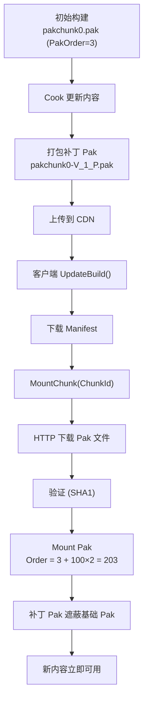
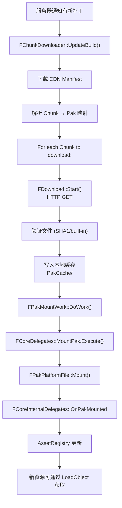

# 热更新与补丁机制详解

## 摘要
UE5.7.4 的热更新机制基于补丁 Pak（Patch Pak）优先级系统实现。核心原理是：基础 Pak 文件包含初始内容，补丁 Pak（`_P.pak`）包含更新的完整文件，通过更高的挂载优先级（PakOrder）遮蔽基础 Pak 中的旧文件。`FChunkDownloader` 插件提供完整的流式安装客户端，支持 CDN 清单下载、分块管理、异步下载和运行时挂载。

## 适合解决的问题
- 如何在不重新安装客户端的情况下更新游戏内容？
- 补丁 Pak 如何覆盖基础 Pak 中的文件？
- ChunkDownloader 如何从 CDN 下载和挂载补丁？
- ContentBuildId 是什么？如何管理版本？
- 如何在运行时挂载从服务器下载的 Pak？
- 补丁更新的完整流程是怎样的？

## 核心结论
1. 补丁 Pak 使用 `_P.pak` 命名，版本号 `_V_<N>` 嵌入文件名，优先级比基础 Pak 高 `100 × (Version+1)`
2. 文件查找时高 Priority 的 Pak 优先匹配，补丁文件自然遮蔽基础文件
3. 支持 `Flag_Deleted` 删除记录，补丁 Pak 可标记基础 Pak 中的文件为"已删除"
4. `FChunkDownloader` 是 UE 内置的流式安装客户端插件，管理 CDN 下载、Chunk 状态、异步挂载
5. `ContentBuildId` 字符串标识内容版本，客户端负责兼容性检查后调用 `UpdateBuild()`
6. 运行时可通过 `FCoreDelegates::MountPak` 动态挂载任何 .pak 文件

## 源码位置

| 组件 | 路径 | 作用 |
|------|------|------|
| Pak Mount 逻辑 | `Engine/Source/Runtime/PakFile/Private/IPlatformFilePak.cpp:5910-6192` | 挂载与补丁检测 |
| 补丁文件名解析 | `Engine/Source/Runtime/PakFile/Private/IPlatformFilePak.cpp:5950-5976` | _P.pak 检测和 Order 计算 |
| ChunkDownloader 插件 | `Engine/Plugins/Runtime/ChunkDownloader/` | 流式安装客户端 |
| ChunkDownloader 头文件 | `Engine/Plugins/Runtime/ChunkDownloader/Source/Public/ChunkDownloader.h` | API 声明 |
| ChunkDownloader 实现 | `Engine/Plugins/Runtime/ChunkDownloader/Source/Private/ChunkDownloader.cpp` | 核心实现 |
| Download 逻辑 | `Engine/Plugins/Runtime/ChunkDownloader/Source/Private/Download.h` | HTTP 下载管理 |
| PakMountWork | `Engine/Plugins/Runtime/ChunkDownloader/Source/Private/ChunkDownloader.cpp:177` | 异步挂载任务 |
| 启动挂载 | `Engine/Source/Runtime/Launch/Private/LaunchEngineLoop.cpp:3565-3584` | 下载目录 Pak 挂载 |
| CoreDelegates | `Engine/Source/Runtime/Core/Public/Misc/CoreDelegates.h` | MountPak 等委托 |
| Chunk Install 接口 | `Engine/Source/Runtime/Core/Public/GenericPlatform/GenericPlatformChunkInstall.h` | 平台抽象 |

## 1. 补丁 Pak 机制

### 命名约定

```
基础 Pak:
  pakchunk0-WindowsClient.pak          → PakOrder = 3 或 4

补丁 Pak:
  pakchunk0-V_1-WindowsClient_P.pak    → PakOrder = 3 + 100×2 = 203
  pakchunk0-V_2-WindowsClient_P.pak    → PakOrder = 3 + 100×3 = 303
```

### 补丁检测与优先级计算

```cpp
// IPlatformFilePak.cpp:5950-5976
if (PakFilename.EndsWith("_P.pak"))
{
    // 从文件名提取版本号: ..._V_<Num>_P.pak
    int32 ChunkVersionNumber = ExtractVersionFromFilename() + 1;
    PakOrder += 100 * ChunkVersionNumber;  // 大幅提高优先级
}
```

### 文件遮蔽机制

```
FPakPlatformFile::FindFileInPakFiles()
  → 遍历 PakFiles[] (按 PakOrder 降序)
    → FPakFile::Find(FullPath)
      → 如果找到且 Flag_Deleted → 返回"未找到"
      → 如果找到且正常 → 返回该文件
      → 如果未找到 → 继续查下一个 Pak
```

**删除记录（Delete Record）**：
```cpp
// FPakEntry::Flag_Deleted = 0x02
// 补丁 Pak 中的删除条目使基础 Pak 的同名文件不可见
```

### 局限性

- 不是二进制 diff：补丁包含完整的新文件
- FPakEntry 结构不能改变（改变意味着所有已安装 Pak 需要重新补丁）
- 删除记录依赖补丁 Pak 的优先级高于基础 Pak

## 2. FChunkDownloader — 流式安装客户端

### 架构

```
FChunkDownloader (主管理器)
  ├── FPakFileEntry[]     → Manifest 中的 Pak 文件元数据
  ├── FChunk[]            → Chunk (分组了多个 FPakFile)
  │   └── FPakFile[]      → 每个 Pak 文件的状态 (缓存/已挂载/下载中)
  ├── FDownload[]         → 活跃的 HTTP 下载
  ├── FPakMountWork[]     → 异步后台挂载任务
  └── Manifest System
      ├── EmbeddedManifest.txt      → 随构建打包
      ├── LocalManifest.txt         → 本地缓存
      └── CachedBuildManifest.txt   → 缓存的 Build ID
```

### Chunk 状态机

```cpp
// ChunkDownloader.h:72
enum class EChunkStatus {
    Remote,       // 远程可用，未下载
    Downloading,  // 正在下载
    Partial,      // 部分下载 (缓存但未完全挂载)
    Cached,       // 已缓存到磁盘
    Mounted,      // 已挂载到文件系统
};
```

状态转移：`Remote → Downloading → Cached → Mounted`

### 核心 API

```cpp
class FChunkDownloader {
    // 获取单例
    static FChunkDownloader& GetChecked();
    
    // 更新 Build 清单 (从 CDN)
    void UpdateBuild(const FString& CdnBaseUrl, const FString& ContentBuildId, ...);
    
    // 挂载 Chunk
    void MountChunk(int32 ChunkId, TFunction<void(bool)> Callback);
    void MountChunks(TArray<int32> ChunkIds, TFunction<void(bool)> Callback);
    
    // 查询状态
    EChunkStatus GetChunkStatus(int32 ChunkId) const;
    
    // 获取加载统计
    void GetLoadingStats(TArray<FChunkStatus>& Stats) const;
    
    // CDN 配置
    void SetCdnBaseUrl(const FString& Url);
};
```

### Manifest 格式

Tab 分隔的文本格式（`EmbeddedManifest.txt` / `LocalManifest.txt`）：

```
FileName\tFileSize\tFileVersion\tChunkId\tRelativeUrl
pakchunk0-WindowsClient.pak	123456789	SHA1:abc123...	1	/path/on/cdn.pak
```

### 下载与挂载流程

```
1. UpdateBuild(CdnBaseUrl, ContentBuildId)
   → SetContentBuildId() 设置 CDN URL 基础路径
   → TryLoadBuildManifest() 从 CDN 下载最新清单

2. MountChunk(ChunkId)
   → 检查 Chunk 中的每个 FPakFile
     → [如果 Embedded (随构建)] → 直接挂载
     → [如果已缓存] → 挂载缓存文件
     → [如果需要下载] → 创建 FDownload
       → HTTP GET <CdnBaseUrl>/<ContentBuildId>/<RelativeUrl>
       → 写入 <PersistentDownloadDir>/PakCache/<FileName>
       → 验证 (如 SHA1 哈希比对)
       → 完成后触发挂载

3. FPakMountWork::DoWork()
   → FCoreDelegates::MountPak.Execute(FullPathOnDisk, PakReadOrder)
   → CompleteMountTask()
   → OnChunkMounted.Broadcast()

4. 挂载后
   → 新 Pak 中的 Asset 对 AssetRegistry 可见
   → 新加载引用可解析到补丁内容
```

## 3. 版本管理

### ContentBuildId

- 字符串标识符（如 `"v1.4.22-r23928293"`）
- 客户端负责检查兼容性后调用 `UpdateBuild()`
- CDN 构建 URL：`<CdnBaseUrl>/<ContentBuildId>/<RelativeUrl>`
- `CachedBuildManifest.txt` 在会话间持久化 Build ID

### 启动时加载缓存

```cpp
// ChunkDownloader.cpp:506
FChunkDownloader::LoadCachedBuild()
{
    // 读取 CachedBuildManifest.txt
    // 如果 CachedBuildId == CurrentContentBuildId
    //   跳过 CDN Manifest 下载 → 快速启动
    // 如果不同
    //   从 CDN 下载新 Manifest
}
```

### Pak 文件版本

每个 Pak 文件在 Manifest 中可有自己的 `FileVersion`（如 `"SHA1:<hash>"`），用于判断是否需要重新下载。

## 4. 运行时挂载流程

### LaunchEngineLoop 中的集成

```cpp
// LaunchEngineLoop.cpp:3565-3584
if (FCoreDelegates::OnMountAllPakFiles.IsBound() && FPaths::HasProjectPersistentDownloadDir())
{
    // 挂载 PersistentDownloadDir 中的 Pak
    MountAllPakFiles(PersistentDownloadPaksPath);
    // 刷新 Plugin 清单
    RefreshPlugins();
}
```

### BundleManager 支持

引擎检测 `BundleManager->SupportsEarlyStartupPatching()`：
- 如果 BundleManager 处理补丁 → 跳过引擎的标准挂载流程
- 否则 → 引擎挂载 `<PersistentDownloadDir>` 中的 Pak

## 5. 完整热更新流程

### 开发端

```
1. 修改内容 (uasset, umap 等)
2. Cook 新内容
   CookCommandlet -CreateReleaseVersion=N+1
3. 将新 Cooked Pak 打包为补丁 Pak
   pakchunk0-V_N-WindowsClient_P.pak
4. 上传到 CDN
   <CdnBaseUrl>/<NewContentBuildId>/pakchunk0-V_N-WindowsClient_P.pak
5. 更新 CDN 上的 BuildManifest
```

### 客户端

```
1. 启动时调用 FChunkDownloader::UpdateBuild()
2. LoadCachedBuild() → 比对 ContentBuildId
3. 如果不一样 → 下载新 Manifest
4. 根据 Manifest 确定需要下载的 Chunk
5. MountChunk() → HTTP 下载 Pak → 验证 → 挂载
6. 新内容立即可用（通过已挂载的 Pak）
```

## 6. 平台特定 Chunk Install

```cpp
// GenericPlatformChunkInstall.h
class IPlatformChunkInstall {
    virtual EChunkLocation GetChunkLocation(uint32 ChunkId) = 0;
    virtual bool GetChunkProgress(uint32 ChunkId, ...) = 0;
    // ...
};

// ChunkDownloaderModule.cpp:11
// FChunkDownloaderPlatformWrapper 桥接 FChunkDownloader → IPlatformChunkInstall
```

支持的 `EChunkLocation` 状态：
- `DoesNotExist` — 不存在
- `NotAvailable` — 不可用
- `LocalSlow` — 本地慢速（如 SD 卡）
- `LocalFast` — 本地快速
- `AvailableViaInternet` — 网络可用

## 7. Mermaid 调用图

### 补丁生命周期



### 运行时动态挂载



## 8. 其他热更新机制

| 机制 | 说明 |
|------|------|
| **Patch Pak** | 核心机制，基于优先级遮蔽 |
| **FChunkDownloader** | 流式安装客户端，Chunk 级管理 |
| **IPlatformChunkInstall** | 平台级 Chunk 安装接口 |
| **HotReload (Editor)** | C++ 模块热重载（仅编辑器） |
| **Live Coding** | C++ 代码热更新（Editor/Development） |
| **Asset Redirector** | UObjectRedirector 支持资产路径重定向 |
| **IOStore On-Demand** | 实验性的 On-Demand IOStore 流式传输 |

## 9. 常见误区

| 误区 | 正确理解 |
|------|----------|
| 热更新 = HotReload | HotReload 是 C++ 代码热重载（编辑器）；热更新是资源补丁 |
| 补丁 Pak 很大效率低 | 不是二进制 diff 但文件级粒度 + 压缩 + CDN 缓存使大小可控 |
| 更新后已加载的资产会自动刷新 | 已加载到内存的资产不会自动替换，需要重新加载或切换关卡 |
| 运行时挂载 Pak 后所有系统都能看到 | 某些系统（如 Niagara、Material）可能需要额外的刷新通知 |

## 10. 调试建议

1. **查看 Chunk 状态**：调用 `FChunkDownloader::GetLoadingStats()`
2. **监控下载进度**：`IChunkDownloader::GetChunkProgress()`
3. **验证 Manifest**：检查 `<PersistentDownloadDir>/PakCache/LocalManifest.txt`
4. **检查挂载状态**：`pak ListMountedPaks` 控制台命令
5. **追踪挂载事件**：订阅 `FCoreDelegates::GetOnPakFileMounted2()`
6. **CDN 调试**：检查 `CachedBuildManifest.txt` 中的 CDN URL

## 源码证据
- Engine/Source/Runtime/PakFile/Private/IPlatformFilePak.cpp:5950-5976（_P.pak 补丁检测）
- Engine/Source/Runtime/PakFile/Private/IPlatformFilePak.cpp:5910-6192（Mount 流程）
- Engine/Source/Runtime/PakFile/Public/IPlatformFilePak.h:398（Flag_Deleted = 0x02）
- Engine/Source/Runtime/PakFile/Public/IPlatformFilePak.h:2263（FindFileInPakFiles）
- Engine/Plugins/Runtime/ChunkDownloader/Source/Public/ChunkDownloader.h（API 声明）
- Engine/Plugins/Runtime/ChunkDownloader/Source/Private/ChunkDownloader.cpp:506（LoadCachedBuild）
- Engine/Plugins/Runtime/ChunkDownloader/Source/Private/ChunkDownloader.cpp:555（UpdateBuild）
- Engine/Plugins/Runtime/ChunkDownloader/Source/Private/ChunkDownloader.cpp:177（FPakMountWork）
- Engine/Plugins/Runtime/ChunkDownloader/Source/Private/Download.h（FDownload）
- Engine/Source/Runtime/Launch/Private/LaunchEngineLoop.cpp:3565-3584（启动下载 Pak 挂载）
- Engine/Source/Runtime/Core/Public/Misc/CoreDelegates.h:127-143（MountPak/MountPaksEx 委托）
- Engine/Source/Runtime/Core/Public/GenericPlatform/GenericPlatformChunkInstall.h（平台抽象）
- Engine/Source/Runtime/Core/Public/Misc/EncryptionKeyManager.h（密钥管理）

## 相关文档
- [Pak.md](Pak.md) — Pak 文件系统
- [Dynamic_Loading.md](Dynamic_Loading.md) — 动态加载系统
- [Cook.md](Cook.md) — Cook 系统
- [IOStore.md](IOStore.md) — IOStore 存储格式
