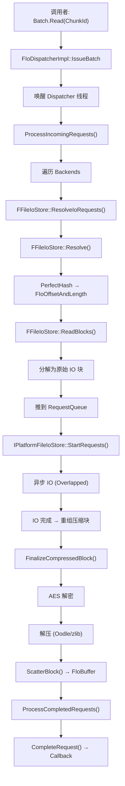
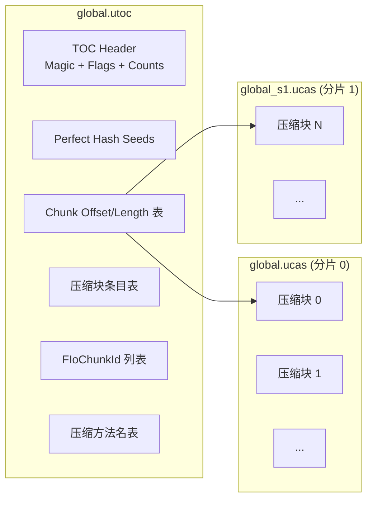

# IOStore 存储系统详解

## 摘要
IOStore（IoStore）是 UE5 引入的新一代资源存储格式，替代传统的 Pak 文件加载路径。采用 .utoc（Table of Contents）+ .ucas（Content Archive Storage）双文件容器架构，通过 FIoDispatcher 统一 IO 调度、完美哈希 O(1) Chunk 查找、固定大小压缩块、AES 容器级加密和 RSA 签名，为 Cooked 运行时提供高性能的流式加载。

## 适合解决的问题
- .utoc 和 .ucas 文件格式是什么？与传统 .pak 有什么区别？
- FIoDispatcher 如何调度 IO 请求？
- Chunk 如何通过完美哈希查找？
- IOStore 如何处理压缩和加密？
- 如何从 IOStore 读取一个资源？
- IO 请求的优先级系统如何工作？

## 核心结论
1. IOStore 使用 FIoChunkId（12 字节）标识 Chunk，替代文件路径查找
2. .utoc 包含完美哈希种子表，实现 O(1) Chunk→Offset 查找
3. 固定大小压缩块（默认 64KB）对其 AES 块边界，支持多压缩方法
4. FIoDispatcher 是全局单例，通过优先级系统和多 Backend 路由 IO 请求
5. FFileIoStore 使用双缓冲重叠 IO + 异步解压实现高吞吐
6. IOStore 支持容器级加密（AES）、签名（RSA+block SHA1）、分片（_s1.ucas）
7. IOStore 在 Cook 阶段由 CreateIoStoreContainerFiles() 生成

## 源码位置

| 组件 | 路径 | 作用 |
|------|------|------|
| IoStore 核心 | `Engine/Source/Runtime/Core/Internal/IO/IoStore.h` | TOC Header、压缩块条目等数据结构 |
| IoStore 实现 | `Engine/Source/Runtime/Core/Private/IO/IoStore.cpp` | Reader/Writer、TOC 解析 |
| FIoDispatcher | `Engine/Source/Runtime/Core/Public/IO/IoDispatcher.h` | 调度器声明 |
| 调度器实现 | `Engine/Source/Runtime/Core/Private/IO/IoDispatcher.cpp` | 调度线程、Request 处理 |
| FIoChunkId | `Engine/Source/Runtime/Core/Public/IO/IoChunkId.h` | Chunk ID 类型定义 |
| FIoContainerId | `Engine/Source/Runtime/Core/Public/IO/IoContainerId.h` | Container ID (CityHash64) |
| FIoContainerHeader | `Engine/Source/Runtime/Core/Public/IO/IoContainerHeader.h` | Container 内 Package 元数据 |
| 优先级 | `Engine/Source/Runtime/Core/Public/IO/IoDispatcherPriority.h` | 优先级枚举 |
| FFileIoStore | `Engine/Source/Runtime/PakFile/Private/IoDispatcherFileBackend.h` | 文件 IO 后端 |
| FFileIoStore 实现 | `Engine/Source/Runtime/PakFile/Private/IoDispatcherFileBackend.cpp` | 文件 IO 后端实现 |
| IIoStoreWriter | `Engine/Source/Developer/IoStoreUtilities/Private/IoStoreWriter.h` | Writer 接口 |
| 容器生成 | `Engine/Source/Developer/IoStoreUtilities/Private/IoStoreUtilities.cpp` | CreateIoStoreContainerFiles |

## 1. 文件格式

### .utoc — Table of Contents（目录索引）

`FIoStoreTocResourceView::Read()`（IoStore.cpp:1247）解析以下布局：

```
[FIoStoreTocHeader]                   ← 固定大小头部
  - Magic: "-==--==--==--==-"         ← 魔数标识
  - Version                           ← TOC 版本
  - TocEntryCount                     ← Chunk 条目总数
  - CompressionBlockSize              ← 压缩块大小
  - PartitionCount / PartitionSize    ← 分片信息
  - ContainerId (FIoContainerId)      ← Container ID
  - EncryptionKeyGuid (FGuid)         ← 加密密钥 GUID
  - ContainerFlags (EIoContainerFlags)← 容器标志
[Chunk IDs]                           ← FIoChunkId[TocEntryCount] (12B × N)
[Chunk Offset/Lengths]                ← FIoOffsetAndLength[TocEntryCount] (10B × N)
[Perfect Hash Seeds]                  ← int32[SeedsCount] (可选, vPerfectHash+)
[Chunks Without Perfect Hash]         ← int32[OverflowCount] (可选)
[Compression Block Entries]           ← FIoStoreTocCompressedBlockEntry[]
  - 5 bytes offset, 3 bytes compressed size
  - 3 bytes uncompressed size, 1 byte compression method index
[Compression Method Names]            ← ANSI string table (32B × N)
[Signatures]                          ← (可选, ContainerFlags & Signed)
[Directory Index]                     ← (可选, ContainerFlags & Indexed)
[Chunk Metadata]                      ← FIoHash + flags per entry
```

### .ucas — Content Archive Storage（数据容器）

.ucas 文件存有实际的（可选的压缩/加密）Chunk 数据：
- 原始压缩块数据，块内无内部头部
- 可分片：`container_s1.ucas`, `_s2.ucas` 等（支持 4GB+ 文件系统限制）
- 分片命名：`{ContainerPath}_s{N}.ucas`（N 从 1 开始）

### Container Flags

```cpp
// IoDispatcher.h:479-487
Compressed  = 0x01  // 使用压缩
Encrypted   = 0x02  // 数据 AES 加密
Signed      = 0x04  // 有 RSA 签名
Indexed     = 0x08  // 有目录索引
OnDemand    = 0x10  // On-Demand 流式传输
```

## 2. 关键类

### FIoChunkId — 12 字节 Chunk 标识

```cpp
// IoChunkId.h:63-156
struct FIoChunkId {
    uint8 Id[12];  // 8B generic/FPackageId + 2B chunk index + 1B group + 1B type
};
```

**Chunk 类型（EIoChunkType）**：
- `ExportBundleData` — Export 包数据
- `BulkData` — 内联 Bulk Data
- `OptionalBulkData` — 可选 Bulk Data
- `MemoryMappedBulkData` — 内存映射 Bulk Data
- `ScriptObjects` — 脚本对象
- `ContainerHeader` — Container 头部
- `ShaderCodeLibrary` / `ShaderCode` — Shader 代码
- `PackageStoreEntry` — Package Store 条目
- `DerivedData` — 衍生数据
- `PackageResource` — Package 资源

### FIoContainerId — Container 标识

```cpp
// IoContainerId.cpp:13-24
// 由 Container 名称（小写）通过 CityHash64 计算
FIoContainerId::FromName(FName("global")) → 64-bit hash
```

### FIoDispatcher — 全局 IO 调度器

```cpp
// IoDispatcher.h:349-393, 实现于 IoDispatcher.cpp:977-1076
class FIoDispatcher {
    FIoBatch NewBatch();                    // 创建批量请求
    void Mount(TSharedPtr<IIoDispatcherBackend>, Priority); // 挂载 Backend
    
    // 内部线程：优先级 TPri_AboveNormal
    // ProcessIncomingRequests() → Backend::ResolveIoRequests()
    // ProcessCompletedRequests() → CompleteRequest() → Callback
};
```

**FIoBatch** 用于累积多个读取请求并原子提交：
```cpp
FIoBatch Batch = Dispatcher.NewBatch();
FIoRequest Req1 = Batch.Read(ChunkId1, Options, Priority);
FIoRequest Req2 = Batch.Read(ChunkId2, Options, Priority);
Batch.Issue();  // 全部请求同时提交
```

### FIoStoreReader — TOC 读取器

```cpp
// IoDispatcher.h:593-638
class FIoStoreReader {
    bool Initialize(FStringView ContainerPath, ...); // 打开 .utoc + .ucas
    FIoStatus Read(FIoChunkId, ...);
    TIoStatusOr<FIoBuffer> ReadAsync(FIoChunkId, ...);
    // 使用 12 个轮转文件句柄/partition 实现重叠 IO
    // 双缓冲：块 N 解压时块 N+1 的 IO 可进行
};
```

### IIoStoreWriter — Cook 端写入器

```cpp
// IoStoreWriter.h:104-188
class IIoStoreWriter {
    // Append() → Hash → Compress → Encrypt/Sign → Write to partitions
    // 支持 DDC 缓存压缩结果
    // IIoStoreWriterReferenceChunkDatabase 复用已压缩块
};
```

## 3. 完美哈希查找

TOC 存储完美哈希种子表用于 O(1) Chunk 查找：

```cpp
// IoStore.cpp:1649-1659
uint64 FIoStoreTocResource::HashChunkIdWithSeed(FIoChunkId ChunkId, int32 Seed) {
    // FNV-1a-like 64-bit hash
    // 每个哈希桶一个种子，保证无冲突
}
// 溢出条目（无法完美哈希的）存储在 ChunkIndicesWithoutPerfectHash 中
// 通过线性搜索补齐
```

## 4. 完整读取路径

```
Caller Thread:
  1. Batch = Dispatcher.NewBatch()
  2. Req = Batch.Read(ChunkId, Options, Priority)  // 创建 FIoRequestImpl
  3. Batch.Issue()                                  // 唤醒 Dispatcher 线程

Dispatcher Thread (Priority: TPri_AboveNormal):
  4. ProcessIncomingRequests()
  5. For each Backend (按 Priority 顺序):
     Backend->ResolveIoRequests()
     
  6. FFileIoStore::Resolve():
     ChunkId → PerfectHash → FIoOffsetAndLength → Container + File offset
     
  7. FFileIoStore::ReadBlocks():
     分解为压缩块 → 分解为原始 IO 块 → 推入 RequestQueue
     (按文件句柄+偏移排序以优化磁盘寻道，或按优先级排序)
     
Platform IO Thread:
  8. IPlatformFileIoStore::StartRequests()
     异步 IO (ReadFile/Overlapped)
     完成后重组为 FFileIoStoreCompressedBlock

Dispatcher Thread (继续):
  9. FinalizeCompressedBlock():
     解密 (AES) → 解压 (Oodle/zlib/等)
  10. ScatterBlock():
      将解压数据复制到 Request 的 FIoBuffer
      
  11. ProcessCompletedRequests():
      Backend->GetCompletedIoRequests()
      CompleteRequest() → 触发 FIoReadCallback
      递减 Batch.UnfinishedRequestsCount → Batch 完成
```

### IO 优先级系统

```cpp
// IoDispatcherPriority.h:8-16
IoDispatcherPriority_Min    = INT32_MIN
IoDispatcherPriority_Low    = INT32_MIN / 2
IoDispatcherPriority_Medium = 0
IoDispatcherPriority_High   = INT32_MAX / 2
IoDispatcherPriority_Max    = INT32_MAX
```

优先级在以下环节生效：
- `FFileIoStoreRequestQueue`：按 Priority 排序，同级按 FIFO Sequence
- `GIoDispatcherSortRequestsByOffset`：启用时按文件句柄+偏移排序（电梯算法）
- `FIoRequest::UpdatePriority()` 可动态调整

### 块缓存与去重

- **FFileIoStoreBlockCache**：LRU 缓存原始 IO 块（Key=(FileIndex, BlockIndex)）
- **FFileIoStoreRequestTracker**：去重正在进行中的压缩块和原始 IO 块请求

## 5. 压缩与加密

### 压缩块
- 固定大小 `CompressionBlockSize`（默认 64KB）
- 每个 `FIoStoreTocCompressedBlockEntry` 编码：偏移、压缩后大小、原始大小、压缩方法
- 方法 0 = NAME_None（无压缩）；其他 = 命名方法（Oodle、zlib 等）
- Writer 端支持 DDC 缓存压缩结果和 ReferenceChunkDatabase 复用

### 加密
- Container 级 AES-256 加密（`ContainerFlags & Encrypted`）
- 密钥由 `EncryptionKeyGuid` 标识
- 压缩块对齐 AES 块大小（16 字节）

### 签名
- Container 级 RSA 签名（`ContainerFlags & Signed`）
- 每个压缩块有 SHA1 哈希（FSHAHash）
- TOC 整体被 RSA 签名保护

## 6. 与传统 Pak 对比

| 特性 | Pak | IOStore |
|------|-----|---------|
| 索引 | 文件路径树 | 完美哈希 Chunk ID |
| 粒度 | 完整文件 | Chunk（Export、BulkData、Shader 等） |
| 压缩 | 文件级 | 固定块级压缩 |
| 加密 | 文件级 AES | Container 级 AES |
| 签名 | 文件级 | Container 级 RSA |
| 分片 | 单 .pak | 多 .ucas 分片 |
| IO 调度 | 简单请求/完成 | 多层次：Resolve→Read→Decompress→Scatter |
| 优先级 | 无 | 完整优先级系统 |
| 块去重 | 无 | BlockCache + RequestTracker |

## 7. Cooker 集成

### IoStoreCommandlet
```cpp
// IoStoreCommandlet.cpp:13-20
int32 UIoStoreCommandlet::Main(...) {
    CreateIoStoreContainerFiles(Params);
}
```

### CreateIoStoreContainerFiles
`IoStoreUtilities.cpp:9835` — 主入口，处理：
- 容器创建（global、game、各 DLC）
- Chunk 写入和压缩
- 完美哈希种子计算
- 签名和加密
- 分片输出

### PakFile 中的 IOStore 集成
`IPlatformFilePak.cpp:5668-5677`：Mount Pak 时检测对应 .utoc，同时挂载 IOStore Container：
```cpp
IoDispatcherFileBackend->Mount(*GlobalUTocPath, 0, ...);
PackageStoreBackend->Mount(ContainerHeader);
```

## 8. Mermaid 调用图

### IO 读取全路径



### Container 结构



## 9. 常见误区

| 误区 | 正确理解 |
|------|----------|
| IOStore 完全替代了 Pak | IOStore 用于 Cooked 运行时加载，编辑器仍用传统 Pak/文件系统 |
| .utoc 可以被编辑 | .utoc 是编译产物，由 Cook 过程生成，不可手动编辑 |
| 每个 Package 对应一个 Chunk | 一个 Package 的数据分散在多个 Chunk（ExportBundle + BulkData + 可选数据） |
| IOStore 需要 SDK 配置 | IOStore 是在引擎内部实现的，无需外部 SDK |

## 10. 调试建议

1. **查看 IOStore 状态**：`stat iostore` 控制台命令
2. **查看 Container 信息**：检查 `<Project>/Content/Paks/` 中的 .utoc 文件
3. **追踪 IO 请求**：启用 `IoStore` trace channel（Unreal Insights）
4. **调试读取失败**：检查 FIoChunkId 构造是否正确、Container 是否已 Mount
5. **性能分析**：`IoDispatcher` trace、`FIoDispatcherImpl` 线程等待时间
6. **配置 CVars**（IoDispatcherConfig.h）：`GIoDispatcherBufferSizeKB`（256KB）、`GIoDispatcherBufferMemoryMB`（16MB）、`GIoDispatcherDecompressionWorkerCount`

## 源码证据
- Engine/Source/Runtime/Core/Internal/IO/IoStore.h:43-80（FIoStoreTocHeader）
- Engine/Source/Runtime/Core/Internal/IO/IoStore.h:105-164（FIoStoreTocCompressedBlockEntry）
- Engine/Source/Runtime/Core/Private/IO/IoStore.cpp:315-1108（FIoStoreReaderImpl）
- Engine/Source/Runtime/Core/Private/IO/IoStore.cpp:1247-1418（TOC 解析）
- Engine/Source/Runtime/Core/Private/IO/IoStore.cpp:1649-1659（完美哈希）
- Engine/Source/Runtime/Core/Public/IO/IoDispatcher.h:349-393（FIoDispatcher 声明）
- Engine/Source/Runtime/Core/Private/IO/IoDispatcher.cpp:977-1076（FIoDispatcherImpl）
- Engine/Source/Runtime/Core/Public/IO/IoChunkId.h:27-44（EIoChunkType）
- Engine/Source/Runtime/Core/Public/IO/IoChunkId.h:63-156（FIoChunkId）
- Engine/Source/Runtime/Core/Public/IO/IoContainerId.h:17-74（FIoContainerId）
- Engine/Source/Runtime/Core/Public/IO/IoContainerHeader.h:109-128（FIoContainerHeader）
- Engine/Source/Runtime/Core/Public/IO/IoDispatcherPriority.h:8-16（优先级）
- Engine/Source/Runtime/PakFile/Private/IoDispatcherFileBackend.h（FFileIoStore 声明）
- Engine/Source/Runtime/PakFile/Private/IoDispatcherFileBackend.cpp（FFileIoStore 实现）
- Engine/Source/Runtime/PakFile/Internal/IoDispatcherFileBackendTypes.h（请求队列、压缩块类型）
- Engine/Source/Developer/IoStoreUtilities/Private/IoStoreWriter.h:104-188（IIoStoreWriter）
- Engine/Source/Developer/IoStoreUtilities/Private/IoStoreUtilities.cpp:9835（CreateIoStoreContainerFiles）
- Engine/Source/Editor/UnrealEd/Private/Commandlets/IoStoreCommandlet.cpp:13-20（Commandlet 入口）

## 相关文档
- [Pak.md](Pak.md) — Pak 文件系统（传统格式）
- [Cook.md](Cook.md) — Cook 系统
- [Package.md](Package.md) — UPackage 格式
- [Dynamic_Loading.md](Dynamic_Loading.md) — 动态加载系统
