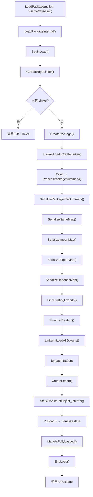
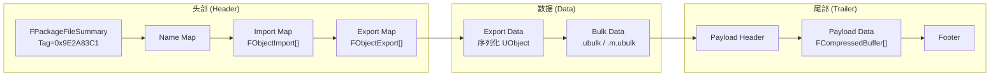
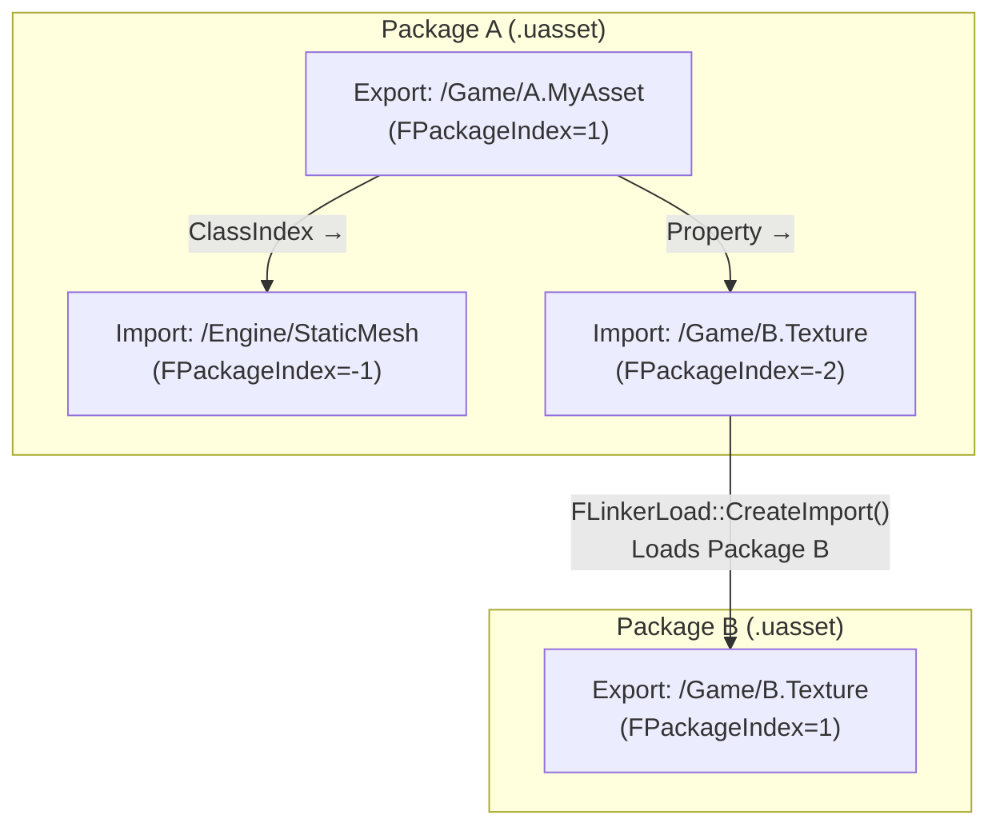

# UPackage 与 Package 文件格式详解

## 摘要
UPackage 是 UE5.7.4 中 Assets 的容器和磁盘持久化单元。每个 `.uasset`/`.umap` 文件对应一个 UPackage，内部通过 FLinkerLoad 管理 Import/Export 表实现对象引用和加载。本文档覆盖 UPackage 类结构、FLinkerLoad/Save 架构、Package 文件二进制格式、PKG_ 标志位系统、完整的同步加载调用链、以及 FPackageTrailer 尾部结构。

## 适合解决的问题
- .uasset/.uexp/.ubulk 文件里到底存了什么？
- UPackage 和 UObject 的区别是什么？
- Import 和 Export 表如何工作？
- 加载一个 Package 的完整调用链是怎样的？
- PKG_* 标志位各有什么含义？
- Package Trailer 是什么？它如何支持 Cooked 加载？

## 核心结论
1. UPackage 是 UObject 的子类，是 Assets 的物理容器和命名作用域
2. 每个 Package 文件包含 FPackageFileSummary 头部 + Name/Import/Export 映射表 + 序列化对象数据 + 尾部 Trailer
3. FLinkerLoad 负责从磁盘读取 Package 并将其反序列化为 UObject 实例
4. Import 表记录外部引用（其他 Package 的对象），Export 表记录本 Package 拥有的对象
5. FPackageIndex 使用正负号区分 Import（负数）和 Export（正数）
6. Package 有 28 个 PKG_* 标志位控制加载、保存、Cook 行为
7. Cooked Package 使用 FPackageTrailer 支持分块加载和 Local Payload

## 源码位置

| 组件 | 路径 | 作用 |
|------|------|------|
| UPackage 声明 | `Engine/Source/Runtime/CoreUObject/Public/UObject/Package.h` | UPackage 类定义 |
| FPackageFileSummary | `Engine/Source/Runtime/CoreUObject/Public/UObject/PackageFileSummary.h` | Package 头部结构 |
| FObjectResource | `Engine/Source/Runtime/CoreUObject/Public/UObject/ObjectResource.h` | FObjectExport/FObjectImport/FPackageIndex |
| FLinkerLoad | `Engine/Source/Runtime/CoreUObject/Public/UObject/LinkerLoad.h` | Linker 加载器声明 |
| FLinkerLoad 实现 | `Engine/Source/Runtime/CoreUObject/Private/UObject/LinkerLoad.cpp` | 加载实现 |
| FLinkerSave | `Engine/Source/Runtime/CoreUObject/Public/UObject/LinkerSave.h` | Linker 保存器声明 |
| SavePackage2 | `Engine/Source/Runtime/CoreUObject/Private/UObject/SavePackage2.cpp` | 保存主实现 |
| FPackageTrailer | `Engine/Source/Runtime/CoreUObject/Public/UObject/PackageTrailer.h` | Package Trailer 结构 |
| PKG 标志 | `Engine/Source/Runtime/CoreUObject/Public/UObject/ObjectMacros.h:128-161` | EPackageFlags 枚举 |
| LOAD 标志 | `Engine/Source/Runtime/CoreUObject/Public/UObject/ObjectMacros.h:67-93` | ELoadFlags 枚举 |
| LoadPackage | `Engine/Source/Runtime/CoreUObject/Private/UObject/UObjectGlobals.cpp` | 同步加载入口 |
| ObjectVersion | `Engine/Source/Runtime/Core/Public/UObject/ObjectVersion.h:14` | PACKAGE_FILE_TAG 定义 |

## 1. UPackage 类结构

### 继承链
```
UObject → UPackage
```

UPackage 是少数直接继承 UObject 的类之一（不是 UActor/UActorComponent 体系）。

### 关键成员

| 成员 | 类型 | 说明 |
|------|------|------|
| `bDirty` | uint8:1 | Package 已被修改需要保存 |
| `bHasBeenFullyLoaded` | uint8:1 | 所有 Export 都已创建 |
| `PackageFlagsPrivate` | atomic\<uint32\> | PKG_* 标志位（线程安全） |
| `PackageId` | FPackageId | 全局唯一 Package ID |
| `LoadedPath` | FPackagePath | 加载时的文件路径 |
| `MetaData` | FMetaData | 编辑器元数据（WITH_METADATA only） |
| `PersistentGuid` | FGuid | 持久化 GUID（跨保存不变） |
| `ChunkIDs` | TArray\<int32\> | Streaming install chunk IDs |
| `PIEInstanceID` | int32 | PIE 实例 ID（INDEX_NONE 表示非 PIE） |
| `FAdditionalInfo` | 私有结构 | 延迟分配的扩展信息（Linker 指针、版本号、文件大小等） |

### 关键方法
- `GetLinker()` — 获取关联的 FLinkerLoad
- `GetPackageFlags()` / `SetPackageFlags()` / `ClearPackageFlags()` — PKG_ 标志管理
- `IsFullyLoaded()` / `MarkAsFullyLoaded()` — 加载状态管理
- `Save()` / `SavePackage()` — 静态保存方法

## 2. Package 文件格式（On-Disk）

### 整体结构

```
[FPackageFileSummary]      ← 头部 TOC（固定起始）
[Name Map]                 ← FName 表
[Soft Object Path List]    ← FSoftObjectPath 列表
[Gatherable Text Data]     ← 可本地化文本
[Import Map]               ← FObjectImport[]（外部引用）
[Export Map]               ← FObjectExport[]（本包对象）
[Depends Map]              ← 依赖关系图
[Soft Package Ref List]    ← 软引用包列表
[Searchable Names Map]     ← 可搜索名称映射
[Import Type Hierarchies]  ← 导入类型层级（编辑器）
[Asset Registry Data]      ← 资产注册数据
[Thumbnail Table]          ← 缩略图数据（编辑器）
[Preload Dependencies]     ← 预加载依赖
[Data Resource Map]        ← 数据资源映射
--- TotalHeaderSize 结束 ---
[Export Data]              ← 序列化 UObject 数据
[Bulk Data Blocks]         ← BulkDataStartOffset 开始
[FPackageTrailer]          ← 文件尾部（反向读取）
```

### FPackageFileSummary 关键字段

| 字段 | 类型 | 说明 |
|------|------|------|
| `Tag` | int32 | 魔数 `PACKAGE_FILE_TAG = 0x9E2A83C1` |
| `FileVersionUE` | FPackageFileVersion | UE4 + UE5 版本号 |
| `PackageFlags` | uint32 | PKG_* 标志位 |
| `TotalHeaderSize` | int32 | 头部总大小 |
| `PackageName` | FString | Package 名称 |
| `NameCount` / `NameOffset` | — | 名称表位置 |
| `ExportCount` / `ExportOffset` | — | 导出表位置 |
| `ImportCount` / `ImportOffset` | — | 导入表位置 |
| `BulkDataStartOffset` | int64 | Bulk Data 起始位置 |
| `PayloadTocOffset` | int64 | 负载 TOC 位置 |
| `CompressionFlags` | ECompressionFlags | 压缩方式 |
| `SavedHash` | FIoHash | 保存时的哈希（编辑器） |
| `PersistentGuid` | FGuid | 持久化 GUID（编辑器） |

### 多文件分离（Cooked）

Cooked Package 将数据分离为多个文件：
- `.uasset` — Package 头部 + 元数据
- `.uexp` — Export 数据（序列化 UObject）
- `.ubulk` — 内联 Bulk Data
- `.m.ubulk` — 内存映射 Bulk Data
- `.opt.ubulk` — 可选 Bulk Data
- `.uptnl` — 负载数据

## 3. FPackageIndex — Import/Export 索引

```cpp
// ObjectResource.h:43-184
// 正数 = Export Map 索引（实际索引 = FPackageIndex - 1）
// 负数 = Import Map 索引（实际索引 = -FPackageIndex - 1）
// 零   = null / 无效
```

### FObjectImport — 外部引用

```cpp
struct FObjectImport {
    FName ObjectName;          // 对象名称
    FPackageIndex OuterIndex;  // 外层索引（0 = 顶层 Package）
    FName ClassPackage;        // 类所在包
    FName ClassName;           // 类名
    // transient:
    UObject* XObject;          // 已解析的对象指针
    FLinkerLoad* SourceLinker; // 源 Linker
    bool bImportPackageHandled;
    bool bImportSearchedFor;
    bool bImportFailed;
};
```

### FObjectExport — 本包拥有的对象

```cpp
struct FObjectExport {
    FPackageIndex ClassIndex;   // 导出对象的类
    FPackageIndex SuperIndex;   // 父结构（UStruct）
    FPackageIndex TemplateIndex;// 模板/原型
    EObjectFlags ObjectFlags;   // RF_* 标志
    int64 SerialSize;           // 序列化数据大小
    int64 SerialOffset;         // 文件中的绝对偏移
    int64 ScriptSerializationStartOffset; // Tagged property 起始
    int64 ScriptSerializationEndOffset;   // Tagged property 结束
    FPackageIndex OuterIndex;   // 外层
    FName ObjectName;           // 对象名称
    UObject* Object;            // transient: 实际的 UObject
    uint32 PackageFlags;        // Package 标志（顶层）
    // EDL 依赖布局字段...
};
```

## 4. PKG_* 标志位系统

```cpp
// ObjectMacros.h:128-161 — 28 个标志位
PKG_None                        = 0x00000000  // 无标志
PKG_NewlyCreated                = 0x00000001  // 新创建，未保存（编辑器）
PKG_ClientOptional              = 0x00000002  // 客户端可选
PKG_ServerSideOnly              = 0x00000004  // 仅服务器需要
PKG_CompiledIn                  = 0x00000010  // 来自"编译进"的类（native）
PKG_ForDiffing                  = 0x00000020  // 为 diff 加载
PKG_EditorOnly                  = 0x00000040  // 仅编辑器
PKG_Developer                   = 0x00000080  // Developer 模块
PKG_UncookedOnly                = 0x00000100  // 仅 Uncooked 加载
PKG_Cooked                      = 0x00000200  // 已 Cooked
PKG_ContainsNoAsset             = 0x00000400  // 不含 Asset 对象
PKG_NotExternallyReferenceable  = 0x00000800  // 对插件/挂载点私有
PKG_UnversionedProperties       = 0x00002000  // 使用 Unversioned 属性序列化
PKG_ContainsMapData             = 0x00004000  // 包含 Map 数据
PKG_IsSaving                    = 0x00008000  // 保存中（临时）
PKG_Compiling                   = 0x00010000  // 编译中
PKG_ContainsMap                 = 0x00020000  // 包含 ULevel/UWorld
PKG_RequiresLocalizationGather  = 0x00040000  // 需要本地化收集
PKG_PlayInEditor                = 0x00100000  // PIE 创建
PKG_ContainsScript              = 0x00200000  // 可包含 UClass
PKG_DisallowExport              = 0x00400000  // 不允许导出
PKG_CookGenerated               = 0x08000000  // Cook 生成
PKG_DynamicImports              = 0x10000000  // 运行时动态 Import
PKG_RuntimeGenerated            = 0x20000000  // 运行时生成
PKG_ReloadingForCooker          = 0x40000000  // Cooker 中重载（临时）
PKG_FilterEditorOnly            = 0x80000000  // 已过滤 Editor-Only 数据
```

**保存时清除的临时标志：** `PKG_NewlyCreated | PKG_IsSaving | PKG_ReloadingForCooker`

### LOAD_* 加载标志

```cpp
LOAD_Async                      = 0x00000001  // 异步加载
LOAD_NoVerify                   = 0x00000080  // 不验证存在性
LOAD_Verify                     = 0x00000010  // 仅验证存在性
LOAD_DisableCompileOnLoad       = 0x00400000  // 禁止加载时编译
LOAD_DeferDependencyLoads       = 0x00100000  // 延迟依赖加载
LOAD_DisableDependencyPreloading= 0x00001000  // 禁用依赖预加载
LOAD_PackageForPIE              = 0x00080000  // PIE Package
LOAD_ForDiff                    = 0x00020000  // Diff 加载
```

## 5. 同步加载完整调用链

```
LoadPackage(UPackage*, const TCHAR*, LoadFlags, ...)          // UObjectGlobals.cpp:1996
  → LoadPackage(UPackage*, const FPackagePath&, LoadFlags)    // UObjectGlobals.cpp:2058
    → LoadPackageInternal(UPackage*, FPackagePath, ...)       // UObjectGlobals.cpp:1649
      → BeginLoad(LoadContext)                                // 递增加载计数器
      → GetPackageLinker(InOuter, PackagePath, ...)           // Linker.cpp:627
        → FLinkerLoad::FindExistingLinkerForPackage()         // 检查已有 Linker
        → FCoreRedirects::GetRedirectedName()                 // Package 重定向
        → CreatePackage() / FindObject<UPackage>()            // 创建/查找 Package
        → FLinkerLoad::CreateLinker(LoadContext, Parent, ...) // LinkerLoad.cpp:527
          → FLinkerLoad::CreateLinkerAsync(...)               // 分配 FLinkerLoad
          → FLinkerLoad::Tick()                               // LinkerLoad.cpp:1067
            → CreateLoader()                                  // 打开文件/Archive
            → ProcessPackageSummary()                         // LinkerLoad.cpp:898
              ├── SerializePackageFileSummary()               // 头部
              ├── SerializePackageTrailer()                   // Trailer
              ├── SerializeNameMap()                          // Name 表
              ├── SerializeSoftObjectPathList()               // 软引用路径
              ├── SerializeImportMap()                        // Import 表
              ├── SerializeExportMap()                        // Export 表
              ├── FixupImportMap()                            // Import 修复
              ├── SerializeDependsMap()                       // 依赖图
              ├── CreateExportHash()                          // Export 哈希表
              ├── FindExistingExports()                       // 匹配已有对象
              └── FinalizeCreation()                          // 注册 Linker
      → Linker->LoadAllObjects()                              // LinkerLoad.cpp:4483
        → for each Export in ExportMap:
          → CreateExportAndPreload(ExportIndex)               // LinkerLoad.cpp:896
            → CreateExport(Index)                             // LinkerLoad.cpp:5200
              → GetExportLoadClass()                          // 解析 Export 的类
              → Resolve Outer + Super                        // 解析外部引用
              → StaticConstructObject_Internal()              // 构造 UObject
            → Preload(Object)                                 // LinkerLoad.cpp:4694
              → Seek(Export.SerialOffset)
              → Serialize(Export.SerialSize)                  // 读取序列化数据
      → MarkAsFullyLoaded()
      → EndLoad(LoadContext)
      → return Package
```

### 异步路径（用于 Cooked + EDL）

当 `ShouldAlwaysLoadPackageAsync()` 返回 true 时：
```
LoadPackage() → LoadPackageAsync() + FlushAsyncLoading()
```

即使同步调用也走异步基础设施，因为 EDL（Event-Driven Loader）提供更好的并行性能。

## 6. FLinkerSave — Package 保存

```cpp
// SavePackage2.cpp:3965
FSavePackageResultStruct UPackage::Save2(UPackage*, UObject*, 
    const TCHAR*, const FSavePackageArgs&)
```

保存流程：
1. 构造 FLinkerSave
2. 通过 AssignSaver() 分配底层 Archive
3. FPackageHarvester 收集 Export/Import
4. 序列化头部（FPackageFileSummary → Name Map → Import Map → Export Map）
5. 序列化 Export 对象数据
6. Bulk Data 写入分离文件（.ubulk 等）
7. 构建并附加 FPackageTrailer
8. 通过 IPackageWriter 提交（Cook 路径）或直接写文件（编辑器路径）

## 7. FPackageTrailer — Cooked Package 尾部

Trailer 位于文件末尾，反向读取：

```
_____________________________
| [Header]                  |
| Tag (uint64)              | = 0xD1C43B2E80A5F697
| Version (uint32)          |
| HeaderLength (uint32)     |
| PayloadsDataLength (uint64)|
| NumPayloads (int32)       |
| LookupTableArray          | FIoHash→LocalPayload 映射
|___________________________|
| [Payload Data]            |
| FCompressedBuffer 数组     |
|___________________________|
| [Footer]                  |
| Tag (uint64)              | = 0x29BFCA045138DE76
| TrailerLength (uint64)    |
| PackageTag (uint32)       | = PACKAGE_FILE_TAG
|___________________________|
```

Trailer 支持 Local Payload 和 External（Virtual）Payload 两种模式：
- **Local Payload**：数据嵌入在 Package 文件尾部
- **Virtual Payload**：数据存储在 IOStore 容器中，通过 FIoHash 引用

## 8. Package 创建与保存 API

### 创建新 Package
```cpp
UPackage* Pkg = CreatePackage(*PackageName);
// 或
UPackage* Pkg = CreatePackage(nullptr, *PackageName);
```

### 加载 Package
```cpp
UPackage* Pkg = LoadPackage(nullptr, *PackagePath, LOAD_None);
```

### 保存 Package
```cpp
FSavePackageArgs SaveArgs;
SaveArgs.TopLevelFlags = RF_Public | RF_Standalone;
UPackage::SavePackage(Pkg, nullptr, *FilePath, SaveArgs);
// 新版 API:
UPackage::Save2(Pkg, Asset, *FilePath, SaveArgs);
```

## 9. Mermaid 调用图

### Package 加载流程



### Package 文件结构



### Import/Export 引用关系



## 10. 常见误区

| 误区 | 正确理解 |
|------|----------|
| UPackage 只是文件容器 | UPackage 是 UObject，有自己的标志位和生命周期 |
| .uasset 包含所有数据 | Cooked 后数据分离到 .uexp + .ubulk + Trailer |
| Import 表存储的是包名 | Import 存储对象级引用（ObjectName + ClassName + ClassPackage） |
| FPackageIndex 直接是数组索引 | 正数→Export、负数→Import、零→null，需要转换 |

## 11. 调试建议

1. **查看 Package 标志**：`obj dump PackageName`（编辑器控制台）
2. **查看 Import/Export**：在调试器中检查 `FLinkerLoad->ImportMap` / `ExportMap`
3. **验证 Package 完整性**：检查 `PACKAGE_FILE_TAG (0x9E2A83C1)` 魔数
4. **调试加载失败**：检查 `FCoreRedirects` Package 重定向是否正确
5. **查看 Trailer 内容**：在二进制编辑器中查看 Package 文件末尾的 Trailer 数据
6. **追踪加载时间**：启用 `stat loadtimes` 查看各 Package 加载耗时

## 源码证据
- Engine/Source/Runtime/Core/Public/UObject/ObjectVersion.h:14（PACKAGE_FILE_TAG）
- Engine/Source/Runtime/CoreUObject/Public/UObject/ObjectMacros.h:128-161（EPackageFlags）
- Engine/Source/Runtime/CoreUObject/Public/UObject/Package.h:215-1209（UPackage 类）
- Engine/Source/Runtime/CoreUObject/Public/UObject/PackageFileSummary.h:56-397（FPackageFileSummary）
- Engine/Source/Runtime/CoreUObject/Public/UObject/ObjectResource.h:43-184（FPackageIndex）
- Engine/Source/Runtime/CoreUObject/Public/UObject/ObjectResource.h:226-395（FObjectExport）
- Engine/Source/Runtime/CoreUObject/Public/UObject/ObjectResource.h:443-543（FObjectImport）
- Engine/Source/Runtime/CoreUObject/Public/UObject/LinkerLoad.h:119-1601（FLinkerLoad 声明）
- Engine/Source/Runtime/CoreUObject/Private/UObject/LinkerLoad.cpp:527（CreateLinker）
- Engine/Source/Runtime/CoreUObject/Private/UObject/LinkerLoad.cpp:898（ProcessPackageSummary）
- Engine/Source/Runtime/CoreUObject/Private/UObject/LinkerLoad.cpp:4483（LoadAllObjects）
- Engine/Source/Runtime/CoreUObject/Private/UObject/LinkerLoad.cpp:5200（CreateExport）
- Engine/Source/Runtime/CoreUObject/Private/UObject/LinkerLoad.cpp:4694（Preload）
- Engine/Source/Runtime/CoreUObject/Public/UObject/LinkerSave.h:47-405（FLinkerSave）
- Engine/Source/Runtime/CoreUObject/Private/UObject/SavePackage2.cpp:3965（UPackage::Save2）
- Engine/Source/Runtime/CoreUObject/Public/UObject/PackageTrailer.h:35-69（Trailer 格式）
- Engine/Source/Runtime/CoreUObject/Private/UObject/UObjectGlobals.cpp:1407-1434（StaticLoadObject）
- Engine/Source/Runtime/CoreUObject/Private/UObject/UObjectGlobals.cpp:1649-1994（LoadPackageInternal）

## 相关文档
- [Dynamic_Loading.md](Dynamic_Loading.md) — 动态加载系统
- [Cook.md](Cook.md) — Cook 系统
- [IOStore.md](IOStore.md) — IOStore 存储格式
- [Pak.md](Pak.md) — Pak 文件系统
- [AssetRegistry.md](AssetRegistry.md) — 资产注册表
