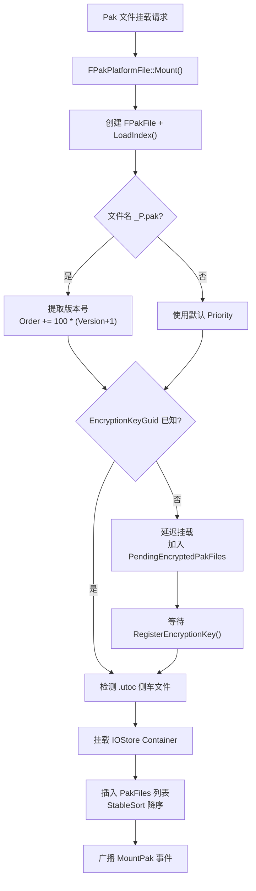
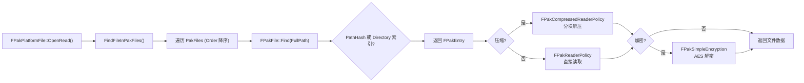

# Pak 文件系统详解

## 摘要
Pak 文件是 UE 传统的资源打包和分发格式。`FPakPlatformFile` 作为平台文件系统层插入虚拟文件系统栈，通过挂载多个 `.pak` 文件实现资源的虚拟化访问。UE5.7.4 中 Pak 系统与 IOStore 共存：Pak 负责文件级查找和挂载，IOStore 负责 Cooked 运行时的高性能 Chunk 级加载。

## 适合解决的问题
- .pak 文件的内部格式是什么？
- Pak 如何挂载？挂载顺序和优先级如何决定文件查找结果？
- Pak 加密和签名机制如何工作？
- 补丁 Pak（Patch Pak）如何实现文件覆盖？
- 引擎启动时如何发现和挂载 Pak？
- 如何在运行时挂载下载的 Pak？

## 核心结论
1. FPakFile 是 .pak 文件的读取器，尾部包含 FPakInfo 元数据和索引（PathHash 或 Directory 索引）
2. FPakPlatformFile 是平台文件系统层（IPlatformFile），插入虚拟文件栈管理所有已挂载 Pak
3. 挂载优先级由 PakOrder 决定（数值越大优先级越高），补丁 Pak 通过 `_P.pak` 命名获得额外优先级
4. 加密支持 AES-256（容器级或文件级），签名支持 RSA + per-block SHA1
5. 压缩支持 Oodle/zlib/gzip 等方法，在 FPakEntry 级别指定
6. 引擎启动时 `MountAllPakFiles()` 自动发现并挂载标准目录下的所有 Pak
7. 运行时可通过 `FCoreDelegates::MountPak` 委托动态挂载

## 源码位置

| 组件 | 路径 | 作用 |
|------|------|------|
| IPlatformFilePak.h | `Engine/Source/Runtime/PakFile/Public/IPlatformFilePak.h` | 主头文件：FPakFile、FPakEntry、FPakInfo、FPakPlatformFile |
| PakFile.cpp | `Engine/Source/Runtime/PakFile/Private/PakFile.cpp` | FPakFile 实现：Initialize、LoadIndex、Find |
| IPlatformFilePak.cpp | `Engine/Source/Runtime/PakFile/Private/IPlatformFilePak.cpp` | FPakPlatformFile 实现：Mount、文件访问、加密/压缩 |
| SignedArchiveReader | `Engine/Source/Runtime/PakFile/Private/SignedArchiveReader.h` | 签名验证 Archive Reader |
| IoDispatcherFileBackend | `Engine/Source/Runtime/PakFile/Private/IoDispatcherFileBackend.h` | IOStore 后端（Pak 中的 IOStore 挂载） |
| Engine 启动 | `Engine/Source/Runtime/Launch/Private/LaunchEngineLoop.cpp` | 启动时 Pak 挂载逻辑 |

## 1. .pak 文件内部格式

### 整体布局

```
[FPakEntry 数据块]          ← 各文件的压缩/加密数据
  [文件的压缩块...]
[Index]                      ← 文件索引（尾部的 FPakInfo 指向这里）
  - PathHash 索引 (v11+)
  - 或 Directory 索引 (旧版)
[FPakInfo]                   ← 尾部信息（反向读取）
  - Magic: 0x5A6F12E1
  - Version: 12 (Latest)
  - IndexOffset / IndexSize
  - EncryptionKeyGuid
  - CompressionMethods[5]
  - MountPoint
```

### FPakInfo — 尾部元数据

```cpp
// IPlatformFilePak.h:152
struct FPakInfo {
    uint32 EncryptedMagic;    // 如果加密: 加密的 Magic
    uint32 Magic;             // 总是 0x5A6F12E1
    int32 Version;           // PakFile_Version_Latest = 12
    int64 IndexOffset;       // 索引在文件中的偏移
    int64 IndexSize;         // 索引大小
    uint8 IndexHash[20];     // 索引 SHA1（验证完整性）
    bool bEncryptedIndex;    // 索引是否加密
    FGuid EncryptionKeyGuid; // 加密密钥 GUID
    FName CompressionMethods[5]; // 压缩方法名称数组
};
```

### Pak 版本历史

| 版本 | 新增特性 |
|------|----------|
| v1 | 初始格式 |
| v2 | 无时间戳 |
| v3 | 压缩+加密 |
| v4 | 索引加密 |
| v5 | 相对 Chunk 偏移 |
| v6 | 删除记录（Delete Records） |
| v7 | EncryptionKeyGuid |
| v8 | FName 压缩方法 |
| v9 | Frozen Index |
| v10 | PathHash 索引 |
| v11 | Fnv64 BugFix |
| v12 | UTF8 PakDirectory（Latest） |

## 2. FPakEntry — 文件条目

```cpp
// IPlatformFilePak.h:395-593
struct FPakEntry {
    int64 Offset;                         // 文件数据在 Pak 中的偏移
    int64 Size;                           // 序列化（压缩/加密后）大小
    int64 UncompressedSize;              // 解压后大小
    uint8 Hash[20];                       // 文件 SHA1 哈希
    TArray<FPakCompressedBlock> CompressionBlocks; // 压缩块列表
    uint32 CompressionBlockSize;          // 每个压缩块的大小
    uint32 CompressionMethodIndex;        // 压缩方法索引（0=不压缩）
    uint8 Flags;                          // Flag_Encrypted (0x01) | Flag_Deleted (0x02)
};
```

## 3. FPakPlatformFile — 平台文件系统集成

### 文件系统栈

```
Application
    ↓
FPakPlatformFile       ← Pak 虚拟文件层
    ↓
IPlatformFile (LowerLevel)  ← 真实文件系统
```

### 初始化

```cpp
// IPlatformFilePak.cpp:5609
FPakPlatformFile::Initialize(IPlatformFile* Inner, const TCHAR* CmdLine)
{
    LowerLevel = Inner;
    // 创建 IOStore 后端
    IoDispatcherFileBackend = MakeShared<FFileIoDispatcherBackend>();
    IoDispatcher.Mount(IoDispatcherFileBackend);
    // 挂载 global.utoc（如果存在）
    // 注册委托
    FCoreDelegates::MountPak.BindRaw(this, &HandleMountPakDelegate);
    FCoreDelegates::OnMountAllPakFiles.BindRaw(this, &MountAllPakFiles);
    // 发现并挂载所有启动 Pak
    MountAllPakFiles(PakFolders, StartupPaksWildcard);
}
```

### Mount() — Pak 挂载流程

```cpp
// IPlatformFilePak.cpp:5910-6192
void FPakPlatformFile::Mount(const FPakMountArgs& Args)
{
    // Step 1: 创建 FPakFile 并从磁盘加载索引
    TRefCountPtr<FPakFile> Pak = MakeRefCount<FPakFile>(LowerLevel, Filename, ...);
    
    // Step 2: 检测补丁 Pak（文件名 _P.pak）
    if (PakFilename.EndsWith("_P.pak"))
        PakOrder += 100 * ChunkVersionNumber;  // 大幅提高优先级
    
    // Step 3: 检查加密密钥
    if (Pak->Info.EncryptionKeyGuid is unknown)
        DeferMount();  // 延迟到密钥注册后
    
    // Step 4: 检查并挂载对应的 IOStore Container (.utoc)
    if (sidecar .utoc exists)
        IoDispatcherFileBackend->Mount(UtocPath, Priority);
        PackageStoreBackend->Mount(ContainerHeader);
    
    // Step 5: 插入 Pak 列表并按 Order 降序排序
    PakFiles.Add({PakOrder, Pak});
    PakFiles.StableSort();  // 高 Order 在前
    
    // Step 6: 广播挂载事件
    FCoreInternalDelegates::GetOnPakMountOperation().Broadcast(...);
}
```

### 文件查找优先级

```cpp
// GetPakOrderFromPakFilePath (IPlatformFilePak.cpp:6393)
// 优先级从高到低:
Project Content Paks/<ProjectName>-*  → 4
Project Content (other)              → 3
Engine Content                       → 2
Project Saved                        → 1
Other                                → 0
```

`FindFileInPakFiles()` 按 `PakOrder` 降序搜索所有挂载的 Pak，第一个匹配即为结果。更高 Order 的 Pak 可以"遮蔽"低 Order 的相同文件。

## 4. 压缩与加密

### 压缩

- 通过 FPakEntry 的 `CompressionBlockSize` 和 `CompressionBlocks` 实现分块压缩
- 支持多方法：NAME_Zlib、NAME_Gzip、TEXT("Oodle")，每个 Pak 最多 5 种
- `FPakCompressedReaderPolicy` 负责解压（IPlatformFilePak.cpp:4145）
- 异步解压通过 `FAsyncTask<FPakUncompressTask>` 实现

### 加密

- 文件级 AES-256 (`FAES::FAESKey`)，通过 `Flag_Encrypted` (0x01) 标记
- 密钥管理：`FGuid EncryptionKeyGuid` → `FCoreDelegates::GetPakEncryptionKeyDelegate()`
- `FPakSimpleEncryption`（IPlatformFilePak.cpp:4016）处理解密
- 密钥可通过 `FCoreDelegates::GetRegisterEncryptionKeyMulticastDelegate()` 动态注册

### 签名

- `.sig` 文件（`FPakSignatureFile`）包含 per-64KB-block SHA1 哈希
- `FChunkCacheWorker` 后台线程验证签名
- `FSignedArchiveReader` 透明读取并验证
- 签名密钥：`FCoreDelegates::GetPakSigningKeysDelegate()`

### 文件句柄类型组合

```cpp
// IPlatformFilePak.cpp:6284-6315
压缩+加密  → FPakFileHandle<FPakCompressedReaderPolicy<FPakSimpleEncryption>>
仅压缩    → FPakFileHandle<FPakCompressedReaderPolicy<>>
仅加密    → FPakFileHandle<FPakReaderPolicy<FPakSimpleEncryption>>
无        → FPakFileHandle<FPakReaderPolicy<>>
```

## 5. 补丁 Pak (Patch Pak)

### 命名约定

```
pakchunk0-WindowsClient.pak          ← 基础 Pak (Order = 3 或 4)
pakchunk0-V_1-WindowsClient_P.pak    ← 补丁 v1 (Order += 100 * 2 = 200)
pakchunk0-V_2-WindowsClient_P.pak    ← 补丁 v2 (Order += 100 * 3 = 300)
```

### 工作机制

1. 文件名以 `_P.pak` 结尾即识别为补丁
2. 从文件名中提取版本号（`_V_<Num>` 模式）
3. `PakOrder += 100 * (Version + 1)`，确保补丁永远优先于基础 Pak
4. 支持 `Flag_Deleted` 删除记录：补丁 Pak 中的删除条目可移除基础 Pak 中的文件
5. 不产生二进制 Diff — 补丁包含完整的新文件

## 6. 引擎启动 Pak 挂载序列

`LaunchEngineLoop.cpp` 中的挂载时序：

**Phase 1 — FPakPlatformFile::Initialize()：**
- 设置 IO Dispatcher 后端
- 挂载 `global.utoc` (IOStore 全局容器)
- 注册 `FCoreDelegates` 回调
- 调用 `MountAllPakFiles()` 挂载标准目录中的所有 Pak：
  - `<Project>/Content/Paks/`
  - `<Project>/Saved/Paks/`
  - `<Engine>/Content/Paks/`
  - 命令行 `-pakdir=` 指定目录

**Phase 2 — 早期启动后（LaunchEngineLoop.cpp:3565-3584）：**
- 如果 `FPaths::HasProjectPersistentDownloadDir()`：
  - 挂载 `<PersistentDownloadDir>/InstalledContent/<ProjectName>/Content/Paks/` 中的 Pak
- 刷新 Plugin 清单（新安装的 Plugin 内容）

## 7. 运行时动态挂载

### 方法 1：FCoreDelegates::MountPak

```cpp
// 公共 API — 最常用
FCoreDelegates::MountPak.Execute(PakFilePath, PakOrder);
```

### 方法 2：FPakPlatformFile 直接挂载

```cpp
FPakPlatformFile* PakPlatform = (FPakPlatformFile*)
    FPlatformFileManager::Get().FindPlatformFile(FPakPlatformFile::GetTypeName());
PakPlatform->Mount(*PakFilePath, PakOrder);
```

### 方法 3：FMountPaksEx（现代 API）

```cpp
// 支持 Pak + IOStore 联合挂载
FCoreDelegates::MountPaksEx.Execute(MountArgs);
```

### 挂载注意事项

- 加密 Pak 需要先注册密钥，否则挂载被延迟（`PendingEncryptedPakFiles`）
- 挂载后 `PackageStoreBackend` 自动注册 IOStore Container 中的 Package
- 文件扩展名限制：`.ini`、`.uasset`、`.umap` 等默认只能从 Pak 中加载（Shipping 构建）
- `GetOnPakFileMounted2()` 委托可用于监听挂载事件

## 8. Mermaid 调用图

### Pak 挂载与文件查找



### 文件读取路径



## 9. 常见误区

| 误区 | 正确理解 |
|------|----------|
| Pak 就是 ZIP | Pak 格式专为游戏流式加载设计，支持分块压缩、加密、签名、Patch 机制 |
| 挂载顺序不影响文件内容 | 高 Order 的 Pak 会遮蔽低 Order 的同名文件 |
| 补丁 Pak 只包含差异数据 | 补丁 Pak 包含完整的替代文件，不是二进制 diff |
| EncryptionKeyGuid 无效时 Pak 无法加载 | 使用嵌入式密钥（通过 `GetPakEncryptionKeyDelegate`） |
| PakFile 模块是独立程序 | PakFile 是 Runtime 模块，通过平台文件系统层嵌入引擎 |

## 10. 调试建议

1. **列出已挂载 Pak**：`pak ListMountedPaks` 控制台命令
2. **查看 Pak 文件信息**：检查尾部 `FPakInfo` 的 Magic (`0x5A6F12E1`)
3. **测试加密密钥注册**：`pak.TestRegisterEncryptionKey <guid> <base64key>`
4. **验证 Pak 完整性**：检查 Index SHA1 和 per-file SHA1 哈希
5. **追踪文件访问**：搜索 UBT log 中的 "PakFile" 或 "FPakPlatformFile" 日志
6. **挂载顺序调试**：检查 `FPakPlatformFile::PakFiles` 列表的 `ReadOrder` 值

## 源码证据
- Engine/Source/Runtime/PakFile/Public/IPlatformFilePak.h:395-593（FPakEntry）
- Engine/Source/Runtime/PakFile/Public/IPlatformFilePak.h:152（FPakInfo 结构）
- Engine/Source/Runtime/PakFile/Public/IPlatformFilePak.h:751-889（FPakFile 声明）
- Engine/Source/Runtime/PakFile/Public/IPlatformFilePak.h:1913-1962（FPakPlatformFile 声明）
- Engine/Source/Runtime/PakFile/Private/PakFile.cpp:272-304（FPakFile::Initialize）
- Engine/Source/Runtime/PakFile/Private/PakFile.cpp:347（FPakFile::LoadIndex）
- Engine/Source/Runtime/PakFile/Private/IPlatformFilePak.cpp:5609（Initialize）
- Engine/Source/Runtime/PakFile/Private/IPlatformFilePak.cpp:5910-6192（Mount）
- Engine/Source/Runtime/PakFile/Private/IPlatformFilePak.cpp:6393（GetPakOrderFromPakFilePath）
- Engine/Source/Runtime/PakFile/Private/IPlatformFilePak.cpp:6284-6315（文件句柄创建）
- Engine/Source/Runtime/PakFile/Private/IPlatformFilePak.cpp:6535（RegisterEncryptionKey）
- Engine/Source/Runtime/PakFile/Private/SignedArchiveReader.h（签名验证）
- Engine/Source/Runtime/Launch/Private/LaunchEngineLoop.cpp:3565-3584（启动挂载）
- Engine/Source/Runtime/Core/Public/Misc/CoreDelegates.h:127（MountPak 委托）

## 相关文档
- [IOStore.md](IOStore.md) — IOStore 存储格式（下一代替代方案）
- [Hot_Update.md](Hot_Update.md) — 热更新与补丁机制
- [Cook.md](Cook.md) — Cook 系统
- [Dynamic_Loading.md](Dynamic_Loading.md) — 动态加载系统
