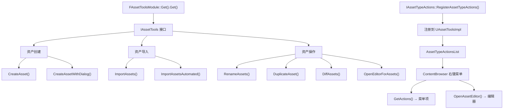

# AssetTools 资产工具详解

## 摘要
AssetTools 是 UE5.7.4 编辑器中程序化操作资产的核心 API。`IAssetTools` 接口提供资产创建、导入、重命名、复制、迁移、Diff 等功能。`FAssetToolsModule` 提供模块访问入口，`IAssetTypeActions` 允许每种资产类型注册自定义操作。资产分类通过 `EAssetTypeCategories` 位掩码系统管理，用户可注册自定义分类。

## 适合解决的问题
- 如何程序化创建资产？
- 如何注册自定义资产类型的右键菜单操作？
- 如何导入外部文件为 UE 资产？
- 如何批量重命名资产？
- 如何在自定义工具中打开某个资产的编辑器？

## 核心结论
1. `FAssetToolsModule::Get().Get()` 获取 `IAssetTools` 接口
2. `IAssetTools::CreateAsset()` 创建资产；`ImportAssets()` 导入外部文件
3. `IAssetTypeActions` 注册每种资产类型的操作（颜色、类别、右键菜单、编辑器）
4. 资产类别使用位掩码系统，`EAssetTypeCategories::FirstUser` 起分配给自定义类别
5. 新系统推荐使用 `UAssetDefinition` 替代旧的 `IAssetTypeActions`

## 源码位置

| 组件 | 路径 | 作用 |
|------|------|------|
| IAssetTools | `Engine/Source/Developer/AssetTools/Public/IAssetTools.h:283` | 资产工具公开接口 |
| FAssetToolsModule | `Engine/Source/Developer/AssetTools/Public/AssetToolsModule.h` | 模块入口 |
| IAssetTypeActions | `Engine/Source/Developer/AssetTools/Public/IAssetTypeActions.h:27` | 资产类型操作接口 |
| AssetTypeActions_Base | `Engine/Source/Developer/AssetTools/Public/AssetTypeActions_Base.h:24` | 便捷基类 |
| UAssetToolsImpl | `Engine/Source/Developer/AssetTools/Private/AssetTools.h:61` | 实现类 |
| 类别枚举 | `Engine/Source/Developer/AssetTools/Public/AssetTypeCategories.h:13` | 资产类别定义 |

## 1. IAssetTools 核心 API

### 获取接口

```cpp
// 方式 1: 模块直接访问
IAssetTools& AssetTools = FModuleManager::LoadModuleChecked<FAssetToolsModule>("AssetTools").Get();

// 方式 2: 静态访问（蓝图可调用）
IAssetTools& AssetTools = UAssetToolsHelpers::GetAssetTools();
```

### 资产创建

```cpp
// 同步创建
UObject* CreateAsset(const FString& AssetName, const FString& PackagePath,
    UClass* AssetClass, UFactory* Factory, FName CallingContext = NAME_None);

// 异步创建 (蓝图可调用)
void CreateAssetAsync(const FString& AssetName, const FString& PackagePath,
    UClass* AssetClass, UFactory* Factory, FCreateAssetAsyncCallback Callback);

// 带对话框创建
UObject* CreateAssetWithDialog(const FString& AssetName, const FString& PackagePath,
    UClass* AssetClass, UFactory* Factory, FName CallingContext = NAME_None);
```

### 资产导入

```cpp
// 带对话框导入
void ImportAssetsWithDialog(const FString& DestinationPath);

// 程序化导入
TArray<UObject*> ImportAssets(const TArray<FString>& Files, const FString& DestinationPath,
    UFactory* Factory, bool bSyncToBrowser = true);

// 自动化导入 (蓝图可调用)
TArray<UObject*> ImportAssetsAutomated(const UAutomatedAssetImportData* ImportData);
```

### 资产重命名

```cpp
// 批量重命名 (蓝图可调用)
bool RenameAssets(const TArray<FAssetRenameData>& AssetsAndNames);

// 带对话框重命名 (蓝图可调用)
bool RenameAssetsWithDialog(const TArray<FAssetRenameData>& AssetsAndNames);
```

### 资产复制

```cpp
UObject* DuplicateAsset(const FString& AssetName, const FString& PackagePath, UObject* Original);
```

### 资产 Diff

```cpp
void DiffAssets(UObject* OldAsset, UObject* NewAsset, 
    const struct FRevisionInfo& OldRevision, const struct FRevisionInfo& NewRevision);
```

## 2. IAssetTypeActions — 资产类型操作

```cpp
class IAssetTypeActions : public TSharedFromThis<IAssetTypeActions>
{
    virtual FText GetName() const = 0;
    virtual UClass* GetSupportedClass() const = 0;  // 关联的 UObject 子类
    virtual FColor GetTypeColor() const = 0;
    virtual uint32 GetCategories();                   // 位掩码类别
    virtual void OpenAssetEditor(const TArray<UObject*>& InObjects, ...);
    virtual void GetActions(const TArray<UObject*>& InObjects, FToolMenuSection& Section);
    virtual bool CanRename(const FAssetData& InAsset, FText* OutErrorMsg) const;
    virtual bool CanDuplicate(const FAssetData& InAsset, FText* OutErrorMsg) const;
};
```

### 注册/注销

```cpp
// 在模块 StartupModule() 中
IAssetTools& AssetTools = FModuleManager::LoadModuleChecked<FAssetToolsModule>("AssetTools").Get();
AssetTools.RegisterAssetTypeActions(MakeShareable(new FMyAssetTypeActions));

// 在模块 ShutdownModule() 中
AssetTools.UnregisterAssetTypeActions(MyAssetTypeActions);
```

### AssetTypeActions_Base 便捷基类

提供默认实现，只需重写关键方法：
```cpp
class FMyAssetTypeActions : public FAssetTypeActions_Base
{
    virtual FText GetName() const override { return LOCTEXT("Name", "My Asset"); }
    virtual UClass* GetSupportedClass() const override { return UMyAsset::StaticClass(); }
    virtual FColor GetTypeColor() const override { return FColor(255, 128, 64); }
    virtual uint32 GetCategories() override { return EAssetTypeCategories::Misc; }
};
```

## 3. 资产类别系统

```cpp
// AssetTypeCategories.h:13-34
namespace EAssetTypeCategories {
    enum Type : uint32 {
        None      = 0,
        Basic     = 1 << 0,   // 基础
        Animation = 1 << 1,   // 动画
        Materials = 1 << 2,   // 材质
        Sounds    = 1 << 3,   // 音频
        Physics   = 1 << 4,   // 物理
        UI        = 1 << 5,   // UI
        Misc      = 1 << 6,   // 杂项
        Gameplay  = 1 << 7,   // 玩法
        Blueprint = 1 << 8,   // 蓝图
        Media     = 1 << 9,   // 媒体
        Textures  = 1 << 10,  // 纹理
        World     = 1 << 11,  // 关卡
        FX        = 1 << 12,  // 特效
        FirstUser = 1 << 13,  // 用户自定义起始位
        LastUser  = 1 << 31,  // 最大值
    };
}

// 注册自定义类别
EAssetTypeCategories::Type MyCategory = AssetTools.RegisterAdvancedAssetCategory(
    FName("MyCategory"), LOCTEXT("MyCategory", "My Category"));
```

## 4. 内容浏览器上下文菜单扩展

```cpp
// 通过 UToolMenus 扩展
UToolMenus::Get()->ExtendMenu("ContentBrowser.AssetContextMenu.MyAsset")
    ->AddDynamicSection("MySection", ...);
```

## 5. Mermaid 调用图



## 6. 调试建议

- AssetTools 操作日志：Search "AssetTools" in editor log
- `AssetRegistry.Debug` 查看资产状态
- 资产权限：检查 `AssetClassPermissionList` 和 `FolderPermissionList`

## 源码证据
- Engine/Source/Developer/AssetTools/Public/IAssetTools.h:283-882（IAssetTools 接口）
- Engine/Source/Developer/AssetTools/Public/AssetToolsModule.h（FAssetToolsModule）
- Engine/Source/Developer/AssetTools/Public/IAssetTypeActions.h:27-219（IAssetTypeActions）
- Engine/Source/Developer/AssetTools/Public/AssetTypeActions_Base.h:24（便捷基类）
- Engine/Source/Developer/AssetTools/Public/AssetTypeCategories.h:13-34（类别枚举）
- Engine/Source/Developer/AssetTools/Private/AssetTools.h:61（UAssetToolsImpl）
- Engine/Source/Developer/AssetTools/Private/AssetTools.cpp（实现）

## 相关文档
- [ContentBrowser.md](ContentBrowser.md) — 内容浏览器
- [DetailsPanel.md](DetailsPanel.md) — 详情面板
