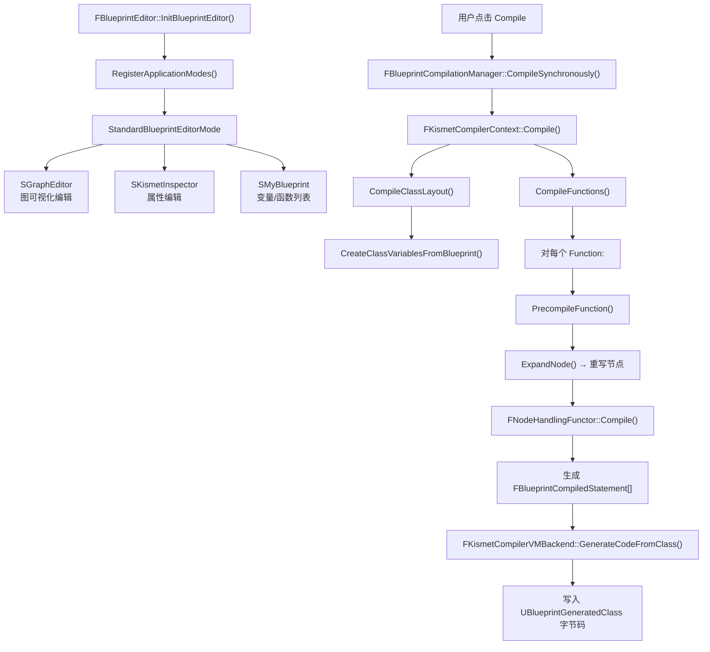
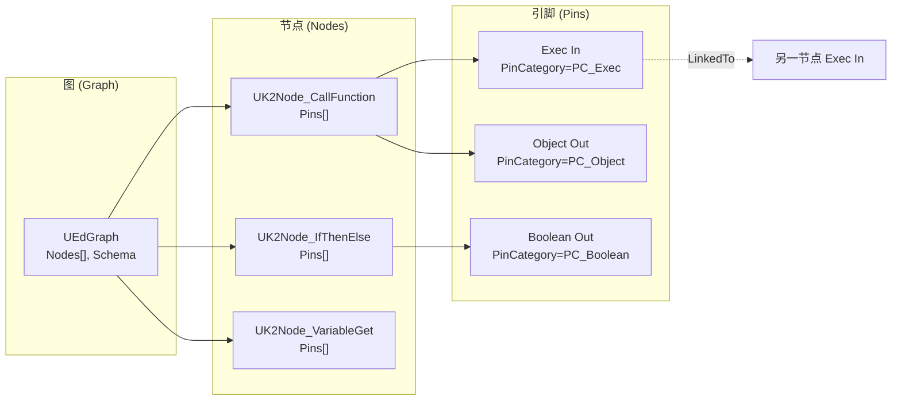

# BlueprintEditor 蓝图编辑器详解

## 摘要
BlueprintEditor（蓝图编辑器 / Kismet）是 UE5.7.4 中可视化和编辑 Blueprint 脚本的核心工具。`FBlueprintEditor` 继承自 `FWorkflowCentricApplication`，提供多模式界面（Standard、Defaults、Components、Interface、Macro）。底层基于 `UEdGraph`/`UEdGraphNode`/`UEdGraphPin` 图模型，编译由 `FKismetCompilerContext` 通过节点展开 → 语句生成 → 字节码输出的管线完成。调试系统支持断点、监视值和执行追踪。

## 适合解决的问题
- Blueprint 编辑器如何打开和初始化？
- UEdGraph/UEdGraphNode/UEdGraphPin 的数据模型是怎样的？
- Blueprint 编译管线从节点到字节码经历了哪些步骤？
- 如何添加自定义 Blueprint 节点？
- Blueprint 调试系统如何工作？

## 核心结论
1. `FBlueprintEditor` 通过 5 个 ApplicationMode 管理不同的编辑模式
2. 图模型由 `UEdGraph` (图) → `UEdGraphNode` (节点) → `UEdGraphPin` (引脚) 三层组成
3. 编译管线：`FKismetCompilerContext::Compile()` → `CreateClassLayout()` → `CompileFunctions()` → 字节码
4. EDL (Event-Driven Loader) 无关 —— Blueprint 编译完全独立于资源加载
5. 编译通过 `FNodeHandlingFunctor` 将每个 UK2Node 转换为 `FBlueprintCompiledStatement` 序列

## 源码位置

| 组件 | 路径 | 作用 |
|------|------|------|
| FBlueprintEditor | `Engine/Source/Editor/Kismet/Public/BlueprintEditor.h:212` | 主编辑器类 |
| UEdGraph | `Engine/Source/Runtime/Engine/Classes/EdGraph/EdGraph.h` | 图数据模型 |
| UEdGraphNode | `Engine/Source/Runtime/Engine/Classes/EdGraph/EdGraphNode.h` | 节点基类 |
| UEdGraphPin | `Engine/Source/Runtime/Engine/Classes/EdGraph/EdGraphPin.h` | 引脚数据模型 |
| UK2Node | `Engine/Source/Editor/BlueprintGraph/Classes/K2Node.h:203` | Kismet 节点基类 |
| FKismetCompilerContext | `Engine/Source/Editor/KismetCompiler/Public/KismetCompiler.h:78` | 编译管线 |
| SGraphEditor | `Engine/Source/Editor/UnrealEd/Public/GraphEditor.h` | 图编辑器 Widget |
| FBlueprintCompilationManager | `Engine/Source/Editor/Kismet/Public/BlueprintCompilationManager.h:38` | 编译管理器 |
| 节点类型目录 | `Engine/Source/Editor/BlueprintGraph/Classes/` | 200+ 节点类型 |
| 编译后端 | `Engine/Source/Editor/KismetCompiler/Private/KismetCompilerBackend.h:19` | 字节码生成 |

## 1. FBlueprintEditor — 主编辑器类

### 多模式编辑

```cpp
// BlueprintEditorModes.h
FBlueprintEditorApplicationModes::StandardBlueprintEditorMode  // 默认：Graph + Details + Palette
FBlueprintEditorApplicationModes::BlueprintDefaultsMode        // Class Defaults 编辑
FBlueprintEditorApplicationModes::BlueprintComponentsMode      // Components/SCS 编辑
FBlueprintEditorApplicationModes::BlueprintInterfaceMode       // Interface 编辑
FBlueprintEditorApplicationModes::BlueprintMacroMode           // Macro 编辑
```

### 初始化流程

```
FBlueprintEditorModule::CreateBlueprintEditor()
  → FBlueprintEditor::InitBlueprintEditor()
    → LoadEditorSettings()
    → CreateToolbar / Commands / Menus
    → InitAssetEditor()
    → CommonInitialization()        // 创建所有面板 Widget
      → 加载 Macro/Function 库
      → 创建 MyBlueprint, Palette, Inspector 面板
    → RegisterApplicationModes()    // 注册 5 个模式
    → PostLayoutBlueprintEditorInitialization()
```

### 核心面板

| 面板 | 类 | 职责 |
|------|-----|------|
| 图编辑器 | SGraphEditor | 可视化和编辑 Blueprint 图 |
| My Blueprint | SMyBlueprint | 变量、函数、宏列表 |
| 节点面板 | SBlueprintPalette | 可拖放的节点类型面板 |
| 详情面板 | SKismetInspector | 节点/变量属性编辑 |
| 编译器结果 | SKismetCompilerResults | 编译错误/警告列表 |
| 调试面板 | SKismetDebuggingView | 断点、监视、调用堆栈 |

## 2. 图模型 — UEdGraph/UEdGraphNode/UEdGraphPin

### UEdGraph

```cpp
class UEdGraph : public UObject {
    TArray<UEdGraphNode*> Nodes;     // 所有节点
    UEdGraphSchema* Schema;          // 图 Schema（定义连接规则）
    bool bEditable;
    bool bAllowDeletion;
};
```

### UEdGraphNode

```cpp
class UEdGraphNode : public UObject {
    int32 NodePosX, NodePosY;        // 位置
    TArray<UEdGraphPin*> Pins;       // 所有引脚
    FGuid NodeGuid;                  // 稳定标识
    FString NodeComment;             // 节点注释
    
    virtual void AllocateDefaultPins();
    virtual void ReconstructNode();
    virtual void PinConnectionListChanged(UEdGraphPin*);
    UEdGraphPin* CreatePin(EEdGraphPinDirection, FName, ...);
};
```

### UEdGraphPin

```cpp
class UEdGraphPin : public UObject {
    FName PinName;
    FGuid PinId;
    EEdGraphPinDirection Direction;  // EGPD_Input / EGPD_Output
    FEdGraphPinType PinType;         // 类型描述
    TArray<UEdGraphPin*> LinkedTo;   // 连接的引脚
    FString DefaultValue;            // 默认值
};
```

### FEdGraphPinType 类型描述

```cpp
struct FEdGraphPinType {
    FName PinCategory;      // PC_Exec, PC_Boolean, PC_Int, PC_Float,
                            // PC_Object, PC_Struct, PC_String, PC_Enum
    FName PinSubCategory;
    TWeakObjectPtr<UObject> PinSubCategoryObject;  // UClass/UScriptStruct/UEnum
    EPinContainerType ContainerType;  // None, Array, Set, Map
    bool bIsReference;
    bool bIsConst;
};
```

## 3. Blueprint 编译管线

### FKismetCompilerContext::Compile() 整体流程

```cpp
// KismetCompiler.h:219
void Compile()
{
    CompileClassLayout()   // Phase 1: 类布局
        → SpawnNewClass()
        → CleanAndSanitizeClass()
        → CreateClassVariablesFromBlueprint()  // UPROPERTY 生成
        → CreateFunctionList()
        → MergeUbergraphPagesIn()              // 事件图合并
    
    CompileFunctions()     // Phase 2: 函数编译
        → for each Function:
            → PrecompileFunction()   // 验证+修剪
            → CompileFunction()      // 节点 → 语句
            → PostcompileFunction()  // 标签修复
            → FinishCompileFunction()
    
    FinishCompilingClass()  // Final: 类注册
        → PostCDOCompiled()
}
```

### 节点编译 — UK2Node → FBlueprintCompiledStatement

```cpp
// 每个节点类型对应一个 FNodeHandlingFunctor
class FNodeHandlingFunctor {
    virtual void Compile(FKismetFunctionContext&, UEdGraphNode*) = 0;
    virtual void RegisterNets(FKismetFunctionContext&, UEdGraphNode*);
};

// 编译时:
// 1. UK2Node::ExpandNode() — 展开复杂节点为简单子节点
// 2. FNodeHandlingFunctor::Compile() — 生成 FBlueprintCompiledStatement
```

### 编译语句类型

| 语句 | 含义 |
|------|------|
| `KCST_CallFunction` | 调用 UFUNCTION |
| `KCST_Assignment` | 变量赋值 |
| `KCST_GotoIfNot` | 条件分支 |
| `KCST_UnconditionalGoto` | 无条件跳转 |
| `KCST_Return` | 函数返回 |
| `KCST_DebugSite` | 断点位置 |
| `KCST_WireTraceSite` | 执行追踪 |
| `KCST_DynamicCast` | 动态类型转换 |
| `KCST_CreateArray/Set/Map` | 容器创建 |

### FKismetCompilerVMBackend — 字节码生成

```cpp
// KismetCompilerBackend.h:19
// 将 FBlueprintCompiledStatement[] 序列化为实际 Bytecode
FKismetCompilerVMBackend::GenerateCodeFromClass()
```

## 4. Blueprint 调试系统

### 断点管理

```cpp
// FBlueprintEditor
void ClearAllBreakpoints();
void EnableAllBreakpoints();
void DisableAllBreakpoints();
void OnToggleBreakpoint();      // 切换节点断点
void OnAddBreakpoint();
void OnRemoveBreakpoint();
```

### 监视值

```cpp
void OnStartWatchingPin();      // 开始监视引脚值
void OnStopWatchingPin();
void ClearAllWatches();
```

### 执行追踪

- 编译时在每个节点注入 `KCST_DebugSite` 和 `KCST_WireTraceSite` 语句
- PIE 中高亮正在执行的节点和连线
- `FBlueprintDebugger` 管理调试状态

## 5. 扩展点

### 添加自定义 Blueprint 节点

```cpp
// 1. 继承 UK2Node
UCLASS()
class UMyCustomNode : public UK2Node
{
    GENERATED_BODY()
public:
    // 2. 注册菜单操作
    virtual void GetMenuActions(FBlueprintActionDatabaseRegistrar&) const override;
    
    // 3. 分配默认引脚
    virtual void AllocateDefaultPins() override;
    
    // 4. 编译节点
    virtual void ExpandNode(FKismetCompilerContext&, UEdGraph* SourceGraph) override;
};
```

### 其他扩展点

- `FBlueprintEditorModule::RegisterVariableCustomization()` — 变量显示自定义
- `FBlueprintEditorModule::RegisterGraphCustomization()` — 函数图自定义
- `FBlueprintEditorModule::OnRegisterTabsForEditor()` — 添加自定义 Tab
- `FGraphEditorModule::GetAllGraphEditorContextMenuExtender()` — 图编辑器右键菜单
- `UBlueprintCompilerExtension` — 编译后处理回调
- `UBlueprintNodeSpawner` 子类 — 自定义节点生成器

## 6. Mermaid 调用图



### 图模型三层架构



## 7. 常见 Blueprint 节点类型

| K2Node 类 | 用途 |
|-----------|------|
| `UK2Node_CallFunction` | 调用 UFUNCTION |
| `UK2Node_Event` / `UK2Node_CustomEvent` | 事件节点 |
| `UK2Node_IfThenElse` | Branch 分支 |
| `UK2Node_ExecutionSequence` | Sequence 序列 |
| `UK2Node_MakeArray/Map/Set/Struct` | 容器构造 |
| `UK2Node_DynamicCast` | 类型转换 |
| `UK2Node_Timeline` | 时间轴 |
| `UK2Node_InputAction/Key/Touch` | 输入处理 |
| `UK2Node_MacroInstance` | 宏实例 |
| `UK2Node_FunctionEntry/FunctionResult` | 函数入口/出口 |

## 8. 调试建议

1. 编辑器日志：Window → Developer Tools → Blueprint Debugger
2. 编译错误查看：Window → Developer Tools → Compiler Results
3. 断点调试：右键节点 → Add Breakpoint
4. 执行追踪：PIE 中查看 Blueprint 节点高亮
5. 编译详情：`BlueprintCompilationManager.EnableDetailedLog 1`
6. 查看字节码：在 `UBlueprintGeneratedClass` 的 `Script` 数组中

## 源码证据
- Engine/Source/Editor/Kismet/Public/BlueprintEditor.h:212（FBlueprintEditor 声明）
- Engine/Source/Editor/Kismet/Private/BlueprintEditor.cpp:2421（InitBlueprintEditor）
- Engine/Source/Runtime/Engine/Classes/EdGraph/EdGraph.h（UEdGraph）
- Engine/Source/Runtime/Engine/Classes/EdGraph/EdGraphNode.h（UEdGraphNode）
- Engine/Source/Runtime/Engine/Classes/EdGraph/EdGraphPin.h（UEdGraphPin）
- Engine/Source/Editor/BlueprintGraph/Classes/K2Node.h:203（UK2Node）
- Engine/Source/Editor/KismetCompiler/Public/KismetCompiler.h:78（FKismetCompilerContext）
- Engine/Source/Editor/KismetCompiler/Private/KismetCompilerBackend.h:19（字节码生成）
- Engine/Source/Editor/KismetCompiler/Public/KismetCompilerMisc.h:171（FNodeHandlingFunctor）
- Engine/Source/Editor/BlueprintGraph/Public/BlueprintActionDatabase.h（节点注册数据库）
- Engine/Source/Editor/BlueprintGraph/Public/BlueprintNodeSpawner.h:115（节点生成器基类）
- Engine/Source/Editor/BlueprintGraph/Classes/EdGraphSchema_K2.h（K2 Schema 定义）
- Engine/Source/Editor/GraphEditor/Public/GraphEditor.h（SGraphEditor）
- Engine/Source/Editor/BlueprintGraph/Classes/（200+ K2Node 子类目录）

## 相关文档
- [DetailsPanel.md](DetailsPanel.md) — 详情面板
- [AssetTools.md](AssetTools.md) — 资产工具
- [ContentBrowser.md](ContentBrowser.md) — 内容浏览器
