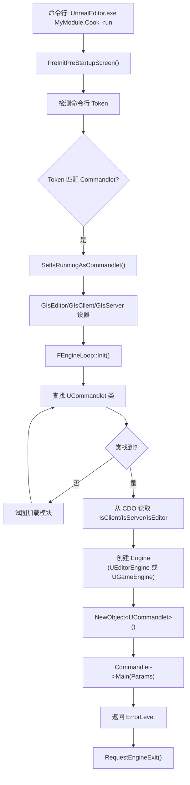

# Commandlet 系统详解

## 摘要
Commandlet 是 UE5.7.4 中可命令行执行的任务单元，继承自 `UCommandlet`。每个 Commandlet 通过重写 `Main()` 方法实现批处理逻辑。引擎在 `FEngineLoop::Init()` 中检测命令行中的 Commandlet 名称，动态加载对应模块和类，创建实例并执行。Commandlet 广泛用于 Cook、资源重保存、文本收集、Pak 打包等离线处理任务。

## 适合解决的问题
- 如何创建命令行批处理任务？
- Commandlet 和编辑器/游戏模式有什么区别？
- 如何通过命令行运行 Commandlet？
- CookCommandlet 的工作机制是什么？
- 如何编写自定义 Commandlet？

## 核心结论
1. Commandlet 继承 `UCommandlet`，重写 `Main(const FString& Params)` 方法
2. 引擎通过命令行 Token 检测 Commandlet 名称（自动追加 "Commandlet" 后缀）
3. Commandlet 在 `FEngineLoop::Init()` 中执行（走特殊路径，非标准编辑器/游戏路径）
4. Commandlet 默认跳过 Slate UI、SessionService、CookServer 等系统
5. CookCommandlet 是最重要的内置 Commandlet，分发到 CookOnTheFly/CookByTheBook/CookWorker

## 源码位置

| 组件 | 路径 | 作用 |
|------|------|------|
| UCommandlet 基类 | `Engine/Source/Runtime/Engine/Classes/Commandlets/Commandlet.h:39` | Commandlet 基类声明 |
| Commandlet 实现 | `Engine/Source/Runtime/Engine/Private/Commandlets/Commandlet.cpp:28` | 基类实现 |
| Commandlet 检测 | `Engine/Source/Runtime/Launch/Private/LaunchEngineLoop.cpp:2281` | 命令行 Commandlet 检测 |
| Commandlet 执行 | `Engine/Source/Runtime/Launch/Private/LaunchEngineLoop.cpp:4024-4067` | Commandlet 实例化和执行 |
| CookCommandlet | `Engine/Source/Editor/UnrealEd/Private/Commandlets/CookCommandlet.cpp:177` | Cook 入口 |
| CommandletHelpers | `Engine/Source/Runtime/Engine/Private/Commandlets/CommandletHelpers.cpp` | Tick 模拟等辅助函数 |
| 内置 Commandlet | `Engine/Source/Editor/UnrealEd/Classes/Commandlets/` | 30+ Commandlet 声明 |

## 1. UCommandlet 基类

```cpp
// Commandlet.h:39-180
UCLASS(abstract, transient, MinimalAPI)
class UCommandlet : public UObject
{
    // 帮助信息
    FString HelpDescription;          // 用途描述
    FString HelpUsage;                // 用法模板
    TArray<FString> HelpParamNames;   // 参数名列表
    TArray<FString> HelpParamDescriptions; // 参数说明
    
    // 运行环境控制
    uint32 IsServer : 1;    // 加载 Server 端对象
    uint32 IsClient : 1;    // 加载 Client 端对象
    uint32 IsEditor : 1;    // 加载 Editor 端对象
    uint32 LogToConsole : 1; // 重定向日志到控制台
    uint32 ShowErrorCount : 1; // 退出时显示错误/警告计数
    uint32 ShowProgress : 1;   // 显示进度
    
    // 核心入口
    virtual int32 Main(const FString& Params);  // 重写此方法
    
    // 命令行解析助手
    static void ParseCommandLine(const TCHAR*, TArray<FString>& Tokens,
        TArray<FString>& Switches, TMap<FString,FString>& Params);
};
```

## 2. Commandlet 检测与执行流程

### 检测（LaunchEngineLoop.cpp:2281-2317）

```
1. 解析命令行 → 获取 Tokens + Switches
2. 检查 -run=CommandletName 语法
3. 检查 Token 是否以 "Commandlet" 结尾
4. 如果未找到，追加 "Commandlet" 再检查
   e.g. "UnrealEd.Cook" → "UnrealEd.CookCommandlet"
5. 如果是 CookCommandlet → 设置 PRIVATE_GIsRunningCookCommandlet = true
6. 设置 PRIVATE_GIsRunningCommandlet = true
```

### 执行（LaunchEngineLoop.cpp:3879-4200）

```
1. 查找 Commandlet 类:
   StaticFindFirstObject(UClass::StaticClass(), *Token)
   → 如果未找到且 Token 含 ".":
     LoadModule(ModuleName) → FindFirstObject<UClass>(*Token)

2. 从 CDO 设置运行环境:
   GIsClient = Default->IsClient
   GIsServer = Default->IsServer
   GIsEditor = Default->IsEditor

3. 允许 Commandlet 创建自定义 Engine (CreateCustomEngine)

4. 根据 GIsEditor 创建 UEditorEngine 或 UGameEngine

5. 创建 Commandlet 实例并执行:
   UCommandlet* Commandlet = NewObject<UCommandlet>(...);
   Commandlet->AddToRoot();
   FCoreDelegates::OnCommandletPreMain.Broadcast();
   ErrorLevel = Commandlet->Main(Params);
   FCoreDelegates::OnCommandletPostMain.Broadcast();

6. 请求退出:
   RequestEngineExit("Commandlet finished (result %d)");
```

### 命令行调用语法

```
# 完整类名
UnrealEditor.exe MyModule.MyCommandlet -Switch1 -Param=Value

# 短名称（自动追加 Commandlet）
UnrealEditor.exe MyModule.My -Switch1

# -run= 语法
UnrealEditor.exe ProjectPath -run=MyCommandlet
```

## 3. Commandlet 与编辑器/游戏的区别

| 特性 | 编辑器 | 游戏 | Commandlet |
|------|--------|------|------------|
| Slate UI | 完整 | 有限 | **无**（除非 -AllowCommandletRendering） |
| SessionService | 是 | 否 | **否** |
| 编辑器 World | 是 | 否 | 取决于 IsEditor |
| AutoReimport | 是 | 否 | **否** |
| CookServer | 是 | 否 | **否** |
| FEditorModeTools | 是 | 否 | **否**（assert 保护） |
| 启动画面 | 是 | 是 | **否** |

## 4. 内置 Commandlet 列表

| Commandlet | 用途 |
|------------|------|
| **CookCommandlet** | 资源 Cook 到目标平台 |
| **ResavePackagesCommandlet** | 批量加载并重新保存 Package |
| **WorldPartitionBuilderCommandlet** | World Partition 构建 |
| **WorldPartitionConvertCommandlet** | 关卡转 World Partition |
| **GatherTextCommandlet** | 文本本地化收集 |
| **UnrealPakCommandlet** | 创建 Pak 文件 |
| **IoStoreCommandlet** | 创建 IOStore 容器 |
| **DiffFilesCommandlet** | 文件对比 |
| **DiffAssetsCommandlet** | 资源对比 |
| **DerivedDataCacheCommandlet** | DDC 填充 |
| **ReplaceAssetsCommandlet** | 批量资源替换 |
| **SmokeTestCommandlet** | 冒烟测试 |

## 5. 编写自定义 Commandlet

```cpp
// MyCommandlet.h
#pragma once
#include "Commandlets/Commandlet.h"
#include "MyCommandlet.generated.h"

UCLASS()
class UMyCommandlet : public UCommandlet
{
    GENERATED_BODY()
public:
    UMyCommandlet()
    {
        IsServer = false;
        IsClient = false;
        IsEditor = true;
        LogToConsole = true;
    }
    
    virtual int32 Main(const FString& Params) override
    {
        TArray<FString> Tokens, Switches;
        TMap<FString, FString> ParamVals;
        ParseCommandLine(*Params, Tokens, Switches, ParamVals);
        
        // 你的批处理逻辑
        UE_LOG(LogTemp, Display, TEXT("Processing %d tokens"), Tokens.Num());
        
        return 0; // 0 = 成功, 非0 = 失败
    }
};
```

## 6. CommandletHelpers::TickEngine()

```cpp
// Commandlet.cpp:127
// 在 Commandlet::Main() 内可调用以驱动引擎 Tick
void TickEngine()
{
    GEngine->Tick(...);              // 驱动引擎
    FSlateApplication::Get().Tick(); // 驱动 Slate（如果启用）
    GFrameCounter++;                 // 帧计数
    FTaskGraphInterface::Get().ProcessThreadUntilIdle();
    // 可选：Tick 渲染（如果 AllowCommandletRendering）
}
```

## 7. Mermaid 调用图



## 8. 调试建议

1. **查看 Commandlet 日志**：输出到 `<Project>/Saved/Logs/`
2. **运行内置 Commandlet**：`UnrealEditor.exe ProjectPath -run=SmokeTest`
3. **强制 Commandlet 渲染**：添加 `-AllowCommandletRendering` 参数
4. **在运行中的编辑器测试**：控制台 `RunCommandlet ClassName`

## 源码证据
- Engine/Source/Runtime/Engine/Classes/Commandlets/Commandlet.h:39-180（UCommandlet 声明）
- Engine/Source/Runtime/Engine/Private/Commandlets/Commandlet.cpp:28-38（构造函数默认值）
- Engine/Source/Runtime/Launch/Private/LaunchEngineLoop.cpp:2281-2317（Commandlet 检测）
- Engine/Source/Runtime/Launch/Private/LaunchEngineLoop.cpp:3879-4200（Commandlet 执行）
- Engine/Source/Runtime/Launch/Private/LaunchEngineLoop.cpp:2204（PRIVATE_GIsRunningCommandlet）
- Engine/Source/Runtime/Engine/Private/Commandlets/CommandletHelpers.cpp（TickEngine）
- Engine/Source/Editor/UnrealEd/Classes/Commandlets/（内置 Commandlet 声明目录）

## 相关文档
- [Editor_Startup.md](Editor_Startup.md) — 编辑器启动流程
- [Cook.md](../07_ASSET_PIPELINE/Cook.md) — Cook 系统
