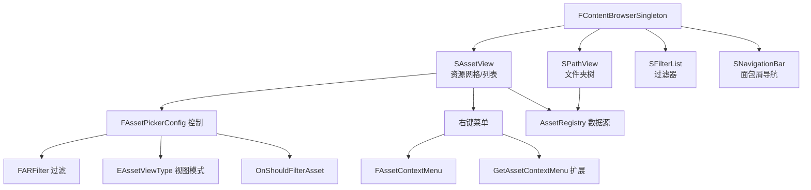

# ContentBrowser 内容浏览器详解

## 摘要
ContentBrowser 是 UE5.7.4 编辑器的核心资源浏览和管理界面。`FContentBrowserSingleton` 是主入口，内部组合 `SPathView`（文件夹树）+ `SAssetView`（资源视图）+ `SFilterList`（过滤器）。支持 List/Tile/Column/Custom 四种视图模式，通过 `FARFilter` 实现资源过滤，通过 `FContentBrowserModule` 暴露扩展点（菜单、拖放、列定制）。

## 适合解决的问题
- 如何程序化创建内容浏览器窗口？
- 如何扩展资源的右键上下文菜单？
- 如何实现自定义资源列和视图？
- 如何按类型、路径、标签过滤资源？
- 如何同步浏览器到指定资源路径？

## 核心结论
1. `FContentBrowserSingleton` 是单例，通过 `FContentBrowserModule::Get().Get()` 访问
2. 内容浏览器由 SPathView + SAssetView + SFilterList 组合而成
3. `FAssetPickerConfig` 控制 AssetPicker 的行为和过滤
4. `FContentBrowserModule` 提供 15+ 个扩展点（菜单、过滤器、列、拖放等）
5. 资源视图支持 List/Tile/Column/Custom 四种模式

## 源码位置

| 组件 | 路径 | 作用 |
|------|------|------|
| IContentBrowserSingleton | `Engine/Source/Editor/ContentBrowser/Public/IContentBrowserSingleton.h` | 公开接口 |
| FContentBrowserSingleton | `Engine/Source/Editor/ContentBrowser/Private/ContentBrowserSingleton.h:69` | 实现类 |
| FContentBrowserModule | `Engine/Source/Editor/ContentBrowser/Public/ContentBrowserModule.h:107` | 模块入口 |
| SContentBrowser | `Engine/Source/Editor/ContentBrowser/Private/SContentBrowser.h:96` | 主浏览器 Widget |
| SAssetView | `Engine/Source/Editor/ContentBrowser/Public/SAssetView.h` | 资源视图 |
| SPathView | `Engine/Source/Editor/ContentBrowser/Private/SPathView.h:64` | 文件夹路径树 |
| FAssetContextMenu | `Engine/Source/Editor/ContentBrowser/Private/AssetContextMenu.h:28` | 右键菜单 |

## 1. IContentBrowserSingleton 核心 API

```cpp
class IContentBrowserSingleton {
    // 创建内容浏览器
    TSharedRef<SWidget> CreateContentBrowser(FName InstanceName, 
        TSharedPtr<SDockTab>, const FContentBrowserConfig*);
    
    // 创建 AssetPicker（嵌入对话框的简化版）
    TSharedRef<SWidget> CreateAssetPicker(const FAssetPickerConfig&);
    
    // 创建 PathPicker（文件夹选择器）
    TSharedRef<SWidget> CreatePathPicker(const FPathPickerConfig&);
    
    // 同步浏览器到指定资源
    void SyncBrowserToAssets(const TArray<FAssetData>&);
    void SyncBrowserToFolders(const TArray<FString>&);
    
    // 获取当前选中
    void GetSelectedAssets(TArray<FAssetData>&);
    void GetSelectedFolders(TArray<FString>&);
    
    // 强制显示插件内容
    void ForceShowPluginContent(bool bForce);
};
```

## 2. FAssetPickerConfig 配置

```cpp
struct FAssetPickerConfig {
    FARFilter Filter;                    // 资源注册表过滤器
    EAssetViewType::Type InitialAssetViewType;  // 默认视图模式 (Tile)
    FText HighlightedText;               // 高亮文本
    bool bAllowDragging;                 // 允许拖放
    bool bAllowNullSelection;            // 允许空选择
    bool bShowBottomToolbar;             // 显示底部工具栏
    bool bCanShowFolders;                // 是否显示文件夹
    FOnAssetSelected OnAssetSelected;    // 选中回调
    FOnGetAssetContextMenu OnGetAssetContextMenu; // 右键菜单回调
    FOnShouldFilterAsset OnShouldFilterAsset;     // 自定义过滤器
    TArray<FAssetViewCustomColumn> CustomColumns;  // 列视图自定义列
};
```

## 3. 资源视图模式

```cpp
namespace EAssetViewType {
    enum Type { List, Tile, Column, Custom, MAX };
}
```

## 4. 菜单扩展点

```cpp
// FContentBrowserModule 提供的扩展点
// 资源右键菜单
FDelegateHandle AddAssetViewContextMenuExtender(FContentBrowserMenuExtender_SelectedAssets&&);
// 路径右键菜单
FDelegateHandle AddPathViewContextMenuExtender(FContentBrowserMenuExtender_SelectedPaths&&);
// 拖放行为扩展
FDelegateHandle AddAssetViewDragAndDropExtender(FAssetViewDragAndDropExtender&&);
// 自定义视图列
FDelegateHandle AddAssetViewExtraStateGenerator(const FAssetViewExtraStateGenerator&);
```

### 在资源右键菜单添加选项

```cpp
// 1. 获取菜单扩展器
FContentBrowserModule& CBModule = FModuleManager::LoadModuleChecked<FContentBrowserModule>("ContentBrowser");
CBModule.AddAssetViewContextMenuExtender(
    FContentBrowserMenuExtender_SelectedAssets::CreateLambda(
        [](const TArray<FAssetData>& SelectedAssets) -> TSharedRef<FExtender> {
            TSharedRef<FExtender> Extender = MakeShareable(new FExtender());
            // 添加自定义菜单项
            return Extender;
        }
    ));
```

## 5. Mermaid 调用图



## 6. 调试建议

- 控制台命令：`ContentBrowser.Refresh`
- 插件内容显示：`ForceShowPluginContent()`
- 资源过滤调试：检查 `FARFilter` 参数

## 源码证据
- Engine/Source/Editor/ContentBrowser/Public/IContentBrowserSingleton.h（公开接口）
- Engine/Source/Editor/ContentBrowser/Private/ContentBrowserSingleton.h:69（实现）
- Engine/Source/Editor/ContentBrowser/Public/ContentBrowserModule.h:107（模块）
- Engine/Source/Editor/ContentBrowser/Private/SContentBrowser.h:96（主 Widget）
- Engine/Source/Editor/ContentBrowser/Private/SPathView.h:64（路径视图）
- Engine/Source/Editor/ContentBrowser/Private/AssetContextMenu.h:28（右键菜单）

## 相关文档
- [AssetTools.md](AssetTools.md) — 资产工具 API
- [DetailsPanel.md](DetailsPanel.md) — 详情面板
- [../07_ASSET_PIPELINE/AssetRegistry.md](../07_ASSET_PIPELINE/AssetRegistry.md) — 资源注册表
