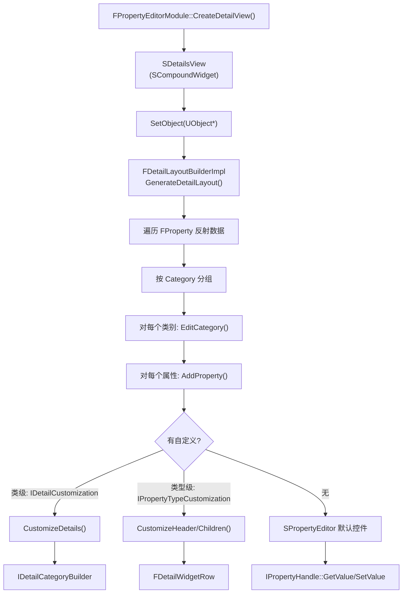

# DetailsPanel 详情面板详解

## 摘要
DetailsPanel（详情面板 / PropertyEditor 模块）是 UE5.7.4 编辑器中最核心的 UI 组件之一，负责显示和编辑 UObject 的属性。`IDetailsView` 是 SCompoundWidget 实现，通过 `FPropertyEditorModule::CreateDetailView()` 创建。提供两层自定义机制：`IDetailCustomization`（类级布局自定义）和 `IPropertyTypeCustomization`（属性类型级显示自定义）。基于 `IPropertyHandle` 系统实现属性读写和值同步。

## 适合解决的问题
- 如何在自定义编辑器中显示和编辑对象属性？
- 如何自定义特定 UCLASS 的属性面板布局？
- 如何为自定义 FProperty 类型定制显示控件？
- 如何隐藏/只读某些属性？
- 如何在属性值变化时接收通知？

## 核心结论
1. `IDetailsView` 通过 `SetObject(UObject*)` 或 `SetObjects(TArray<UObject*>)` 绑定对象
2. `IDetailCustomization::CustomizeDetails(IDetailLayoutBuilder&)` 用于整个类的布局定制
3. `IPropertyTypeCustomization::CustomizeHeader()/CustomizeChildren()` 用于属性类型的显示定制
4. `IPropertyHandle` 提供属性的类型安全读写接口，支持值修改回调和多对象编辑
5. 自定义注册通过 `FPropertyEditorModule::RegisterCustomClassLayout()` / `RegisterCustomPropertyTypeLayout()`

## 源码位置

| 组件 | 路径 | 作用 |
|------|------|------|
| IDetailsView | `Engine/Source/Editor/PropertyEditor/Public/IDetailsView.h:35` | 详情面板接口 |
| FPropertyEditorModule | `Engine/Source/Editor/PropertyEditor/Public/PropertyEditorModule.h:238` | 模块入口 |
| SDetailsView | `Engine/Source/Editor/PropertyEditor/Private/SDetailsView.h:19` | 实现类 |
| IPropertyHandle | `Engine/Source/Editor/PropertyEditor/Public/PropertyHandle.h:42` | 属性句柄 |
| IDetailCustomization | `Engine/Source/Editor/PropertyEditor/Public/IDetailCustomization.h:11` | 类级自定义 |
| IPropertyTypeCustomization | `Engine/Source/Editor/PropertyEditor/Public/IPropertyTypeCustomization.h:27` | 类型级自定义 |
| IDetailLayoutBuilder | `Engine/Source/Editor/PropertyEditor/Public/DetailLayoutBuilder.h:35` | 布局构建器 |
| FDetailsViewArgs | `Engine/Source/Editor/PropertyEditor/Public/DetailsViewArgs.h:33` | 视图参数配置 |
| DetailCustomizations 目录 | `Engine/Source/Editor/DetailCustomizations/` | 内置自定义示例 |

## 1. IDetailsView — 创建和基本使用

```cpp
// 获取模块
FPropertyEditorModule& PropertyModule = 
    FModuleManager::LoadModuleChecked<FPropertyEditorModule>("PropertyEditor");

// 创建详情面板
FDetailsViewArgs Args;
Args.bUpdatesFromSelection = false;  // 手动控制
Args.bLockable = true;               // 可锁定
Args.bAllowSearch = true;            // 搜索框
TSharedRef<IDetailsView> DetailsView = PropertyModule.CreateDetailView(Args);

// 绑定对象
DetailsView->SetObject(MyObject);

// 多对象编辑
DetailsView->SetObjects({ObjA, ObjB, ObjC});
```

### FDetailsViewArgs 关键配置

| 参数 | 说明 |
|------|------|
| `bUpdatesFromSelection` | 是否跟随编辑器选中更新 |
| `bLockable` | 是否可锁定当前选中 |
| `bAllowSearch` | 是否显示属性搜索框 |
| `bShowOptions` | 是否显示设置菜单 |
| `bForceHiddenPropertyVisibility` | 是否显示所有属性(不限于 CPF_Edit) |
| `DefaultsOnlyVisibility` | CDO 默认值显示策略 |
| `NameAreaSettings` | 名称区域显示策略 |

## 2. IDetailCustomization — 类级自定义

```cpp
class FMyClassDetails : public IDetailCustomization
{
public:
    static TSharedRef<IDetailCustomization> MakeInstance()
    {
        return MakeShareable(new FMyClassDetails);
    }
    
    virtual void CustomizeDetails(IDetailLayoutBuilder& DetailBuilder) override
    {
        // 获取并修改某个类别
        IDetailCategoryBuilder& Category = DetailBuilder.EditCategory("MyCategory");
        Category.SetSortOrder(0);
        Category.AddCustomRow(LOCTEXT("MyRow", "My Row"))
            .NameContent()[ SNew(STextBlock).Text(LOCTEXT("Name", "Custom")) ]
            .ValueContent()[ SNew(SButton).Text(LOCTEXT("Btn", "Click")) ];
        
        // 隐藏属性
        DetailBuilder.HideProperty(DetailBuilder.GetProperty(GET_MEMBER_NAME_CHECKED(UMyClass, HiddenProp)));
    }
};

// 注册 (在模块 StartupModule 中)
PropertyModule.RegisterCustomClassLayout(
    UMyClass::StaticClass()->GetFName(),
    FOnGetDetailCustomizationInstance::CreateStatic(&FMyClassDetails::MakeInstance));
```

### IDetailLayoutBuilder 关键方法

| 方法 | 作用 |
|------|------|
| `EditCategory(FName)` | 获取/创建类别 |
| `HideCategory(FName)` | 隐藏类别 |
| `HideProperty(TSharedPtr<IPropertyHandle>)` | 隐藏属性 |
| `GetProperty(FName, UStruct*)` | 按名称获取属性句柄 |
| `AddPropertyToCategory(TSharedPtr<IPropertyHandle>)` | 移动属性到类别 |
| `ForceRefreshDetails()` | 强制刷新 |

## 3. IPropertyTypeCustomization — 类型级自定义

```cpp
class FMyStructCustomization : public IPropertyTypeCustomization
{
public:
    static TSharedRef<IPropertyTypeCustomization> MakeInstance()
    {
        return MakeShareable(new FMyStructCustomization);
    }
    
    virtual void CustomizeHeader(TSharedRef<IPropertyHandle> PropertyHandle,
        FDetailWidgetRow& HeaderRow, IPropertyTypeCustomizationUtils& Utils) override
    {
        HeaderRow.NameContent()[ SNew(STextBlock).Text(LOCTEXT("Name", "My Struct")) ]
            .ValueContent()[ SNew(SButton) ];
    }
    
    virtual void CustomizeChildren(TSharedRef<IPropertyHandle> PropertyHandle,
        IDetailChildrenBuilder& ChildBuilder, IPropertyTypeCustomizationUtils& Utils) override
    {
        // 添加子属性
        uint32 NumChildren;
        PropertyHandle->GetNumChildren(NumChildren);
        for (uint32 i = 0; i < NumChildren; i++)
        {
            ChildBuilder.AddProperty(PropertyHandle->GetChildHandle(i).ToSharedRef());
        }
    }
};

// 注册
PropertyModule.RegisterCustomPropertyTypeLayout(
    "MyStruct",
    FOnGetPropertyTypeCustomizationInstance::CreateStatic(&FMyStructCustomization::MakeInstance));
```

## 4. IPropertyHandle — 属性读写

```cpp
TSharedPtr<IPropertyHandle> Handle = DetailBuilder.GetProperty(
    GET_MEMBER_NAME_CHECKED(UMyClass, MyFloatProp));

// 读取值
float Value;
Handle->GetValue(Value);         // 支持 float/double/int32/bool/FString/FText/UObject* 等
FName NameValue;
Handle->GetValue(NameValue);

// 设置值
Handle->SetValue(NewValue, EPropertyValueSetFlags::InteractiveChange);

// 子属性导航
TSharedPtr<IPropertyHandle> Child = Handle->GetChildHandle(FName("SubProp"));
uint32 Index = Handle->GetIndexInArray();

// 数组操作
TSharedPtr<IPropertyHandleArray> Array = Handle->AsArray();
Array->AddItem();
Array->DeleteItem(0);
uint32 Num;
Array->GetNumElements(Num);
TSharedPtr<IPropertyHandle> Element = Array->GetElement(0);

// 获取外部对象
TArray<UObject*> OuterObjects;
Handle->GetOuterObjects(OuterObjects);
```

### EPropertyValueSetFlags

| 标志 | 含义 |
|------|------|
| `DefaultFlags` | 标准修改（可 Undo） |
| `NotTransactable` | 不记录 Undo |
| `InteractiveChange` | 交互式改变（滑块拖动中） |
| `InstanceObjects` | 创建新的实例化对象 |
| `ResetToDefault` | 重置为默认值 |

## 5. 影响 DetailsPanel 的 UPROPERTY 元数据

| 元数据 | 效果 |
|--------|------|
| `Category="AAA"` | 归类到 AAA 类别 |
| `AdvancedDisplay` | 折叠到高级栏 |
| `EditCondition="bFlag"` | 由 bFlag 控制可编辑性 |
| `EditConditionHides` | 不满足条件时完全隐藏 |
| `meta=(DisplayName="Name")` | 覆盖显示名称 |
| `meta=(ToolTip="Desc")` | 设置提示信息 |
| `meta=(ClampMin="0", ClampMax="100")` | 数值范围 |
| `meta=(ShowOnlyInnerProperties)` | 内联展开结构体 |
| `meta=(InlineEditConditionToggle)` | 内联编辑条件勾选框 |

## 6. Mermaid 调用图



## 7. 内置 DetailCustomization 示例

`Engine/Source/Editor/DetailCustomizations/` 目录包含 100+ 内置自定义：

| 文件 | 自定义对象 |
|------|-----------|
| `ActorDetails.h` | AActor |
| `ActorComponentDetails.h` | UActorComponent |
| `CameraDetails.h` | UCameraComponent |
| `LightComponentDetails.h` | ULightComponent |
| `DataTableCustomization.h` | UDataTable |
| `FilePathStructCustomization.h` | FFilePath |
| `CurveStructCustomization.h` | Curve 结构 |

## 8. 调试建议

1. 检查属性可见性：`DetailsView->SetIsPropertyVisibleDelegate()`
2. 强制刷新：`DetailsView->ForceRefresh()`
3. 启用所有高级属性：`DetailsView->ShowAllAdvancedProperties()`
4. 属性高亮：`DetailsView->HighlightProperty(FPropertyPath)`

## 源码证据
- Engine/Source/Editor/PropertyEditor/Public/IDetailsView.h:35-291（IDetailsView 接口）
- Engine/Source/Editor/PropertyEditor/Public/PropertyEditorModule.h:238-500（模块）
- Engine/Source/Editor/PropertyEditor/Private/SDetailsView.h:19（实现）
- Engine/Source/Editor/PropertyEditor/Public/PropertyHandle.h:42-858（IPropertyHandle）
- Engine/Source/Editor/PropertyEditor/Public/IDetailCustomization.h:11-26（类自定义）
- Engine/Source/Editor/PropertyEditor/Public/IPropertyTypeCustomization.h:27-56（类型自定义）
- Engine/Source/Editor/PropertyEditor/Public/DetailLayoutBuilder.h:35-318（布局构建器）
- Engine/Source/Editor/PropertyEditor/Public/DetailsViewArgs.h:33-120（视图配置）
- Engine/Source/Editor/DetailCustomizations/（100+ 内置自定义示例）

## 相关文档
- [AssetTools.md](AssetTools.md) — 资产工具 API
- [ContentBrowser.md](ContentBrowser.md) — 内容浏览器
- [BlueprintEditor.md](BlueprintEditor.md) — Blueprint 编辑器
