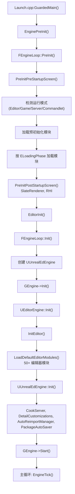

# 编辑器启动流程详解

## 摘要
UE5.7.4 编辑器的启动是 `GuardedMain()` → `EnginePreInit()` → `EditorInit()` → `FEngineLoop::Init()` 的完整链路。`UEditorEngine` (继承 `UEngine`) 是编辑器的核心引擎类，`UUnrealEdEngine` (继承 `UEditorEngine`) 提供完整的级别编辑功能。编辑器启动过程中按阶段加载 50+ 个编辑器模块，初始化 Slate UI、ToolMenus、模式系统、CookServer 等子系统。

## 适合解决的问题
- 编辑器的完整启动序列是怎样的？
- UEditorEngine 和 UUnrealEdEngine 有什么区别？
- 编辑器在各个加载阶段分别初始化了哪些系统？
- 如何追踪编辑器启动时间？
- 如何在编辑器启动时插入自定义逻辑？

## 核心结论
1. 编辑器入口为 `GuardedMain()` → `EditorInit()` → `FEngineLoop::Init()`
2. `UEditorEngine::Init()` 初始化核心编辑器系统，`UUnrealEdEngine::Init()` 扩展关卡编辑功能
3. `LoadDefaultEditorModules()` 加载 50+ 个编辑器模块
4. 模块按 `ELoadingPhase` 分阶段加载：`EarliestPossible` → `PostConfigInit` → ... → `PostEngineInit`
5. Commandlet 模式跳过大部分 UI 初始化，不创建 FEditorModeTools

## 源码位置

| 组件 | 路径 | 作用 |
|------|------|------|
| 程序入口 | `Engine/Source/Runtime/Launch/Private/Launch.cpp:87` | GuardedMain() |
| FEngineLoop | `Engine/Source/Runtime/Launch/Private/LaunchEngineLoop.cpp:4332` | PreInit/Init 主循环 |
| UEditorEngine | `Engine/Source/Editor/UnrealEd/Classes/Editor/EditorEngine.h:397` | 编辑器引擎声明 |
| EditorEngine 实现 | `Engine/Source/Editor/UnrealEd/Private/EditorEngine.cpp` | 编辑器引擎实现 |
| UUnrealEdEngine | `Engine/Source/Editor/UnrealEd/Classes/Editor/UnrealEdEngine.h:86` | 关卡编辑器引擎 |
| UnrealEdEngine 实现 | `Engine/Source/Editor/UnrealEd/Private/UnrealEdEngine.cpp:93` | 关卡编辑器实现 |
| EditorInit | `Engine/Source/Editor/UnrealEd/Private/UnrealEdGlobals.cpp:154` | EditorInit() 函数 |
| EditorExit | `Engine/Source/Editor/UnrealEd/Private/UnrealEdGlobals.cpp:307` | EditorExit() 函数 |
| FEditorModeTools | `Engine/Source/Editor/UnrealEd/Public/EditorModeTools.h` | 编辑器模式管理器 |

## 1. 类继承体系

```
UObject
  → UEngine
    → UEditorEngine      (UnrealEd 模块)
      → UUnrealEdEngine  (UnrealEd 模块, 关卡编辑扩展)
```

全局实例：
- `GEngine` (UEngine*) → 类型为 UUnrealEdEngine
- `GEditor` (UEditorEngine*) → 从 GEngine 转换
- `GUnrealEd` (UUnrealEdEngine*) → 完整编辑器引擎

## 2. 启动完整序列

### Phase 1: GuardedMain() → EnginePreInit()

```cpp
// Launch.cpp:87-205
GuardedMain()
  → FCoreDelegates::GetPreMainInitDelegate().Broadcast()
  → EnginePreInit(CmdLine) → FEngineLoop::PreInit(CmdLine)  // LaunchEngineLoop.cpp:4332
```

**PreInit 分为两个子阶段：**

#### PreInitPreStartupScreen (line 1699)
- 初始化 GLog 和命令行 (1709-1769)
- 设置游戏名称 `LaunchSetGameName()` (1795)
- 初始化 Trace/LLM (1802-1813)
- **检测运行模式** (2151-2368):
  - 检查 `-run=CommandletName` → 设为 Commandlet 模式
  - 检查 `-game` → 设为 Game 模式
  - 检查 `-server` → 设为 Server 模式
  - 否则默认为 Editor 模式 (`GIsEditor = true`)
- 设置 `GIsEditor`, `GIsClient`, `GIsServer`
- 加载预初始化模块: CoreUObject, Engine, Renderer 等 (2064-2078)
- 按阶段加载模块: `EarliestPossible`, `PostConfigInit`

#### PreInitPostStartupScreen (line 3387)
- 初始化 SlateRenderer
- 加载 `PostSplashScreen`, `PreEarlyLoadingScreen`, `PreLoadingScreen` 阶段的模块
- 初始化 RHI 和渲染线程

### Phase 2: EditorInit()

```cpp
// UnrealEdGlobals.cpp:154
int32 EditorInit(IEngineLoop& EngineLoop)
{
    // 1. 创建调试工具
    GDebugToolExec = new FDebugToolExec();
    
    // 2. 调用 FEngineLoop::Init() → 创建并初始化引擎
    EngineLoop.Init();                    // line 167
    
    // 3. 初始化 ActorFolders
    FActorFolders::Get();
    
    // 4. 创建 FEditorModeTools 单例
    FEditorModeTools& ModeTools = GLevelEditorModeTools();
    
    // 5. 初始化编辑器杂项
    FUnrealEdMisc::Get().OnInit();        // line 194
    
    // 6. 创建主编辑器窗口
    IMainFrameModule::CreateDefaultMainFrame();  // line 231
    
    // 7. 可选: 进入 VR 编辑器模式
    // 8. 检查自动化 Map 构建
    // 9. 加载 HierarchicalLODOutliner 模块
}
```

### Phase 3: FEngineLoop::Init() (line 4682)

```
1. 确定 UEngine 类型 (4701-4731):
   GIsEditor → 加载 UUnrealEdEngine 类 → 创建实例
   
2. GEngine->Init(this) (4763)
   → UEditorEngine::Init() (EditorEngine.cpp:1263)
   
3. FCoreDelegates::OnPostEngineInit.Broadcast()

4. 初始化 SessionService, EngineService, TraceService (4778-4789)

5. 加载 PostEngineInit 阶段模块 (4793)

6. GEngine->Start() (4811) → 引擎开始运行

7. 等待加载画面/电影完成 (4816-4826)

8. 初始化 Media, Automation 系统 (4831-4851)

9. GIsRunning = true (4858)
```

### Phase 4: UEditorEngine::Init() (EditorEngine.cpp:1263)

1. 绑定委托: ModalMessageDialog, LevelAddedToWorld, PreWorldOriginOffset 等 (1271-1277)
2. 绑定 AssetRegistry 回调 (1279)
3. 设置 PIE 相关委托 (1281-1317)
4. `InitEditor(InEngineLoop)` (1329) — **核心编辑器初始化**
5. `LoadEditorShaderPlatformPreview()` (1331)
6. 创建 Transaction 系统 (1335)
7. `LoadDefaultEditorModules()` (1340) — 加载 50+ 编辑器模块
8. 加载 `UGameUserSettings` (1352)
9. `FEditorCommandLineUtils::ProcessEditorCommands()` (1365)
10. 标记 `bIsInitialized = true` (1370)

### Phase 5: UUnrealEdEngine::Init() (UnrealEdEngine.cpp:93)

1. `Super::Init()` → 调用 UEditorEngine::Init (95)
2. `RegisterEditorElements()` (97)
3. `RebuildTemplateMapData()` (99)
4. `ValidateFreeDiskSpace()` (102)
5. `FSourceCodeNavigation::Initialize()` (105)
6. 创建 `PackageAutoSaver` (107)
7. 创建 `FPerformanceMonitor` (110)
8. 初始化 Snapping 工具 (140)
9. 加载启动 Package (146-157)
10. 初始化 `AutoReimportManager` (175)
11. 注册 DetailCustomizations (180-215)
12. 初始化 `CookServer` (CookOnTheFlyServer) (228-273)

## 3. LoadDefaultEditorModules() 模块列表

```cpp
// EditorEngine.cpp:1466-1589
Documentation, WorkspaceMenuStructure, MainFrame, OutputLog,
SourceControl, SourceControlWindows, TextureCompressor, MeshUtilities,
MovieSceneTools, ClassViewer, StructViewer, ContentBrowser,
AssetTools, GraphEditor, KismetCompiler, Kismet, Persona,
AnimationBlueprintEditor, LevelEditor, PropertyEditor, PackagesDialog,
DetailCustomizations, ComponentVisualizers, Layers,
AutomationWindow, AutomationController, DeviceManager,
SessionFrontend, SettingsEditor, EditorSettingsViewer,
ProjectSettingsViewer, Blutility, UndoHistory,
DeviceProfileEditor, SourceCodeAccess, BehaviorTreeEditor,
HardwareTargeting, LocalizationDashboard, MergeActors,
InputBindingEditor, AudioEditor, StaticMeshEditor,
EditorFramework, WorldPartitionEditor, EditorConfig,
DerivedDataEditor, ZenEditor, CSVtoSVG, GeometryFramework,
VirtualizationEditor, AnimationSettings, GameplayDebuggerEditor,
RenderResourceViewer, UniversalObjectLocatorEditor,
StructUtilsEditor, MassEntityEditor, DataHierarchyEditor,
ToolWidgets, UserAssetTagsEditor

// + 平台特定模块:
*RuntimeSettings, *PlatformEditor
PListEditor, LogVisualizer, HotReload, ClothPainter,
ViewportInteraction, VREditor
```

## 4. FEditorModeTools — 编辑器模式管理

```cpp
// EditorModeManager.cpp:63
class FEditorModeTools {
    // 管理当前编辑器模式 (默认模式、放置模式、地形编辑等)
    // 全局单例通过 GLevelEditorModeTools() 访问
    // Commandlet 中不可用 (checkf 保护)
};
```

内置模式 ID (`EditorModes.h:16-50`):
- `EM_None` — 游戏模式
- `EM_Default` — 默认编辑模式
- `EM_Placement` — 放置模式
- `EM_Landscape` — 地形编辑
- `EM_Foliage` — 植被编辑
- `EM_MeshPaint` — 网格绘制
- `EM_Physics` — 物理操作
- `EM_ActorPicker` — Actor 选择器

## 5. EditorExit()

```cpp
// UnrealEdGlobals.cpp:307
EditorExit()
  → GEditor->SaveConfig()
  → GLevelEditorModeTools().SaveConfig()
  → FEditorDirectories::Get().SaveLastDirectories()
  → FUnrealEdMisc::Get().OnExit()
  → 删除 GDebugToolExec
```

## 6. Mermaid 调用图



## 7. 常见误区

| 误区 | 正确理解 |
|------|----------|
| 编辑器启动就是打开一个窗口 | 编辑器在窗口创建前已完成大量初始化 (引擎、模块、UObject 系统) |
| UEditorEngine 和 UUnrealEdEngine 可互换 | UUnrealEdEngine 添加了关卡编辑特有功能 (AutoSave, CookServer 等) |
| LoadDefaultEditorModules 一次性加载所有 50+ 模块 | 模块加载是惰性的，实际在首次使用时才初始化 |
| Commandlet 和编辑器启动流程相同 | Commandlet 跳过 Slate UI、ModeTools、CookServer 等编辑器专有系统 |

## 8. 调试建议

1. **启动耗时分析**：`-profilestartup` 参数
2. **模块加载追踪**：搜索日志中的 "Loading module" / "Module loaded"
3. **编辑器初始化断点**：`UEditorEngine::Init()` (EditorEngine.cpp:1263)
4. **检查当前模式**：`IsRunningCommandlet()`, `GIsEditor`, `GIsClient`

## 源码证据
- Engine/Source/Runtime/Launch/Private/Launch.cpp:87-205（GuardedMain）
- Engine/Source/Runtime/Launch/Private/LaunchEngineLoop.cpp:4332（PreInit）
- Engine/Source/Runtime/Launch/Private/LaunchEngineLoop.cpp:4682（Init）
- Engine/Source/Runtime/Launch/Private/LaunchEngineLoop.cpp:2281-2317（Commandlet 检测）
- Engine/Source/Editor/UnrealEd/Private/EditorEngine.cpp:1263（UEditorEngine::Init）
- Engine/Source/Editor/UnrealEd/Private/EditorEngine.cpp:949（InitEditor）
- Engine/Source/Editor/UnrealEd/Private/EditorEngine.cpp:1466-1589（LoadDefaultEditorModules）
- Engine/Source/Editor/UnrealEd/Private/UnrealEdEngine.cpp:93（UUnrealEdEngine::Init）
- Engine/Source/Editor/UnrealEd/Private/UnrealEdGlobals.cpp:154（EditorInit）
- Engine/Source/Editor/UnrealEd/Public/EditorModeTools.h（FEditorModeTools）

## 相关文档
- [Commandlet.md](Commandlet.md) — Commandlet 系统
- [AssetTools.md](AssetTools.md) — 资产工具 API
- [ContentBrowser.md](ContentBrowser.md) — 内容浏览器
- [DetailsPanel.md](DetailsPanel.md) — 详情面板
- [BlueprintEditor.md](BlueprintEditor.md) — Blueprint 编辑器
