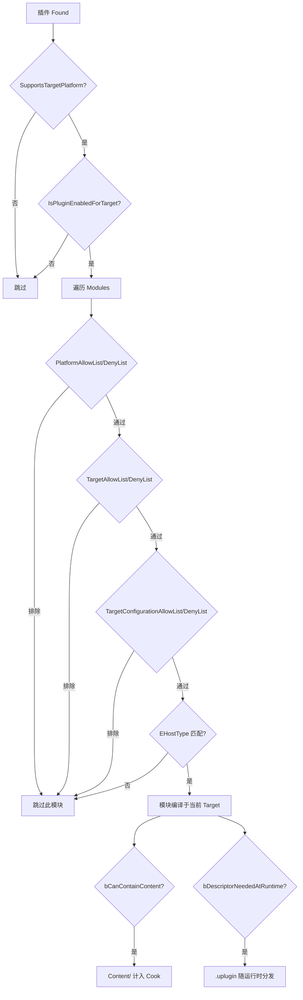

# 插件打包详解

## 摘要
插件打包系统通过 `ModuleDescriptor` 中的多层过滤机制（HostType、Platform、Target、Configuration、Architecture、Program）确保正确的模块进入正确的构建目标。`IPluginManager` 在 Cook/Pak 阶段根据插件配置决定哪些模块编译、哪些内容打包、`.uplugin` 文件是否需要随运行时分发。

## 适合解决的问题
- 如何确保 Editor 模块不进 Shipping 包？
- 如何针对特定平台排除插件模块？
- 插件的 Content 资源是如何被打包的？
- .uplugin 文件在最终包中如何存在？
- 如何为不同目标配置启用/禁用插件模块？

## 核心结论
1. 模块过滤有 8 层机制：HostType + Platform + Target + Configuration + Architecture + Program + GameTarget + bBuildRequiresCookedData
2. `EHostType::Editor/UncookedOnly/DeveloperTool` 自动被 Shipping 排除
3. `bCanContainContent=true` 的插件 Content 计入 Cook 处理
4. `.uplugin` 描述符仅在 `bCanContainContent || bCanContainVerse` 时随运行时分发
5. DLL 分发通过 `RuntimeDependencies` + `StagedFileType` 控制

## 源码位置

| 组件 | 路径 | 作用 |
|------|------|------|
| 模块编译过滤 | `Engine/Source/Runtime/Projects/Private/ModuleDescriptor.cpp:521` | IsCompiledInConfiguration |
| 模块加载过滤 | `Engine/Source/Runtime/Projects/Private/ModuleDescriptor.cpp:638` | IsLoadedInCurrentConfiguration |
| 插件启用判断 | `Engine/Source/Programs/UnrealBuildTool/System/Plugins.cs:693` | IsPluginEnabledForTarget |
| Plugin staging | `Engine/Source/Programs/UnrealBuildTool/Configuration/UEBuildTarget.cs:5508` | bDescriptorNeededAtRuntime |
| StagedFileType | `Engine/Source/Programs/UnrealBuildTool/System/TargetReceipt.cs:114` | 文件打包类型 |
| RuntimeDependencies | `Engine/Source/Programs/UnrealBuildTool/Configuration/ModuleRules.cs:313` | 运行时依赖 |

## 1. 八层模块过滤机制

### 过滤顺序（ModuleDescriptor.cpp:685-837）

```
1. PlatformAllowList/DenyList           ← "PlatformAllowList": ["Win64"]
2. PlatformArchitectureAllowList/DenyList ← "PlatformArchitectureAllowList": {...}
3. TargetAllowList/DenyList             ← "TargetAllowList": ["Editor"]
4. TargetConfigurationAllowList/DenyList ← "TargetConfigurationAllowList": ["Shipping"]
5. ProgramAllowList/DenyList            ← "ProgramAllowList": ["UnrealEditor"]
6. GameTargetAllowList/DenyList         ← "GameTargetAllowList": ["MyGame"]
7. EHostType 检查 (编译目标类型匹配)
8. bBuildRequiresCookedData 检查 (CookedOnly/UncookedOnly)
```

### HostType → Shipping 排除

| HostType | Shipping 构建? | 原因 |
|----------|---------------|------|
| `Runtime` | ✅ | 所有非 Program 目标 |
| `CookedOnly` | ✅ | `bBuildRequiresCookedData` == true |
| `UncookedOnly` | ❌ | `bBuildRequiresCookedData` == false |
| `Editor` / `EditorNoCommandlet` | ❌ | `TargetType != Editor` |
| `Developer` / `DeveloperTool` | ❌ | `!bBuildDeveloperTools` (Shipping) |
| `ServerOnly` | ✅ (仅 Server) | 排除 Client |
| `ClientOnly` | ✅ (仅 Client) | 排除 Server |

## 2. Plugin 级别过滤

```cpp
// Plugins.cs:693-713 IsPluginEnabledForTarget()
// 1. SupportsTargetPlatform(Platform)
// 2. IsEnabledByDefault() 
// 3. 项目 .uproject 中的 PluginReferenceDescriptor 覆盖
```

```cpp
// IsPluginCompiledForTarget() (Plugins.cs:726-742)
// 检查插件中任何模块是否编译于当前 Target
// 如果没有模块编译 → 插件不编为当前 Target
```

## 3. 插件内容打包

### Content 目录打包
- `bCanContainContent=true` 时，`Content/` 被 Cook 处理
- 资产进入 Cook Pipeline → `.uasset/.uexp/.ubulk` → Pak 文件
- 挂载点：`/<PluginName>/`
- `bCanContainVerse=true` 时 Verse 代码同处理

### Config 文件打包
```cpp
// PluginManager.cpp:1866 ProcessEnabledPlugins()
// 插件 Config/ 目录 INI 文件合并到项目配置层级
// Plugin 层 INI: DynamicLayerPriority::Plugin
```

### .uplugin 文件分发
```cpp
// UEBuildTarget.cs:5508-5512
if (Info.Descriptor.bCanContainContent || Info.Descriptor.bCanContainVerse
    || Dependencies.Any(x => x.bDescriptorNeededAtRuntime))
{
    Instance.bDescriptorNeededAtRuntime = true;
}
```

### 运行时的 Pak 挂载
```cpp
// PluginManager.cpp:1941-1966
// Cooked 构建中，插件 Pak 从 <Plugin>/Content/Paks/<Platform>/ 挂载
```

## 4. DLL 分发控制

### StagedFileType 枚举（TargetReceipt.cpp:114-135）

| 类型 | 含义 | 示例 |
|------|------|------|
| `UFS` | 进入 Pak 文件 | 大部分资产 |
| `NonUFS` | 松散文件 | 需要直接 IO 的 DLL |
| `DebugNonUFS` | 调试文件 | 仅 Debug 构建 |
| `SystemNonUFS` | 系统文件 | 不重映射路径 |

```csharp
// 示例：将 DLL 分发给运行时
RuntimeDependencies.Add("$(BinaryOutputDir)/MyDll.dll", 
    Path.Combine(ModuleDirectory, "bin", "Win64", "MyDll.dll"),
    StagedFileType.NonUFS);
```

## 5. 平台扩展插件（Platform Extension）

```cpp
// Plugins.cs:459-617 MergeWithParent()
// 子插件: <ParentName>_<Platform>.uplugin (如 MyPlugin_HoloLens.uplugin)
// 合并规则:
//   - PlatformAllowList 与父插件合并
//   - 模块列表与父插件合并
//   - 插件引用列表与父插件合并
// 父插件标记: bIsPluginExtension = true
```

## 6. 完整过滤流程图



## 7. 常见误区

| 误区 | 正确理解 |
|------|----------|
| 插件 Content 自动进入包 | 需 `bCanContainContent=true` 且内容被正确 Cook |
| PlatformDenyList 为空 = 所有平台可用 | `bHasExplicitPlatforms` 控制此行为；默认不排除 |
| Runtime 模块的 Editor 引用会被过滤 | 编辑器 #include 必须用 `#if WITH_EDITOR` 保护 |
| 删除 Module 条目即可排除 | `TargetDenyList` + `TargetConfigurationDenyList` 更精确 |

## 8. 调试建议

1. **查看模块编译清单**：UBT 日志中搜索 "Compiling module"
2. **验证打包内容**：检查 `<Project>/Saved/StagedBuilds/` 内容
3. **追踪插件过滤**：UBT 日志中搜索插件名称
4. **检查 .uplugin 分发**：`bDescriptorNeededAtRuntime` 影响最终 Pak 清单

## 源码证据
- Engine/Source/Runtime/Projects/Private/ModuleDescriptor.cpp:521-837（IsCompiledInConfiguration + IsLoadedInCurrentConfiguration）
- Engine/Source/Programs/UnrealBuildTool/System/Plugins.cs:693-713（IsPluginEnabledForTarget）
- Engine/Source/Programs/UnrealBuildTool/System/Plugins.cs:726-742（IsPluginCompiledForTarget）
- Engine/Source/Programs/UnrealBuildTool/Configuration/UEBuildTarget.cs:5508-5512（bDescriptorNeededAtRuntime）
- Engine/Source/Programs/UnrealBuildTool/System/TargetReceipt.cs:114-135（StagedFileType）
- Engine/Source/Programs/UnrealBuildTool/Configuration/ModuleRules.cs:313-408（RuntimeDependency 类）
- Engine/Source/Runtime/Projects/Private/PluginManager.cpp:1941-1966（Cooked Pak 挂载）

## 相关文档
- [Plugin_Descriptor.md](Plugin_Descriptor.md) — .uplugin 描述文件
- [ThirdParty_Libraries.md](ThirdParty_Libraries.md) — 第三方库集成
- [Runtime_Plugin.md](Runtime_Plugin.md) — Runtime 插件
- [Editor_Plugin.md](Editor_Plugin.md) — Editor 插件
