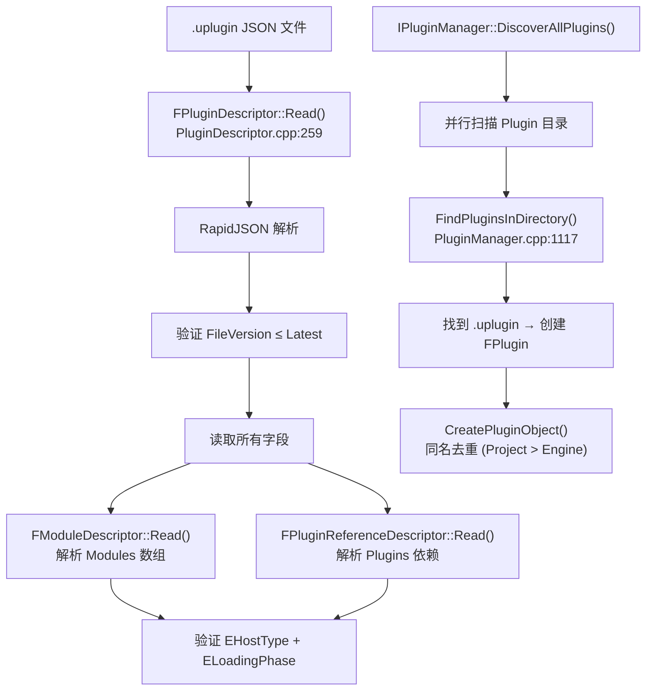

# Plugin Descriptor 描述文件详解

## 摘要
`.uplugin` 是 UE5.7.4 插件的根描述文件，JSON 格式（FileVersion=3）。`FPluginDescriptor` 结构体（`Engine/Source/Runtime/Projects/Public/PluginDescriptor.h:38`）定义了全部 30+ 字段，`FModuleDescriptor` 定义模块编译目标、加载阶段和平台过滤。`IPluginManager::ReadAllPlugins()` 负责解析和注册所有插件。

## 适合解决的问题
- .uplugin 文件有哪些字段？
- 如何控制模块在哪个目标类型/平台/配置下编译？
- ELoadingPhase 各阶段的精确含义？
- 插件如何声明对其他插件的依赖？
- FileVersion 1/2/3 有什么区别？

## 核心结论
1. FileVersion 当前为 3（ProjectPluginUnification），通过 RapidJSON 解析
2. `FModuleDescriptor` 控制模块编译时机（EHostType）和加载时机（ELoadingPhase）
3. 平台过滤支持 AllowList/DenyList 模式（Platform, Target, TargetConfiguration, Architecture, Program）
4. 插件依赖通过 `Plugins` 数组声明（FPluginReferenceDescriptor 支持 Platform/Target/TargetConfiguration 条件）
5. 插件发现优先级：Project > Engine > Mod > External（同名时取最高优先级/版本）

## 源码位置

| 组件 | 路径 | 作用 |
|------|------|------|
| FPluginDescriptor | `Engine/Source/Runtime/Projects/Public/PluginDescriptor.h:38` | 插件描述符结构体 |
| PluginDescriptor.cpp | `Engine/Source/Runtime/Projects/Private/PluginDescriptor.cpp:259` | JSON 读写实现 |
| FModuleDescriptor | `Engine/Source/Runtime/Projects/Public/ModuleDescriptor.h:154` | 模块描述符结构体 |
| ModuleDescriptor.cpp | `Engine/Source/Runtime/Projects/Private/ModuleDescriptor.cpp:162` | 编译/加载逻辑 |
| FPluginReferenceDescriptor | `Engine/Source/Runtime/Projects/Public/PluginReferenceDescriptor.h:26` | 插件依赖描述符 |
| IPluginManager | `Engine/Source/Runtime/Projects/Public/IPluginManager.h` | 插件管理器接口 |
| PluginManager.cpp | `Engine/Source/Runtime/Projects/Private/PluginManager.cpp:770` | 插件发现实现 |

## 1. FPluginDescriptor 全部字段

```cpp
// PluginDescriptor.h:38-253
struct FPluginDescriptor {
    int32 FileVersion;              // "FileVersion": 3
    int32 Version;                  // "Version": 1 (数值版本)
    FString VersionName;            // "VersionName": "1.0"
    FString FriendlyName;           // "FriendlyName": "My Plugin"
    FString Description;            // "Description": "..."
    FString Category;               // "Category": "Rendering"
    FString CreatedBy;              // "CreatedBy": "Author"
    FString CreatedByURL;           // "CreatedByURL": "https://..."
    FString DocsURL;                // "DocsURL": "https://..."
    FString MarketplaceURL;         // "MarketplaceURL": "https://..."
    FString SupportURL;             // "SupportURL": "https://..."
    FString EngineVersion;          // "EngineVersion": "5.7"
    FString DeprecatedEngineVersion;// "DeprecatedEngineVersion": "5.8"
    TArray<FString> SupportedTargetPlatforms;   // "SupportedTargetPlatforms": ["Win64"]
    TArray<FString> SupportedPrograms;          // "SupportedPrograms": ["UnrealEditor"]
    TArray<FModuleDescriptor> Modules;          // "Modules": [...] (核心)
    TArray<FPluginReferenceDescriptor> Plugins; // "Plugins": [...] (依赖)
    bool bCanContainContent;        // "CanContainContent": true
    bool bCanContainVerse;          // "CanContainVerse": false
    bool bIsBetaVersion;            // "IsBetaVersion": false
    bool bIsExperimentalVersion;    // "IsExperimentalVersion": false
    bool bInstalled;                // "Installed": false
    bool bRequiresBuildPlatform;    // "RequiresBuildPlatform": false
    bool bIsHidden;                 // "Hidden": false
    bool bIsSealed;                 // "Sealed": false
    bool bNoCode;                   // "NoCode": false
    bool bExplicitlyLoaded;         // "ExplicitlyLoaded": false
    bool bHasExplicitPlatforms;     // "HasExplicitPlatforms": false
    bool bIsPluginExtension;        // "bIsPluginExtension": false
    EPluginEnabledByDefault EnabledByDefault;  // "EnabledByDefault": "Enabled"
    FString EditorCustomVirtualPath;// "EditorCustomVirtualPath": ""
    TArray<FLocalizationTargetDescriptor> LocalizationTargets;
    FCustomBuildSteps PreBuildSteps;
    FCustomBuildSteps PostBuildSteps;
};
```

## 2. FModuleDescriptor — 模块条目

```cpp
// ModuleDescriptor.h:154-254
struct FModuleDescriptor {
    FName Name;                     // "Name": "MyModule"
    EHostType::Type Type;           // "Type": "Runtime"
    ELoadingPhase::Type LoadingPhase; // "LoadingPhase": "Default"
    
    // 平台过滤
    TArray<FString> PlatformAllowList;       // "PlatformAllowList": ["Win64"]
    TArray<FString> PlatformDenyList;        // "PlatformDenyList": ["Android"]
    
    // 目标过滤
    TArray<EBuildTargetType> TargetAllowList;    // "TargetAllowList": ["Editor"]
    TArray<EBuildTargetType> TargetDenyList;     // "TargetDenyList": ["Client"]
    TArray<EBuildConfiguration> TargetConfigurationAllowList; // "TargetConfigurationAllowList"
    TArray<EBuildConfiguration> TargetConfigurationDenyList;  // "TargetConfigurationDenyList"
    
    // 架构过滤
    TMap<FString, TArray<FString>> PlatformArchitectureAllowList;
    TMap<FString, TArray<FString>> PlatformArchitectureDenyList;
    
    // 程序过滤
    TArray<FString> ProgramAllowList;   // "ProgramAllowList": ["UnrealEditor"]
    TArray<FString> ProgramDenyList;
    TArray<FString> GameTargetAllowList;
    TArray<FString> GameTargetDenyList;
};
```

## 3. ELoadingPhase 加载阶段

| 值 | JSON | 加载时机 |
|-----|------|----------|
| `EarliestPossible` | `"EarliestPossible"` | 最早（PlatformFile 之后） |
| `PostConfigInit` | `"PostConfigInit"` | 配置系统初始化后 |
| `PostSplashScreen` | `"PostSplashScreen"` | 闪屏渲染后 |
| `PreEarlyLoadingScreen` | `"PreEarlyLoadingScreen"` | CoreUObject 之前 |
| `PreLoadingScreen` | `"PreLoadingScreen"` | 加载屏幕触发前 |
| `PreDefault` | `"PreDefault"` | 默认阶段之前 |
| `Default` | `"Default"` | 标准加载点 |
| `PostDefault` | `"PostDefault"` | 默认阶段之后 |
| `PostEngineInit` | `"PostEngineInit"` | 引擎完全初始化后 |
| `None` | `"None"` | 不自动加载 |

## 4. 插件发现与优先级

```cpp
// PluginManager.cpp:770-1053
// 搜索优先级 (同名插件选择更高优先级的):
1. Project Plugins: <Project>/Plugins/          (EPluginType::Project)
2. Engine Plugins:  Engine/Plugins/             (EPluginType::Engine)
3. Mod Plugins:     <Project>/Mods/             (EPluginType::Mod)
4. External:        AdditionalPluginDirectories  (EPluginType::External)
5. Command Line:    -PLUGIN=<path>
6. Env Variable:    UE_ADDITIONAL_PLUGIN_PATHS
```

## 5. FileVersion 演进

| 版本 | 名称 | 变化 |
|------|------|------|
| 1 | Initial | 初始格式 |
| 2 | NameHash | 新增名称哈希 |
| 3 | ProjectPluginUnification | 当前版本，RapidJSON 解析 |

## 6. Mermaid 调用图



## 源码证据
- Engine/Source/Runtime/Projects/Public/PluginDescriptor.h:38-253（FPluginDescriptor 全部字段）
- Engine/Source/Runtime/Projects/Private/PluginDescriptor.cpp:259-450（Read 实现）
- Engine/Source/Runtime/Projects/Private/PluginDescriptor.cpp:61-72（EPluginDescriptorVersion 枚举）
- Engine/Source/Runtime/Projects/Public/ModuleDescriptor.h:24-77（ELoadingPhase 枚举）
- Engine/Source/Runtime/Projects/Public/ModuleDescriptor.h:82-149（EHostType 枚举）
- Engine/Source/Runtime/Projects/Public/ModuleDescriptor.h:154-254（FModuleDescriptor 结构体）
- Engine/Source/Runtime/Projects/Public/PluginReferenceDescriptor.h:26-127（依赖描述符）
- Engine/Source/Runtime/Projects/Private/PluginManager.cpp:770-1053（ReadAllPlugins 发现）
- Engine/Source/Runtime/Projects/Private/PluginManager.cpp:1117-1227（FindPluginsInDirectory）
- Engine/Source/Runtime/Projects/Private/PluginManager.cpp:1258-1318（CreatePluginObject 去重）

## 相关文档
- [Runtime_Plugin.md](Runtime_Plugin.md) — Runtime 插件开发
- [Editor_Plugin.md](Editor_Plugin.md) — Editor 插件开发
- [ThirdParty_Libraries.md](ThirdParty_Libraries.md) — 第三方库集成
- [Packaging.md](Packaging.md) — 插件打包
