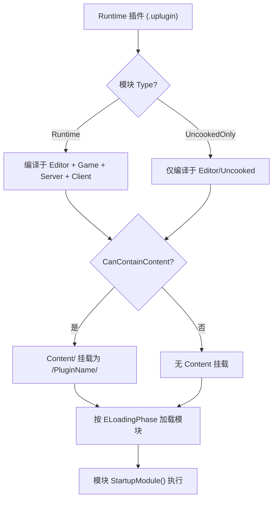

# Runtime 插件开发详解

## 摘要
Runtime 插件是随游戏包一同分发的模块化功能单元。`EHostType::Runtime` 模块在所有非 Program 目标（Editor, Game, Client, Server）上编译和加载。Runtime 插件支持内容打包（`bCanContainContent`）、自动加载（`EnabledByDefault`），并按 `ELoadingPhase` 分阶段加载模块。常见引擎 Runtime 插件包括 GameplayAbilities、EnhancedInput、MassEntity 等。

## 适合解决的问题
- 如何创建随游戏分发的插件？
- Runtime 插件在编辑器和 Shipping 构建中有什么区别？
- `bCanContainContent` 标志的影响？
- Runtime 模块在各目标类型上的编译行为？

## 核心结论
1. Runtime 插件使用 `"Type": "Runtime"` 的模块，在所有非 Program 目标编译
2. Runtime 插件可同时包含 Runtime（打包）+ UncookedOnly/Editor（仅编辑器）模块
3. `bCanContainContent=true` 时插件的 `Content/` 目录作为资产挂载点注册
4. Engine Runtime 插件默认不启用，需用户手动或项目配置启用
5. 推荐模式：Runtime 模块 + Editor 模块分离（如 GameplayAbilities 示例）

## 源码位置

| 组件 | 路径 | 作用 |
|------|------|------|
| EHostType | `Engine/Source/Runtime/Projects/Public/ModuleDescriptor.h:87` | Runtime 类型定义 |
| 编译过滤 | `Engine/Source/Runtime/Projects/Private/ModuleDescriptor.cpp:603` | IsCompiledInConfiguration |
| 加载过滤 | `Engine/Source/Runtime/Projects/Private/ModuleDescriptor.cpp:691` | IsLoadedInCurrentConfiguration |
| 内容挂载 | `Engine/Source/Runtime/Projects/Private/PluginManager.cpp:1980` | MountContentPlugins |
| 模块加载 | `Engine/Source/Runtime/Projects/Private/PluginManager.cpp:2827` | LoadModulesForEnabledPlugins |

## 1. Runtime 模块编译行为

```cpp
// ModuleDescriptor.cpp:603-605
case EHostType::Runtime:
    return TargetType != EBuildTargetType::Program;
```
编译于：Editor, Game, Client, Server；不编译于：Program

```cpp
// ModuleDescriptor.cpp:691-695
case EHostType::Runtime:
    #if (WITH_ENGINE || WITH_PLUGIN_SUPPORT) && !IS_PROGRAM
        return true;
    #endif
```
加载于：目标不是 Program 且定义了 WITH_ENGINE 或 WITH_PLUGIN_SUPPORT

## 2. Runtime 插件生命周期

```
1. 发现阶段
   IPM::DiscoverAllPlugins() → 扫描所有 .uplugin 文件

2. 启用配置
   IPM::ConfigureEnabledPlugins() → 检查 EnabledByDefault + 项目设置

3. 处理阶段
   IPM::ProcessEnabledPlugins() → 加载 Config 文件, 注册 Content 挂载点

4. 内容挂载
   IPM::MountContentPlugins() → 注册 /PluginName/ 资产路径

5. 模块加载（按 Phase 顺序）
   IPM::LoadModulesForEnabledPlugins(EarliestPossible)
   IPM::LoadModulesForEnabledPlugins(PostConfigInit)
   ... (每个 ELoadingPhase 调用一次)
   IPM::LoadModulesForEnabledPlugins(PostEngineInit)
```

## 3. CanContainContent 标志

```cpp
// PluginDescriptor.h:121
bool bCanContainContent;  // "CanContainContent": true

// PluginManager.cpp:1980-2017
if (Descriptor.bCanContainContent || Descriptor.bCanContainVerse)
{
    RegisterMountPointDelegate(
        RootPath / Plugin->GetName(),           // "/PluginName/"
        Plugin->GetContentDir()                  // "<PluginDir>/Content/"
    );
}
```

当 `bCanContainContent=true`：
- 插件 `Content/` 目录作为 `/PluginName/` 路径挂载到虚拟文件系统
- 资产可通过 `/PluginName/AssetPath` 引用
- Cook 时会被处理并打包
- `.uplugin` 文件被标记为 `bDescriptorNeededAtRuntime=true`

## 4. EnabledByDefault 行为

```cpp
// PluginManager.cpp:421-435
bool FPlugin::IsEnabledByDefault(bool bAllowEnginePlugins) const
{
    if (Descriptor.EnabledByDefault == EPluginEnabledByDefault::Enabled)
        return GetLoadedFrom() == EPluginLoadedFrom::Project 
            ? true : bAllowEnginePlugins;
    else if (Descriptor.EnabledByDefault == EPluginEnabledByDefault::Disabled)
        return false;
    else
        return GetLoadedFrom() == EPluginLoadedFrom::Project;
}
```

- Project 插件：默认启用（`Unspecified` 时）
- Engine 插件：需要 `EnabledByDefault: Enabled` 且 `bAllowEnginePluginsEnabledByDefault=true`
- 用户可在 Edit → Plugins 中手动启用/禁用

## 5. 引擎 Runtime 插件示例

### GameplayAbilities 插件
```
GameplayAbilities.uplugin:
  Modules:
    - Name: "GameplayAbilities", Type: "Runtime", LoadingPhase: "PreDefault"
    - Name: "GameplayAbilitiesEditor", Type: "UncookedOnly", LoadingPhase: "PreDefault"
  CanContainContent: false
  EnabledByDefault: false
```

模式：Runtime 模块 + Editor 模块分离，使 Shipping 构建不含编辑器代码。

## 6. Mermaid 调用图



## 7. 常见误区

| 误区 | 正确理解 |
|------|----------|
| Runtime 插件的所有模块都进 Shipping | 只有 `Runtime`/`CookedOnly` 类型模块进 Shipping；`UncookedOnly`/`Editor` 不编译 |
| Engine Runtime 插件自动启用 | 大多 `EnabledByDefault: false`，需用户手动或项目配置 |
| CanContainContent 影响模块编译 | 只影响 Content 挂载和 .uplugin 文件是否打包到运行时 |

## 源码证据
- Engine/Source/Runtime/Projects/Public/ModuleDescriptor.h:87（EHostType::Runtime 定义）
- Engine/Source/Runtime/Projects/Private/ModuleDescriptor.cpp:603（编译过滤）
- Engine/Source/Runtime/Projects/Private/ModuleDescriptor.cpp:691（加载过滤）
- Engine/Source/Runtime/Projects/Private/PluginManager.cpp:421（IsEnabledByDefault）
- Engine/Source/Runtime/Projects/Private/PluginManager.cpp:1980（MountContentPlugins）

## 相关文档
- [Plugin_Descriptor.md](Plugin_Descriptor.md) — .uplugin 描述文件
- [Editor_Plugin.md](Editor_Plugin.md) — Editor 插件开发
- [Packaging.md](Packaging.md) — 插件打包
