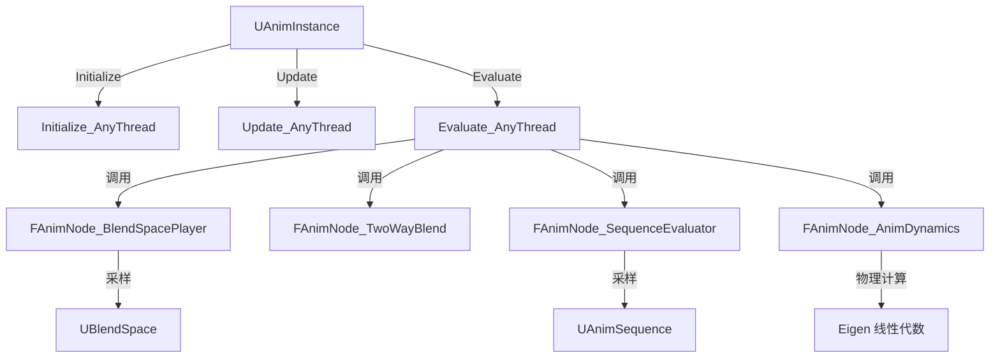

# AnimGraphRuntime

## 摘要
动画蓝图运行时：提供动画节点（混合空间、混合器、序列评估器、动力学等）在游戏线程/工作线程的求值实现。

## 1. 模块定位
AnimGraphRuntime 是动画蓝图的运行时求值模块。它包含所有 `FAnimNode_*` 节点类型的实现，这些节点在 Animation Blueprint 的动画图中被连线使用。节点在 `Initialize_AnyThread()` / `Update_AnyThread()` / `Evaluate_AnyThread()` 中被调用，支持多线程并行求值。

## 2. 所在路径
```
Engine/Source/Runtime/AnimGraphRuntime/
├── Public/
│   ├── AnimNodes/               (所有 FAnimNode_* 节点)
│   │   ├── AnimNode_BlendSpacePlayer.h
│   │   ├── AnimNode_TwoWayBlend.h
│   │   ├── AnimNode_SequenceEvaluator.h
│   │   └── AnimNode_AnimDynamics.h
│   ├── AnimNotifies/            (动画通知)
│   ├── BoneControllers/         (骨骼控制器: IK, Spline)
│   └── CommonAnimationLibrary.h
├── Private/
└── AnimGraphRuntime.Build.cs
```

## 3. Build.cs 依赖关系
```csharp
// AnimGraphRuntime.Build.cs
PublicDependencyModuleNames = {
    "Core", "CoreUObject", "Engine", "AnimationCore",
    "GeometryCollectionEngine"
};
PrivateDependencyModuleNames = { "TraceLog" };
// 第三方: Eigen (线性代数库，用于 IK/动力学计算)
```

## 4. Public API（5个关键类）

| 类 | 文件 | 职责 |
|----|------|------|
| `FAnimNode_BlendSpacePlayer` | AnimNodes/AnimNode_BlendSpacePlayer.h | BlendSpace 播放器，按坐标混合动画 |
| `FAnimNode_TwoWayBlend` | AnimNodes/AnimNode_TwoWayBlend.h | 两个动画源的 Alpha 混合 |
| `FAnimNode_SequenceEvaluator` | AnimNodes/AnimNode_SequenceEvaluator.h | 序列评估器，按时间采样动画 |
| `FAnimNode_AnimDynamics` | AnimNodes/AnimNode_AnimDynamics.h | 物理动力学节点（布娃娃/弹簧） |
| `UBlendSpace` | (Engine 模块) | BlendSpace 资源，定义动画混合网格 |

## 5. 关键函数（含文件路径）

### 5.1 FAnimNode_BlendSpacePlayerBase::Initialize_AnyThread()
```cpp
// Public/AnimNodes/AnimNode_BlendSpacePlayerBase.h
virtual void Initialize_AnyThread(const FAnimationInitializeContext& Context) override;
```
初始化播放器：获取 BlendSpace 资源，设置初始坐标和时间。

### 5.2 FAnimNode_Base::UpdateAssetPlayer()
```cpp
// 更新动画资源的播放时间
void UpdateAssetPlayer(const FAnimationUpdateContext& Context);
```

### 5.3 FAnimNode_TwoWayBlend::Evaluate_AnyThread()
```cpp
// 混合两个动画姿态的骨骼变换
virtual void Evaluate_AnyThread(FPoseContext& Output) override;
```

### 5.4 FAnimNode_AnimDynamics::Evaluate_AnyThread()
```cpp
// 物理模拟：弹簧/重力/碰撞
virtual void Evaluate_AnyThread(FPoseContext& Output) override;
```

### 5.5 FAnimNode_SequenceEvaluator::Evaluate_AnyThread()
```cpp
// 从 AnimSequence 中采样指定时间的骨骼姿态
virtual void Evaluate_AnyThread(FPoseContext& Output) override;
```

## 6. 初始化流程
```cpp
// FAnimGraphRuntimeModule — 空实现
// 节点实例由动画蓝图运行时按需创建:
// 1. UAnimInstance::InitializeAnimation() → 遍历节点调用 Initialize_AnyThread
// 2. UAnimInstance::UpdateAnimation() → 遍历节点调用 Update_AnyThread
// 3. UAnimInstance::EvaluateAnimation() → 遍历节点调用 Evaluate_AnyThread
```

## 7. 与其他模块的关系
```
AnimationCore (骨骼/曲线/混合工具)
  └──> AnimGraphRuntime (动画节点实现)
         ├──被依赖──> Engine (UAnimInstance, USkeletalMeshComponent)
         ├──被依赖──> AnimGraph (编辑器蓝图节点)
         └──被依赖──> GeometryCollectionEngine (破碎体动画)
```

## 8. 常见扩展点
- **自定义动画节点**：继承 `FAnimNode_Base`，实现 Initialize/Update/Evaluate
- **自定义 BlendSpace**：通过坐标映射混合多个动画序列
- **IK 节点**：`BoneControllers/` 目录提供多种 IK 实现
- **动画通知**：`AnimNotifies/` 支持在特定帧触发事件

## 9. Mermaid 调用图


## 10. 源码证据
- `AnimGraphRuntime.Build.cs:10-17`：公共依赖含 AnimationCore、Engine
- `AnimGraphRuntime.Build.cs:28-30`：第三方 Eigen 用于动力学计算
- `Public/AnimNodes/` 目录包含所有 FAnimNode_* 节点头文件
- `Public/BoneControllers/` 目录包含 IK 和骨骼控制节点
- 节点以 `_AnyThread` 后缀标注线程安全性

## 11. 相关文档
- `UE5_知识树.txt` — A.核心层 / AnimGraphRuntime 模块
- Epic 官方文档: Animation Blueprints
