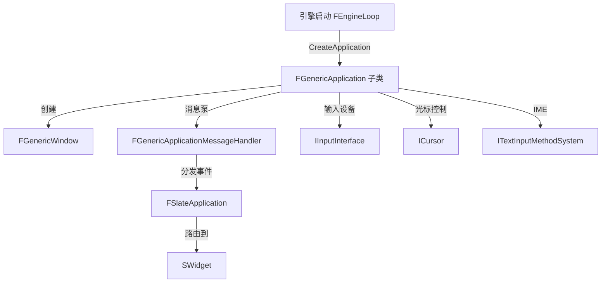

# ApplicationCore

## 摘要
提供跨平台应用程序抽象层：窗口管理、输入设备接口、光标控制、文本输入法，是 Slate UI 系统的平台底层。

## 1. 模块定位
ApplicationCore 位于引擎平台抽象层之上、Slate 之下。它定义了 `FGenericApplication` 抽象类，各平台（Windows/Mac/Linux/Android/iOS）继承此接口提供平台特定的消息循环、窗口创建和输入事件。Slate 通过此模块接收所有用户输入。

## 2. 所在路径
```
Engine/Source/Runtime/ApplicationCore/
├── Public/
│   ├── GenericPlatform/
│   │   ├── GenericApplication.h
│   │   ├── GenericWindow.h
│   │   ├── GenericApplicationMessageHandler.h
│   │   ├── ICursor.h
│   │   ├── IInputInterface.h
│   │   ├── ITextInputMethodSystem.h
│   │   └── GenericPlatformApplicationMisc.h
│   ├── HAL/          (平台宏)
│   ├── Windows/      (Windows 平台实现头文件)
│   ├── Mac/
│   ├── Linux/
│   ├── IOS/
│   ├── Android/
│   └── Null/         (无头模式实现)
├── Private/          (各平台 .cpp 实现)
└── ApplicationCore.Build.cs
```

## 3. Build.cs 依赖关系
```csharp
// ApplicationCore.Build.cs
PublicDependencyModuleNames = { "Core" };
PublicIncludePathModuleNames = { "RHI" };  // 仅头文件引用
// Windows 平台额外: XInput, DXGI.lib, uiautomationcore.lib
// Mac: OpenGL, GameController framework
// Linux: SDL3, FreeType2 (Editor only)
```

## 4. Public API（6个关键类）

| 类 | 文件 | 职责 |
|----|------|------|
| `FGenericApplication` | Public/GenericPlatform/GenericApplication.h | 应用程序抽象基类，管理窗口和输入 |
| `FGenericWindow` | Public/GenericPlatform/GenericWindow.h | 跨平台窗口抽象 |
| `FGenericApplicationMessageHandler` | Public/GenericPlatform/GenericApplicationMessageHandler.h | 输入事件分发处理器 |
| `IInputInterface` | Public/GenericPlatform/IInputInterface.h | 输入设备（手柄、键鼠）接口 |
| `ICursor` | Public/GenericPlatform/ICursor.h | 光标位置/可见性/类型控制 |
| `ITextInputMethodSystem` | Public/GenericPlatform/ITextInputMethodSystem.h | IME 文本输入法管理 |

## 5. 关键函数（含文件路径）

### 5.1 FGenericApplication::PollGameState()
平台实现定期调用，检查应用程序焦点、窗口状态变化。Windows 实现处理 WM_* 消息。

### 5.2 FGenericApplicationMessageHandler::ProcessMessage()
接收原始平台消息（按键、鼠标移动、触摸等），转换为 Slate 事件结构。

### 5.3 ICursor::SetCursorPos() / GetCursorPos()
```cpp
// Public/GenericPlatform/ICursor.h
virtual void SetPosition(const int32 X, const int32 Y) = 0;
virtual FVector2D GetPosition() const = 0;
```

### 5.4 FGenericApplication::MakeWindow()
创建平台窗口实例，返回 `TSharedRef<FGenericWindow>`。

### 5.5 FGenericApplication::InitializeWindow()
初始化已创建窗口的平台特定属性（大小、位置、渲染目标绑定）。

## 6. 初始化流程
```cpp
// 使用 FDefaultModuleImpl，无自定义 Startup
// 平台 Application 实例由 Application.Init() 创建:
// Windows: FWindowsApplication
// Mac: FMacApplication
// Linux: FLinuxApplication
// Android: FAndroidApplication
// iOS: FIOSApplication
```
引擎启动时 `FEngineLoop::PreInit()` 调用 `FPlatformApplicationMisc::CreateApplication()` 创建平台实例。

## 7. 与其他模块的关系
```
Core (平台抽象, 容器)
  └── ApplicationCore (窗口, 输入接口)
        ├──被依赖──> SlateCore (SWidget 事件定义)
        ├──被依赖──> Slate (FSlateApplication 消息处理)
        ├──被依赖──> RHI (SwapChain 窗口绑定)
        └──被依赖──> InputCore (FKey 映射)
```

## 8. 常见扩展点
- **新平台移植**：继承 `FGenericApplication` 和 `FGenericWindow`
- **自定义输入设备**：实现 `IInputInterface`
- **无头渲染**：使用 `FNullApplication`（NullDrv 模式）
- **辅助功能**：Windows 上通过 UIA (`uiautomationcore.lib`) 实现无障碍

## 9. Mermaid 调用图


## 10. 源码证据
- `ApplicationCore.Build.cs:9-13`：核心依赖仅 Core，保持平台底层轻量
- `Public/GenericPlatform/` 目录包含全部 6 个抽象接口头文件
- 平台特定实现位于 `Public/Windows/`, `Public/Mac/` 等目录
- Windows 额外依赖 `DXGI.lib` 用于 GPU 硬件查询（Build.cs:46）
- Linux 使用 SDL3 作为底层窗口/输入后端（Build.cs:64）

## 11. 相关文档
- `UE5_知识树.txt` — A.核心层 / ApplicationCore 模块
- Epic 官方文档: Application Core Architecture
