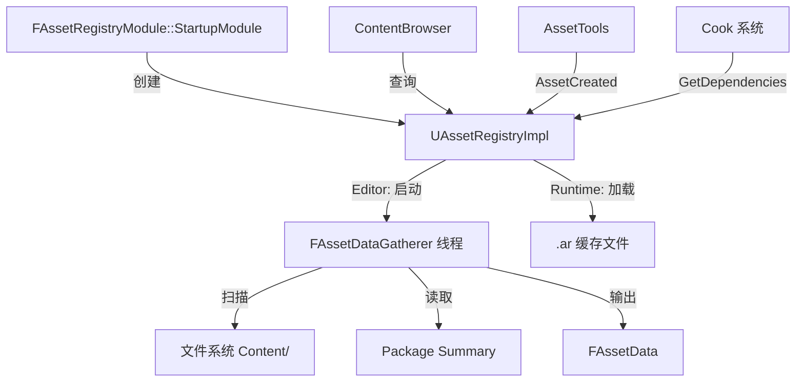

# AssetRegistry

## 摘要
引擎资产元数据的异步采集与查询系统，为内容浏览器、引用查看器和烹饪系统提供资产发现/依赖/引用追踪能力。

## 1. 模块定位
AssetRegistry 负责扫描引擎和项目的 Content 目录，采集所有 `.uasset` 文件的元数据（类名、路径、标签、依赖），构建可快速查询的内存索引。编辑器模式下使用后台线程 (`FAssetDataGatherer`) 异步采集；运行时从 `.ar` 缓存文件同步加载。

## 2. 所在路径
```
Engine/Source/Runtime/AssetRegistry/
├── Public/
│   ├── AssetRegistry.h         (IAssetRegistry 接口)
│   ├── AssetRegistryModule.h   (模块入口)
│   ├── AssetData.h             (FAssetData 结构)
│   └── AssetRegistryState.h    (完整注册表状态)
├── Private/
│   ├── AssetRegistry.cpp/h     (UAssetRegistryImpl 实现)
│   ├── AssetDataGatherer.cpp/h (后台采集线程 FRunnable)
│   ├── AssetDependencyGatherer.cpp
│   └── AssetRegistryModule.cpp
└── AssetRegistry.Build.cs
```

## 3. Build.cs 依赖关系
```csharp
// AssetRegistry.Build.cs
PrivateDependencyModuleNames = {
    "Core", "CoreUObject", "TraceLog",
    "ApplicationCore", "Projects", "TelemetryUtils", "PakFile"
};
// Editor 构建: 动态加载 DirectoryWatcher, TargetPlatform
```

## 4. Public API（6个关键类）

| 类 | 文件 | 职责 |
|----|------|------|
| `IAssetRegistry` | AssetRegistry.h | 资产注册表抽象接口（查询/扫描/回调） |
| `FAssetRegistryModule` | AssetRegistryModule.h | 模块入口，提供 `Get()` |
| `FAssetData` | AssetData.h | 单个资产的元数据快照（路径、类名、标签） |
| `FAssetRegistryState` | AssetRegistryState.h | 完整注册表状态（可序列化/反序列化） |
| `FAssetDataGatherer` | AssetDataGatherer.h | 后台采集线程（FRunnable 实现） |
| `UAssetRegistryImpl` | AssetRegistryImpl.h | IAssetRegistry 的 UObject 实现 |

## 5. 关键函数（含文件路径）

### 5.1 IAssetRegistry::ScanPathsSynchronous()
```cpp
// 同步扫描指定路径，阻塞直到完成
virtual void ScanPathsSynchronous(const TArray<FString>& InPaths, bool bForceRescan = false) = 0;
```

### 5.2 IAssetRegistry::GetAssetsByPath()
```cpp
// 按路径查询所有资产元数据
virtual bool GetAssetsByPath(const FName& PackagePath, TArray<FAssetData>& OutAssetData) const = 0;
```

### 5.3 IAssetRegistry::GetDependencies()
```cpp
// 查询指定包的所有依赖包
virtual bool GetDependencies(const FPackageId& PackageId, TArray<FAssetIdentifier>& OutDependencies) const = 0;
```

### 5.4 IAssetRegistry::AssetCreated() / AssetDeleted()
```cpp
// 运行时资产增删通知
virtual void AssetCreated(UObject* NewAsset) = 0;
virtual void AssetDeleted(UObject* DeletedAsset) = 0;
```

### 5.5 FAssetDataGatherer::Run()
```cpp
// AssetDataGatherer.cpp
// FRunnable::Run() 实现：后台线程扫描文件系统
virtual uint32 Run() override;
```

## 6. 初始化流程
```cpp
// AssetRegistryModule.cpp
class FAssetRegistryModule : public IModuleInterface {
    virtual void StartupModule() override {
        // 创建 UAssetRegistryImpl 默认对象
        AssetRegistryImpl = NewObject<UAssetRegistryImpl>();
        // 开始异步采集（Editor）或加载缓存（Runtime）
    }
};
IMPLEMENT_MODULE(FAssetRegistryModule, AssetRegistry);
```

## 7. 与其他模块的关系
```
Projects (插件/模块发现)
  └──> AssetRegistry (资产元数据采集)
         ├──被依赖──> ContentBrowser (资产浏览 UI)
         ├──被依赖──> AssetTools (资产操作)
         ├──被依赖──> UBT (构建系统依赖图)
         └──被依赖──> CookOnTheFly (按需烹饪)
```

## 8. 常见扩展点
- **自定义资产扫描**：通过 `IAssetRegistry::OnAssetAdded()` 响应新资产发现
- **依赖收集器**：自定义 `FAssetDependencyGatherer` 扩展依赖追踪
- **缓存文件**：`.ar` 二进制格式加速运行时加载
- **资产标签**：通过 `UPROPERTY(AssetRegistrySearchable)` 标记可搜索属性

## 9. Mermaid 调用图


## 10. 源码证据
- `AssetRegistry.Build.cs:9-18`：私有依赖含 Core、CoreUObject、Projects、PakFile
- `AssetDataGatherer.cpp/h`：FRunnable 后台线程实现
- `AssetRegistryModule.cpp`：StartupModule 创建 UAssetRegistryImpl
- Editor 模式动态加载 DirectoryWatcher 用于文件变更监听（Build.cs:23-24）

## 11. 相关文档
- `UE5_知识树.txt` — A.核心层 / AssetRegistry 模块
- Epic 官方文档: Asset Registry
