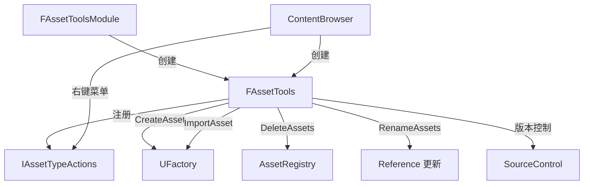

# AssetTools

## 摘要
编辑器资产操作工具集：提供资产的创建/导入/导出/重命名/删除/迁移等操作的统一 API 接口。

## 1. 模块定位
AssetTools 是编辑器资产操作的核心入口。`IAssetTools` 接口定义了资产的完整生命周期操作：创建（`CreateAsset`）、导入（`ImportAsset`）、重命名（`RenameAssets`）、删除（`DeleteAssets`）、迁移（`MigrateAssets`）。它还管理 `IAssetTypeActions` 注册表，每种资产类型注册自己的操作集（打开/导入/导出/复制）。

## 2. 所在路径
```
Engine/Source/Developer/AssetTools/
├── Public/
│   ├── IAssetTools.h              (核心接口)
│   ├── AssetToolsModule.h         (模块入口)
│   ├── IAssetTypeActions.h        (资产类型操作接口)
│   ├── AssetTypeActions/          (内置类型操作)
│   ├── AssetTypeCategories.h      (资产分类枚举)
│   ├── AssetViewUtils.h           (资产视图工具)
│   └── CollectionAssetManagement.h
├── Private/
│   ├── AssetTools.cpp             (FAssetTools 实现)
│   └── AssetTypeActions/          (具体资产类型的操作实现)
└── AssetTools.Build.cs
```

## 3. Build.cs 依赖关系
```csharp
// AssetTools.Build.cs
PublicDependencyModuleNames = {
    "Core", "CoreUObject", "SlateCore",
    "EditorFramework", "UnrealEd"
};
PrivateDependencyModuleNames = {
    "Engine", "InputCore", "Slate", "SourceControl",
    "PropertyEditor", "Kismet", "Projects", "RHI",
    "MaterialEditor", "ToolMenus", "AssetRegistry", ...
};
// 循环依赖处理: UnrealEd, Landscape, Kismet, MaterialEditor
// 动态加载: ContentBrowser, CollectionManager, DesktopPlatform, ...
```

## 4. Public API（2个关键接口）

| 类 | 文件 | 职责 |
|----|------|------|
| `IAssetTools` | Public/IAssetTools.h | 资产操作抽象接口（创建/导入/重命名/删除） |
| `FAssetToolsModule` | Public/AssetToolsModule.h | 模块入口，`Get().Get()` 返回 IAssetTools |

## 5. 关键函数（含文件路径）

### 5.1 IAssetTools::CreateAsset()
```cpp
// Public/IAssetTools.h
virtual UObject* CreateAsset(const FString& AssetName, const FString& PackagePath,
    UClass* AssetClass, UFactory* Factory) = 0;
```
在指定路径创建新资产，可选指定工厂类。

### 5.2 IAssetTools::ImportAsset()
```cpp
virtual UObject* ImportAsset(const FString& Filename, const FString& DestinationPath) = 0;
```
从文件导入资产（如 .fbx, .png, .wav），自动匹配合适的 Factory。

### 5.3 IAssetTools::RenameAssets()
```cpp
virtual EAssetRenameResult RenameAssets(const TArray<FAssetRenameData>& AssetsAndNames) = 0;
```
批量重命名资产，自动处理引用重定向。

### 5.4 IAssetTools::DeleteAssets()
```cpp
virtual bool DeleteAssets(const TArray<FAssetData>& AssetsToDelete) = 0;
```
删除指定资产，处理引用检查和确认。

### 5.5 IAssetTools::RegisterAssetTypeActions()
```cpp
virtual void RegisterAssetTypeActions(TSharedRef<IAssetTypeActions> NewActions) = 0;
```
注册资产类型操作（右键菜单、打开方式等）。

## 6. 初始化流程
```cpp
// FAssetToolsModule::StartupModule()
// 1. 创建 FAssetTools 实例（IAssetTools 的实现）
// 2. 注册内置 AssetTypeActions（Blueprint, Material, Texture, etc.）
// 3. 绑定 SourceControl 和 AssetRegistry 回调
```

## 7. 与其他模块的关系
```
UnrealEd (编辑器核心)
  └──> AssetTools (资产操作)
         ├──> AssetRegistry (资产查询)
         ├──> SourceControl (版本控制)
         ├──> ContentBrowser (资产浏览 UI)
         ├──> PropertyEditor (属性编辑)
         └──> MaterialEditor/Kismet (特定资产编辑器)
```

## 8. 常见扩展点
- **自定义资产类型操作**：实现 `IAssetTypeActions`，注册右键菜单和打开行为
- **自定义工厂**：继承 `UFactory`，实现新资产创建/导入逻辑
- **资产迁移**：`MigrateAssets()` 支持项目间资产迁移
- **高级复制**：`AdvancedCopyAssets()` 支持自定义复制规则

## 9. Mermaid 调用图


## 10. 源码证据
- `AssetTools.Build.cs:8-13`：公共依赖含 EditorFramework、UnrealEd
- `AssetTools.Build.cs:52-59`：循环依赖处理（UnrealEd、Landscape、Kismet、MaterialEditor）
- `Public/IAssetTools.h`：定义 CreateAsset/ImportAsset/RenameAssets/DeleteAssets 等核心 API
- `Public/IAssetTypeActions.h`：资产类型操作注册接口

## 11. 相关文档
- `UE5_知识树.txt` — D.编辑器层 / AssetTools 模块
- Epic 官方文档: Asset Tools Framework
