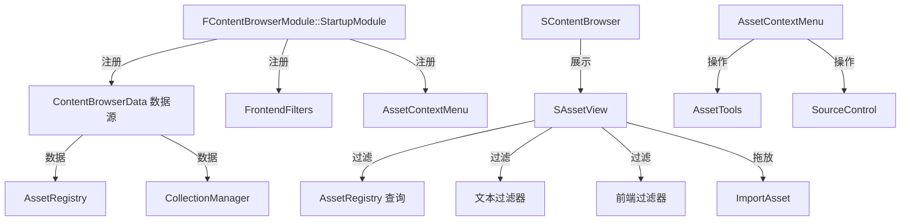

# ContentBrowser

## 摘要
编辑器内容浏览器面板：提供资产浏览、搜索过滤、拖放导入、集合管理和资产右键菜单的完整 UI 实现。

## 1. 模块定位
ContentBrowser 是编辑器中最常用的面板之一。它以 Slate 控件树形式呈现资产列表（`SAssetView`），支持路径导航、文本搜索、前端过滤器、集合管理、拖放操作和右键上下文菜单。它通过 `ContentBrowserData` 抽象层与 `AssetRegistry` 和 `CollectionManager` 交互。

## 2. 所在路径
```
Engine/Source/Editor/ContentBrowser/
├── Public/
│   ├── ContentBrowserModule.h         (FContentBrowserModule)
│   ├── IContentBrowserSingleton.h     (全局单例接口)
│   ├── SAssetView.h                   (资产列表控件)
│   ├── ContentBrowserDelegates.h      (委托/事件)
│   ├── FrontendFilters.h              (前端过滤器)
│   ├── SourcesData.h                  (路径源数据)
│   └── Widgets/                       (子控件)
├── Private/
│   ├── AssetContextMenu.cpp/h         (资产右键菜单)
│   ├── CollectionContextMenu.cpp/h    (集合右键菜单)
│   ├── AssetView/                     (资产视图实现)
│   ├── AssetSystemContentBrowserInfoProvider.cpp
│   └── ContentBrowserModule.cpp
└── ContentBrowser.Build.cs
```

## 3. Build.cs 依赖关系
```csharp
// ContentBrowser.Build.cs
PrivateDependencyModuleNames = {
    "Core", "CoreUObject", "Engine", "Slate", "SlateCore",
    "AssetTools", "ContentBrowserData", "SourceControl",
    "UnrealEd", "EditorFramework", "AssetRegistry",
    "ToolMenus", "StatusBar", "DesktopPlatform", ...
};
PublicIncludePathModuleNames = {
    "AssetTools", "CollectionManager", "ContentBrowserData"
};
// 动态加载: PropertyEditor, CollectionManager, GameProjectGeneration
```

## 4. Public API（2个关键类）

| 类 | 文件 | 职责 |
|----|------|------|
| `FContentBrowserModule` | ContentBrowserModule.h | 模块入口，提供内容浏览器创建和配置 API |
| `IContentBrowserSingleton` | IContentBrowserSingleton.h | 内容浏览器全局单例，管理所有实例 |

`FContentBrowserModule` 关键方法：
- `Get()` — 获取模块单例
- `CreateContentBrowser() — 创建内容浏览器 Slate 控件
- `GetSelectedAssets() / SetSelectedPaths()` — 查询/设置选中状态
- `OnAssetSelectionChanged` — 选中变更事件

## 5. 关键函数

### 5.1 FContentBrowserModule::CreateContentBrowser()
```cpp
// 创建内容浏览器 Slate 控件实例
TSharedRef<SWidget> CreateContentBrowser(const FContentBrowserConfig& Config);
```

### 5.2 资产过滤
- 文本搜索：`FAssetTextFilter` 通过关键字/标签匹配
- 前端过滤器：`FFrontendFilter` 子类按资产类型/状态筛选
- 路径过滤：`SourcesData` 管理当前浏览路径

### 5.3 拖放操作
- 文件拖入：从文件系统拖入文件触发 `ImportAsset` 流程
- 资产拖出：拖出资产到关卡/蓝图/材质编辑器

### 5.4 右键菜单
`AssetContextMenu` 提供完整的资产操作菜单（通过 `ToolMenus` 系统）：
- 创建/导入/导出/删除/重命名
- 复制/迁移/引用查看
- 源代码管理操作

## 6. 初始化流程
```cpp
// FContentBrowserModule::StartupModule()
// 1. 注册 ContentBrowserData 数据源
// 2. 注册前端过滤器
// 3. 注册右键菜单扩展点 (ToolMenus)
// 4. 创建 IContentBrowserSingleton
// 5. 绑定 AssetRegistry 事件 (OnAssetAdded/OnAssetRemoved)
```

## 7. 与其他模块的关系
```
AssetRegistry (资产元数据)
  └──> ContentBrowserData (数据抽象层)
         └──> ContentBrowser (浏览 UI)
               ├──> AssetTools (资产操作)
               ├──> CollectionManager (集合/收藏夹)
               ├──> SourceControl (版本控制)
               └──> ToolMenus (右键菜单系统)
```

## 8. 常见扩展点
- **自定义前端过滤器**：继承 `FFrontendFilter`，注册到 `ContentBrowserData`
- **自定义数据源**：实现 `IContentBrowserDataSource`，扩展资产来源
- **菜单扩展**：通过 `ToolMenus` 注册自定义右键菜单项
- **资产选择监听**：绑定 `OnAssetSelectionChanged` 事件

## 9. Mermaid 调用图


## 10. 源码证据
- `ContentBrowser.Build.cs:12-34`：私有依赖含 AssetTools、ContentBrowserData、UnrealEd、AssetRegistry
- `ContentBrowser.Build.cs:50-52`：公共包含路径暴露 AssetTools、CollectionManager、ContentBrowserData
- `Public/ContentBrowserModule.h:107`：`FContentBrowserModule : public IModuleInterface`
- `Private/AssetContextMenu.cpp`：完整的资产右键菜单实现
- 动态加载 PropertyEditor、CollectionManager 等模块避免编译依赖

## 11. 相关文档
- `UE5_知识树.txt` — D.编辑器层 / ContentBrowser 模块
- Epic 官方文档: Content Browser
