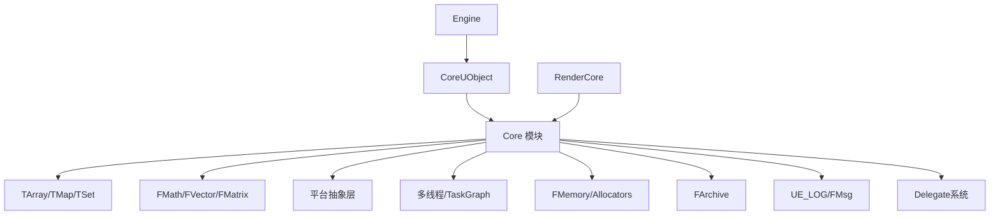

# Core 模块详解

## 摘要

Core 是 UE5.7.4 的最底层运行时模块，提供所有其他模块依赖的基础设施：字符串（FString）、容器（TArray, TMap, TSet）、数学（FMath）、反射基础类型、多线程（TaskGraph, FRunnable）、平台抽象（HAL）、内存管理、序列化（FArchive）、日志系统等。几乎所有 UE 模块都直接或间接依赖 Core。

---

## 1. 模块定位

Core 是引擎的基础层，不依赖任何其他 UE 运行时模块。它提供：
- 平台无关的基础类型和容器
- 多线程和异步任务框架
- 内存管理和分配器
- 日志和诊断工具
- 序列化基础设施
- 委托（Delegate）系统

---

## 2. 所在路径

- **Public**: `Engine/Source/Runtime/Core/Public/`
- **Private**: `Engine/Source/Runtime/Core/Private/`
- **Build.cs**: `Engine/Source/Runtime/Core/Core.Build.cs`

---

## 3. Build.cs 依赖关系

### 公共依赖
- `GuidelinesSupportLibrary`
- `TraceLog`
- `AtomicQueue`

### 私有依赖
- `BuildSettings`, `AutoRTFM`, `BLAKE3`, `OodleDataCompression`, `xxhash`
- 平台特定: `mimalloc`, `libpas`, `WinPixEventRuntime`, `ConcurrencyVisualizer`, `SuperLuminal`

---

## 4. Public API 关键头文件

| 目录 | 关键类/文件 |
|------|------------|
| `Containers/` | `TArray`, `TMap`, `TSet`, `TQueue`, `TChunkedArray` |
| `Math/` | `FMath`, `FVector`, `FMatrix`, `FQuat`, `FRotator`, `FTransform` |
| `HAL/` | `FPlatformMath`, `FPlatformProcess`, `FPlatformAtomics`, `FPlatformMisc` |
| `Async/` | `FRunnable`, `FAsyncTask`, `TPromise`, `TFuture`, `Async` |
| `Templates/` | `TFunction`, `TUniquePtr`, `TSharedPtr`, `TStaticArray`, `TypeTraits` |
| `Serialization/` | `FArchive`, `FMemoryArchive`, `FObjectAndNameAsStringProxyArchive` |
| `Delegates/` | `TDelegate`, `TMulticastDelegate`, `FDelegateHandle` |
| `Logging/` | `UE_LOG`, `FOutputDevice`, `FMsg` |
| `Memory/` | `FMemory`, `FMemStack`, `TScopeCounter` |
| `Misc/` | `FString`, `FName`, `FText`, `FGuid`, `FDateTime`, `FPaths` |
| `Hash/` | `FMD5`, `FSHA1`, `FCrc` |
| `Internationalization/` | `FText`, `FInternationalization` |
| `IO/` | `FFileHelper`, `FIoBuffer`, `FIoChunkId` |
| `Modules/` | `IModuleInterface`, `FModuleManager` |

---

## 5. 关键类

### FString (`Misc/String.h`)
- UE 的主要字符串类型，支持 UTF-8/UTF-16 转换
- 常用操作: `Printf()`, `Format()`, `Split()`, `Replace()`, `Find()`

### TArray (`Containers/Array.h`)
- 动态数组，UE 中最常用的容器
- 特性: 连续内存、随机访问 O(1)、尾部插入 O(1) 均摊

### TMap (`Containers/Map.h`)
- 基于 TSparseArray 的有序/无序哈希映射
- 特性: 删除不产生空洞、迭代稳定

### TFunction (`Templates/Function.h`)
- 类型擦除的可调用对象，类似 std::function

### FRunnable (`Async/Runnable.h`)
- 多线程基础接口，配合 `FRunnableThread::Create()` 使用

### FArchive (`Serialization/Archive.h`)
- 序列化抽象基类，支持 `<<` 运算符重载

---

## 6. 关键函数

| 函数 | 文件 | 作用 |
|------|------|------|
| `FModuleManager::LoadModule()` | `Modules/ModuleManager.cpp` | 动态加载模块 |
| `FMemory::Malloc/Free()` | `Memory/FMemory.cpp` | 内存分配（走 UE 分配器） |
| `FPlatformProcess::Sleep()` | `HAL/PlatformProcess.cpp` | 平台无关的 Sleep |
| `FArchive::Serialize()` | `Serialization/Archive.cpp` | 序列化核心函数 |
| `AsyncTask<T>::Start()` | `Async/AsyncTask.h` | 启动异步任务 |
| `FTaskGraphInterface::Get()` | `Async/TaskGraph.cpp` | 获取 TaskGraph 单例 |

---

## 7. 初始化流程

```
FEngineLoop::Init()
  │
  └─ FModuleManager::Get().LoadModule("Core")
      └─ FCoreModule::StartupModule()
          ├─ FPlatformMemory::Init() — 初始化内存分配器
          ├─ FPlatformProcess::Init() — 初始化进程信息
          ├─ FTaskGraphInterface::Startup() — 启动 TaskGraph
          ├─ FThreadManager::Get() — 线程管理器
          └─ FInternationalization::Get() — 国际化系统
```

---

## 8. 运行时调用链

### TaskGraph 多线程调度
```
FTaskGraphInterface::Get()
  └─ FTaskGraphImplementation (平台相关)
      ├─ ENamedThreads::GameThread — 主线程任务
      ├─ ENamedThreads::ActualRenderingThread — 渲染线程任务
      ├─ ENamedThreads::RHIThread — RHI 线程任务
      └─ WorkerThreads[N] — 工作线程池
          └─ ProcessThreadUntilRequestReturn()
```

### 内存分配
```
FMemory::Malloc(Size, Alignment)
  └─ GMalloc->Malloc()
      ├─ [默认] FMimallocAllocator (mimalloc)
      └─ [备选] FBinnedAllocator / FPlatformAllocator
```

---

## 9. 与其他模块的关系

```
Core ← CoreUObject ← Engine ← Renderer
Core ← RenderCore ← RHI
Core ← ApplicationCore ← Slate
Core ← 所有其他运行时模块
```

Core 是依赖树的最底层，被所有模块依赖。

---

## 10. 常见扩展点

1. **自定义容器**: 继承 TArray 接口或使用 TChunkedArray
2. **自定义分配器**: 实现 FMalloc 接口替换全局分配器
3. **平台抽象**: 在 HAL/ 下添加新平台支持
4. **模块注册**: 通过 IModuleInterface 注册自定义模块

---

## 11. 常见错误与调试

- **内存泄漏**: 使用 `MALLOC_LEAK_DETECTION` 宏启用泄漏检测
- **容器越界**: Debug 模式下 TArray 有越界检查
- **线程竞争**: 使用 `FCriticalSection` 或 `FRWLock` 保护共享数据
- **模块加载失败**: 检查 Build.cs 依赖是否完整

---

## 12. Mermaid 调用图



---

## 13. 源码证据

- `Engine/Source/Runtime/Core/Core.Build.cs` — 模块依赖定义
- `Engine/Source/Runtime/Core/Public/Containers/Array.h` — TArray 定义
- `Engine/Source/Runtime/Core/Public/Math/UnrealMath.h` — FMath 定义
- `Engine/Source/Runtime/Core/Public/HAL/PlatformProcess.h` — 平台抽象
- `Engine/Source/Runtime/Core/Public/Async/TaskGraphInterfaces.h` — TaskGraph 接口
- `Engine/Source/Runtime/Core/Public/Serialization/Archive.h` — FArchive 定义
- `Engine/Source/Runtime/Core/Public/Templates/Function.h` — TFunction 定义

---

## 14. 相关文档

- [CoreUObject 模块详解](CoreUObject.md)
- [Engine 模块详解](Engine.md)
- [04_CORE_OBJECT_SYSTEM/UObject.md](../04_CORE_OBJECT_SYSTEM/UObject.md)
